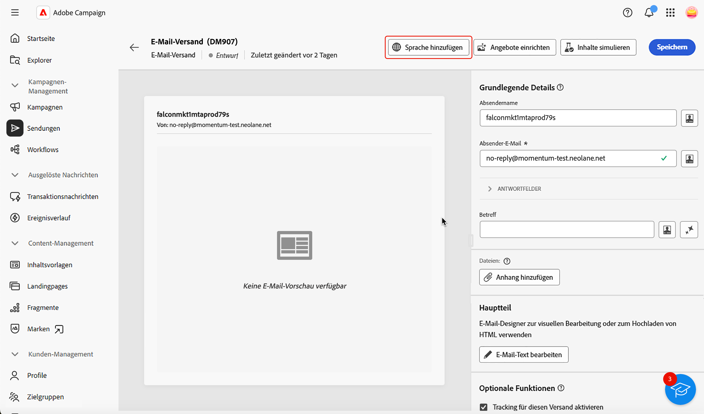
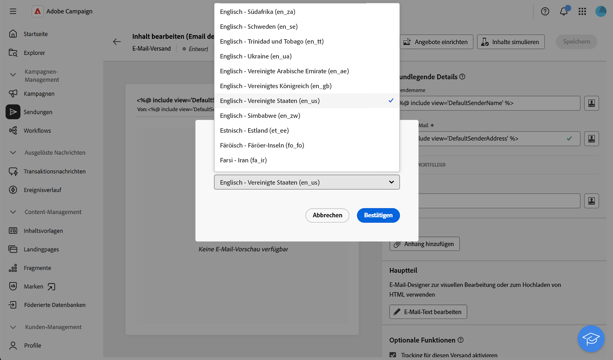
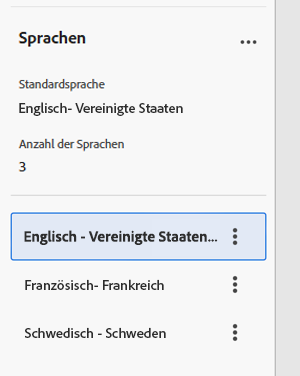
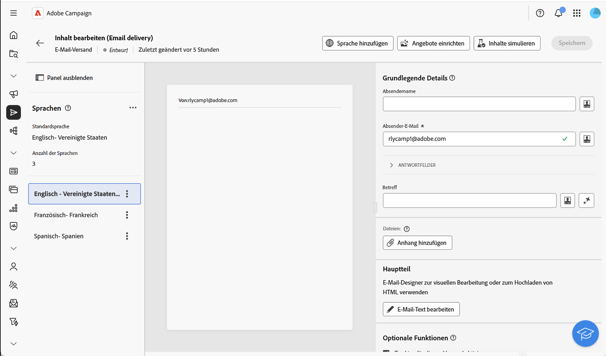
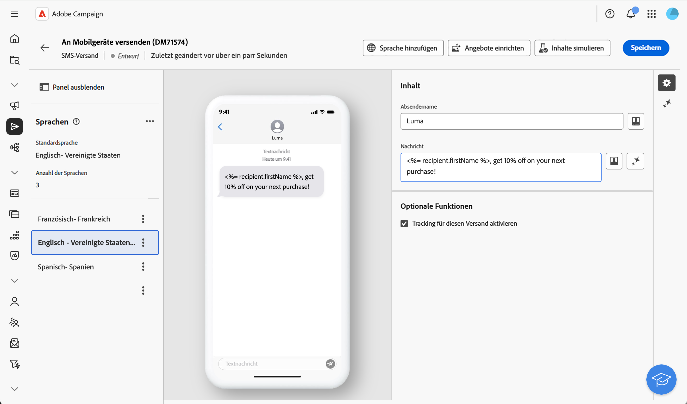
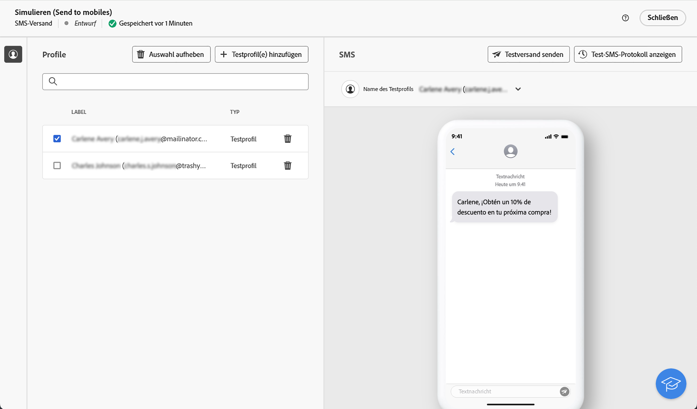
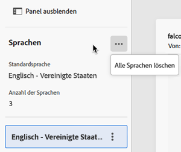
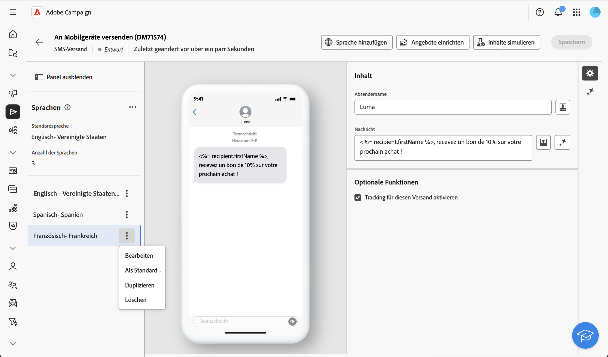

# Konfigurieren eines mehrsprachigen Versands {#multilingual-delivery}

>[!CONTEXTUALHELP]
>id="acw_deliveries_email_multilingual"
>title="Sprachen hinzufügen"
>abstract="Auf dieser Registerkarte finden Sie eine Liste der Sprachen, in denen der Versand durchgeführt werden soll. Sie können weitere Sprachen hinzufügen, indem Sie auf die Schaltfläche „Sprache hinzufügen“ klicken oder über diese Registerkarte eine andere Sprache duplizieren."

In der Campaign Web-Benutzeroberfläche können Sie Ihre Sendungen als mehrsprachig einrichten, sodass Sie Nachrichten basierend auf der bevorzugten Sprache eines Profils senden können. Wenn keine Voreinstellung definiert ist, wird die Nachricht in der Standardsprache gesendet.

Bei einem mehrsprachigen Versand basiert die Sprachverwaltung auf Varianten. Jede Variante steht für eine Sprache. Bei der Versanderstellung können Sie entsprechend der Anzahl der erforderlichen Sprachen in Ihrer Nachricht mehrere Sprachvarianten hinzufügen. Sie können die Standardsprache auch jederzeit ändern, nachdem Sie diese Varianten hinzugefügt haben.

Die mehrsprachige Funktion ist derzeit für E-Mails, Push-Benachrichtigungen, Transaktionsnachrichten und SMS verfügbar.

>[!AVAILABILITY]
>
>Mehrsprachige Push-Benachrichtigungen, Transaktionsnachrichten und SMS sind nur für eine bestimmte Gruppe von Unternehmen verfügbar (eingeschränkte Verfügbarkeit) und werden in einer zukünftigen Version global eingeführt. Ihr Server muss auf 8.8.2 oder höher aktualisiert sein.

Führen Sie die folgenden Schritte durch, um den mehrsprachigen Versand einzurichten:

1. Hinzufügen einer Sprachvariante, [weitere Informationen](#add-variant)
1. Definieren des Inhalts für jede Variante, [weitere Informationen](#define-content)
1. Verwalten der Sprachvarianten, [weitere Informationen](#manage-variant)

## Hinzufügen einer Sprachvariante{#add-variant}

Gehen Sie wie folgt vor, um eine Sprachvariante zu erstellen:

1. Klicken Sie im Versand-Dashboard auf das Stiftsymbol, um den Bildschirm zur Bearbeitung des Versandinhalts aufzurufen, und klicken Sie dann auf **[!UICONTROL Sprache hinzufügen]**.

   >[!IMPORTANT]
   >
   >Die Schaltfläche **[!UICONTROL Sprache hinzufügen]** ist nur verfügbar, wenn die Zielgruppendimension das Schema **Sprache** enthält. Weitere Informationen zu Schemata und Zielgruppendimensionen finden Sie in der [ausführlichen Dokumentation](../audience/targeting-dimensions.md).

   {zoomable="yes"}

1. Wählen Sie aus der Dropdown-Liste **Sprache hinzufügen** die gewünschte Sprache aus und bestätigen Sie dann Ihre Auswahl.

   Die erste hinzugefügte Sprache wird automatisch als Standard festgelegt und der vorhandene Inhalt wird zur Standardversion. Wenn zusätzliche Sprachen hinzugefügt werden, wird deren Inhalt zunächst aus der Standardsprache kopiert.

   {zoomable="yes"}

   >[!NOTE]
   >
   >Die in dieser Liste verfügbaren Sprachen hängen von den Werten ab, die durch das Attribut **Sprache** definiert wurden (Werte wie: „system“, „user“, „dbenum“ usw.). Weitere Informationen zur Auflistungsverwaltung finden Sie in diesem [Abschnitt](../administration/enumerations.md).

1. Wiederholen Sie diesen Vorgang, um weitere Sprachen hinzuzufügen. Im Panel **[!UICONTROL Sprachen]** werden auf der linken Seite die Liste der ausgewählten Sprachen, die Anzahl der verschiedenen Sprachen sowie die Standardsprache angezeigt.

   Wenn Sie beispielsweise Englisch, Französisch und Schwedisch ausgewählt haben, können Sie diese 3 Sprachen wie unten angezeigt sehen:

   {zoomable="yes"}

   Informationen zum Verwalten von Sprachvarianten finden Sie in diesem [Abschnitt](#manage-variant).

## Definieren des Inhalts für jede Variante{#define-content}

Definieren Sie nach dem Festlegen der Sprachen den Versandinhalt für jede Sprache.

1. Wählen Sie auf dem Bildschirm zur Bearbeitung des Versandinhalts über das Panel **[!UICONTROL Sprachen]** auf der linken Seite eine Sprache aus.

   {zoomable="yes"}

1. Definieren Sie den Inhalt Ihrer Nachricht für diese Sprache. Weitere Informationen finden Sie in diesem [Abschnitt](../msg/create-deliveries.md).

1. Wiederholen Sie diesen Vorgang für jede Sprache.

<!--
>[!BEGINTABS]

>[!TAB Email delivery]

1. From the delivery content edition screen, choose a language and click the **[!UICONTROL Edit email body]** button. You can also hover over the email preview and select **[!UICONTROL Open email designer]**.

    {zoomable="yes"}

1. Define the content of your email for this language. [Read more](../email/get-started-email-designer.md#start-authoring)

1. Repeat this operation for each language.

>[!TAB SMS delivery]

1. From the delivery content edition screen, choose a language.

1. Edit the content of the SMS message for this language. [Read more](../sms/create-sms.md)

    {zoomable="yes"}

1. Repeat this operation for each language.

>[!ENDTABS]

-->

Um eine Vorschau des Versands anzuzeigen, klicken Sie auf die Schaltfläche **[!UICONTROL Inhalte simulieren]** und wählen Sie „Profile“ aus. Stellen Sie sicher, dass für jedes Profil der richtige Inhalt angezeigt wird.

{zoomable="yes"}

## Verwalten von Sprachvarianten{#manage-variant}

Im linken Panel werden die Informationen zu allen Sprachvarianten angezeigt. Um alle Sprachen zu löschen, klicken Sie auf die Schaltfläche „Erweitern“ und anschließend auf **[!UICONTROL Alle Varianten löschen]**.

{zoomable="yes"}

In der Liste der Sprachvarianten können Sie die folgenden Aktionen ausführen:

* **Bearbeiten**: die Sprache ändern und gleichzeitig die zugehörigen Inhalte beibehalten.
* **Als Standard festlegen**: die Sprache als Standardsprache festlegen. Wenn für ein Profil keine Sprache definiert ist, wird die Nachricht in der Standardsprache gesendet.
* **Duplizieren**: den für diese Sprache definierten Inhalt duplizieren und eine andere Variante auswählen.
* **Löschen**: die Variante und den zugehörigen Inhalt löschen.

{zoomable="yes"}

