# Konfigurieren eines mehrsprachigen Versands {#multilingual-delivery}

>[!CONTEXTUALHELP]
>id="acw_homepage_welcome_rn1"
>title="Mehrsprachige Sendungen"
>abstract="Sie können jetzt in der Campaign Web-Benutzeroberfläche Nachrichten in mehreren Sprachen senden. Füllen Sie für Push-Benachrichtigungen alle Sprachvarianten durch Hochladen einer CSV-Datei aus."
>additional-url="https://experienceleague.adobe.com/docs/campaign-web/v8/release-notes/release-notes.html?lang=de" text="Siehe Versionshinweise"

>[!CONTEXTUALHELP]
>id="acw_deliveries_email_multilingual"
>title="Sprachen hinzufügen"
>abstract="Auf dieser Registerkarte befindet sich eine Liste der Sprachen, in denen der Versand durchgeführt werden soll. Es können weitere Sprachen hinzufügt werden, indem auf die Schaltfläche „Sprache hinzufügen“ geklickt oder über diese Registerkarte eine andere Sprache dupliziert wird."

>[!CONTEXTUALHELP]
>id="acw_multilingual_file_upload"
>title="Importieren von Sprachvarianten"
>abstract="Verwenden Sie dieses Dialogfeld, um eine Sprachvariante hinzuzufügen, indem Sie eine CSV-Datei importieren. Die Datei befüllt automatisch alle verfügbaren Felder für die ausgewählte Sprache. Sie können Ihre Datei per Drag-and-Drop verschieben oder am Computer auswählen und anschließend bestätigen."

In der Campaign Web-Benutzeroberfläche können Sie Ihre Sendungen als mehrsprachig einrichten, sodass Sie Nachrichten basierend auf der bevorzugten Sprache eines Profils senden können. Wenn keine Voreinstellung definiert ist, wird die Nachricht in der Standardsprache gesendet.

Bei einem mehrsprachigen Versand basiert die Sprachverwaltung auf Varianten. Jede Variante steht für eine Sprache. Bei der Versanderstellung können Sie entsprechend der Anzahl der erforderlichen Sprachen in Ihrer Nachricht mehrere Sprachvarianten hinzufügen. Sie können die Standardsprache auch jederzeit ändern, nachdem Sie diese Varianten hinzugefügt haben.

Die mehrsprachige Funktion ist derzeit für E-Mails, Push-Benachrichtigungen, Transaktionsnachrichten und SMS verfügbar.

Führen Sie die folgenden Schritte durch, um den mehrsprachigen Versand einzurichten:

1. Hinzufügen einer Sprachvariante, [weitere Informationen](#add-variant)
1. Definieren des Inhalts für jede Variante, [weitere Informationen](#define-content)
1. Verwalten der Sprachvarianten, [weitere Informationen](#manage-variant)

## Hinzufügen einer Sprachvariante{#add-variant}

Gehen Sie wie folgt vor, um eine Sprachvariante zu erstellen:

1. Klicken Sie im Versand-Dashboard auf das Stiftsymbol, um den Bildschirm zur Bearbeitung des Versandinhalts aufzurufen, und klicken Sie dann auf **[!UICONTROL Sprache hinzufügen]**.

   >[!IMPORTANT]
   >
   >Die Schaltfläche **[!UICONTROL Sprache hinzufügen]** ist nur verfügbar, wenn die Zielgruppendimension das Schema **Sprache** enthält. Weitere Informationen zu Schemata und Zielgruppendimensionen finden Sie in der [ausführlichen Dokumentation](../audience/targeting-dimensions.md).

   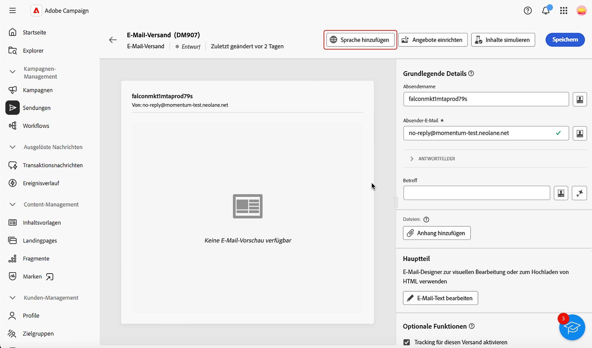{zoomable="yes"}

1. Wählen Sie aus **Dropdown-Liste** Sprache hinzufügen“ die hinzuzufügende Sprache aus und bestätigen Sie dann Ihre Auswahl. Für Push-Benachrichtigungen können Sie auch [CSV-Datei hochladen](#csv-upload) um alle Sprachvarianten gleichzeitig zu importieren.

   Die erste hinzugefügte Sprache wird automatisch als Standard festgelegt und der vorhandene Inhalt wird zur Standardversion. Wenn zusätzliche Sprachen hinzugefügt werden, wird deren Inhalt zunächst aus der Standardsprache kopiert.

   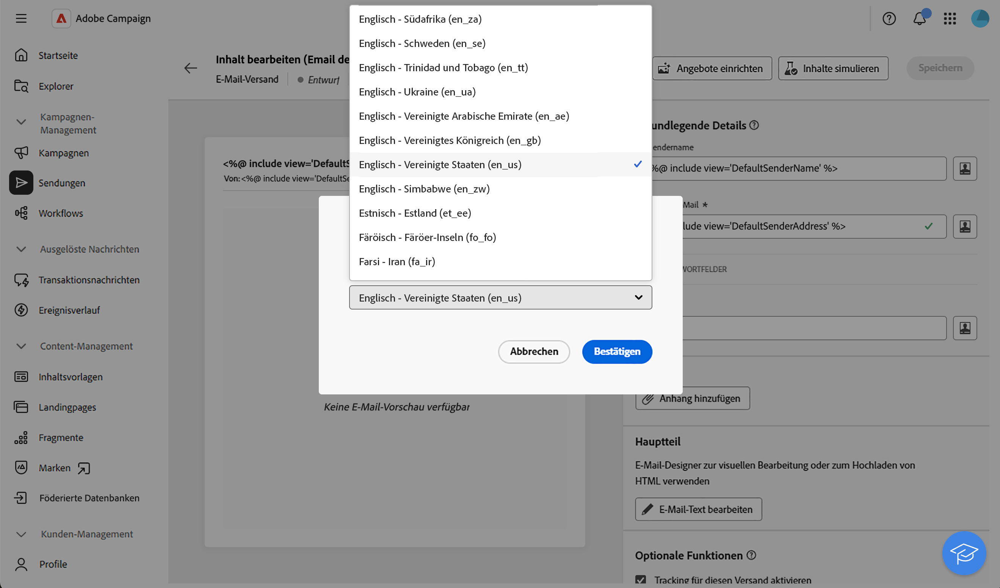{zoomable="yes"}

   >[!NOTE]
   >
   >Die in dieser Liste verfügbaren Sprachen hängen von den Werten ab, die durch das Attribut **Sprache** definiert wurden (Werte wie: „system“, „user“, „dbenum“ usw.). Weitere Informationen zur Auflistungsverwaltung finden Sie in diesem [Abschnitt](../administration/enumerations.md).

1. Wiederholen Sie diesen Vorgang, um weitere Sprachen hinzuzufügen. Im Panel **[!UICONTROL Sprachen]** werden auf der linken Seite die Liste der ausgewählten Sprachen, die Anzahl der verschiedenen Sprachen sowie die Standardsprache angezeigt.

   Wenn Sie beispielsweise Englisch, Französisch und Schwedisch ausgewählt haben, können Sie diese 3 Sprachen wie unten angezeigt sehen:

   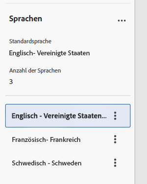{zoomable="yes"}

   Informationen zum Verwalten von Sprachvarianten finden Sie in diesem [Abschnitt](#manage-variant).

## Definieren des Inhalts für jede Variante{#define-content}

Definieren Sie nach dem Festlegen der Sprachen den Versandinhalt für jede Sprache.

1. Wählen Sie auf dem Bildschirm zur Bearbeitung des Versandinhalts über das Panel **[!UICONTROL Sprachen]** auf der linken Seite eine Sprache aus.

   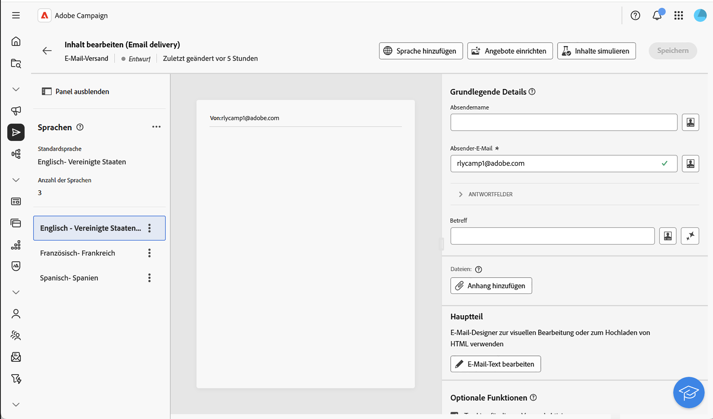{zoomable="yes"}

1. Definieren Sie den Inhalt Ihrer Nachricht für diese Sprache. Weitere Informationen finden Sie in diesem [Abschnitt](../msg/create-deliveries.md).

1. Wiederholen Sie diesen Vorgang für jede Sprache.

<!--
>[!BEGINTABS]

>[!TAB Email delivery]

1. From the delivery content edition screen, choose a language and click the **[!UICONTROL Edit email body]** button. You can also hover over the email preview and select **[!UICONTROL Open email designer]**.

    {zoomable="yes"}

1. Define the content of your email for this language. [Read more](../email/get-started-email-designer.md#start-authoring)

1. Repeat this operation for each language.

>[!TAB SMS delivery]

1. From the delivery content edition screen, choose a language.

1. Edit the content of the SMS message for this language. [Read more](../sms/create-sms.md)

    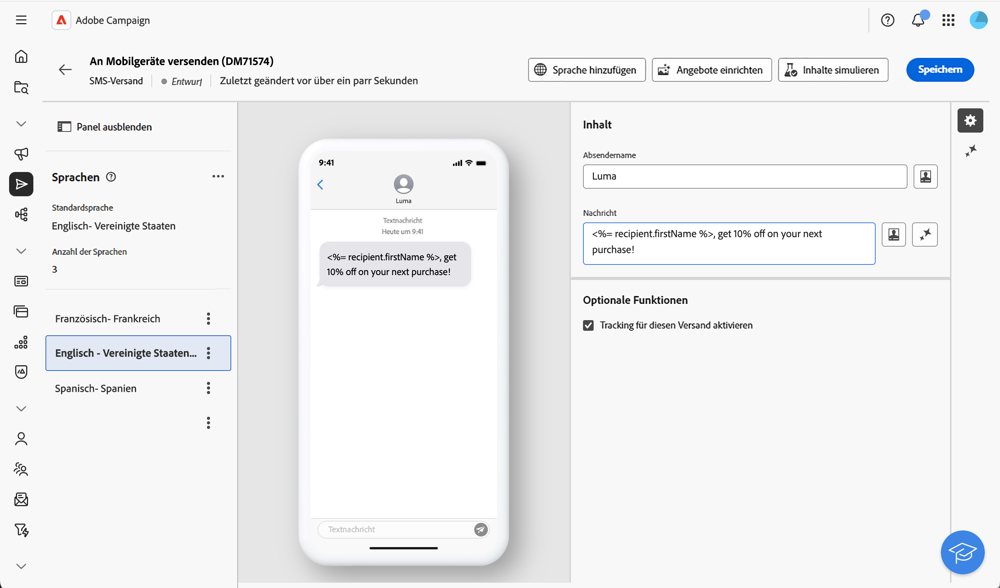{zoomable="yes"}

1. Repeat this operation for each language.

>[!ENDTABS]

-->

Um eine Vorschau des Versands anzuzeigen, klicken Sie auf die Schaltfläche **[!UICONTROL Inhalte simulieren]** und wählen Sie „Profile“ aus. Stellen Sie sicher, dass für jedes Profil der richtige Inhalt angezeigt wird.

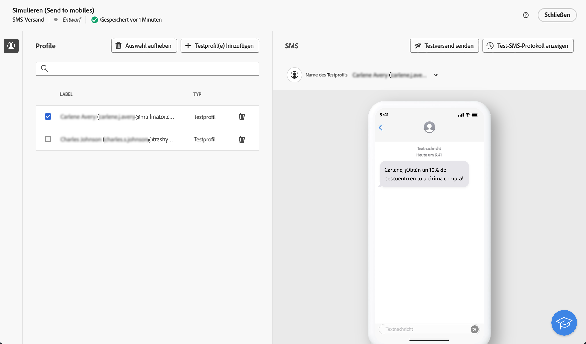{zoomable="yes"}

## Verwalten von Sprachvarianten{#manage-variant}

Im linken Panel werden die Informationen zu allen Sprachvarianten angezeigt. Um alle Sprachen zu löschen, klicken Sie auf die Schaltfläche „Erweitern“ und anschließend auf **[!UICONTROL Alle Varianten löschen]**.

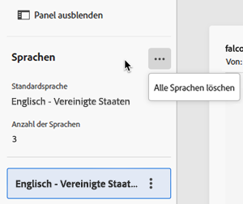{zoomable="yes"}

In der Liste der Sprachvarianten können Sie die folgenden Aktionen ausführen:

* **Bearbeiten**: die Sprache ändern und gleichzeitig die zugehörigen Inhalte beibehalten.
* **Als Standard festlegen**: die Sprache als Standardsprache festlegen. Wenn für ein Profil keine Sprache definiert ist, wird die Nachricht in der Standardsprache gesendet.
* **Duplizieren**: den für diese Sprache definierten Inhalt duplizieren und eine andere Variante auswählen.
* **Löschen**: die Variante und den zugehörigen Inhalt löschen.

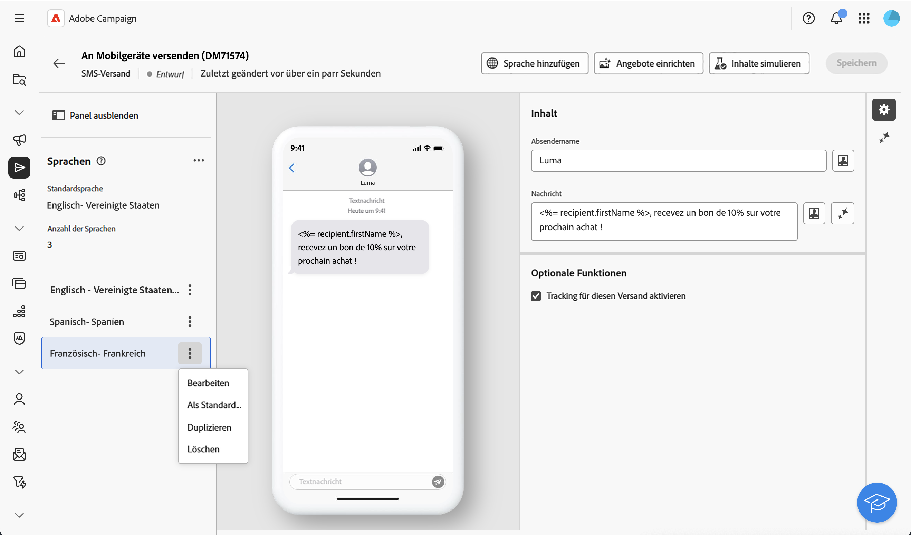{zoomable="yes"}

## Sprachvarianten aus CSV importieren (Push-Benachrichtigungen) {#csv-upload}

Für Push-Benachrichtigungen können Sie schnell alle Sprachvarianten ausfüllen, indem Sie eine CSV-Datei mit Ihrem mehrsprachigen Inhalt hochladen. Diese Funktion optimiert die Erstellung mehrsprachiger Kampagnen, indem Sie Inhalte offline vorbereiten und in Massen importieren können.

* **Effizienz**: Mehrere Sprachen und deren Inhalte in einem Vorgang hinzufügen
* **Konsistenz**: Gewährleistung einer einheitlichen Botschaft für alle Sprachvarianten
* **Collaboration**: Ermöglichen Sie es Inhalts-Teams, Übersetzungen in vertrauten Tabellenkalkulations-Tools vorzubereiten
* **Massenverwaltung**: Einfaches Verwalten und Aktualisieren einer großen Anzahl von Sprachvarianten

### Voraussetzungen {#csv-best-practices}

Befolgen Sie die folgenden Best Practices, um einen erfolgreichen CSV-Import sicherzustellen:

* **Verwenden Sie die exakte Spaltenstruktur**: Alle 14 Spalten müssen in Ihrer CSV-Datei vorhanden sein, auch wenn Sie einige leer lassen. Fehlende Spalten führen zu einem Importfehler. Sie können eine andere Reihenfolge verwenden, aber alle Spalten müssen vorhanden sein.
* **Spaltennamen genau abgleichen**: Bei Spaltennamen wird zwischen Groß- und Kleinschreibung unterschieden. Verwenden Sie `title` nicht `Title`, `badge` nicht `Bbadge`, `locale` nicht `Locale`.
* **Gebietsschemakodes in Kleinbuchstaben verwenden**: Formatieren Sie Gebietsschemakodes als `en_us`, `fr_fr`, `de_de` (Kleinbuchstaben mit Unterstrich), nicht `en_US` oder `en-us`.
* **Pflichtspalten ausfüllen**: Die `locale`- und `language` müssen Werte für jede Zeile enthalten. Leere Werte führen zu einem Importfehler.
* **Gebietsschemata eindeutig**: Jeder Gebietsschema-Code darf nur einmal in der CSV-Datei angezeigt werden. Doppelte Gebietsschemata werden abgelehnt.
* **Als UTF-8 speichern**: Speichern Sie Ihre CSV-Datei immer mit UTF-8-Codierung, um internationale Zeichen korrekt zu unterstützen.
* **Inhalt, der Kommas enthält**: Wenn der Titel oder Nachrichtentext Kommas enthält, setzen Sie das gesamte Feld in doppelte Anführungszeichen: `"Hello, welcome!"`.
* **Numerische Werte korrekt verwenden**: Verwenden Sie für Markierungsspalten (isContentAvailable, isMutableContent, silentPush) `1` für „true“, `0` für „false“ oder lassen Sie das Feld leer für die Standardeinstellung.
* **Validieren des JSON-**: Wenn Sie die Spalte „customFields“ verwenden, stellen Sie sicher, dass Ihr JSON ordnungsgemäß formatiert ist: `{"key":"value"}` mit korrekten Anführungszeichen und Klammern.
* **Testen Sie zuerst mit minimalen Daten**: Beginnen Sie mit einer einfachen 2-3-Sprach-CSV-Datei, um Ihr Format zu überprüfen, bevor Sie große Dateien erstellen.

>[!NOTE]
>
>Die Spaltenstruktur wird in diesem [Abschnitt](#csv-columns) beschrieben.

### CSV-Datei importieren {#csv-steps}

Gehen Sie wie folgt vor, um Sprachvarianten aus einer CSV-Datei zu importieren:

1. Klicken Sie im Editor für Versandinhalte auf **[!UICONTROL Sprache hinzufügen]**.

   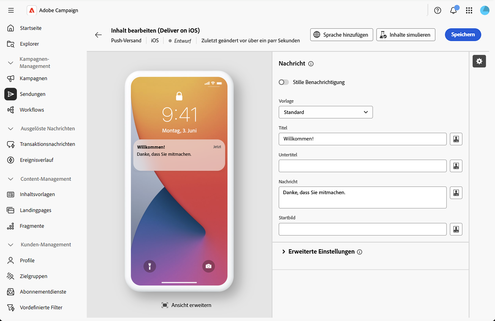{zoomable="yes"}

1. Wählen Sie Ihre CSV-Datei aus, indem Sie sie per Drag-and-Drop in den Upload-Bereich ziehen, oder klicken Sie, um Ihren Computer zu durchsuchen.

   Das System überprüft Ihr Dateiformat und Ihren Inhalt. Wenn die Validierung fehlschlägt, geben Fehlermeldungen an, welche Spalten oder Daten falsch sind. Beheben Sie die Probleme in Ihrer CSV-Datei und laden Sie sie erneut hoch. Weitere Informationen finden Sie in diesem [Abschnitt](#csv-troubleshooting).

   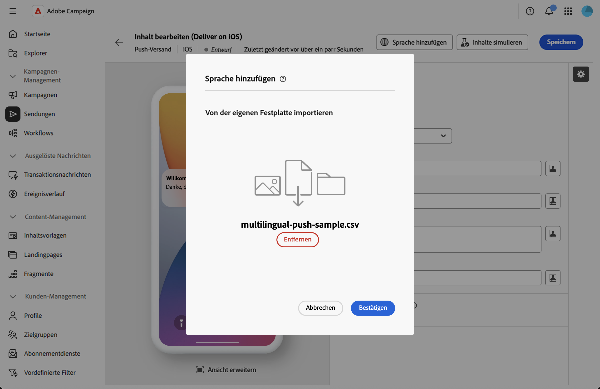{zoomable="yes"}

1. Überprüfen Sie die importierten Inhalte im Bedienfeld Sprachvarianten , um zu bestätigen, dass alle Übersetzungen korrekt geladen wurden.

   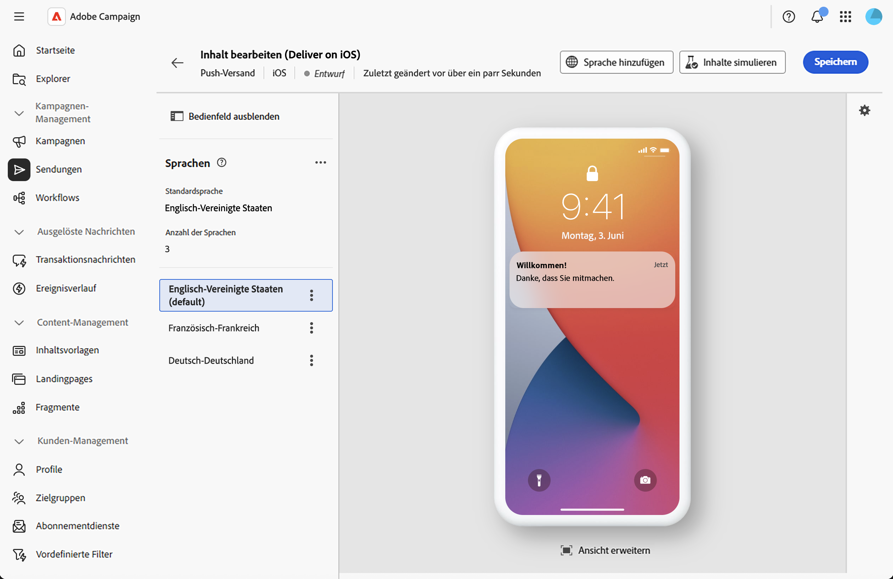{zoomable="yes"}

### Spaltenstruktur {#csv-columns}

Hier finden Sie die richtige zu verwendende Spaltenstruktur:

>[!NOTE]
>
>Sie können eine andere Reihenfolge verwenden, aber alle Spalten müssen vorhanden sein. Weitere Best Practices finden Sie in diesem [Abschnitt](#csv-best-practices).

1. **title**: Titel der Benachrichtigung (erforderlich)
1. **messageBody**: Textkörper der Benachrichtigungsmeldung (erforderlich)
1. **sound**: Name der Audiodatei (z. B. `default`, `custom_sound.mp3`) - lassen Sie das Feld für die Standardeinstellung leer.
1. **BADGE**: Badge-Nummer, die auf dem App-Symbol (iOS) angezeigt wird - nur Zahlen verwenden
1. **deeplinkURI**: Deep-Link-URL, die beim Tippen auf eine Benachrichtigung geöffnet werden soll - leer lassen, wenn nicht verwendet
1. **category**: Kennung der Benachrichtigungskategorie für benutzerdefinierte Aktionen (iOS) - Leer lassen, wenn nicht verwendet
1. **iosMediaAttachmentURL**: URL des Medienanhangs für iOS-Benachrichtigungen - Leer lassen, wenn er nicht verwendet wird
1. **androidMediaAttachmentURL**: URL des Medienanhangs für Android-Benachrichtigungen - Leer lassen, wenn nicht verwendet
1. **isContentAvailable**: Flag für verfügbaren Inhalt (iOS) - `1` für „true“ verwenden, `0` für „false“, für „default“ leer lassen (0).
1. **isMutableContent**: Markierung für veränderbaren Inhalt (iOS) - Verwenden Sie `1` für „true“, `0` für „false“ und lassen Sie es leer für „default“ (0).
1. **customFields**: Benutzerdefinierte Daten im JSON-Format (z. B. `{"key1":"value1","key2":"value2"}`) - Leer lassen, wenn sie nicht verwendet werden
1. **locale**: Sprach-Code (erforderlich) - z. B. `en_us`, `fr_fr`, `de_de` - **obligatorisch, muss pro Zeile eindeutig sein**
1. **language**: Sprachname (erforderlich) - z.B. `English-United States`, `French-France` - **obligatorisch**
1. **silentPush**: Markierung für stille Push - `1` für stille Push verwenden, für reguläre Push `0`, für Standard leer lassen (0)

### Beispiel einer CSV-Datei {#csv-examples}

Im Folgenden finden Sie ein einfaches Beispiel mit den Pflichtfeldern:

```csv
title,messageBody,sound,badge,deeplinkURI,category,iosMediaAttachmentURL,androidMediaAttachmentURL,isContentAvailable,isMutableContent,customFields,locale,language,silentPush
Welcome!,Thank you for joining us,,,,,,,,,, en_us,English-United States,0
Bienvenue !,Merci de nous avoir rejoint,,,,,,,,,,fr_fr,French-France,0
Willkommen!,Vielen Dank für Ihre Anmeldung,,,,,,,,,, de_de,German-Germany,0
¡Bienvenido!,Gracias por unirte a nosotros,,,,,,,,,, es_es,Spanish-Spain,0
```

Im Folgenden finden Sie ein Beispiel mit optionalen Feldern:

```csv
title,messageBody,sound,badge,deeplinkURI,category,iosMediaAttachmentURL,androidMediaAttachmentURL,isContentAvailable,isMutableContent,customFields,locale,language,silentPush
Welcome!,Thank you for joining us,default,1,,,https://example.com/welcome-en.jpg,https://example.com/welcome-en.jpg,,,, en_us,English-United States,0
Bienvenue !,Merci de nous avoir rejoint,default,1,,,https://example.com/welcome-fr.jpg,https://example.com/welcome-fr.jpg,,,, fr_fr,French-France,0
Willkommen!,Vielen Dank für Ihre Anmeldung,default,1,,,https://example.com/welcome-de.jpg,https://example.com/welcome-de.jpg,,,, de_de,German-Germany,0
¡Bienvenido!,Gracias por unirte a nosotros,default,1,,,https://example.com/welcome-es.jpg,https://example.com/welcome-es.jpg,,,, es_es,Spanish-Spain,0
```

Im Folgenden finden Sie ein Beispiel mit benutzerdefinierten Feldern

```csv
title,messageBody,sound,badge,deeplinkURI,category,iosMediaAttachmentURL,androidMediaAttachmentURL,isContentAvailable,isMutableContent,customFields,locale,language,silentPush
New Collection,Discover our latest products,default,1,,,,,,,"{"campaign":"summer2025","segment":"premium"}",en_us,English-United States,0
Nouvelle Collection,Découvrez nos derniers produits,default,1,,,,,,,"{"campaign":"summer2025","segment":"premium"}",fr_fr,French-France,0
```

>[!NOTE]
>
>Für Rich-Push-Benachrichtigungen mit Karussells oder Aktionsschaltflächen verwendet Campaign eine andere Konfigurationsmethode als den CSV-Import. Konfigurieren Sie Rich-Push-Inhalte direkt im Versand-Editor nach dem Import grundlegender mehrsprachiger Inhalte.

### Personalization in CSV-Dateien {#csv-personalization}

Um Personalisierungsfelder in Ihren CSV-Inhalten zu verwenden, müssen Sie `<span>` Tags verwenden:

```csv
title,messageBody,sound,badge,deeplinkURI,category,iosMediaAttachmentURL,androidMediaAttachmentURL,isContentAvailable,isMutableContent,customFields,locale,language,silentPush
"Hello <span class=""nl-dce-field nl-dce-done"" data-nl-expr=""recipient.firstName"">recipient.firstName</span>","Your order has shipped!",,,,,,,,,,en_us,English-United States,0
"Bonjour <span class=""nl-dce-field nl-dce-done"" data-nl-expr=""recipient.firstName"">recipient.firstName</span>","Votre commande a été expédiée !",,,,,,,,,,fr_fr,French-France,0
```

Während des Versands ersetzt Campaign diese Platzhalter durch die tatsächlichen Empfängerdaten.

### Fehlerbehebung {#csv-troubleshooting}

| Fehler | Grund | Lösung |
|-------|-------|----------|
| Erforderliche Spalten fehlen | CSV-Datei enthält nicht alle 14 Spalten | Stellen Sie sicher, dass Ihre CSV-Datei alle 14 Spalten in der exakt oben gezeigten Reihenfolge enthält. Verwenden Sie leere Werte für nicht verwendete Spalten. |
| Ungültige Gebietsschema-/Sprachwerte | Gebietsschema- oder Sprachspalten sind leer | Sowohl die Spalten des Gebietsschemas als auch der Sprache müssen Werte für jede Zeile aufweisen |
| Doppelte Gebietsschemata | Derselbe Gebietsschema-Code wird mehrmals angezeigt | Jeder Gebietsschemawert muss eindeutig sein - Entfernen doppelter Zeilen |
| Probleme mit der Dateicodierung | CSV-Datei verwendet eine inkompatible Kodierung | Speichern Sie Ihre CSV-Datei mit UTF-8-Kodierung |
| Spaltenabweichung | Zeilen haben eine andere Anzahl von Spalten als die Kopfzeile | Stellen Sie sicher, dass alle Zeilen genau 14 Spalten aufweisen, die mit der -Kopfzeile übereinstimmen. |
| Ungültige numerische Werte | Badge, isContentAvailable, isMutableContent oder silentPush enthalten nicht numerische Werte | Nur Zahlen verwenden: 0 oder 1 für Flags oder leer lassen für Standard |
| Falsch formatiertes JSON | customFields-Spalte enthält ungültiges JSON | Stellen Sie sicher, dass die JSON-Syntax korrekt ist: `{"key":"value"}` oder leer lassen |
| Groß-/Kleinschreibung des Spaltennamens stimmt nicht überein | Spaltennamen stimmen nicht genau überein | Bei Spaltennamen wird zwischen Groß- und Kleinschreibung unterschieden. Verwenden Sie die oben aufgeführten exakten Namen (z. B. `badge`, nicht `Badge` oder `BADGE`). |

>Best Practices sind in diesem Abschnitt [](#csv-best-practices). Die Spaltenstruktur wird in diesem [Abschnitt](#csv-columns) beschrieben.
