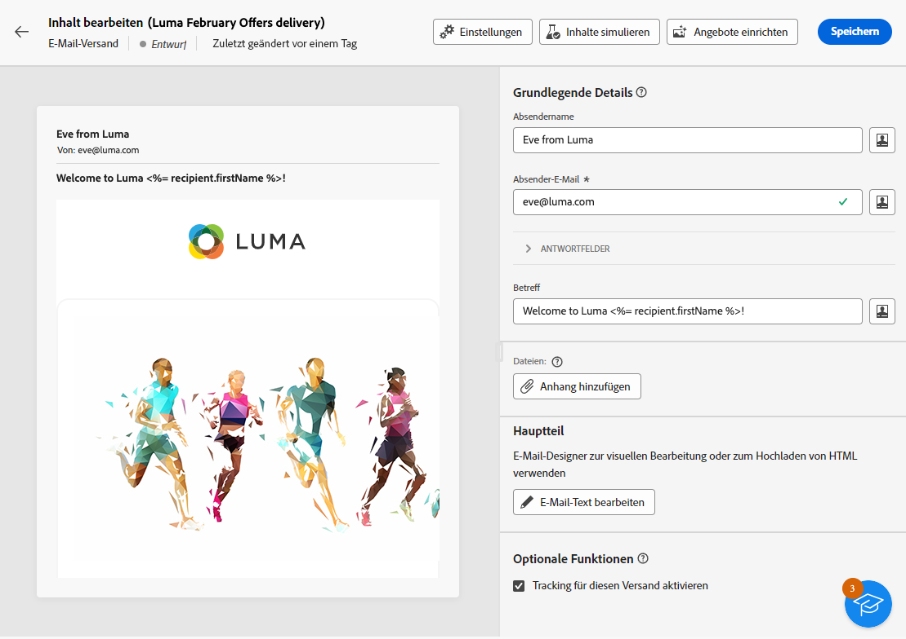
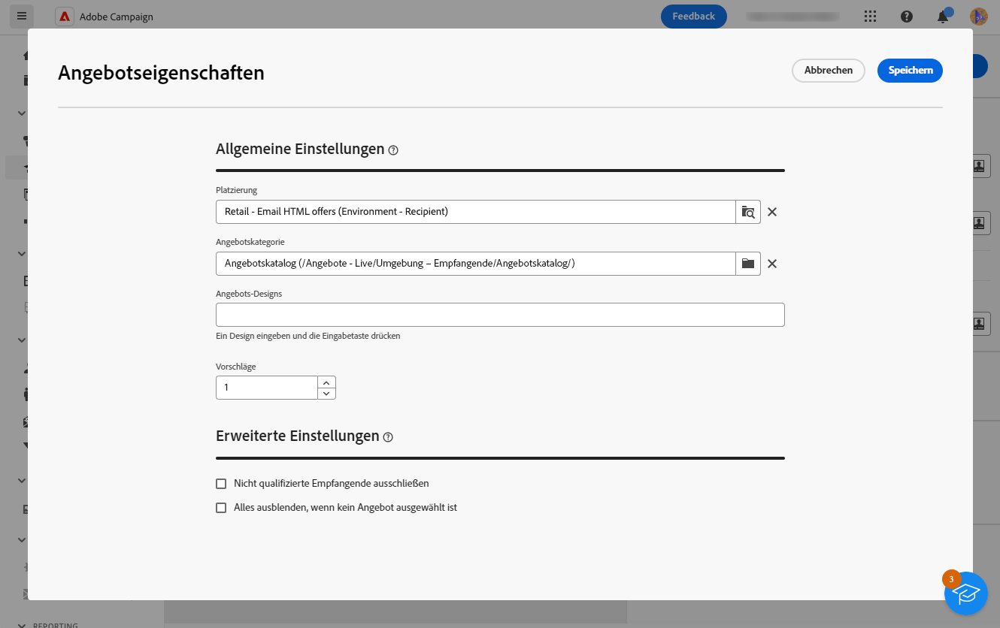
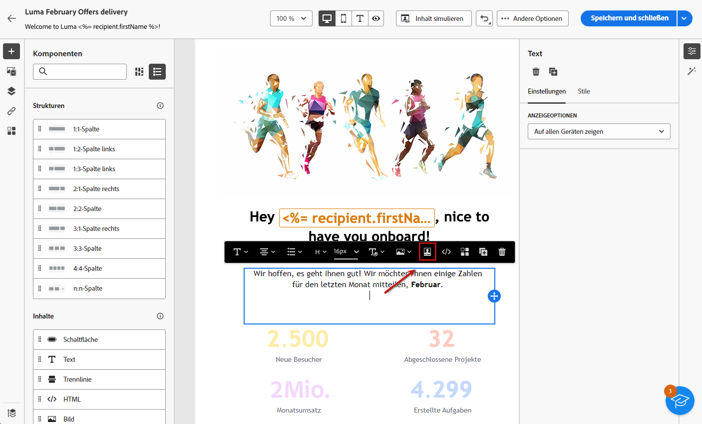
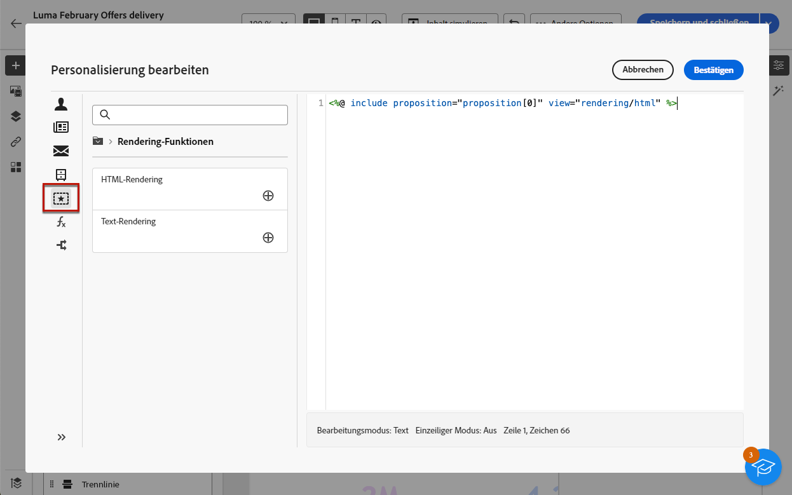

# Hinzufügen von Angeboten zu Ihren Nachrichten {#offers-content}

Sie können Ihren Sendungen über die Adobe Campaign Web-Benutzeroberfläche Angebote hinzufügen. Diese Angebote sind über das linke Menü **Angebote** verfügbar, über das Sie auf die Liste der Angebote zugreifen können. Alle diese Angebote sind schreibgeschützt und müssen in der Campaign-Client-Konsole mithilfe des Moduls **[!UICONTROL Interaction]** erstellt werden. Weitere Informationen zur Interaktion und Verwaltung eines Angebotskatalogs in der Konsole finden Sie in der [Dokumentation zu Campaign v8 (Client-Konsole)](https://experienceleague.adobe.com/docs/campaign/campaign-v8/offers/interaction.html?lang=de){target="_blank"}.

Gehen Sie wie folgt vor, um Angebote mit einem Versand zu senden:

1. [Zu unterbreitende Angebote konfigurieren](#configure)
1. [Angebote in den Versand einfügen](#insert)

## Zu unterbreitende Angebote konfigurieren {#configure}

>[!CONTEXTUALHELP]
>id="acw_deliveries_email_offers_settings"
>title="Definieren der Angebotsparameter"
>abstract="Konfigurieren Sie, welche Angebote den Empfängerinnen und Empfängern unterbreitet werden sollen, indem Sie eine Platzierung, optional eine Kategorie sowie ein Thema definieren und die Anzahl der Angebote angeben, die in den Versand eingefügt werden sollen."

>[!CONTEXTUALHELP]
>id="acw_deliveries_email_offers_advanced_settings"
>title="Festlegen der erweiterten Angebotseinstellungen"
>abstract="Sie können den Ausschluss von Empfängerinnen und Empfängern aktivieren, für die nicht genügend geeignete Angebote vorhanden sind, und festlegen, wie die Nachricht verarbeitet werden soll, falls einer der Vorschläge nicht vorhanden ist."

Adobe Campaign ermöglicht es Ihnen, während einer Interaktion in Echtzeit auf einen bestimmten Kontakt zu reagieren, indem Sie ein oder mehrere spezifische Angebote unterbreiten. Bei diesen Angeboten kann es sich um einfache Kommunikationsnachrichten, Sonderangebote für ein oder mehrere Produkte oder einen Service handeln.

Gehen Sie wie folgt vor, um Angebote auszuwählen, die zu Ihrem Versand hinzugefügt werden sollen.

1. Klicken Sie auf die Schaltfläche **[!UICONTROL Angebote einrichten]** auf dem Bearbeitungsbildschirm für den Inhalt des Versands.

   {zoomable="yes"}

1. Konfigurieren Sie, welche Angebote den Empfängerinnen und Empfängern unterbreitet werden sollen.

   Wählen Sie zunächst die **[!UICONTROL Platzierung]** die Ihrer Angebotsumgebung entspricht. Wie Sie eine Platzierung erstellen, erfahren Sie in der [Dokumentation zu Campaign v8 (Client-Konsole)](https://experienceleague.adobe.com/docs/campaign/campaign-v8/offers/interaction-settings/interaction-offer-spaces.html?lang=de){target="_blank"}.

   {zoomable="yes"}

1. Um die Angebotsauswahl des Moduls zu verfeinern, wählen Sie eine spezifische **[!UICONTROL Angebotskategorie]**, in der die Angebote gruppiert sind.

   Bei der Auswahl eines Ordners werden alle Unterordner automatisch eingeschlossen und können nicht entfernt werden. Beachten Sie, dass dieses Verhalten in der [!DNL Campaign]-Schnittstelle nicht widergespiegelt wird.

   >[!NOTE]
   >
   >Wenn keine Kategorie spezifiziert wird, werden alle in der Umgebung enthaltenen Angebote von der Angebots-Engine berücksichtigt, es sei denn, es wurde ein **[!UICONTROL Angebotsthema]** ausgewählt.

1. (Optional) Geben Sie ein Design ein, um Kategorien zu filtern. Themen sind Schlüsselwörter, die zuvor in den Kategorien definiert wurden. Sie dienen als Filter und verfeinern die Anzahl der zu unterbreitenden Angebote, indem sie sie in einer Reihe von Kategorien auswählen.

1. Verwenden Sie das Feld **[!UICONTROL Vorschläge]**, um die Anzahl der Angebote anzugeben, die in den Versand eingefügt werden sollen.

1. Wählen Sie bei Bedarf die Option **[!UICONTROL Nicht infrage kommende Empfänger ausschließen]** aus.

   Mit dieser Option können Sie den Ausschluss von Empfangenden aktivieren oder deaktivieren, für die nicht genügend geeignete Angebote vorhanden sind:

   * Wenn die Option aktiviert ist, werden Empfängerinnen und Empfänger, für die nicht genügend geeignete Angebote vorhanden sind, vom Versand ausgeschlossen.
   * Wenn die Option deaktiviert ist, werden diese Empfänger nicht ausgeschlossen, ihnen wird jedoch nicht die angeforderte Anzahl an Vorschlägen unterbreitet.

1. Wählen Sie bei Bedarf die Option **[!UICONTROL Alles ausblenden, wenn kein Angebot ausgewählt ist]**.

   Mit dieser Option können Sie festlegen, wie die Nachricht verarbeitet werden soll, wenn eine der Vorschläge nicht existiert:

   * Wenn die Option aktiviert ist, wird die Darstellung des fehlenden Vorschlags nicht angezeigt und es wird auch kein Inhalt für diesen Vorschlag in der Nachricht angezeigt.
   * Wenn die Option deaktiviert ist, wird die Nachricht selbst während des Versands abgebrochen, und die Empfänger und Empfängerinnen können keine Nachrichten mehr empfangen.

Nachdem Sie die Angebote konfiguriert haben, die im Versand vorgeschlagen werden sollen, können Sie sie in den Versandinhalt einfügen.

## Einfügen von Angeboten in den Versand {#insert}

Angebote können mit dem [Ausdruckseditor](../personalization/gs-personalization.md#access) zum Versand hinzugefügt werden. Sie können entweder in die Betreffzeile oder in den Versandtext eingefügt werden.

>[!CAUTION]
>
>Bevor Sie ein Angebot in den Versand einfügen, stellen Sie sicher, dass Sie [konfiguriert haben, welche Angebote mit diesem Versand vorgeschlagen werden sollen](#configure).

Gehen Sie wie folgt vor, um ein Angebot mit dem Ausdruckseditor einzufügen.

1. Rufen Sie die Betreffzeile oder den Inhalt für einen Versand auf.

1. Platzieren Sie den Cursor an der gewünschten Stelle, und öffnen Sie den Ausdruckseditor über das Personalisierungssymbol.

   {zoomable="yes"}

1. Wählen Sie das Menü **[!UICONTROL Vorschläge]** aus. Die verfügbaren Vorschläge werden in der Liste angezeigt.

   >[!NOTE]
   >
   >Die Anzahl der Vorschläge wird beim [Einrichten von Angeboten](#configure) für den aktuellen Versand definiert.

1. Definieren Sie jeden Vorschlag mithilfe der verfügbaren Personalisierungsfelder, Rendering-Funktionen oder Angebotsattribute.

   {zoomable="yes"}

   >[!NOTE]
   >
   >Die Anzahl der verfügbaren Vorschläge hängt von der Konfiguration des Modulaufrufs ab und ihre Reihenfolge hängt von der Priorität der Angebote ab. Weitere Informationen finden Sie in der [Dokumentation zu Campaign v8 (Client-Konsole)](https://experienceleague.adobe.com/docs/campaign/campaign-v8/offers/interaction-best-practices.html?lang=de){target="_blank"}.

1. Speichern Sie Ihre Änderungen.

1. Finalisieren Sie den Inhalt, testen Sie den Versand und führen Sie ihn aus. [Weitere Informationen](gs-messages.md).

Wenn nun ein Empfänger den Versand erhält, wird diesem Profil das richtige Angebot angezeigt.