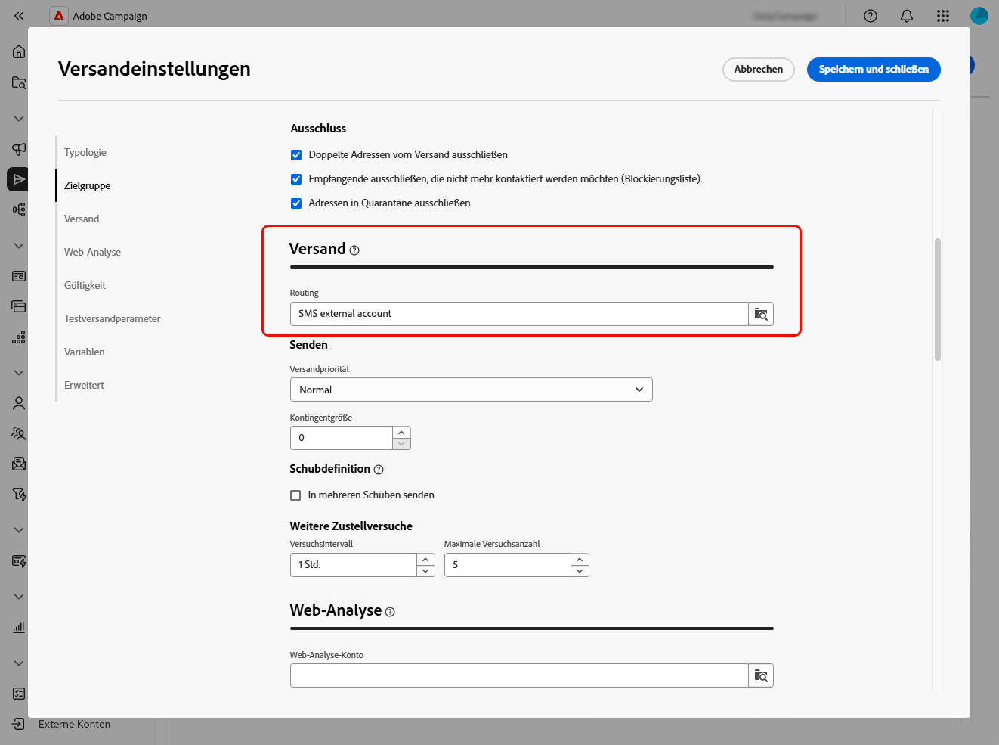
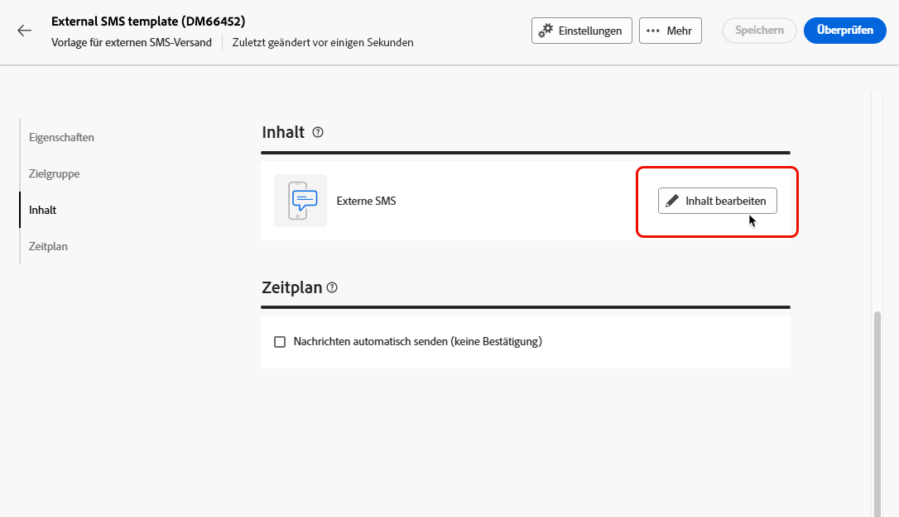
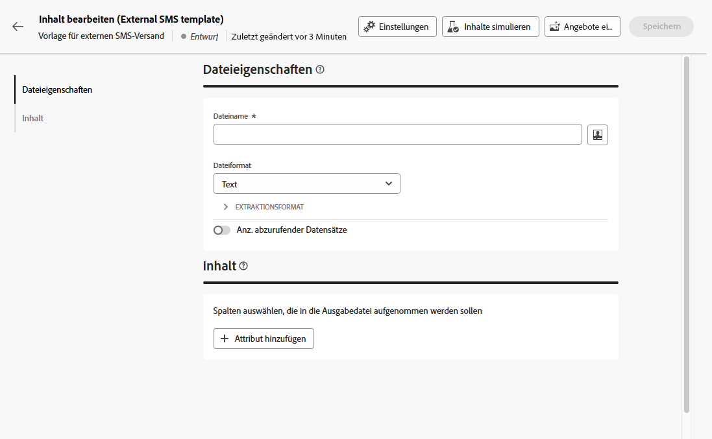

# Durchführen von externen Sendungen {#gs-direct-mail}

Adobe Campaign ermöglicht das Verarbeiten von Sendungen, die außerhalb von Campaign erstellt wurden, um personalisierte E-Mails, SMS-Nachrichten oder Push-Benachrichtigungen (iOS und Android) über ein externes System in großen Mengen bereitzustellen.

<!--The supported channels are Email, Mobile (SMS), and Push (iOs and Android).-->

Beim Erstellen eines externen Versands generiert Adobe Campaign automatisch eine Extraktionsdatei, die alle Zielgruppenprofile und ausgewählten Daten enthält. Diese Datei wird an den Server Ihrer Wahl gesendet, der den Versandprozess für Sie handhabt.

## Erstellen eines dedizierten externen Kontos {#routing-external-account}

Zunächst müssen Sie ein spezielles externes Konto konfigurieren, das in Ihren externen Sendungen verwendet wird. Es muss vom Typ **[!UICONTROL Routing]** sein.

>[!NOTE]
>
>Näheres dazu, wie Sie ein externes Konto vom Typ „Routing“ erstellen, finden Sie in [diesem Abschnitt](../administration/external-account.md#routing).

Wählen Sie für das externe Konto beispielsweise den Kanal **[!UICONTROL Mobil (SMS)]** aus. **[!UICONTROL Extern]** ist standardmäßig als **[!UICONTROL Versandmodus]** ausgewählt.

{zoomable="yes"}

## Erstellen und Senden des externen Versands {#create-external-delivery}

Nachdem das spezifische externe Konto konfiguriert wurde, erstellen Sie den externen Versand. Gehen Sie dazu wie folgt vor.

1. Erstellen Sie einen Versand. [Weitere Informationen](create-deliveries.md)

   Sie haben drei Möglichkeiten:

   * **In einem Workflow**: Fügen Sie Ihrem Workflow eine externe Kanalaktivität (E-Mail, SMS oder Push) hinzu. Detaillierte Anweisungen zum Konfigurieren eines Workflows finden Sie auf [dieser Seite](../workflows/gs-workflow-creation.md).
   * **In einer Kampagne**: Nachdem Sie eine Kampagne erstellt haben, können Sie einen externen Versand über den E-Mail-, SMS- oder Push-Kanal erstellen. Weiterführende Informationen zum Einrichten Ihrer Kampagne finden Sie auf [dieser Seite](../campaigns/gs-campaigns.md).
   * **Eigenständiger Versand**: Binden Sie Kundinnen und Kunden direkt und sofort mit einem individuellen externen Versand ein. [Erfahren Sie, wie Sie einen Versand erstellen](../msg/gs-deliveries.md).

1. Wählen Sie in den [Einstellungen](../advanced-settings/delivery-settings.md) des Versands oder der Versandvorlage das externe Konto aus, das Sie für den Kanal Ihrer Wahl (in diesem Beispiel den SMS-Kanal) erstellt haben, und speichern Sie es.

   {zoomable="yes"}

   >[!NOTE]
   >
   >Vergewissern Sie sich beim Erstellen eines Versands, dass Sie eine [Versandvorlage](delivery-template.md) mit einem externen Konto vom Typ **[!UICONTROL Routing]** ausgewählt haben. Andernfalls können Sie das [oben](#routing-external-account) von Ihnen erstellte dedizierte Konto nicht auswählen.

1. Klicken Sie im Abschnitt **[!UICONTROL Inhaltsversand]** auf **[!UICONTROL Inhalt bearbeiten]**.

   {zoomable="yes"}

1. Im Gegensatz zu einem Standardversand gestalten Sie nicht den Inhalt der Nachricht selbst. Stattdessen müssen Sie die Eigenschaften und Spalten der Datei definieren, die an das externe System gesendet wird.

   {zoomable="yes"}

   Führen Sie die gleichen Schritte wie beim Entwerfen des Inhalts der von [Briefpost-Sendungen](../direct-mail/content-direct-mail.md) generierten Extraktionsdatei aus:

   * Definieren Sie die Eigenschaften der Extraktionsdatei. [Weitere Informationen](../direct-mail/content-direct-mail.md#properties)
   * Wählen Sie die Spalten mit den Informationen aus, die in diese Datei exportiert werden sollen. [Weitere Informationen](../direct-mail/content-direct-mail.md#content)

1. Sie können eine Vorschau der Datei anzeigen und Testsendungen senden<!--not in UI right now - to check-->. [Weitere Informationen](../direct-mail/send-direct-mail.md#preview-dm)

   {zoomable="yes"}

1. Senden Sie den Versand, damit die Extraktionsdatei generiert wird. [Weitere Informationen](../direct-mail/send-direct-mail.md#send-dm)

Nach dem Versand wird die Extraktionsdatei automatisch generiert und an den Speicherort exportiert, der in dem [externen Konto](../administration/external-account.md#create-ext-account) angegeben ist, das in den Einstellungen der Versandvorlage ausgewählt ist.

Sie können die Daten der KPIs über die Versandseite und weitere Daten über das Menü **[!UICONTROL Protokolle]** nachverfolgen.
