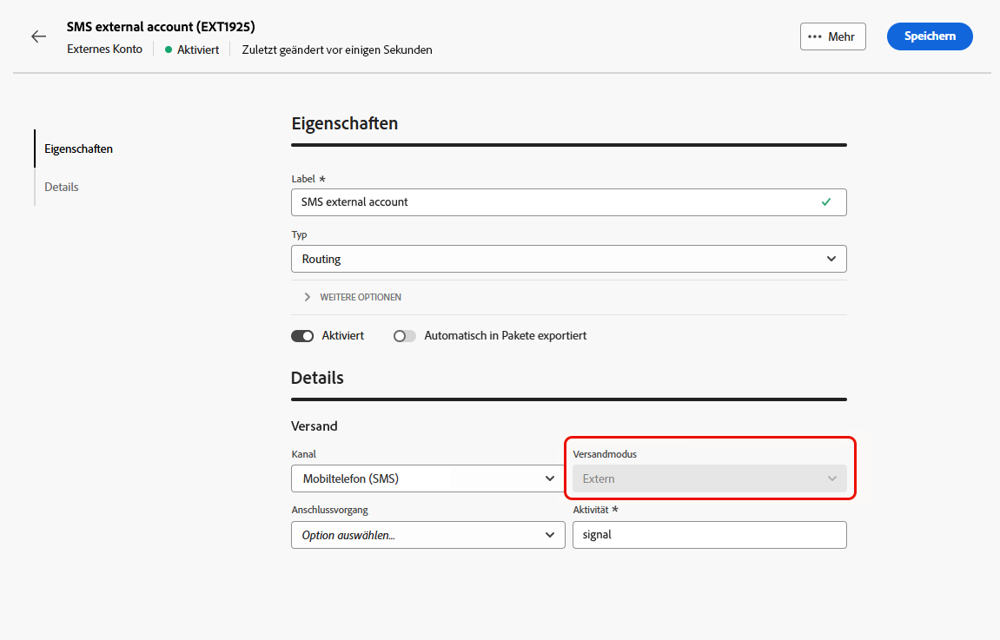
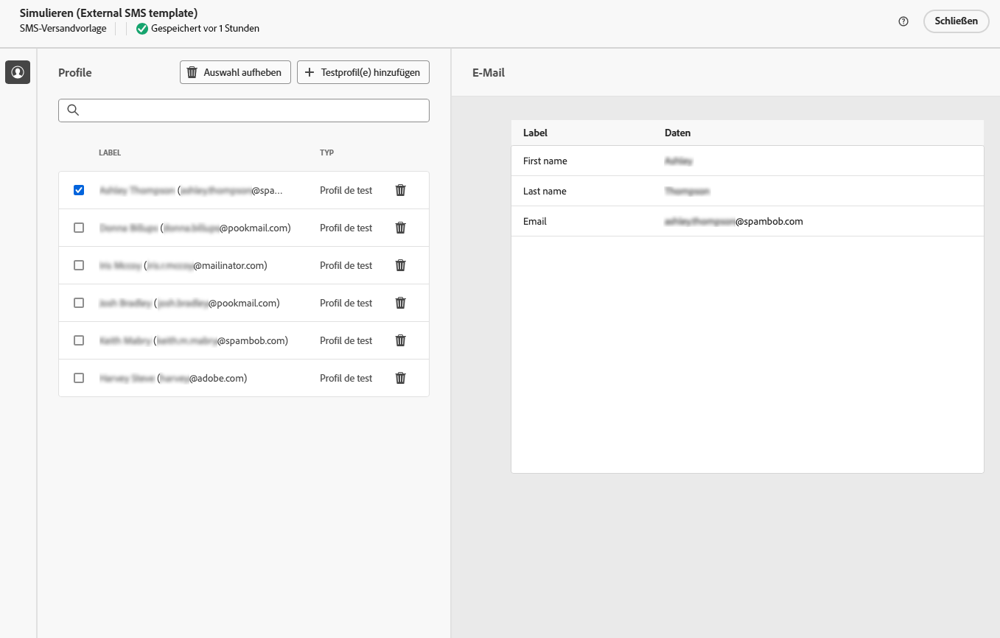

# Durchführen von externen Sendungen {#gs-direct-mail}

Adobe Campaign ermöglicht das Verwalten von Sendungen, die außerhalb von Campaign erstellt wurden, um personalisierte E-Mails, SMS-Nachrichten oder Push-Benachrichtigungen (iOS und Android) in großen Mengen über ein externes System zu versenden.

<!--The supported channels are Email, Mobile (SMS), and Push (iOS and Android).-->

Beim Erstellen eines externen Versands generiert Adobe Campaign automatisch eine Extraktionsdatei, die alle Zielgruppenprofile und ausgewählten Daten enthält. Diese Datei wird an den Server Ihrer Wahl gesendet, der den Versandprozess verarbeitet.

## Erstellen eines dedizierten externen Kontos {#routing-external-account}

Sie müssen ein bestimmtes externes Konto für Ihre externen Sendungen konfigurieren. Es muss vom Typ **[!UICONTROL Routing]** sein.

>[!NOTE]
>
>Näheres dazu, wie Sie ein externes Konto vom Typ „Routing“ erstellen, finden Sie in [diesem Abschnitt](../administration/external-account.md#routing).

Wählen Sie für das externe Konto beispielsweise den Kanal **[!UICONTROL Mobil (SMS)]** aus. **[!UICONTROL Extern]** ist standardmäßig als **[!UICONTROL Versandmodus]** ausgewählt.

{zoomable="yes"}

## Erstellen und Senden des externen Versands {#create-external-delivery}

Nachdem das spezifische externe Konto konfiguriert wurde, erstellen Sie den externen Versand. Gehen Sie dazu wie folgt vor.

1. Erstellen Sie einen Versand. [Weitere Informationen](create-deliveries.md)

   Sie haben drei Möglichkeiten:

   * **In einem Workflow**: Fügen Sie Ihrem Workflow eine externe Kanalaktivität (E-Mail, SMS oder Push) hinzu. Detaillierte Anweisungen zum Konfigurieren von Workflows finden Sie auf [dieser Seite](../workflows/gs-workflow-creation.md).
   * **In einer Kampagne**: Nachdem Sie eine Kampagne erstellt haben, können Sie einen externen Versand über den E-Mail-, SMS- oder Push-Kanal erstellen. Weiterführende Informationen zum Einrichten Ihrer Kampagne finden Sie auf [dieser Seite](../campaigns/gs-campaigns.md).
   * **Eigenständiger Versand**: Binden Sie Kundinnen und Kunden direkt und sofort mit einem individuellen externen Versand ein. [Erfahren Sie, wie Sie einen Versand erstellen](../msg/gs-deliveries.md).

1. Wählen Sie in den [Einstellungen](../advanced-settings/delivery-settings.md) des Versands oder der Versandvorlage das für den Kanal Ihrer Wahl erstellte externe Konto aus (in diesem Beispiel den SMS-Kanal) und speichern Sie es.

   {zoomable="yes"}

   >[!NOTE]
   >
   >Stellen Sie beim Erstellen eines Versands sicher, dass Sie eine [Versandvorlage](delivery-template.md) mit einem externen Konto vom Typ **[!UICONTROL Routing]** ausgewählt haben. Andernfalls können Sie das [oben](#routing-external-account) erstellte dedizierte Konto nicht auswählen.

1. Klicken Sie im Abschnitt **[!UICONTROL Inhalt]** für den Versand auf **[!UICONTROL Inhalt bearbeiten]**.

   {zoomable="yes"}

1. Im Gegensatz zu einem Standardversand gestalten Sie nicht den Inhalt der Nachricht selbst. Stattdessen definieren Sie die Eigenschaften und Spalten der Datei, die an das externe System gesendet wird.

   {zoomable="yes"}

   Führen Sie die gleichen Schritte wie beim Entwerfen des Inhalts der von [Briefpost-Sendungen](../direct-mail/content-direct-mail.md) generierten Extraktionsdatei aus:

   * Definieren Sie die Eigenschaften der Extraktionsdatei. [Weitere Informationen](../direct-mail/content-direct-mail.md#properties)
   * Wählen Sie die Spalten mit den Informationen aus, die in die Datei exportiert werden sollen. [Weitere Informationen](../direct-mail/content-direct-mail.md#content)

1. Zeigen Sie eine Vorschau der Datei an und senden Sie Testsendungen<!--not in UI right now - to check-->. [Weitere Informationen](../direct-mail/send-direct-mail.md#preview-dm)

   {zoomable="yes"}

1. Senden Sie den Versand, damit die Extraktionsdatei generiert wird. [Weitere Informationen](../direct-mail/send-direct-mail.md#send-dm)

Nach dem Versand wird die Extraktionsdatei automatisch generiert und an den Speicherort exportiert, der in dem [externen Konto](../administration/external-account.md#create-ext-account) angegeben ist, das in den Einstellungen der Versandvorlage ausgewählt ist.

Verfolgen Sie die Daten der KPIs über die Versandseite und weitere Daten über das Menü **[!UICONTROL Logs]**.