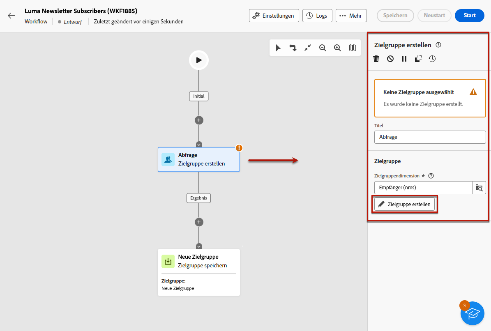
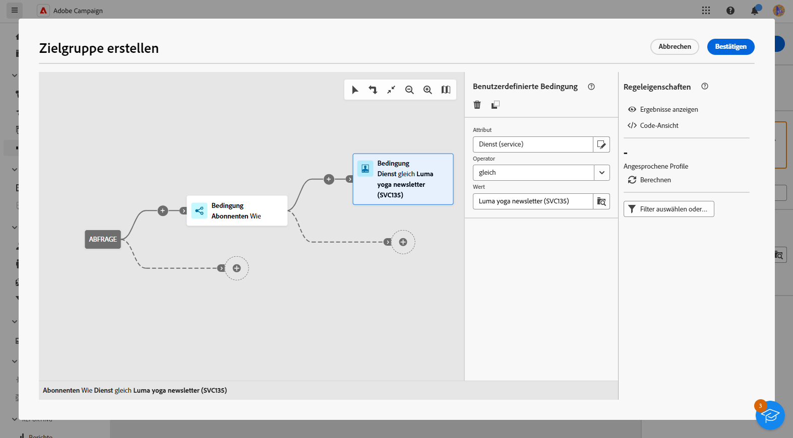
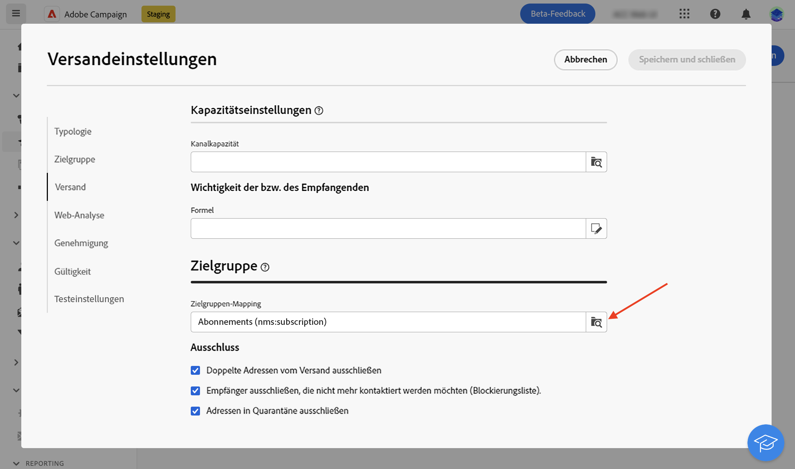
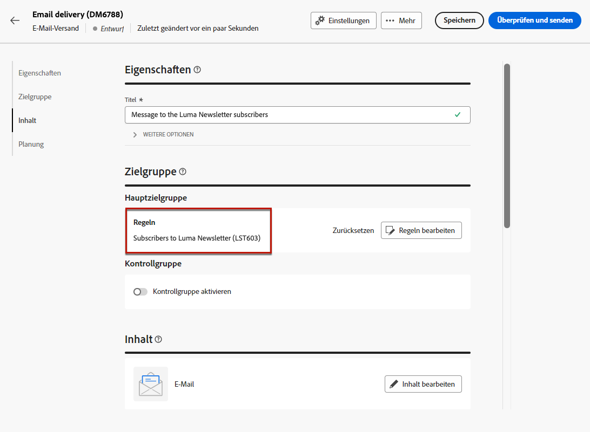
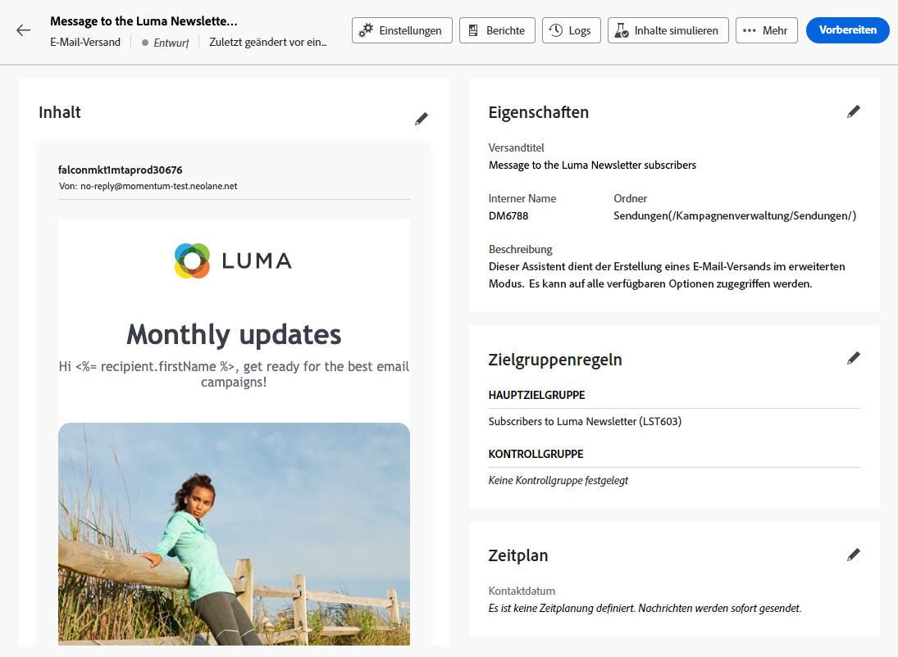

# Senden von Nachrichten an Abonnentinnen und Abonnenten eines Dienstes {#send-to-subscribers}

Sie können in Adobe Campaign Anmeldedienste erstellen und Nachrichten an Ihre Abonnentinnen und Abonnenten senden. Erfahren Sie auf [dieser Seite](../audience//manage-services.md#create-service), wie Sie Abonnementdienste erstellen.

Um Nachrichten an Ihre Abonnentinnen und Abonnenten zu senden, erstellen Sie eine bestimmte Zielgruppe, um die Abonnentinnen und Abonnenten zu identifizieren, und erstellen Sie dann den Versand wie unten beschrieben.

1. Erstellen einer Zielgruppe. Es wird automatisch ein neuer Workflow erstellt. [Weitere Informationen zu Zielgruppen](../audience/create-audience.md)

1. Ändern Sie zugunsten einer besseren Lesbarkeit den Namen des Workflows in den Workflow-Einstellungen im Feld **Titel**. [Erfahren Sie, wie Sie Workflow-Einstellungen konfigurieren](../workflows/workflow-settings.md)

1. Öffnen Sie die Aktivität **[!UICONTROL Zielgruppe erstellen]** und wählen Sie **[!UICONTROL Zielgruppe erstellen]** aus. [Erfahren Sie, wie Sie die Aktivität „Zielgruppe erstellen“ konfigurieren können](../workflows/activities/build-audience.md)

   {zoomable=&quot;yes&quot;}

1. Wählen Sie im Fluss zur Erstellung der Zielgruppe die folgenden benutzerdefinierten Bedingungen aus: Es gibt **[!UICONTROL Abonnements]**, wie beispielsweise **[!UICONTROL Dienst]** ist gleich dem von Ihnen definierten Dienst. In diesem Beispiel wählen Sie Ihren **Luma Yoga-Newsletter** aus.

   {zoomable=&quot;yes&quot;}

1. Wählen Sie **[!UICONTROL Bestätigen]** aus und klicken Sie auf **[!UICONTROL Starten]**, um den Workflow auszuführen.

1. Erstellen Sie einen Versand. Die Schritte zum Erstellen eines Versands werden auf [dieser Seite](../msg/gs-messages.md#create-delivery) ausgeführt.
1. Navigieren Sie zu Ihren Versandeinstellungen und ändern Sie das standardmäßige Zielgruppen-Mapping in **Abonnements (nms:subscriptions)**.

   {zoomable=&quot;yes&quot;}

1. Wählen Sie im Hauptzielbereich des Versands die zuvor erstellte Zielgruppe aus.

   {zoomable=&quot;yes&quot;}

1. Erstellen Sie den Nachrichteninhalt und testen und senden Sie den Versand, wie in [diesem Abschnitt](../preview-test/preview-test.md) ausgeführt.

   {zoomable=&quot;yes&quot;}

Ihr Versand wird nur den Abonnentinnen und Abonnenten dieses Dienstes zugestellt.
