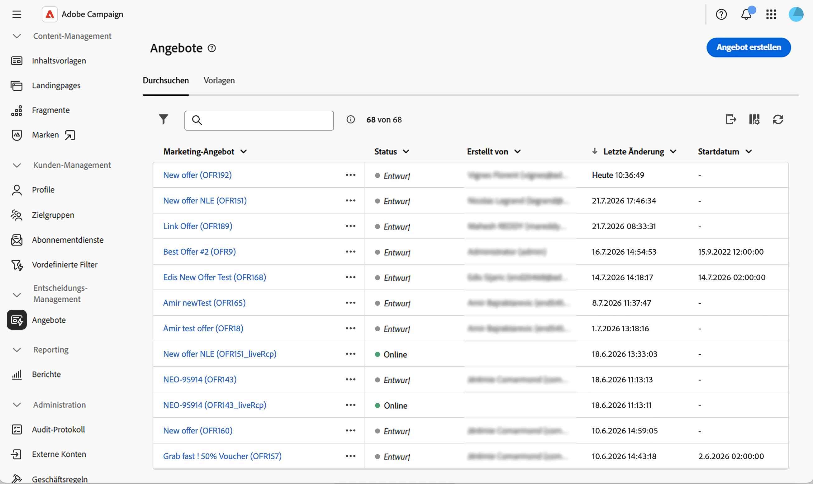
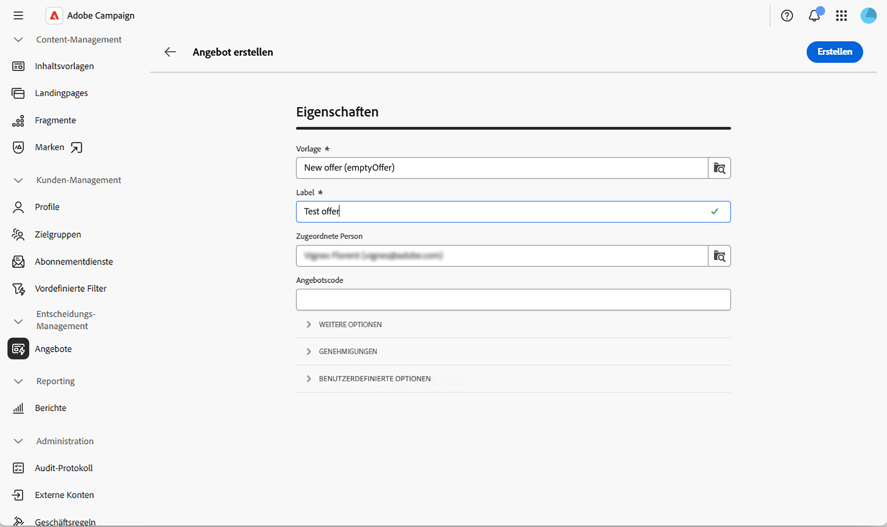
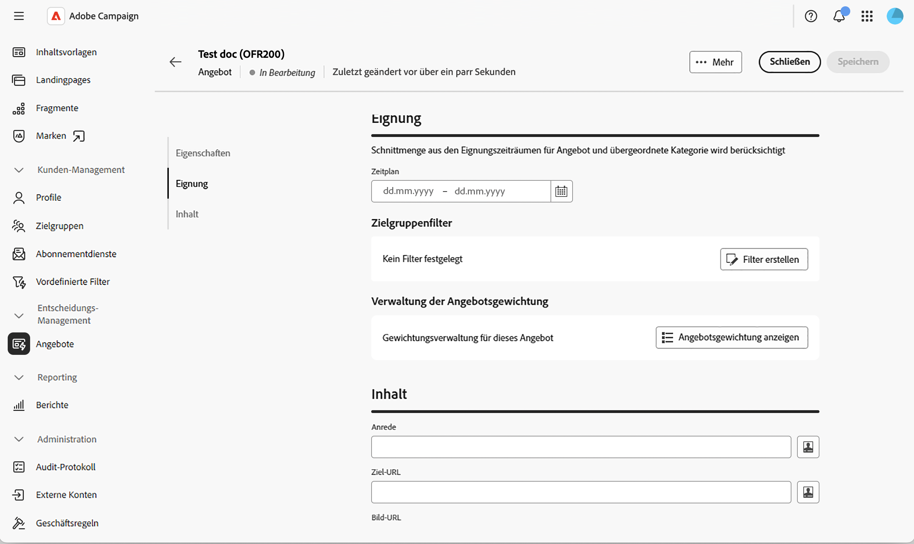
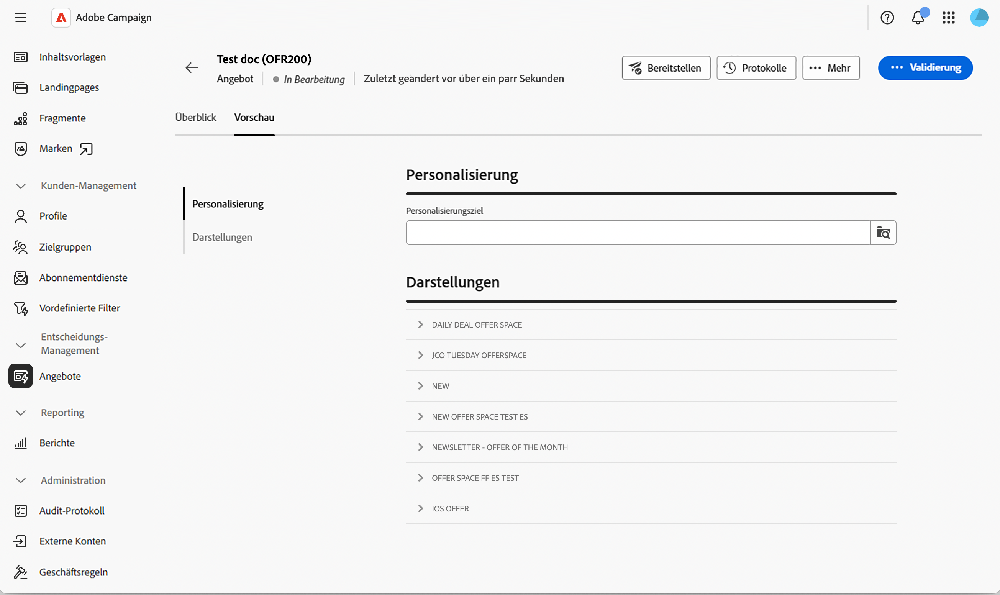
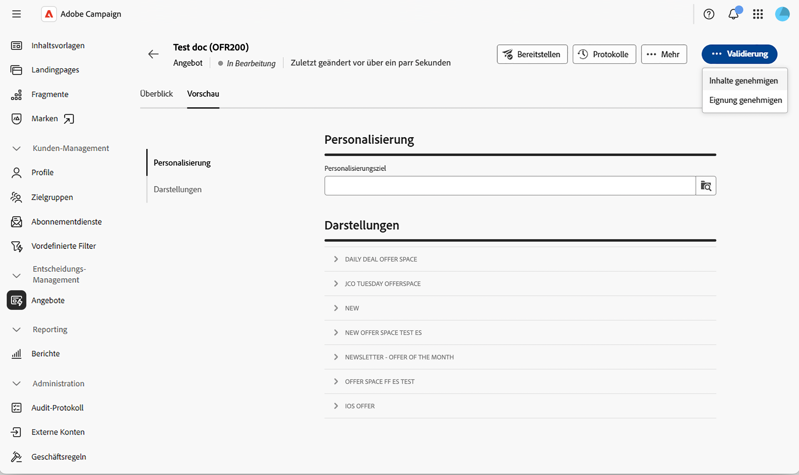
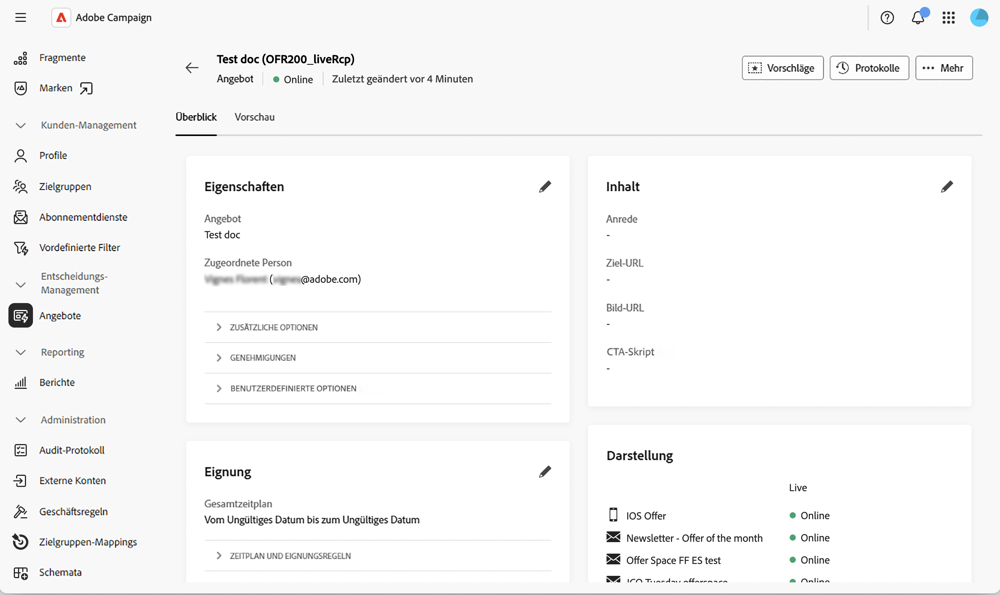

# Erstellen und Veröffentlichen eines Angebots {#create-offer}

Ein **Angebot** ist ein individueller Vorschlag mit eigenem Eignungszeitraum, Zielgruppenfilter, Gewichtung und Inhalt. Angebote sind im Angebotskatalog über **Kategorien** organisiert und werden Empfangenden über eine **Platzierung** unterbreitet.

Bevor Sie ein Angebot erstellen, stellen Sie sicher, dass die Angebotsumgebung konfiguriert ist und mindestens eine Platzierung veröffentlicht wurde. Weitere Informationen finden Sie unter [Konfigurieren einer Angebotsumgebung](offer-environment.md) und [Erstellen und Verwalten von Platzierungen](offer-space.md).

## Zugreifen auf den Angebotskatalog {#access}

Um Angebote zu durchsuchen und zu erstellen, wählen Sie in der linken Navigationsleiste **[!UICONTROL Angebote]** aus. Die Liste enthält die vorhandenen Angebote. Verwenden Sie das Suchfeld, die Ordnerauswahl oder den [Abfrage-Modeler](../query/query-modeler-overview.md), um die Liste zu filtern.

{zoomable="yes"}

Klicken Sie auf den Namen eines Angebots, um es zur Bearbeitung zu öffnen, oder wählen Sie die drei Punkte neben dem Angebot aus, um es zu **[!UICONTROL duplizieren]** oder zu **[!UICONTROL löschen]**.

## Erstellen eines Angebots {#create}

Erstellen eines neuen Angebots:

1. Klicken Sie in der Liste der Angebote auf **[!UICONTROL Angebot erstellen]**.

1. Wählen Sie die **[!UICONTROL Vorlage]** aus, aus der das Angebot erstellt werden soll (z. B. ein leeres Angebot oder eine anonyme Angebotsvorlage).

   {zoomable="yes"}

1. Geben Sie ein **[!UICONTROL Label]** ein und weisen Sie das Angebot optional einer Benutzerin bzw. einem Benutzer zu, indem Sie **[!UICONTROL Zugewiesen an]** verwenden und/oder einen **[!UICONTROL Angebots-Code]** eingeben.

1. Erweitern Sie **[!UICONTROL Zusätzliche Optionen]**, um den automatisch generierten **[!UICONTROL internen Namen]** zu bearbeiten, wählen Sie die **[!UICONTROL Kategorie]** aus, in der das Angebot gespeichert ist, oder fügen Sie eine Beschreibung hinzu. Dieser Schritt ist optional.

1. Erweitern Sie **[!UICONTROL Validierungen]**, um den Gruppen **[!UICONTROL Eignungsvalidierung]** und **[!UICONTROL Inhaltsvalidierung]** validierende Personen zuzuweisen. Dieser Schritt ist optional.

1. Erweitern Sie **[!UICONTROL Benutzerdefinierte Optionen]**, um alle zusätzlichen Felder auszufüllen, die Ihre Organisation dem Angebotsschema hinzugefügt hat. Die in diesem Abschnitt angezeigten Felder sind je nach Kampagneninstanz unterschiedlich. Dieser Schritt ist optional.

1. Wählen Sie **[!UICONTROL Erstellen]** aus. Der Bildschirm mit den vollständigen Einstellungen wird angezeigt.

   {zoomable="yes"}

### Definieren der Eignung {#eligibility}

In diesem Abschnitt können Sie steuern, wann und wem das Angebot unterbreitet werden kann. Folgende Optionen stehen zur Verfügung:

* **[!UICONTROL Zeitplan]** – Legen Sie das Start- und Enddatum fest, zwischen denen das Angebot unterbreitet werden kann.

  >[!NOTE]
  >
  >Schnittmengen der Eignungszeiträume mit der übergeordneten Kategorie werden berücksichtigt: Selbst wenn der eigene Zeitplan des Angebots umfangreicher ist, wird das Angebot nur unterbreitet, während seine übergeordnete Kategorie ebenfalls geeignet ist.

* **[!UICONTROL Filter für die Zielgruppe]** – Klicken Sie auf **[!UICONTROL Filter erstellen]**, um den Regel-Builder zu öffnen und das Angebot auf eine bestimmte Zielgruppe zu beschränken. Lassen Sie den Filter leer, damit das Angebot für die gesamte Zielgruppe der Umgebung geeignet ist. Informationen zur Wiederverwendung eines **vordefinierten Filters**, der auf Plattformebene deklariert wurde, finden Sie in der [Dokumentation zu Campaign v8](https://experienceleague.adobe.com/docs/campaign/campaign-v8/offers/interaction-predefined-filters.html?lang=de){target="_blank"}. Vordefinierte Filter werden über die Client-Konsole erstellt.

* **[!UICONTROL Verwaltung der Angebotsgewichtung]** – Klicken Sie auf **[!UICONTROL Angebotsgewichtung anzeigen]** und dann auf **[!UICONTROL Gewichtung hinzufügen]**, um die Priorität des Angebots zu beeinflussen, wenn mehrere Angebote gleichzeitig geeignet sind. Jede Gewichtung hat ein Startdatum, ein Enddatum und einen optionalen Filter.

>[!NOTE]
>
>Das Angebotsmodul sortiert geeignete Angebote nach abnehmender Gewichtung und gibt zuerst die Vorschläge mit der höchsten Gewichtung zurück. Die Auswahllogik – auch als **Schlichtung** bezeichnet – berücksichtigt auch die Eignungsregeln und Gewichtungen, die für die übergeordnete Kategorie und die Umgebung konfiguriert sind. Weitere Informationen zum Prinzip der Schlichtung finden Sie in der [Dokumentation zu Campaign v8](https://experienceleague.adobe.com/docs/campaign/campaign-v8/offers/interaction-best-practices.html?lang=de){target="_blank"}.

### Definieren des Inhalts {#content}

Wählen Sie im Angebot die Registerkarte **[!UICONTROL Inhalt]** aus. Auf dieser Registerkarte werden die Werte definiert, die von der Rendering-Funktion bereitgestellt werden.

1. Füllen Sie die vordefinierten Attribute aus – **[!UICONTROL Label]**, **[!UICONTROL Ziel-URL]**, **[!UICONTROL Bild-URL]** und alle benutzerdefinierten Attribute, die im Angebotsschema deklariert wurden.

1. Verwenden Sie den [Ausdruckseditor](../query/expression-editor.md), um die Werte mit Profildaten, Angebotsattributen oder Vorschlagsfeldern zu personalisieren.

1. Klicken Sie für die HTML- und Text-Payloads auf **[!UICONTROL Inhalt bearbeiten]**, um den Inhaltseditor zu öffnen. Sie können den Inhalt von Grund auf neu gestalten, Ihren eigenen HTML-Code schreiben oder vorhandene HTML-Dateien importieren, optional ausgehend von einer Beispielvorlage.

>[!IMPORTANT]
>
>Die im Abschnitt **[!UICONTROL Inhalt]** verfügbaren Attribute hängen vom [!DNL nms:offer]-Schema ab. Um benutzerdefinierte Attribute verfügbar zu machen, erweitern Sie das Schema und wählen Sie sie im Abschnitt **[!UICONTROL Angebotsinhalt]** aus. Weitere Informationen finden Sie unter [Arbeiten mit Schemata](../administration/schemas.md).

## Erstellen einer Vorschau des Angebots {#preview}

Sie können das Angebot vor dem Absenden in der Vorschau anzeigen.

1. Wählen Sie im Angebot die Registerkarte **[!UICONTROL Vorschau]** neben **[!UICONTROL Überblick]** aus.

   {zoomable="yes"}

1. Wählen Sie ein Zielprofil und, falls relevant, die Platzierung aus, für das bzw. die die Vorschau angezeigt werden soll.

   Die für die Platzierung definierte Rendering-Funktion wird auf den Angebotsinhalt angewendet, und die daraus resultierende Darstellung wird angezeigt.

>[!NOTE]
>
>Wenn die Vorschau einen Fehler zurückgibt oder kein Inhalt angezeigt wird, überprüfen Sie die Rendering-Funktion der Platzierung, die Eignungsregeln des Angebots und ob alle erforderlichen Inhaltsfelder ausgefüllt sind.

## Validieren und Bereitstellen des Angebots {#approve-deploy}

Angebote sind in Sendungen nicht sofort verfügbar: Sie durchlaufen einen Validierungs- und Bereitstellungszyklus.

1. Klicken Sie im Angebotsüberblick auf **[!UICONTROL Validierung]**.

   {zoomable="yes"}

1. Validieren Sie die **[!UICONTROL Eignung]** und den **[!UICONTROL Inhalt]**. Inhalte können pro Platzierung validiert werden, sodass Sie sie für eine Platzierung validieren können, während andere weiterhin ausstehend sind.

1. Sobald beide Validierungen erteilt wurden, klicken Sie auf **[!UICONTROL Bereitstellen]**, um das Angebot in der Live-Umgebung zu veröffentlichen.

1. Aktualisieren Sie die Angebotsansicht, um zu bestätigen, dass die **[!UICONTROL Live]**-Darstellung auf dem neuesten Stand ist.

<!--
>[!NOTE]
>
>Once deployed, the design offer's status resets to **[!UICONTROL Being edited]** — its normal draft status, not a sign that someone is actively editing it. This just means the design offer is ready to accept further changes, which would then need to go through a new approval and deployment cycle. The live representation itself remains untouched until that happens.
-->

>[!CAUTION]
>
>Die Prüfung der Berechtigung und des Inhalts eines Angebots sind zwei unterschiedliche Aktionen. Ein Angebot kann teilweise validiert werden (z. B. nur der Inhalt) und ist erst für den Versand verfügbar, wenn auch die Eignungsvalidierung erfolgt ist.

## Überwachen des Angebots-Dashboards {#dashboard}

Auf der Registerkarte **[!UICONTROL Überblick]** wird der Angebotsstatus auf den Karten **[!UICONTROL Eigenschaften]**, **[!UICONTROL Inhalt]** und **[!UICONTROL Eignung]** zusammengefasst, wobei jeweils ein Stiftsymbol angezeigt wird, über das Sie zur Bearbeitung zurückkehren können. Auf der Karte **[!UICONTROL Darstellung]** sind alle Platzierungen aufgeführt, mit denen das Angebot verknüpft ist, zusammen mit ihrem aktuellen Design-Status.

{zoomable="yes"}

Klicken Sie auf **[!UICONTROL Protokolle]**, um auf die Bereitstellungsprotokolle zuzugreifen, oder auf das Menü **···** (**[!UICONTROL Mehr]**), um das Angebot zu **[!UICONTROL duplizieren]** oder zu **[!UICONTROL löschen]**.

Sobald ein Angebot aktiv ist, versetzt das Ändern einer beliebigen Einstellung das Design-Angebot wieder in einen bearbeitbaren Zustand. Die Live-Darstellung bleibt bis zum nächsten Validierungs- und Bereitstellungszyklus unverändert.

## Verwenden des Angebots in einem Versand {#use-in-delivery}

Wenn das Angebot aktiv ist, kann es aus jedem Versand ausgewählt werden, der auf den entsprechenden Angebotsbereich abzielt. Erfahren Sie unter [Hinzufügen von Angeboten zu Ihren Nachrichten](../msg/offers.md), wie Sie Angebote in einem Versand einrichten.

Die vollständige Integration des ausgehenden Versands, einschließlich der Art und Weise, wie der Modulaufruf aufgebaut ist und wie das Tracking auf Angebots-Links angewendet wird, finden Sie unter [Dokumentation zu Campaign v8 – Angebote in ausgehenden Sendungen](https://experienceleague.adobe.com/docs/campaign/campaign-v8/offers/interaction-send-offers.html?lang=de){target="_blank"}.

