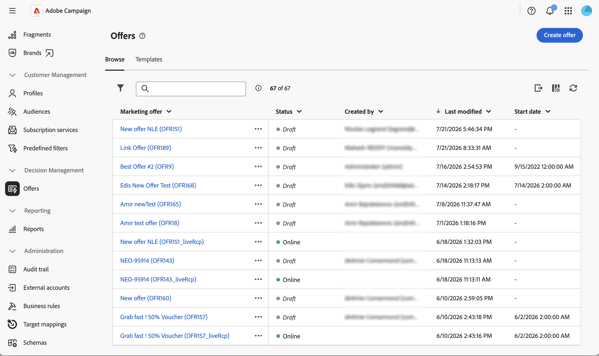

# Erste Schritte mit der Angebotsverwaltung {#gs-offer-management}

Mit dieser Funktion können Sie Ihren Sendungen personalisierte Angebote hinzufügen und für jedes Profil in einem bestimmten Kontext das relevanteste präsentieren. Angebote können eine einfache Kommunikationsnachricht oder Werbeaktionen für ein oder mehrere Produkte sein. Basierend auf Eignungsregeln und Prioritätsgewichten wählt das Angebotsmodul den besten zu unterbreitenden Vorschlag aus.

In der Web-Benutzeroberfläche von Campaign können Sie Angebote durchgängig verwalten. Sie können Angebotsumgebungen erstellen und konfigurieren, Angebotsplatzierungen entwerfen, Ihren Angebotskatalog erstellen, Eignungsregeln festlegen, Angebotsinhalte bearbeiten und Angebote veröffentlichen.

Angebote werden den Empfängern dann durch Sendungen auf der Grundlage von **Eignungsregeln** und **Prioritätsgewichten** unterbreitet, sodass für jedes Profil in einem bestimmten Kontext das beste Angebot ausgewählt wird.

>[!NOTE]
>
>Die Web-Benutzeroberfläche von Campaign konzentriert sich auf die gängigste Verwendung der Angebotsverwaltung. Erweiterte Konfigurationen sind weiterhin in der Campaign-Client-Konsole verfügbar. Weitere Informationen finden Sie in [&#x200B; Dokumentation zu Campaign v8](https://experienceleague.adobe.com/docs/campaign/campaign-v8/offers/interaction.html?lang=de){target="_blank"}

<!--
and check the [Campaign Web and client console capability matrix](../get-started/capability-matrix.md#offer-capabilities) for the current scope.
-->

## Schlüsselkonzepte {#concepts}

Bevor Sie mit der Arbeit mit Angeboten beginnen, machen Sie sich mit den wichtigsten beteiligten Objekten vertraut.

* **Angebotsumgebung** - Container, der einen Angebotskatalog und die zugehörigen Angebotsplatzierungen enthält. Es gibt zwei Typen: die **Design**-Umgebung, in der Sie Angebote erstellen und konfigurieren, und die schreibgeschützte **[!UICONTROL Live]**-Umgebung, die die genehmigten und bereitgestellten Objekte enthält, die für die Bereitstellung verfügbar sind. [Weitere Informationen](offer-environment.md)

* **Platzierung** - Definiert, wo und wie ein Angebot bereitgestellt wird (E-Mail, Briefpost, SMS, Web-Empfang usw.). Die Platzierung listet die Inhaltsfelder auf, die im Angebot verwendet werden können, die Rendering-Funktion, mit der die Angebotsdarstellung erstellt wird, und die Speichereinstellungen, die den Vorschlagsstatus steuern. [Weitere Informationen](offer-space.md)

* **Angebotskatalog und Kategorien** - Angebote sind in einem hierarchischen Katalog mit **Kategorien** und Unterkategorien unterteilt. Jede Kategorie kann Eignungsregeln, Gültigkeitsdaten und **Anwendungsthemen“**. In der Design-Umgebung wird eine Standardkategorie für den Empfang aller Angebote bereitgestellt.

<!--
To configure categories in depth — including sub-categories, fallback categories, and theme management — refer to the [Campaign v8 (client console) documentation](https://experienceleague.adobe.com/docs/campaign/campaign-v8/offers/interaction-catalog/interaction-offer-catalog.html){target="_blank"}.
-->

* **Angebot** - Ein individuelles Angebot mit eigenem Eignungszeitraum, Zielgruppenfilter, Gewichtung und Inhalt. Angebote werden genehmigt und bereitgestellt, bevor sie Empfängern unterbreitet werden können. [Weitere Informationen](create-offer.md)

* **Angebotsvorschlag** - Ergebnis der Präsentation eines Angebots an einen Kontakt in einer bestimmten Platzierung (Banner auf einer Website, E-Mail, SMS usw.). Die Anzahl der Vorschläge pro Versand wird konfiguriert, wenn [Angebote in einem Versand einrichten](../msg/offers.md).

* **Schlichtung** - Das Prinzip, nach dem das Angebotsmodul geeignete Angebote nach Priorität sortiert, um zu entscheiden, welche unterbreitet werden sollen. Die Schlichtung verwendet die Kriterien, die für die Kategorien, die Angebote und den Angebotskontext definiert sind.

## Fluss der Angebotsverwaltung {#workflow}

Der typische End-to-End-Fluss in der Web-Benutzeroberfläche von Campaign sieht wie folgt aus:

1. **Überprüfen der Einstellungen der Angebotsumgebung** — Überprüfen Sie die Einstellungen für Design/Live-Zuordnung, Eignung und Gewichtsverwaltung. [Weitere Informationen](offer-environment.md)

1. **Platzierung erstellen** - Definieren Sie die Inhaltsfelder, die Rendering-Funktion und die erweiterten Parameter, die Ihrem Kanal entsprechen. [Weitere Informationen](offer-space.md)

1. **Erstellen von Angeboten im Katalog** - Legen Sie den Eignungszeitraum, den Zielfilter, die Gewichtung und den Inhalt für jedes Angebot fest. [Weitere Informationen](create-offer.md)

1. **Genehmigen und bereitstellen** — Senden Sie das Angebot zur Genehmigung, genehmigen Sie seinen Inhalt und seine Eignung und lassen Sie ihn dann vom Bereitstellungsprozess in der Live-Umgebung veröffentlichen. [Weitere Informationen](create-offer.md#approve-deploy)

1. **Angebot zu einem Versand hinzufügen** - Referenzieren Sie die Platzierung und die Vorschläge in Ihrem E-Mail-, SMS-, Push- oder Briefpost-Versand. [Weitere Informationen](../msg/offers.md)

## Zugreifen auf Angebote über die Web-Benutzeroberfläche {#access}

Angebote sind im Menü **[!UICONTROL Angebote]** links verfügbar. Dort können Sie den Katalog durchsuchen, ein Angebot zur Bearbeitung öffnen und seinen Genehmigungs- und Bereitstellungsstatus überwachen.

{zoomable="yes"}

Der Zugriff auf Angebotsumgebungen und Platzierungen erfolgt über den **[!UICONTROL Explorer]**, indem Sie zum entsprechenden Ordner navigieren.

## Nur-Konsole-Ergänzungen {#console-complements}

Einige Angebotsfunktionen werden noch nicht in der Web-Benutzeroberfläche angezeigt und müssen weiterhin über die Client-Konsole konfiguriert werden:

* **Angebotssimulation** - Das Modul **Simulation**, mit dem Sie die Verteilung von Angeboten vor dem Versand testen können. Siehe [Angebotssimulation](https://experienceleague.adobe.com/docs/campaign/campaign-v8/offers/interaction-offer.html?lang=de#offer-simulation){target="_blank"}.

* **Vordefinierte Filter** Verwaltung - Wiederverwendbare Filterregeln, die von jedem Angebot aus referenziert werden können. Siehe [Verwalten vordefinierter Filter](https://experienceleague.adobe.com/docs/campaign/campaign-v8/offers/interaction-predefined-filters.html){target="_blank"}.

* **Angebotsverfolgung** - Konfigurieren der Angebotsverfolgung für den Vorschlagsverlauf. Siehe [Angebotsvorschläge verfolgen](https://experienceleague.adobe.com/docs/campaign/campaign-v8/offers/interaction-tracking.html?lang=de){target="_blank"}.

* **Benutzerrollen** — Zuweisung der Rechte des Angebotsverantwortlichen bzw. des Versandverantwortlichen Siehe [Operatoren des Interaction-Moduls](https://experienceleague.adobe.com/docs/campaign/campaign-v8/offers/interaction-operators.html){target="_blank"}.

* **Best Practices und Schlichtungsregeln für Interaction**. Siehe [Best Practices für Campaign Interaction](https://experienceleague.adobe.com/docs/campaign/campaign-v8/offers/interaction-best-practices.html?lang=de){target="_blank"}.

* **Reporting** - Dedizierte Angebots- und Vorschlagsberichte sind noch nicht in der Web-Benutzeroberfläche verfügbar.