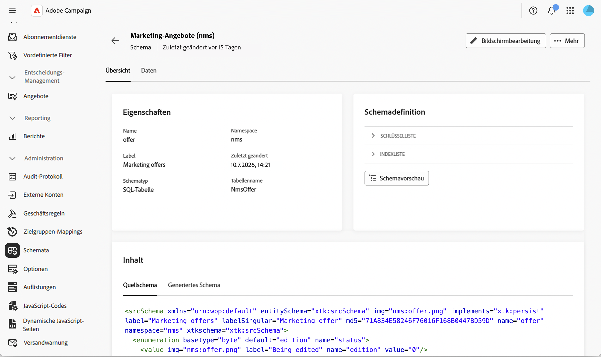
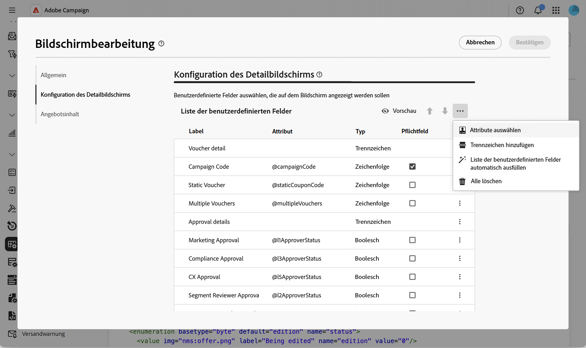
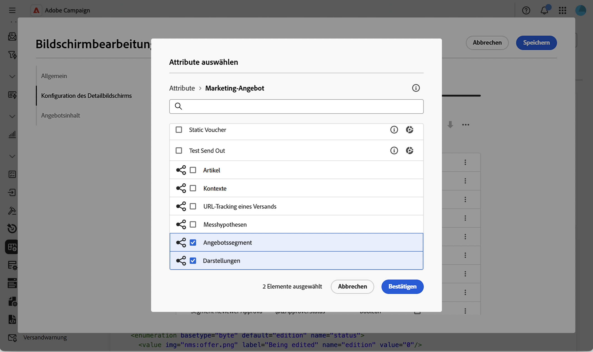
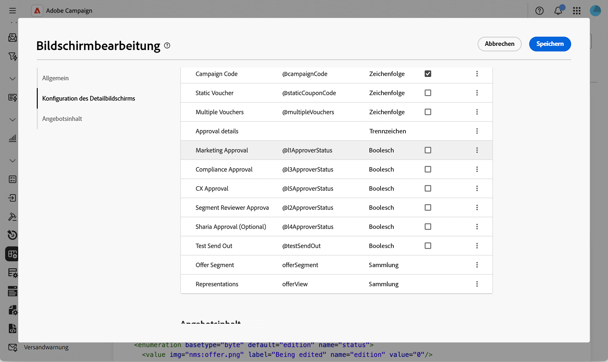
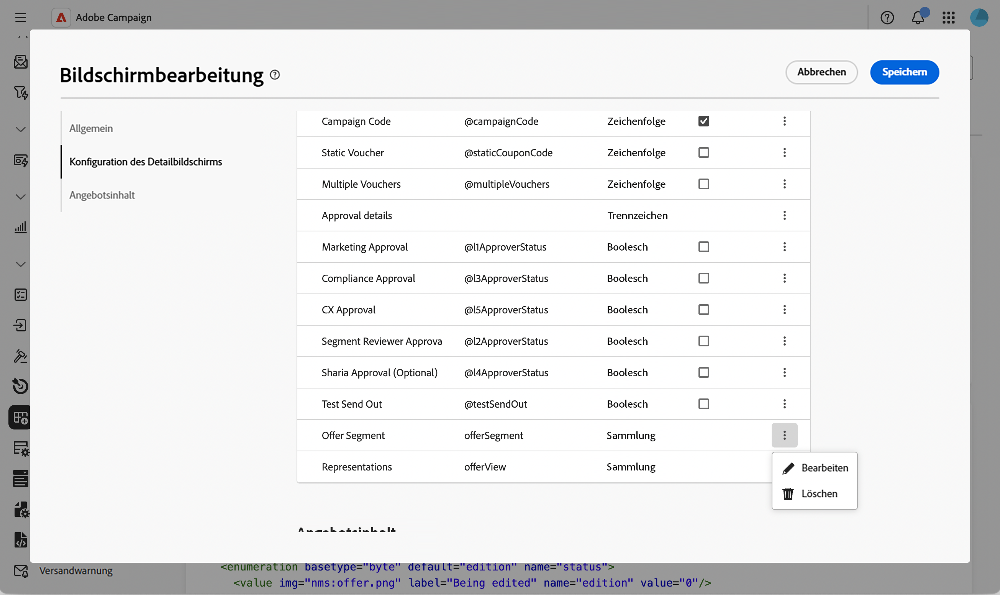
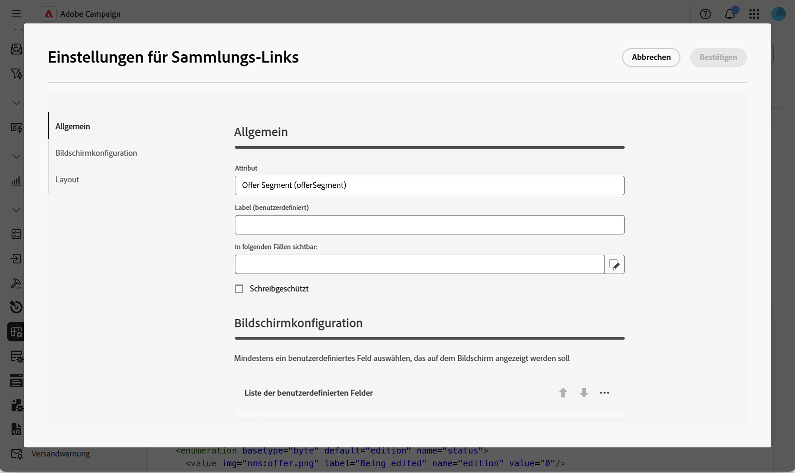
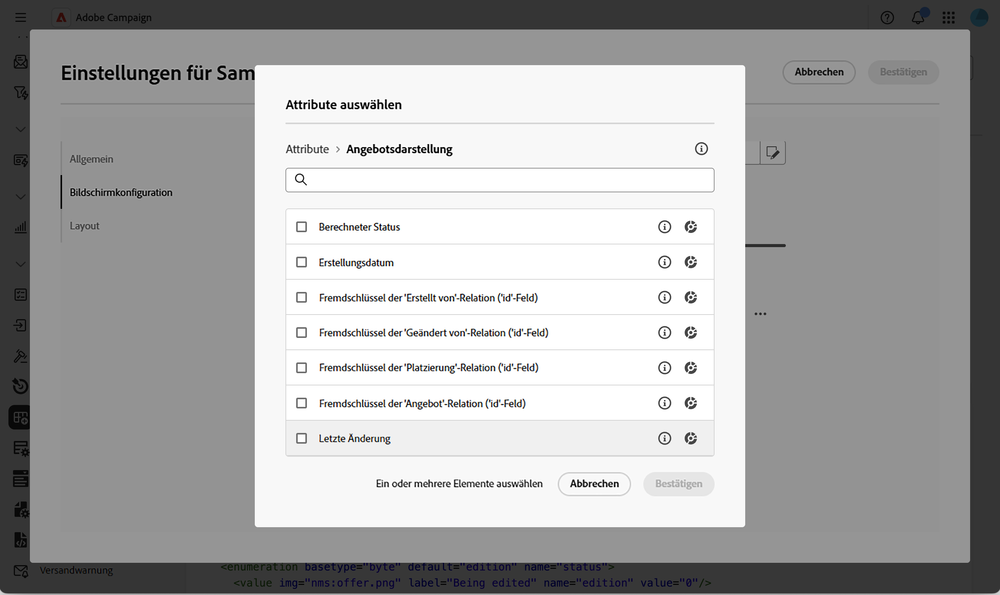
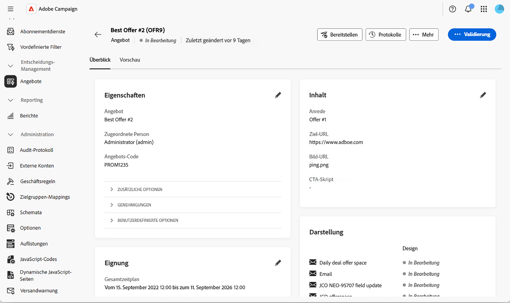
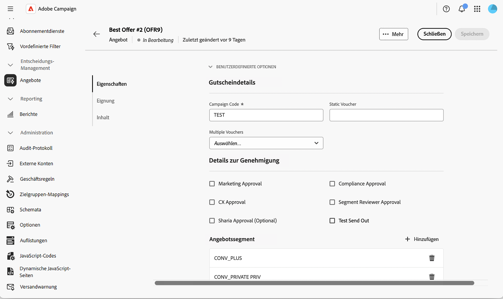

# Hinzufügen einer bearbeitbaren Liste zum Angebotsschema {#offer-editable-list}

Wenn Sie [Schema [!DNL nms:offer]  mit ](../administration/schemas.md) benutzerdefinierten Sammlungsrelation erweitern, z. B. mit einer Reihe von Segmenten, die mit einem Angebot verknüpft sind, können Sie es direkt im Abschnitt „Benutzerdefinierte Optionen **[!UICONTROL des Angebots als bearbeitbare Liste]**. Anstatt die verknüpften Datensätze über einen separaten Bildschirm zu verwalten, wird die Sammlung als Liste in den Angebotsdetails gerendert, und Sie können neue verknüpfte Datensätze inline über ein dediziertes Dialogfeld erstellen.

>[!NOTE]
>
>Diese Funktion ist derzeit nur für das Angebotsschema verfügbar.

## Feld für Sammlungsrelation hinzufügen {#add-field}

1. Erweitern Sie das [!DNL nms:offer] Schema mit Ihrer benutzerdefinierten Sammlung, navigieren Sie zum Menü **[!UICONTROL Schemata]**, öffnen Sie das Schema **[!UICONTROL Marketing-Angebote]** und klicken Sie auf **[!UICONTROL Bildschirmbearbeitung]**. [Weitere Informationen](../administration/schemas-browse-access.md#screen-def).

   {zoomable="yes"}

1. Klicken Sie im Abschnitt **[!UICONTROL Detailbildschirmkonfiguration]** auf das Auslassungssymbol über der Tabelle **[!UICONTROL Liste benutzerdefinierter Felder]** und wählen Sie **[!UICONTROL Attribute auswählen]**. [Weitere Informationen](../administration/schemas-custom-fields.md).

   {zoomable="yes"}

1. Durchsuchen Sie die Attribute und wählen Sie Ihren benutzerdefinierten Sammlungslink aus, der durch sein Sammlungssymbol gekennzeichnet ist.

   {zoomable="yes"}

   >[!NOTE]
   >
   >Sammlungsverknüpfungsfelder können nicht als Pflichtfelder festgelegt werden und unterstützen keine Unterattribute. Standardmäßig erstrecken sie sich über zwei Spalten im Formular.

1. Bestätigen Sie Ihre Auswahl. Die Sammlungsrelation wird der Tabelle **[!UICONTROL Liste benutzerdefinierter Felder“ hinzugefügt]** wobei **[!UICONTROL collection]** als Typ dient.

   {zoomable="yes"}

## Konfigurieren der bearbeitbaren Liste der Sammlung {#configure-list}

1. Klicken Sie auf das Symbol mit den Auslassungspunkten in der Zeile des Sammlungsfelds und wählen Sie **[!UICONTROL Bearbeiten]**, um das Dialogfeld **[!UICONTROL Einstellungen für Sammlungsrelationen]** zu öffnen.

   {zoomable="yes"}

1. Legen Sie auf der Registerkarte **[!UICONTROL Allgemein]** optional eine **[!UICONTROL Visible if]**-Bedingung fest oder aktivieren Sie **[!UICONTROL Schreibgeschützt]**.

   {zoomable="yes"}

1. Klicken Sie auf der Registerkarte **[!UICONTROL Bildschirmkonfiguration]** auf **[!UICONTROL Attribute auswählen]** und wählen Sie die Attribute aus, die beim Hinzufügen eines neuen Elements zur Liste verwendet werden sollen, z. B. einen Segmentnamen und ein benutzerdefiniertes Feld.

   {zoomable="yes"}

1. Behalten Sie auf **[!UICONTROL Registerkarte]** Layout“ die Option **[!UICONTROL Über zwei Spalten erstrecken“ bei oder deaktivieren Sie sie]**.

1. Klicken Sie **[!UICONTROL Bestätigen]** und **[!UICONTROL Speichern]** die Bildschirmdefinition.

## Verwenden der bearbeitbaren Liste in einem Angebot {#use-list}

1. Klicken Sie im linken Menü auf **Angebote** und öffnen Sie ein Angebot. [Weitere Informationen](create-offer.md#create)

   {zoomable="yes"}

1. Zugreifen auf die Angebotseigenschaften. Die Sammlung wird als Liste im Abschnitt &quot;**Optionen** gerendert.

   {zoomable="yes"}

1. Klicken Sie **[!UICONTROL Hinzufügen]**, um die konfigurierten Attribute anzuzeigen, sie auszufüllen und auf **[!UICONTROL Bestätigen]**. Das neue Element wird der Liste hinzugefügt.

   Sie können derselben Liste mehrere Elemente hinzufügen, und die Angebotsdetails können mehr als eine bearbeitbare Liste enthalten.

1. Klicken Sie auf **[!UICONTROL Speichern]**.

<!--
Each element added through the editable list creates a new related record. For instance, adding a segment to an offer generates the following payload:

```xml
<offer ...>
  <offerSegment segmentName="..." _operation="insert"/>
</offer>
```
-->