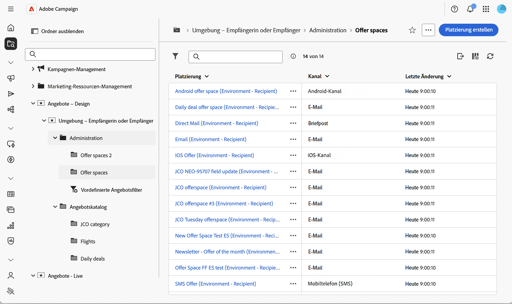
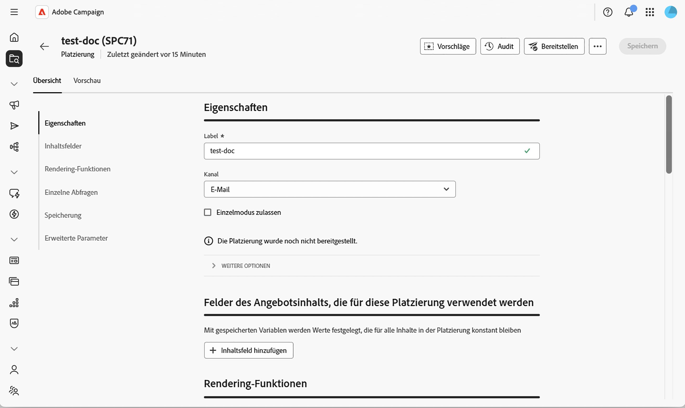
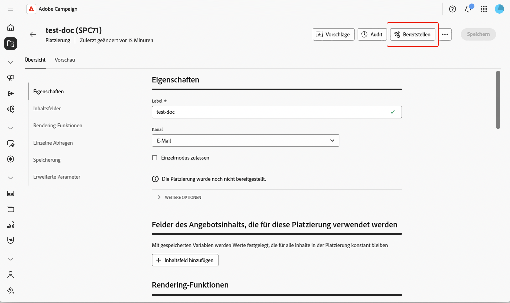
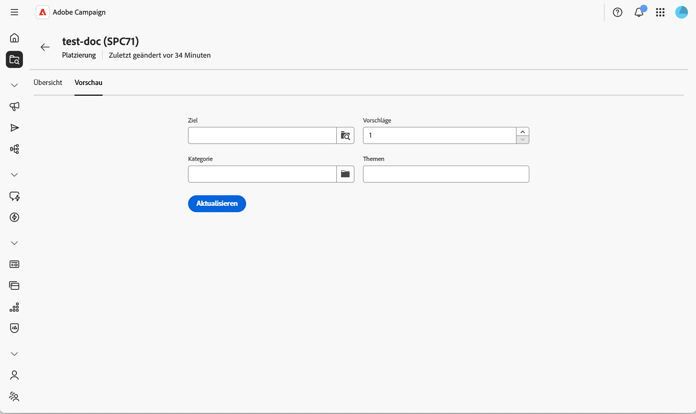

# Erstellen und Verwalten von Platzierungen {#offer-space}

Eine **Platzierung** definiert, wo und wie ein Angebot einem Kontakt angezeigt wird: welchen Kanal es verwendet (E-Mail, Briefpost, SMS, Inbound-Web usw.), welche Inhaltsfelder das Angebot verwenden kann und wie die endgültige Darstellung erstellt wird. Eine einzelne Umgebung kann mehrere Platzierungen enthalten – eine für jeden Erläuterungspunkt.

Eine Platzierung selbst ist kein eigener Kanal. Sie stellt eine bestimmte Position dar, an der das Angebot in einem Kanal angezeigt wird. Zwei Banner auf derselben Web-Seite entsprechen in der Regel zwei verschiedenen Platzierungen. Das vollständige Konzeptmodell finden Sie in der [Dokumentation zu Campaig v8](https://experienceleague.adobe.com/docs/campaign/campaign-v8/offers/interaction-offer-spaces.html?lang=de){target="_blank"}.

## Erstellen oder Ändern einer Platzierung{#create-offer-space}

Platzierungen werden im Ordner der Angebotsumgebung gespeichert. Um die auf Ihrer Plattform verfügbaren Platzierungen zu durchsuchen, öffnen Sie den **[!UICONTROL Explorer]**, navigieren Sie zur Angebotsumgebung und wählen Sie den Unterordner aus, der sie enthält.

{zoomable="yes"}

Dort können Sie eine vorhandene Platzierung öffnen oder durch Klicken auf **[!UICONTROL Platzierung erstellen]** eine neue erstellen.

{zoomable="yes"}

### Definieren der Eigenschaften {#properties}

In diesem Abschnitt haben Sie folgende Möglichkeiten:

* Geben Sie ein **[!UICONTROL Label]** für die Platzierung ein.
* Wählen Sie den **[!UICONTROL Kanal]** aus, der dem Erläuterungspunkt entspricht (E-Mail, Briefpost, SMS, Web usw.).
* Wählen Sie **[!UICONTROL Einzelmodus zulassen]** aus, wenn diese Platzierung zusätzlich zu den Massenversandaufrufen auch Einzelaufrufe an das Angebotsmodul (Echtzeit, Einzelangebot) unterstützen muss.

### Definieren der Inhaltsfelder {#content-fields}

In den Inhaltsfeldern werden die Attribute aufgelistet, die auf Angebotsebene bearbeitet und von der Rendering-Funktion wiederverwendet werden können. Die Reihenfolge, in der Sie die Felder in der Platzierung hinzufügen, bestimmt die Reihenfolge, in der sie im Abschnitt **[!UICONTROL Inhalt]** angezeigt werden.

Standardmäßig wird jedes Angebot mit den folgenden nativen Inhaltsfeldern versandt: **[!UICONTROL Label]**, **[!UICONTROL Ziel-URL]**, **[!UICONTROL Bild-URL]**, **[!UICONTROL HTML-Inhalt]** und **[!UICONTROL Textinhalt]**. Sie können diese Liste mit jedem benutzerdefinierten Feld erweitern, das Sie für das Rendering benötigen, z. B. einem **kurzen Inhalt**, einer **getrackten URL** oder einem beliebiges Attribut, das über die Schemaerweiterung hinzugefügt wurde.

Klicken Sie auf **[!UICONTROL Inhaltsfeld hinzufügen]** und wählen Sie dann im Angebotsschema das Attribut aus, das angezeigt werden soll, oder klicken Sie auf **[!UICONTROL Ausdruck bearbeiten]**, um stattdessen einen benutzerdefinierten Ausdruck zu definieren.

>[!IMPORTANT]
>
>Damit ein benutzerdefiniertes Attribut im Abschnitt **[!UICONTROL Inhalt]** des Angebots bearbeitet werden kann, muss das Attribut auch im Abschnitt **[!UICONTROL Angebotsinhalt]** des [!DNL nms:offer]-Schemas deklariert werden. Weitere Informationen finden Sie unter [Arbeiten mit Schemata](../administration/schemas.md).

### Konfigurieren der Rendering-Funktionen {#rendering}

Die Rendering-Funktionen erstellen die endgültige Angebotsdarstellung aus den Inhaltsfeldern. Sie können zwischen dem Standard-Rendering, bei dem der Inhalt einfach unverändert ausgegeben wird, und einer benutzerdefinierten Funktion wählen, die die Felder mit HTML, XML oder Text kombiniert.

Wählen Sie die Registerkarte **[!UICONTROL HTML-Rendering]**, **[!UICONTROL XML-Rendering]** oder **[!UICONTROL Text-Rendering]** aus und ermöglichen Sie das **[!UICONTROL Überschreiben der Rendering-Funktion]**, um sie zu aktivieren.

Verwenden Sie den Ausdruckseditor, um die Rendering-Funktion zu erstellen. Sie können auf die in der Platzierung definierten Inhaltsfelder, die Angebotsattribute und jede beliebige Funktion im [Ausdruckseditor](../query/expression-editor.md) verweisen.

>[!NOTE]
>
>Wenn keine Rendering-Funktion definiert ist, wird der Angebotsinhalt unverändert mit den vordefinierten Attributen zurückgegeben. Die XML-Rendering-Funktion kann nur verwendet werden, wenn **[!UICONTROL Einzelmodus zulassen]** in der Platzierung ausgewählt ist.

### Konfigurieren des Speicher- und Vorschlagsstatus {#storage}

In diesem Abschnitt können Sie steuern, wie Vorschläge, die über diese Platzierung generiert wurden, gespeichert werden und wie sich ihr Status während ihres Lebenszyklus verändert.

* **[!UICONTROL Einfügung der Vorschläge deaktivieren]** – Verhindert, dass über diese Platzierung erstellte Vorschläge in die Tabelle zur Speicherung von Vorschlägen eingefügt werden.

* **[!UICONTROL Status]** bei Vorschlag – Der Status, der auf den Vorschlag angewendet wird, sobald das Angebotsmodul ihn zurückgibt (normalerweise **[!UICONTROL Unterbreitet]** für ausgehende Sendungen).

* **[!UICONTROL Status]** bei Annahme – Der Status, der angewendet wird, wenn die Empfängerin bzw. der Empfänger mit dem Angebot interagiert (normalerweise **[!UICONTROL Angenommen]**).

Die verfügbaren Statuswerte entsprechen der in der Client-Konsole verwendeten Liste. Weitere Informationen finden Sie in der Dokumentation der Konsole unter [Dokumentation zu Campaign v8](https://experienceleague.adobe.com/docs/campaign/campaign-v8/offers/interaction-offer-spaces.html?lang=de#offer-proposition-statuses){target="_blank"}.

<!--
>[!NOTE]
>
>Status updates run asynchronously through the tracking workflow. For an outbound delivery containing a tracked link, the status of the proposition is automatically switched to **[!UICONTROL Presented]** when the delivery reaches the **[!UICONTROL Sent]** state. To trigger the **[!UICONTROL Interested]** status from a click, add the `_urlType="11"` attribute to the link. The full **inbound interaction** URL syntax (for example to apply the **[!UICONTROL Rejected]** status from a web app) must be configured in the client console — see [Inbound interaction status update](https://experienceleague.adobe.com/docs/campaign/campaign-v8/offers/interaction-offer-spaces.html#configuring-the-status-when-the-proposition-is-accepted){target="_blank"}.
-->

### Konfigurieren erweiterter Einstellungen {#advanced}

In diesem Abschnitt können Sie die **[!UICONTROL Zielgruppenidentifizierung]** definieren. Klicken Sie auf **[!UICONTROL Hinzufügen]** und wählen Sie ein oder mehrere **[!UICONTROL Empfänger]**-Attribute aus oder klicken Sie auf **[!UICONTROL Ausdruck bearbeiten]**, um stattdessen einen benutzerdefinierten Ausdruck zu definieren. Diese Einstellung ist für eine einfache Platzierung optional. Vollständige Informationen und Angaben zum Verhalten finden Sie in der [Dokumentation zu Campaign v8](https://experienceleague.adobe.com/docs/campaign/campaign-v8/offers/interaction-offer-spaces.html?lang=de){target="_blank"}.

Platzierungen, die im **Inbound-Web-Kanal** erstellt wurden, erfordern außerdem, dass die Website so konfiguriert ist, dass das Angebot angezeigt und das Angebotsmodul aufgerufen wird. Diese Integration erfolgt in der Client-Konsole – siehe [Unterbreiten von Angeboten in Echtzeit ](https://experienceleague.adobe.com/docs/campaign/campaign-v8/offers/interaction-present-offers.html?lang=de){target="_blank"} und [Konfigurieren der Integration des Angebotsmoduls](https://experienceleague.adobe.com/docs/campaign/campaign-v8/offers/interaction-integration.html?lang=de){target="_blank"} in der Dokumentation zu Campaign v8.

## Bereitstellen der Platzierung {#deploy}

Eine Platzierung muss bereitgestellt werden, bevor sie in einem Versand verwendet werden kann. Speichern Sie Ihre Platzierung und klicken Sie dann auf **Bereitstellen**. Der Status der Bereitstellung wird in der Platzierung angezeigt.

{zoomable="yes"}

## Vorschau der Platzierung {#preview}

In der Vorschau können Sie simulieren, wie ein Angebot für eine bestimmte Zielgruppe ausgewählt und gerendert wird.

1. Wählen Sie in der Platzierung die Registerkarte **[!UICONTROL Vorschau]** neben **[!UICONTROL Überblick]** aus.

   {zoomable="yes"}

1. Wählen Sie ein Zielprofil aus und starten Sie die Vorschau. Die passenden Angebote werden zusammen mit der von der Rendering-Funktion erstellten Darstellung zurückgegeben.

>[!NOTE]
>
>Wenn keine Vorschläge zurückgegeben werden, überprüfen Sie die Eignungsregeln der Angebote und die Konfiguration der Platzierung.

[Erstellen Sie als Nächstes ein Angebot](create-offer.md) im Katalog und weisen es dieser Platzierung zu.
