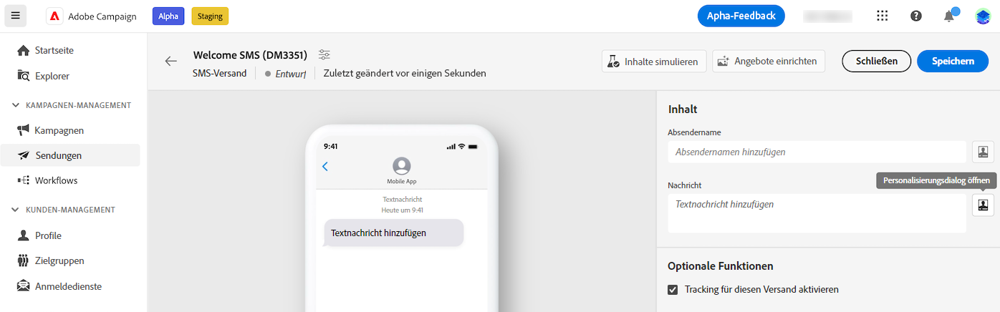
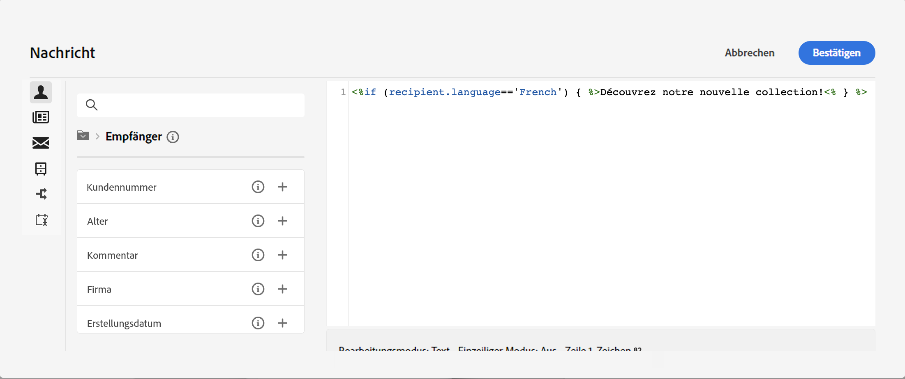
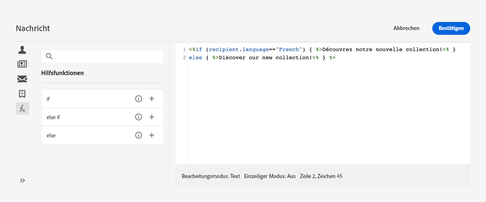
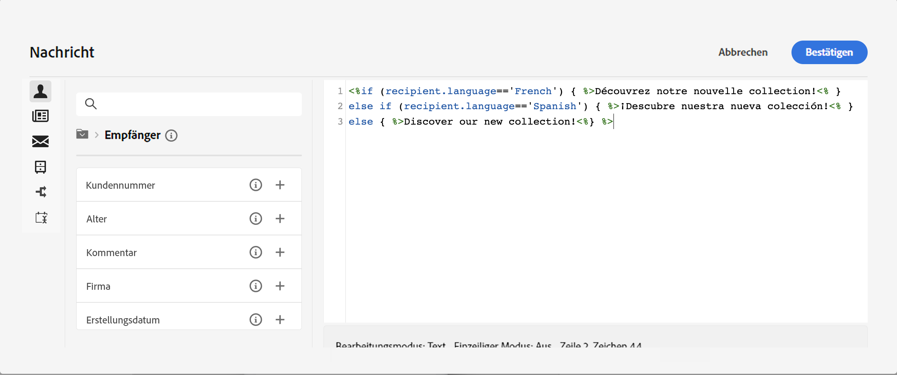
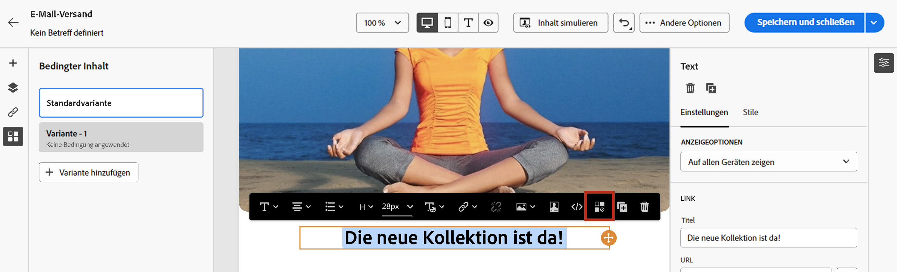
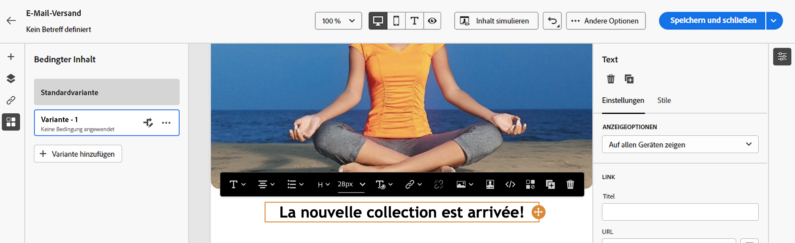

# Erstellen bedingter Inhalte{#add-conditions}

>[!CONTEXTUALHELP]
>id="acw_conditional_content"
>title="Hinzufügen bedingter Inhalte"
>abstract="Bedingte Inhaltsfelder konfigurieren, um eine erweiterte dynamische Personalisierung basierend auf den Daten des Empfängerprofils zu erstellen. Textblöcke, Links, Betreffzeile und/oder Bilder werden im Nachrichteninhalt ersetzt, wenn eine bestimmte Bedingung erfüllt ist."

## Erste Schritte mit bedingtem Inhalt {#gs}

Bedingter Inhalt ist eine leistungsstarke Funktion, mit der Sie eine dynamische Personalisierung erstellen können, die auf dem Empfängerprofil basiert. Dabei werden Textblöcke und Bilder automatisch ersetzt, wenn bestimmte Bedingungen erfüllt sind. Mit dieser Funktion bringen Sie Ihre Kampagnen auf eine neue Ebene und können Ihrer Zielgruppe zielgerichtete, personalisierte Erlebnisse bieten.

Durch die Konfiguration bedingter Inhalte können Sie beispielsweise eine erweiterte dynamische Personalisierung erstellen, die auf dem Empfängerprofil basiert. Textblöcke, Links, Betreffzeile und/oder Bilder werden im Nachrichteninhalt ersetzt, wenn eine bestimmte Bedingung erfüllt ist. Beispielsweise kann „Herr“ oder „Frau“ entsprechend dem Wert für das Feld „Geschlecht“ in der Adobe Campaign-Datenbank eingesetzt oder je nach bevorzugter Empfängersprache ein anderer Link eingefügt werden.

Um bedingte Inhalte zu erstellen, müssen Sie Bedingungen im **Ausdruckseditor** mithilfe spezifischer Hilfsfunktionen erstellen. Diese Methode steht für alle Versandkanäle in jedem Feld zur Verfügung, in dem Sie auf den Ausdruckseditor zugreifen können, z. B. Betreffzeile, E-Mail-Links oder Text-/Schaltflächen-Inhaltskomponenten. [Erfahren Sie, wie Sie auf den Ausdruckseditor zugreifen](gs-personalization.md/#access)

<!--In addition to the expression editor, you can leverage a dedicated **conditional content builder** when designing an email that allows you to build conditions using profile attributes only. [Learn how to create conditional content in emails](#condition-condition-builder)-->

## Erstellen von Bedingungen im Ausdruckseditor {#condition-perso-editor}

Gehen Sie wie folgt vor, um mit dem Ausdruckseditor bedingte Inhalte für einen Versand zu definieren. In diesem Beispiel möchten wir bedingte Inhalte basierend auf der Sprache der Empfängerinnen oder Empfänger (Französisch oder Englisch) erstellen.

1. Öffnen Sie einen Versand und navigieren Sie zum Abschnitt für die Inhaltsbearbeitung.

1. Suchen Sie das Feld, dem bedingte Inhalte hinzugefügt werden sollen. Beispielsweise können Sie einer SMS-Nachricht bedingte Inhalte hinzufügen.

1. Klicken Sie neben dem Feld auf **[!UICONTROL Personalisierungsdialog öffnen]**, um den Ausdruckseditor zu öffnen.

   

1. Navigieren Sie im Personalisierungseditor zum Menü **[!UICONTROL Hilfsfunktionen]** auf der linken Seite.

1. Um mit der Erstellung Ihrer Bedingung zu beginnen, klicken Sie auf das Symbol „+“ neben der Funktion **Wenn**. Die folgende Zeile wird zum mittleren Bereich des Bildschirms hinzugefügt:`<% if (<FIELD>==<VALUE>) { %>Insert content here<% } %>`

   * Ersetzen Sie `<FIELD>` durch ein Personalisierungsfeld, z. B. die Empfängersprache: `recipient.language`.
   * Ersetzen Sie `<VALUE>` durch den Wert, der erfüllt werden soll. Zum Beispiel `'French'`.
   * Ersetzen Sie `Ìnsert content here` durch den Inhalt, der für die Profile angezeigt werden soll, die die angegebene Bedingung erfüllen.

     {width="800" align="center"}

1. Geben Sie den Inhalt an, der angezeigt werden soll, wenn die Empfängerinnen bzw. Empfänger die Bedingung nicht erfüllen. Verwenden Sie dazu die Hilfsfunktion **Sonst**:

   1. Platzieren Sie den Cursor vor dem schließenden Tag des Ausdrucks `%>` und klicken Sie auf `+` neben der Funktion **Sonst**.

   1. Ersetzen Sie `Ìnsert content here` durch den Inhalt, der für die Profile angezeigt werden soll, die die Bedingung der Wenn-Funktion nicht erfüllen.

   {width="800" align="center"}

   Sie können auch die Hilfsfunktion **Sonst wenn** zum Erstellen von Bedingungen mit mehreren Inhaltsvarianten verwenden. Der folgende Ausdruck zeigt beispielsweise drei Varianten einer Nachricht in Abhängigkeit von der Sprache der Empfängerinnen oder Empfänger:

   {width="800" align="center"}

   >[!NOTE]
   >
   >Jedes Mal, wenn eine Hilfsfunktion hinzugefügt wird, werden öffnende (`<%`) und schließende (`%>`) Tags vor und nach der Funktion automatisch hinzugefügt.
   >
   >Beispiel nach dem Hinzufügen einer Hilfsfunktion „Sonst“ innerhalb eines Ausdrucks: >
   >
   >`<% if (<FIELD>==<VALUE>) { %>Insert content here<% } <% else { %> Insert content here<% } %>%>`
   >
   >Entfernen Sie diese Tags, um Syntaxfehler zu vermeiden. In diesem Beispiel lautet der korrigierte Ausdruck nach dem Entfernen der Tags der Funktion **Sonst**:
   >
   >`<% if (<FIELD>==<VALUE>) { %>Insert content here<% } else { %> Insert content here<% } %>`

1. Sobald Ihre Bedingung fertig ist, können Sie Ihren Inhalt speichern und das Rendering überprüfen, indem Sie Ihren Inhalt simulieren.

<!--SECTION REMOVED FOR LA > CONDITIONAL CONTENT NOT AVAILABLE ANYMORE FROM THE DEDICATED MENU IN THE EMAIL DESIGNER. ONLY THE EXPRESSION EDITOR IS AVAILABLE FOR NOW

## Create conditional content in emails {#condition-condition-builder}

Conditional content in emails can be created in two ways:
* In the expression editor by building a condition with helper functions,
* In a dedicated conditional content builder that is accessible when designing an email.

Detailed information on how to create conditions using the expression editor is available [here](#condition-perso-editor). The following section provides step-by-step instructions on how to create conditions using the email designer's conditional content capability. In this example, we want to create an email message with multiple variants based on the recipients' language. Follow these steps:

1. Create or open an email delivery, edit its content, and click the **[!UICONTROL Edit email body]** button to open the email designing workspace.

1. Select a content component and click the **[!UICONTROL Enable conditional content]** icon.

    {width="800" align="center"}

1. The **[!UICONTROL Conditional Content]** pane opens on the left-hand side of the screen. In this pane, you can create multiple variants of the selected content component using conditions.

1. Configure your first variant. Hover over **[!UICONTROL Variant - 1]** in the **[!UICONTROL Conditional Content]** pane and click the **[!UICONTROL Add condition]** icon.

1. A query modeler appears. Use profile attributes to create the condition for the first variant of the message and click **[!UICONTROL Confirm]**. In this example, we are creating a rule targeting recipients whose language is 'French'.

    {width="800" align="center"}

1. The rule is now associated to the variant. For better readability, we recommend renaming the variant by clicking the ellipsis menu.

1. Configure how the component should display if the rule is met when sending the message. In this example, we want to display the text in French if it is the recipient's preferred language.

    {width="800" align="center"}

1. Add as many variants as needed for the content component. You can switch between the variants at any time to check how the content component will display based on their conditional rules.

    >[!NOTE]
    >If none of the rules defined in the variants are met when sending the message, the content component will display the content defined in the **[!UICONTROL Default variant]** from the **[!UICONTROL Conditional Content]** pane.
-->