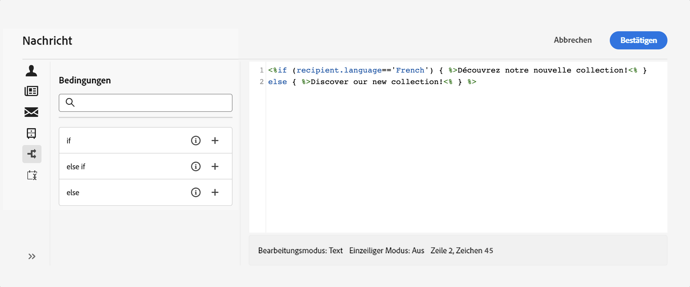
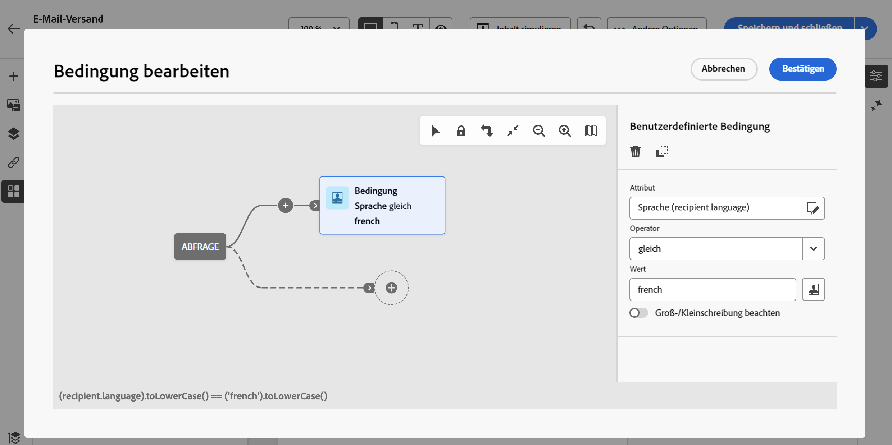
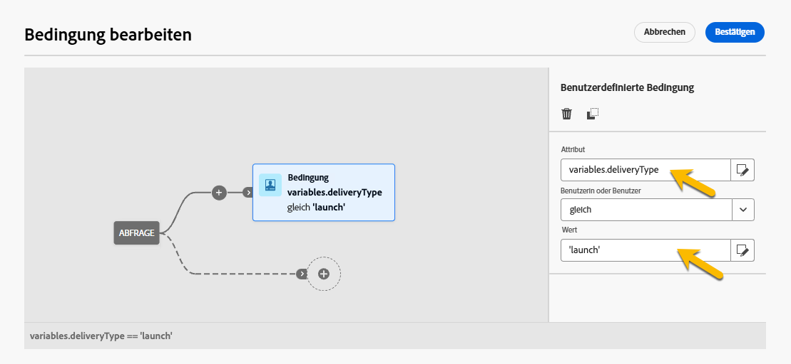

# Erstellen bedingter Inhalte {#add-conditions}

>[!CONTEXTUALHELP]
>id="acw_conditional_content"
>title="Hinzufügen bedingter Inhalte"
>abstract="Felder mit bedingten Inhalten konfigurieren, um eine erweiterte dynamische Personalisierung basierend auf den Daten des Empfängerprofils zu erstellen. Textblöcke, Links, Betreffzeile und/oder Bilder werden im Nachrichteninhalt ersetzt, wenn eine bestimmte Bedingung erfüllt ist."

## Erste Schritte mit bedingten Inhalten {#gs}

„Bedingter Inhalt“ ist eine leistungsstarke Funktion, die eine dynamische Personalisierung basierend auf den Profildaten der Empfängerin bzw. des Empfängers ermöglicht. Sie ersetzt Textblöcke und Bilder automatisch, wenn bestimmte Bedingungen erfüllt sind. Diese Funktion verbessert Kampagnen und liefert äußerst zielgerichtete, personalisierte Erlebnisse für Ihre Zielgruppe.

Durch die Konfiguration bedingter Inhalte können Sie eine erweiterte dynamische Personalisierung erstellen, die auf dem Empfängerprofil basiert. Textblöcke, Links, Betreffzeilen und Bilder werden etwa im Nachrichteninhalt ersetzt, wenn eine bestimmte Bedingung erfüllt ist. Beispielsweise kann „Herr“ oder „Frau“ entsprechend dem Wert für das Feld „Geschlecht“ in der Adobe Campaign-Datenbank eingesetzt oder je nach bevorzugter Empfängersprache ein anderer Link eingefügt werden.

Um bedingte Inhalte zu erstellen, konfigurieren Sie Bedingungen im **Ausdruckseditor** mithilfe spezifischer Hilfsfunktionen. Diese Methode steht für alle Versandkanäle in jedem Feld zur Verfügung, in dem Sie auf den Ausdruckseditor zugreifen können, z. B. Betreffzeile, E-Mail-Links und Text-/Schaltflächen-Inhaltskomponenten. [Erfahren Sie, wie Sie auf den Ausdruckseditor zugreifen](gs-personalization.md#access).

Darüber hinaus können Sie den dedizierten **Builder für bedingte Inhalte** beim Entwerfen einer E-Mail verwenden, um mehrere Varianten für ein Element Ihres E-Mail-Texts zu erstellen. [Erfahren Sie, wie Sie bedingte Inhalte in E-Mails erstellen](#condition-condition-builder).

## Erstellen von Bedingungen im Ausdruckseditor {#condition-perso-editor}

>[!CONTEXTUALHELP]
>id="acw_personalization_editor_conditions"
>title="Bedingungen"
>abstract="Mit diesem Menü können Sie Hilfsfunktionen zum Definieren bedingter Inhalte nutzen."

Gehen Sie wie folgt vor, um mit dem Ausdruckseditor bedingte Inhalte für einen Versand zu definieren. In diesem Beispiel werden bedingte Inhalte basierend auf der Sprache der Empfängerinnen oder Empfänger (Französisch oder Englisch) erstellt.

1. Öffnen Sie einen Versand und navigieren Sie zum Abschnitt für die Inhaltsbearbeitung.

1. Suchen Sie das Feld, dem bedingte Inhalte hinzugefügt werden sollen. Fügen Sie z. B. einer SMS-Nachricht bedingte Inhalte hinzu.

1. Klicken Sie neben dem Feld auf **[!UICONTROL Personalisierungsdialog öffnen]**, um den Ausdruckseditor zu öffnen.

   {zoomable="yes"}

1. Navigieren Sie im Personalisierungseditor zum Menü **[!UICONTROL Bedingungen]** auf der linken Seite.

1. Um mit der Erstellung Ihrer Bedingung zu beginnen, klicken Sie auf das Symbol „+“ neben der Funktion **Wenn**. Die folgende Zeile wird zum mittleren Bereich des Bildschirms hinzugefügt: `<% if (<FIELD>==<VALUE>) { %>Insert content here<% } %>`

   * Ersetzen Sie `<FIELD>` durch ein Personalisierungsfeld, z. B. die Empfängersprache: `recipient.language`.
   * Ersetzen Sie `<VALUE>` durch den Wert, der erfüllt werden soll, z. B. `'French'`. 
   * Ersetzen Sie `Insert content here` durch den Inhalt, der für die Profile angezeigt werden soll, die die angegebene Bedingung erfüllen.

     {zoomable="yes"}{width="800" align="center"}

1. Geben Sie den Inhalt an, der angezeigt werden soll, wenn die Empfängerinnen bzw. Empfänger die Bedingung nicht erfüllen. Verwenden Sie die Hilfsfunktion **Sonst**:

   1. Platzieren Sie den Cursor vor dem schließenden Tag des Ausdrucks `%>` und klicken Sie auf `+` neben der Funktion **Sonst**.

   1. Ersetzen Sie `Insert content here` durch den Inhalt, der für die Profile angezeigt werden soll, die die Bedingung der Wenn-Funktion nicht erfüllen.

   {zoomable="yes"}{width="800" align="center"}

   Verwenden Sie die Hilfsfunktion **Sonst wenn**, um Bedingungen mit mehreren Inhaltsvarianten zu erstellen. Der folgende Ausdruck zeigt beispielsweise drei Varianten einer Nachricht in Abhängigkeit von der Sprache der Empfängerinnen oder Empfänger:

   {zoomable="yes"}{width="800" align="center"}

   >[!NOTE]
   >
   >Jedes Mal, wenn eine Hilfsfunktion hinzugefügt wird, werden öffnende (`<%`) und schließende (`%>`) Tags vor und nach der Funktion automatisch hinzugefügt.
   >
   >Beispiel nach dem Hinzufügen einer Hilfsfunktion „Sonst“ innerhalb eines Ausdrucks:
   >
   >`<% if (<FIELD>==<VALUE>) { %>Insert content here<% } <% else { %> Insert content here<% } %>%>`
   >
   >Entfernen Sie diese Tags, um Syntaxfehler zu vermeiden. In diesem Beispiel lautet der korrigierte Ausdruck nach dem Entfernen der Tags der Funktion **Sonst**:
   >
   >`<% if (<FIELD>==<VALUE>) { %>Insert content here<% } else { %> Insert content here<% } %>`

1. Speichern Sie Ihren Inhalt und überprüfen Sie das Rendering, indem Sie Ihren Inhalt simulieren.

## Erstellen von bedingten Inhalten in E-Mails {#condition-condition-builder}

Bedingte Inhalte in E-Mails können auf zwei Arten erstellt werden:
* im Ausdruckseditor durch Erstellen einer Bedingung mit Hilfsfunktionen
* in einem speziellen Builder für bedingte Inhalte, auf den Sie beim Entwerfen einer E-Mail zugreifen können

Im folgenden Abschnitt finden Sie eine schrittweise Anleitung zum Erstellen von Bedingungen mithilfe der Funktion des E-Mail-Designers für bedingte Inhalte. Detaillierte Informationen zum Erstellen von Bedingungen mithilfe des Ausdruckseditors finden Sie [hier](#condition-perso-editor). 

In diesem Beispiel wird eine E-Mail-Nachricht mit mehreren Varianten erstellt, die auf der Empfängersprache basieren. Führen Sie folgende Schritte aus:

1. Erstellen oder öffnen Sie einen E-Mail-Versand, bearbeiten Sie den Inhalt und klicken Sie auf die Schaltfläche **[!UICONTROL E-Mail-Text bearbeiten]**, um den Arbeitsbereich zum Entwerfen von E-Mails zu öffnen.

1. Wählen Sie eine Inhaltskomponente aus und klicken Sie auf das Symbol **[!UICONTROL Bedingten Inhalt aktivieren]**.

   {zoomable="yes"}{width="800" align="center"}

1. Der Bereich **[!UICONTROL Bedingter Inhalt]** wird auf der linken Bildschirmseite geöffnet. Erstellen Sie in diesem Bereich mithilfe von Bedingungen mehrere Varianten der ausgewählten Inhaltskomponente.

1. Konfigurieren Sie Ihre erste Variante. Bewegen Sie den Mauszeiger über **[!UICONTROL Variante – 1]** im Bereich **[!UICONTROL Bedingter Inhalt]** und klicken Sie auf die Schaltfläche **[!UICONTROL Bedingung hinzufügen]**.

   {zoomable="yes"}{width="800" align="center"}

1. Der Abfrage-Modeler wird geöffnet. Mit diesem können Sie eine Bedingung erstellen, indem Sie die Profildaten der Empfängerin bzw. des Empfängers filtern. [Erfahren Sie mehr über die Arbeit mit dem Abfrage-Modeler](../query/query-modeler-overview.md).

   Sobald die Bedingung für die erste Variante der Nachricht vorliegt, klicken Sie auf **[!UICONTROL Bestätigen]**. In diesem Beispiel wird eine Regel erstellt, die sich an Empfängerinnen und Empfänger richtet, deren Sprache „Französisch“ ist.

   {zoomable="yes"}{width="800" align="center"}

1. Die Regel ist nun mit der Variante verknüpft. Um die Lesbarkeit zu verbessern, benennen Sie die Variante um, indem Sie auf das Menü mit den Auslassungspunkten klicken.

1. Konfigurieren Sie, wie die Komponente angezeigt werden soll, wenn die Regel beim Senden der Nachricht erfüllt ist. In diesem Beispiel wird der Text auf Französisch angezeigt, wenn dies die bevorzugte Sprache der Empfängerin bzw. des Empfängers ist.

   {zoomable="yes"}{width="800" align="center"}

1. Fügen Sie so viele Varianten hinzu, wie für die Inhaltskomponente erforderlich sind. Sie können jederzeit zwischen den Varianten wechseln, um zu überprüfen, wie die Inhaltskomponente basierend auf ihren bedingten Regeln angezeigt wird.

   >[!NOTE]
   >Wenn keine der in den Varianten definierten Regeln beim Senden der Nachricht erfüllt ist, zeigt die Inhaltskomponente den Inhalt an, der für die **[!UICONTROL Standardvariante]** im Bereich **[!UICONTROL Bedingter Inhalt]** definiert ist.

## Verwenden von Variablen für bedingte Inhalte {#variables-conditional}

Variablen können für bedingte Inhalte in Ihrem Versand verwendet werden.

Erfahren Sie mehr über das [Hinzufügen von Variablen zu einem Versand](../advanced-settings/delivery-settings.md#variables-delivery).

Wählen Sie das Element, dem bedingte Inhalte hinzugefügt werden sollen.

{zoomable="yes"}

Um Ihre Variable zu verwenden, konfigurieren Sie die Bedingung mithilfe der Schaltfläche **[!UICONTROL Ausdruck bearbeiten]**, wie unten dargestellt. In diesem Beispiel wird dieses Bild angezeigt, wenn der Wert der Variablen `launch` ist.

{zoomable="yes"}

Erstellen Sie eine andere Variante mit dem Wert `reminder`, wobei z. B. ein anderes Bild angezeigt wird.