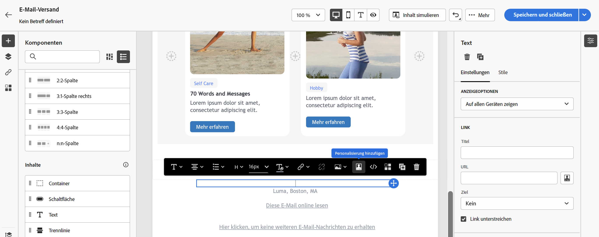
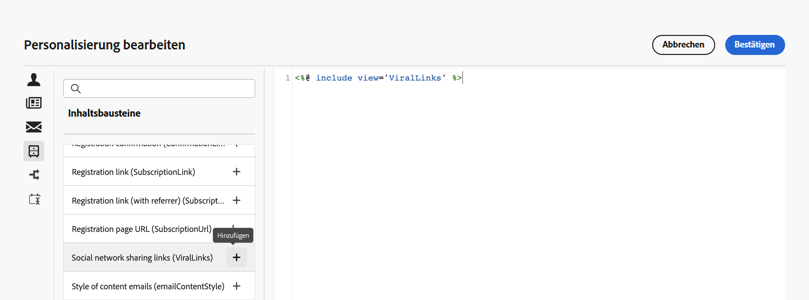

# Integrierte Inhaltsbausteine {#ootb-content-blocks}

Adobe Campaign bietet eine Reihe von vorkonfigurierten Inhaltsbausteinen. Diese Inhaltsbausteine sind dynamisch und personalisiert und enthalten ein spezifisches Rendering, das Sie in Ihre Sendungen einfügen können. Sie können zum Beispiel ein Logo, eine Grußbotschaft oder einen Link zur Mirrorseite hinzufügen.

Gehen Sie wie folgt vor, um einen Inhaltsbaustein zu einem Versand hinzuzufügen:

1. Öffnen Sie einen Versand und bearbeiten Sie seinen Inhalt.

1. Suchen Sie das Feld, in dem Sie einen Inhaltsbaustein hinzufügen möchten, und klicken Sie auf das Symbol **[!UICONTROL Personalisierungsdialog öffnen]**, um den Ausdruckseditor zu öffnen.

   {width="800" align="center"}

1. Navigieren Sie im Ausdruckseditor zum linken Menü **[!UICONTROL Inhaltsbausteine]**.

1. Um einen Inhaltsbaustein hinzuzufügen, platzieren Sie den Cursor an der gewünschten Stelle in Ihrem Inhalt und klicken Sie auf die Schaltfläche „+“, um ihn einzufügen.

   {width="800" align="center"}

Integrierte Inhaltsbausteine sind:

* **[!UICONTROL Standard-Opt-out-Banner]**
* **[!UICONTROL Ermöglicht durch Adobe Campaign]**: Hiermit wird das Logo „Ermöglicht durch Adobe Campaign“ eingefügt.
* **[!UICONTROL Formatierungsfunktion für Eigennamen]**: Hiermit wird die JavaScript-Funktion **[!UICONTROL toSmartCase]** generiert, mit der der erste Buchstabe eines jeden Worts in einen Großbuchstaben umgewandelt wird.
* **[!UICONTROL Grußformeln]**: fügt Grußformeln mit dem vollständigen Namen der Empfängerin bzw. des Empfängers ein, gefolgt von einem Komma. Beispiel: „Sehr geehrter Herr Mustermann,“.
* **[!UICONTROL Logo einfügen]**: Fügt ein Logo ein, das in den Instanzeinstellungen definiert ist.
* **[!UICONTROL Mirrorseiten-Link]**: Hiermit wird ein Link zur [Mirrorseite](../content/mirror-page.md) eingefügt. Das Standardformat lautet: „Wenn diese Nachricht nicht richtig angezeigt wird, bitte hier klicken“.
* **[!UICONTROL Mirrorseiten-URL]**: Hiermit wird die URL der Mirrorseite eingefügt, damit Versand-Designerinnen und -Designer den Link prüfen können.
* **[!UICONTROL Benachrichtigungsstil]**
* **[!UICONTROL Annahme-URL eines Angebots im Einzelmodus]**: Hiermit wird eine URL eingefügt, die es ermöglicht, ein Angebot auf **[!UICONTROL Angenommen]** zu setzen. (Dieser Baustein ist verfügbar, wenn das Interaction-Modul aktiviert ist)
* **[!UICONTROL Anmeldebestätigung]**: Hiermit wird ein Link eingefügt, mit dem die Anmeldung bestätigt werden kann.
* **[!UICONTROL Anmelde-Link]**: Hiermit wird ein Anmelde-Link eingefügt. Dieser Link wird in den Instanzeinstellungen definiert. Der Standardinhalt lautet: „Klicken Sie hier, um sich zu registrieren.“
* **[!UICONTROL Anmelde-Link (mit Werber)]**: Hiermit wird ein Anmelde-Link eingefügt, über den der Besucher bzw. die Besucherin sowie der Versand identifiziert werden können. Dieser Link wird in den Instanzeinstellungen definiert.
* **[!UICONTROL Anmeldungsseiten-URL]**: Hiermit wird eine Abonnement-URL eingefügt
* Teilen-Links der sozialen Netzwerke
* **[!UICONTROL Stil der Inhalts-E-Mails]** und **[!UICONTROL Stil der Benachrichtigungen]**: Hiermit wird Code erstellt, mit dem eine E-Mail mit nativen HTML-Stilen formatiert werden kann.
* **[!UICONTROL Abmelde-Link]**: Fügt einen Link ein, der es ermöglicht, das Abo aller Sendungen zu kündigen (Blockierungsliste). Der standardmäßig verknüpfte Inhalt ist: „Sie erhalten diese Nachricht, da Sie mit ***Name Ihres Unternehmens*** oder einem Tochterunternehmen in Kontakt standen. Um keine Nachrichten mehr von ***Name Ihres Unternehmens*** zu erhalten, klicken Sie hier.“

>[!NOTE]
>
>Sie können in der Konsole von Adobe Campaign v8 neue Bausteine definieren, mit denen Sie die Personalisierung Ihrer Sendungen optimieren können. Weitere Informationen finden Sie in der [Dokumentation zu Campaign v8 (Konsole)](https://experienceleague.adobe.com/docs/campaign/campaign-v8/campaigns/send/personalize/personalization-blocks.html?lang=de#create-custom-personalization-blocks){target="_blank"}.

