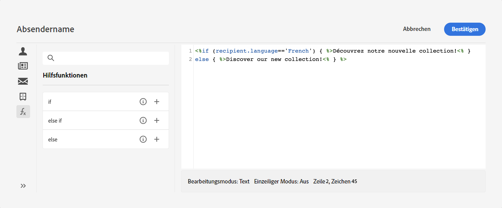
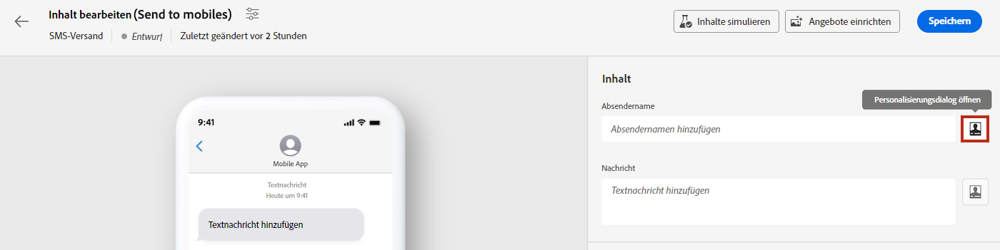
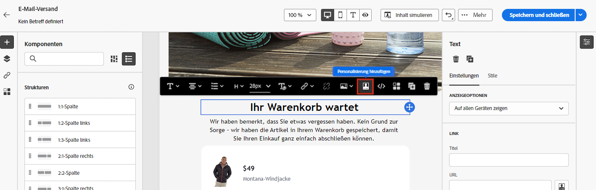

# Erste Schritte mit dynamischen Inhalten

Als Marketing-Experte ist es entscheidend, Kunden anzusprechen, die sich wirklich für Ihre Angebote interessieren, und sie durch die Bereitstellung effektiver und relevanter Inhalte einzubinden. Angesichts der vielfältigen Empfängervielfalt können Sie zeitaufwendige und verschwenderische Marketinginhalte erstellen, die verschiedene Personen ansprechen. Hier kommt dynamischer Inhalt ins Spiel.

Mit den Web-dynamischen Inhaltsfunktionen von Adobe Campaign können Sie Ihren Inhalt auf der Grundlage der Informationen anpassen, die Sie über Ihre Empfänger erfasst haben. Durch die Verwendung dynamischer Inhalte stellen Sie sicher, dass Ihre Marketing-Maßnahmen relevanter sind, und vermeiden Sie unerwünschte oder unnötige Produkte oder Services im Marketing. Dieser Ansatz macht Ihre Inhalte attraktiver und erhöht die Wahrscheinlichkeit, dass sie gelesen werden. Darüber hinaus können Sie Ihren Inhalt personalisieren, sodass Empfänger das Gefühl haben, Informationen von einer Person und nicht von einem Computer zu erhalten.

## Wie wird Ihr Inhalt dynamisch?

Sie können den Nachrichteninhalt dynamisch gestalten, indem Sie im Campaign-Web-Ausdruckseditor JavaScript-Konstrukte einfügen. Beim Nachrichtenversand werden diese Ausdrücke von Adobe Campaign interpretiert, um jedem Ihrer Empfänger den richtigen Inhalt bereitzustellen:

* **Nachrichten personalisieren** für jeden einzelnen Empfänger durch Nutzung von Profildaten wie Vorname, Interessen, Wohnort, Einkauf und vieles mehr. Sie können jedes in der Datenbank verfügbare Feld aus dem Personalisierungseditor auswählen, das sich auf den Empfänger, die Nachricht oder den Versand bezieht. Diese Personalisierungsattribute können in die Betreffzeile oder in den Text Ihrer Nachrichten eingefügt werden. Mit der folgenden Syntax wird die Stadt des Empfängers bzw. der Empfängerin in Ihren Inhalt eingefügt: &lt;%= recipient.location.city %>.

  {width="800" align="center"}

* **Bedingten Inhalt erstellen** , um Ihre Sendungen an jeden Empfänger anzupassen und nur den Inhalt anzuzeigen, der für einen bestimmten Kunden aufgrund der ihm zur Verfügung stehenden Informationen relevant ist. Auf diese Weise können Sie bestimmte Textblöcke und/oder Bilder basierend auf Bedingungen anzeigen. Passen Sie beispielsweise ein E-Mail-Banner an, indem Sie die Anmeldung der Empfänger für einen bestimmten Dienst berücksichtigen.

  {width="800" align="center"}

* **Verwenden von Gestaltungsbausteinen** um Zeit zu sparen und leicht wiederverwendbare personalisierte Inhalte in Ihren Nachrichten zu nutzen. Campaign verfügt über eine Reihe von Gestaltungsbausteinen, die ein bestimmtes Rendering ermöglichen, das Sie in Ihre Sendungen einfügen können. Sie können beispielsweise ein Logo, eine Grußnachricht oder einen Link zur Mirrorseite einer E-Mail-Nachricht hinzufügen. Inhaltsbausteine sind über einen eigenen Eintrag im Personalisierungs-Editor verfügbar.

  {width="800" align="center"}

## Auf den Ausdruckseditor zugreifen {#access}

Adobe Campaign V8 Web bietet einen Ausdruckseditor, in dem Sie alle Daten auswählen, anordnen, anpassen und validieren können, um ein benutzerdefiniertes Erlebnis für Ihren Inhalt zu erstellen. Der Ausdruckseditor steht für alle Kanäle in allen Feldern mit dem **[!UICONTROL Personalisierungsdialogfeld öffnen]** -Symbol, z. B. das Betreffzeilenfeld oder E-Mail-Links und Text-/Schaltflächeninhaltskomponenten.

Im Folgenden finden Sie einige Beispiele für den Zugriff auf den Ausdruckseditor in Abhängigkeit vom Inhalt, den Sie dynamisch gestalten möchten:

* *Zugriff auf den Ausdruckseditor über das Feld Absendername*

  {width="800" align="center"}

* *Zugriff auf den Ausdruckseditor über eine E-Mail-Textkomponente*

  {width="800" align="center"}

* *Zugriff auf den Ausdruckseditor über einen Link in einer E-Mail*

  {width="800" align="center"}

>[!NOTE]
>
>Zusätzlich zum Ausdruckseditor können Sie beim Entwerfen einer E-Mail auch einen dedizierten Builder für bedingte Inhalte verwenden. [Erfahren Sie, wie Sie bedingte Inhalte in E-Mails erstellen](conditions.md)

## Tauchen wir tiefer in die Materie ein

Nachdem Sie nun wissen, wie Sie Ihren Inhalt dynamisch gestalten können, ist es an der Zeit, diese Dokumentationsabschnitte näher zu untersuchen, um mit der Funktion zu beginnen.

<table style="table-layout:fixed"><tr style="border: 0;">
<td>

<a href="personalize.md"><strong>Hinzufügen von Personalisierung</strong></a>

</td>
<td>

<a href="conditions.md"><strong>Hinzufügen bedingter Inhalte</strong>

</td>
<td>

<a href="content-blocks.md"><strong>Hinzufügen integrierter Inhaltsbausteine</strong></a>

</td>
</tr></table>
