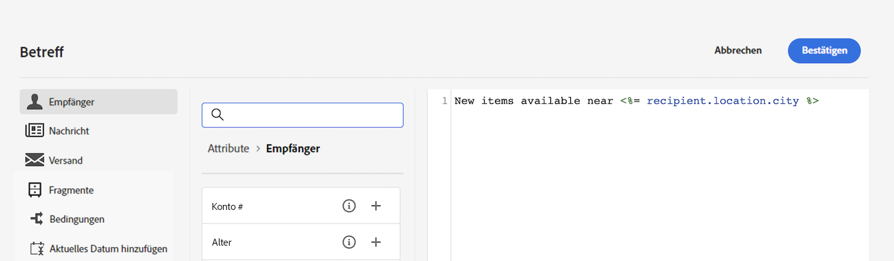
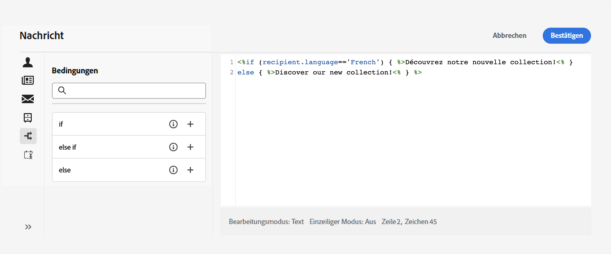

# Erste Schritte mit dynamischen Inhalten {#gs-dynamic-content}

>[!CONTEXTUALHELP]
>id="acw_targetdata_personalization_dashboard"
>title="Personalisierung"
>abstract="Mit dem Ausdruckseditor können Sie alle Daten auswählen, anordnen, anpassen und validieren, um ein benutzerdefiniertes Erlebnis für Ihren Inhalt zu erstellen. Sie können Ihre Nachrichten für alle einzelnen Empfängerinnen und Empfänger personalisieren, indem Sie Profildaten nutzen und bedingte Inhalte erstellen, um Ihre Nachricht an jede Person anzupassen und nur die jeweils relevanten Inhalte anzuzeigen. Darüber hinaus stehen Gestaltungsbausteine zur Verfügung, mit denen Sie Ihren Sendungen vordefinierten personalisierten Inhalt hinzufügen können."

Als Marketing-Fachkraft ist es entscheidend, dass Sie Kundinnen und Kunden ansprechen, die sich wirklich für Ihre Angebote interessieren, und sie durch die Bereitstellung effektiver und relevanter Inhalte einbinden. Angesichts der Vielzahl von Empfängerinnen und Empfänger, mit denen Sie zu tun haben, kann die Erstellung mehrerer Marketing-Inhalte, die verschiedene Personen ansprechen, zeitaufwändig und verschwenderisch sein. Hier kommen dynamische Inhalte ins Spiel.

Mit den Funktionen für dynamische Inhalte von Adobe Campaign Web können Sie Ihre Inhalte auf der Grundlage der Informationen, die Sie über Ihre Empfängerinnen und Empfänger gesammelt haben, anpassen. Durch die Verwendung dynamischer Inhalte stellen Sie sicher, dass Ihre Marketing-Bemühungen relevanter sind, indem Sie die Vermarktung unerwünschter oder unnötiger Produkte oder Dienstleistungen vermeiden. Dieser Ansatz macht Ihre Inhalte attraktiver und erhöht die Wahrscheinlichkeit, dass sie gelesen werden. Darüber hinaus können Sie Ihre Inhalte personalisieren, sodass Empfängerinnen und Empfänger das Gefühl haben, Informationen von einer Person und nicht von einem Computer zu erhalten.

## Wie lässt sich der Inhalt dynamisch gestalten? {#make-content-dyn}

Sie können den Inhalt Ihrer Nachrichten dynamisch gestalten, indem Sie JavaScript-Konstrukte im Ausdruckseditor von Campaign Web einfügen. Beim Nachrichtenversand werden diese Ausdrücke von Adobe Campaign interpretiert, um jeder Person den richtigen Inhalt bereitzustellen:

* **Personalisieren Sie Ihre Nachrichten** für jeden einzelnen Empfänger und jede einzelne Empfängerin, indem Sie Profildaten wie Vorname, Interessen, Wohnort, die gekauften Produkte und vieles mehr nutzen. Sie können jedes in der Datenbank verfügbare Feld aus dem Personalisierungseditor auswählen, das sich auf die Empfängerin bzw. den Empfänger, die Nachricht oder den Versand bezieht. Diese Personalisierungsattribute können in die Betreffzeile oder in den Text Ihrer Nachrichten eingefügt werden. Mit der folgenden Syntax wird jeweils die entsprechende Stadt in Ihren Inhalt eingefügt: &lt;%= recipient.location.city %>.

  {width="800" align="center"}

* **Erstellen Sie bedingte Inhalte**, um Ihre Sendungen an einzelne Empfängerinnen und Empfänger anzupassen, und zeigen Sie nur den Inhalt an, der für eine bestimmte Person aufgrund der Ihnen zur Verfügung stehenden Informationen relevant ist. Auf diese Weise können Sie bestimmte Textblöcke und/oder Bilder basierend auf Bedingungen anzeigen. Passen Sie beispielsweise ein E-Mail-Banner an, indem Sie die Anmeldung der jeweiligen Person für einen bestimmten Dienst berücksichtigen.

  {width="800" align="center"}

* **Verwenden Sie Gestaltungsbausteine**, um Zeit zu sparen und leicht wiederverwendbare, personalisierte Inhalte in Ihren Nachrichten zu nutzen. Campaign verfügt über eine Reihe von Gestaltungsbausteinen, die ein bestimmtes Rendering enthalten, das Sie in Ihre Sendungen einfügen können. Sie können zum Beispiel ein Logo, eine Grußbotschaft oder einen Link zur Mirrorseite einer E-Mail-Nachricht hinzufügen. Inhaltsbausteine sind über einen eigenen Eintrag im Personalisierungseditor verfügbar.

  {width="800" align="center"}

## Zugreifen auf den Ausdruckseditor {#access}

Adobe Campaign V8 Web bietet einen Ausdruckseditor, in dem Sie alle Daten auswählen, anordnen, anpassen und validieren können, um ein benutzerdefiniertes Erlebnis für Ihren Inhalt zu erstellen. Der Ausdruckseditor steht für alle Kanäle in allen Feldern mit dem Symbol **[!UICONTROL Personalisierungsdialogfeld öffnen]** zur Verfügung, z. B. das Betreffzeilenfeld oder E-Mail-Links und Text-/Schaltflächen-Inhaltskomponenten.

Im Folgenden finden Sie einige Beispiele für den Zugriff auf den Ausdruckseditor in Abhängigkeit von den Inhalten, die Sie dynamisch gestalten möchten:

* *Zugreifen auf den Ausdruckseditor über das Feld mit dem Absendernamen*

  {width="800" align="center"}

* *Zugreifen auf den Ausdruckseditor über eine E-Mail-Textkomponente*

  {width="800" align="center"}

* *Zugriff auf den Ausdruckseditor über einen Link in einer E-Mail*

  {width="800" align="center"}

>[!NOTE]
>
>Zusätzlich zum Ausdruckseditor können Sie bei der Gestaltung einer E-Mail auch einen dedizierten Builder für bedingte Inhalte verwenden. [Erfahren Sie, wie Sie bedingte Inhalte in E-Mails erstellen](conditions.md)

## Tauchen wir tiefer in die Materie ein {#dive-deeper}

Jetzt, da Sie wissen, wie Sie Ihre Inhalte dynamisch gestalten können, ist es an der Zeit, diese Dokumentationsabschnitte zu vertiefen und mit der Funktion zu arbeiten.

<table style="table-layout:fixed"><tr style="border: 0;">
<td>

<a href="personalize.md"><strong>Hinzufügen von Personalisierung</strong></a>

</td>
<td>

<a href="conditions.md"><strong>Hinzufügen bedingter Inhalte</strong>

</td>
<td>

<a href="content-blocks.md"><strong>Hinzufügen von integrierten Inhaltsbausteinen</strong></a>

</td>
</tr></table>
