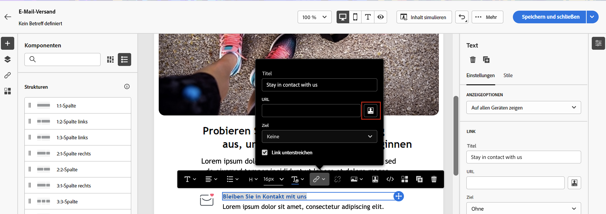

# Erste Schritte mit dynamischen Inhalten

Um jede Marketing-Kampagne optimal zu nutzen, bietet Ihnen Adobe Campaign eine Möglichkeit, benutzerdefinierte dynamische Inhalte bereitzustellen, die Kunden auf ihrer Ebene ansprechen. Verwenden Sie auf der Basis von Profildaten Personalisierungsfunktionen, um ein benutzerdefiniertes Erlebnis für verschiedene Gruppen und Personen zu erstellen: Sie können Ihre Nachrichten an jeden einzelnen Empfänger anpassen, indem Sie die vorhandenen Daten und Informationen nutzen. Dies können Vornamen, Interessen, Wohnorte, bisherige Käufe und vieles mehr sein.

Verwenden Sie Campaign, um dynamische Inhalte zu erstellen und personalisierte Nachrichten zu versenden. Personalisierungsfunktionen können kombiniert werden, um Ihre Nachrichten zu verbessern und ein individuelles Benutzererlebnis zu schaffen.

## Wie wird Ihr Inhalt dynamisch?

Der Nachrichteninhalt kann dynamisch gestaltet werden, indem Sie Folgendes einfügen:

* **Personalisierungsfelder**: Personalisierungsfelder werden zur Personalisierung Ihrer Nachrichten auf erster Ebene verwendet. Sie können jedes in der Datenbank verfügbare Feld aus dem Personalisierungseditor auswählen. Für einen Versand können Sie jedes Feld auswählen, das sich auf die Empfängerin oder den Empfänger, die Nachricht oder den Versand bezieht. Diese Personalisierungsattribute können in die Betreffzeile oder in den Text Ihrer Nachrichten eingefügt werden.

   Mit der folgenden Syntax wird die Stadt des Empfängers bzw. der Empfängerin in Ihren Inhalt eingefügt: &lt;%= recipient.location.city %>.

   

* **Bedingter Inhalt**: Konfigurieren Sie bedingte Inhalte, um beispielsweise Inhalte basierend auf dem Empfängerprofil hinzuzufügen. Textblöcke und/oder Bilder werden eingefügt, wenn eine bestimmte Bedingung erfüllt ist. Sie können die alternative Version des Inhalts definieren, wenn die Bedingung nicht wahr ist.

* **Integrierte Inhaltsbausteine**: Campaign verfügt über eine Reihe von Gestaltungsbausteinen, die ein bestimmtes Rendering enthalten, das Sie in Ihre Sendungen einfügen können. Sie können beispielsweise ein Logo, eine Grußnachricht oder einen Link zur Mirrorseite einer E-Mail-Nachricht hinzufügen. Inhaltsbausteine sind über einen eigenen Eintrag im Personalisierungs-Editor verfügbar.

   

## Auf den Ausdruckseditor zugreifen {#access}

Adobe Campaign V8 Web bietet einen Ausdruckseditor, in dem Sie alle Daten auswählen, anordnen, anpassen und validieren können, um ein benutzerdefiniertes Erlebnis für Ihren Inhalt zu erstellen. Der Ausdruckseditor steht für alle Kanäle in allen Feldern mit dem **[!UICONTROL Personalisierungsdialogfeld öffnen]** -Symbol, z. B. das Betreffzeilenfeld oder E-Mail-Links und Text-/Schaltflächeninhaltskomponenten.

>[!NOTE]
>
>Zusätzlich zum Ausdruckseditor können Sie beim Entwerfen einer E-Mail auch einen dedizierten Builder für bedingte Inhalte verwenden. [Erfahren Sie, wie Sie bedingte Inhalte in E-Mails erstellen](conditions.md)

*Zugriff auf den Ausdruckseditor über das Feld Absendername*

*Zugriff auf den Ausdruckseditor über eine E-Mail-Textkomponente*

*Zugriff auf den Ausdruckseditor über einen Link in einer E-Mail*

## Tauchen wir tiefer in die Materie ein

Nachdem Sie nun wissen, wie Sie Ihren Inhalt dynamisch gestalten können, ist es an der Zeit, diese Dokumentationsabschnitte näher zu untersuchen, um mit der Funktion zu beginnen.

<table style="table-layout:fixed"><tr style="border: 0;">
<td>

<a href="personalize.md"><strong>Hinzufügen von Personalisierung</strong></a>

</td>
<td>

<a href="conditions.md"><strong>Hinzufügen bedingter Inhalte</strong>

</td>
<td>

<a href="content-blocks.md"><strong>Hinzufügen integrierter Inhaltsbausteine</strong></a>

</td>
</tr></table>
