# Personalisieren von Inhalten{#add-personalization}

Sie können den Nachrichteninhalt wie folgt personalisieren:

* Einfügen von dynamischen **Personalisierungsfeldern**

   Personalisierungsfelder werden für die oberste Ebene der Nachrichtenpersonalisierung verwendet. Sie können jedes in der Datenbank verfügbare Feld aus dem Personalisierungseditor auswählen. Für einen Versand können Sie jedes Feld auswählen, das sich auf die Empfängerin oder den Empfänger, die Nachricht oder den Versand bezieht. Diese Personalisierungsattribute können in die Betreffzeile oder in den Text Ihrer Nachrichten eingefügt werden.

   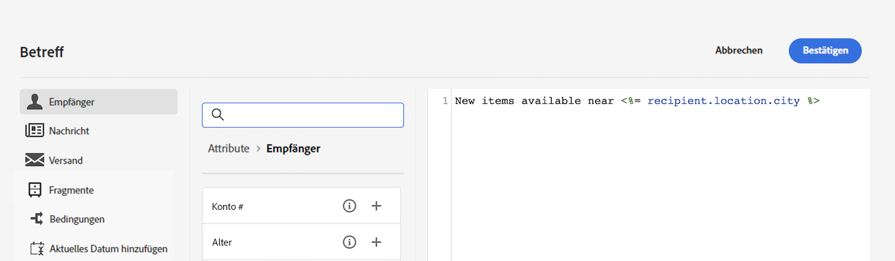

   Mit der folgenden Syntax wird die Stadt des Empfängers bzw. der Empfängerin in Ihren Inhalt eingefügt: &lt;%= recipient.location.city %>.

* Einfügen von vordefinierten **Inhaltsbausteinen**

   Campaign verfügt über eine Reihe von Gestaltungsbausteinen, die ein bestimmtes Rendering ermöglichen, das Sie in Ihre Sendungen einfügen können. Sie können zum Beispiel ein Logo, eine Grußbotschaft oder einen Link zur Mirror-Seite der Nachricht hinzufügen. Inhaltsbausteine sind über einen eigenen Eintrag im Personalisierungseditor verfügbar.

   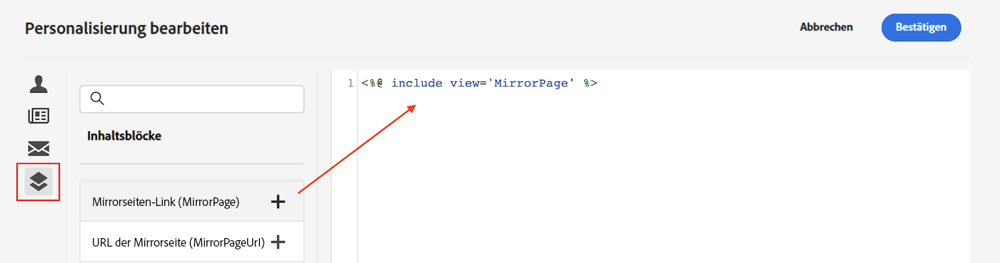

* Erstellen **bedingter Inhalte**

   Konfigurieren Sie bedingte Inhalte, um beispielsweise eine dynamische Personalisierung basierend auf dem Empfängerprofil hinzuzufügen. Textblöcke und/oder Bilder werden eingefügt, wenn eine bestimmte Bedingung erfüllt ist.

## Personalisieren der Betreffzeile der E-Mail {#personalize-subject-line}

Um eine Personalisierung im Feld **[!UICONTROL Betreffzeile]** der Nachricht hinzuzufügen, gehen Sie wie folgt vor:

1. Klicken Sie auf **[!UICONTROL Personalisierungsdialog öffnen]** rechts neben dem Feld **[!UICONTROL Betreffzeile]**.

   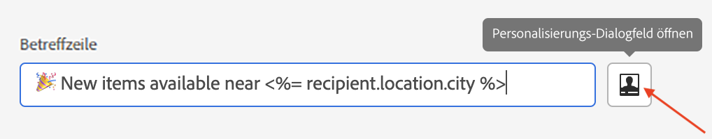{width="600"}

1. Geben Sie den Inhalt der Betreffzeile ein und wählen Sie die Personalisierungsattribute, die Sie hinzufügen möchten.

1. Klicken **[!UICONTROL Bestätigen]**** zu validieren. Die Personalisierungsattribute werden der Betreffzeile hinzugefügt.

## Personalisieren des E-Mail-Inhalts {#personalize-emails}

Um den E-Mail-Inhalt zu personalisieren, öffnen Sie die Nachricht im E-Mail-Designer und:

1. Klicken Sie auf einen Textblock.
1. Wählen Sie in der kontextbasierten Symbolleiste **[!UICONTROL Personalisierung hinzufügen]**.

   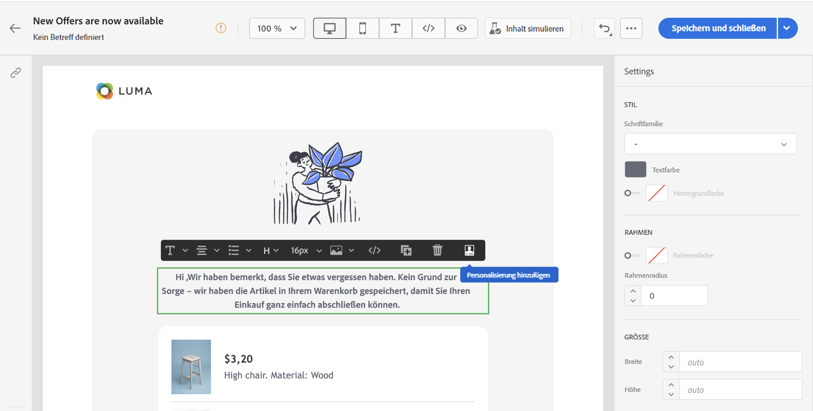

1. Fügen Sie den Namen der Empfängerin oder des Empfängers in den Personalisierungseditor ein und bestätigen Sie die Eingabe.

   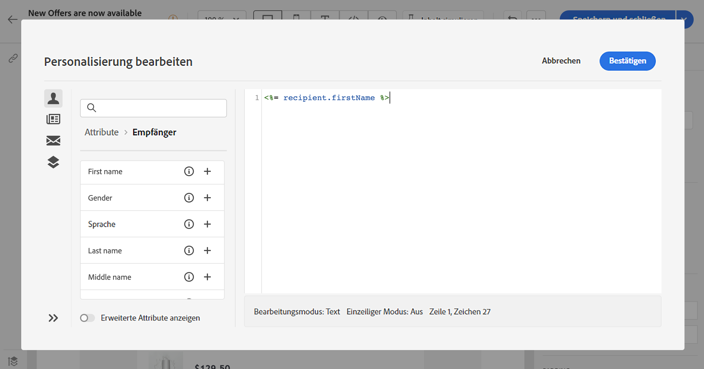

   Das Personalisierungsattribut wird dem E-Mail-Inhalt hinzugefügt.

   Sie können den Inhalt simulieren, um das Rendering zu überprüfen. [Weitere Informationen](../preview-test/preview-content.md)

   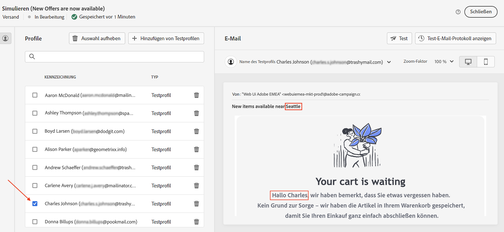

1. Um einen Inhaltsbaustein zu Ihrer E-Mail hinzuzufügen, führen Sie dieselben Schritte aus und wählen im letzten Symbol einen Inhaltsbaustein:

   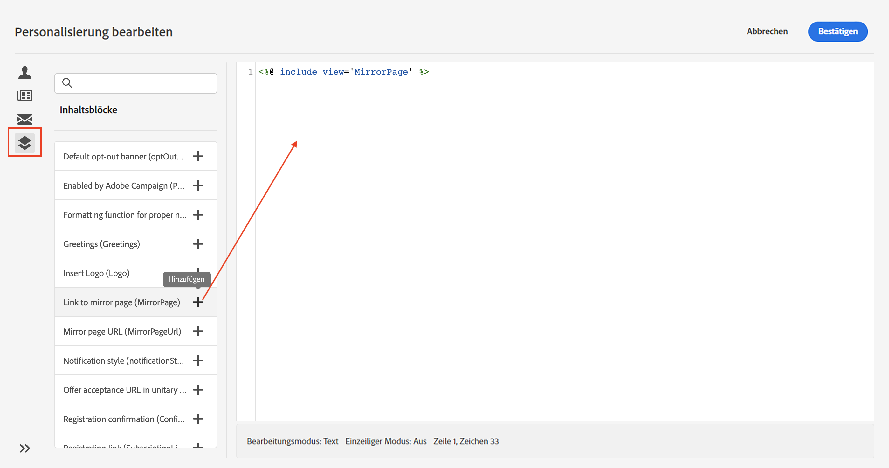

1. Nach dem Einfügen wird der Inhaltsbaustein dem E-Mail-Inhalt hinzugefügt. Er wird bei der Versandvorbereitung automatisch an das Empfängerprofil angepasst, wenn eine Personalisierung erstellt wird.

   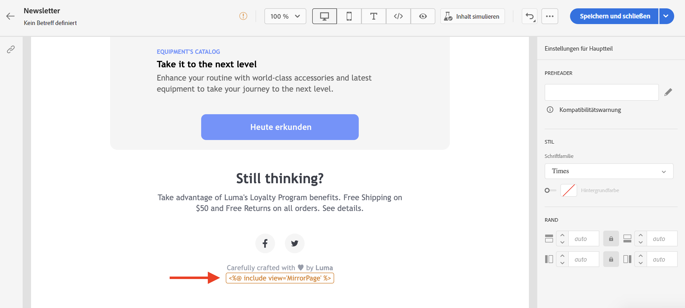

## Personalisieren von Links in E-Mails {#personalize-links}

So personalisieren Sie einen **Link**:

1. Wählen Sie einen Textblock oder ein Bild aus.
1. Wählen Sie in der kontextbezogenen Symbolleiste **Link einfügen**.

   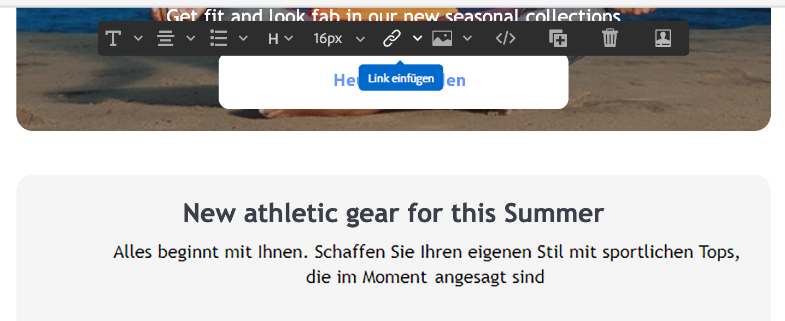

1. Geben Sie den Link-Titel ein und verwenden Sie die Schaltfläche **Link einfügen**, um den Link zu personalisieren.

   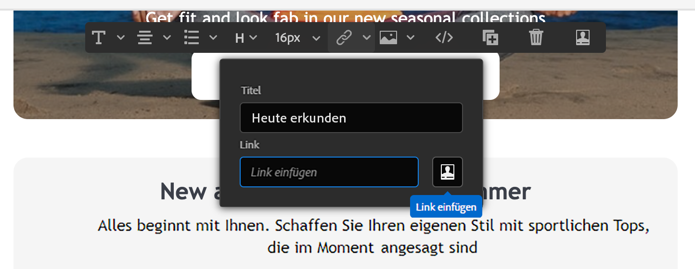

1. Verwenden Sie den Personalisierungseditor, um den Link zu definieren und zu personalisieren, und bestätigen Sie ihn dann.

   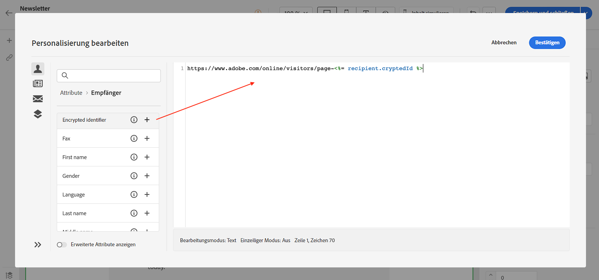

## Personalisieren von Angeboten {#personalize-offers}

Sie können mit dem Personalisierungseditor auch Textinhalte zu den Darstellungen Ihrer Angebote hinzufügen. Weiterführende Informationen finden Sie in [diesem Abschnitt](../content/offers.md).

## Integrierte Inhaltsbausteine {#ootb-content-blocks}

Integrierte Inhaltsbausteine sind:

* **[!UICONTROL Ermöglicht durch Adobe Campaign]**: Hiermit wird das Logo „Ermöglicht durch Adobe Campaign“ eingefügt.
* **[!UICONTROL Formatierungsfunktion für Eigennamen]**: Hiermit wird die JavaScript-Funktion **[!UICONTROL toSmartCase]** generiert, mit der der erste Buchstabe eines jeden Worts in einen Großbuchstaben umgewandelt wird.
* **[!UICONTROL Grußformeln]**: fügt Grußformeln mit dem vollständigen Namen der Empfängerin bzw. des Empfängers ein, gefolgt von einem Komma. Beispiel: „Sehr geehrter Herr Mustermann,“.
* **[!UICONTROL Logo einfügen]**: Fügt ein Logo ein, das in den Instanzeinstellungen definiert ist.
* **[!UICONTROL Mirrorseiten-Link]**: Hiermit wird ein Link zur [Mirrorseite](../content/mirror-page.md) eingefügt. Das Standardformat lautet: „Wenn diese Nachricht nicht richtig angezeigt wird, bitte hier klicken“.
* **[!UICONTROL Mirrorseiten-URL]**: Hiermit wird die URL der Mirrorseite eingefügt, damit Versand-Designerinnen und -Designer den Link prüfen können.
* **[!UICONTROL Annahme-URL eines Angebots im Einzelmodus]**: Hiermit wird eine URL eingefügt, die es ermöglicht, ein Angebot auf **[!UICONTROL Angenommen]** zu setzen. (Dieser Baustein ist verfügbar, wenn das Interaction-Modul aktiviert ist)
* **[!UICONTROL Anmeldebestätigung]**: Hiermit wird ein Link eingefügt, mit dem die Anmeldung bestätigt werden kann.
* **[!UICONTROL Anmelde-Link]**: Hiermit wird ein Anmelde-Link eingefügt. Dieser Link wird in den Instanzeinstellungen definiert. Der Standardinhalt lautet: „Klicken Sie hier, um sich zu registrieren.“
* **[!UICONTROL Anmelde-Link (mit Werber)]**: Hiermit wird ein Anmelde-Link eingefügt, über den der Besucher bzw. die Besucherin sowie der Versand identifiziert werden können. Dieser Link wird in den Instanzeinstellungen definiert.
* **[!UICONTROL Anmeldungsseiten-URL]**: Hiermit wird eine Abonnement-URL eingefügt
* **[!UICONTROL Stil der Inhalts-E-Mails]** und **[!UICONTROL Stil der Benachrichtigungen]**: Hiermit wird Code erstellt, mit dem eine E-Mail mit nativen HTML-Stilen formatiert werden kann.
* **[!UICONTROL Abmelde-Link]**: Fügt einen Link ein, der es ermöglicht, das Abo aller Sendungen zu kündigen (Blockierungsliste). Der standardmäßig verknüpfte Inhalt ist: „Sie erhalten diese Nachricht, da Sie mit ***Name Ihres Unternehmens*** oder einem Tochterunternehmen in Kontakt standen. Um keine Nachrichten mehr von ***Name Ihres Unternehmens*** zu erhalten, klicken Sie hier.“
