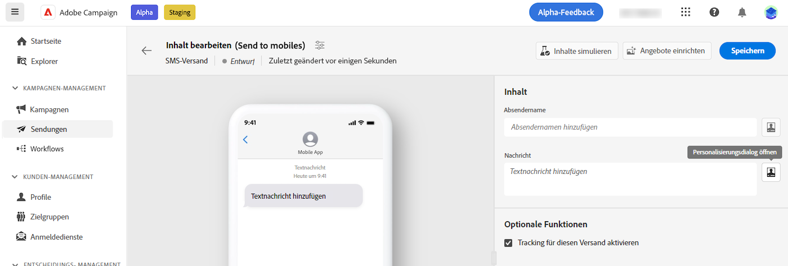
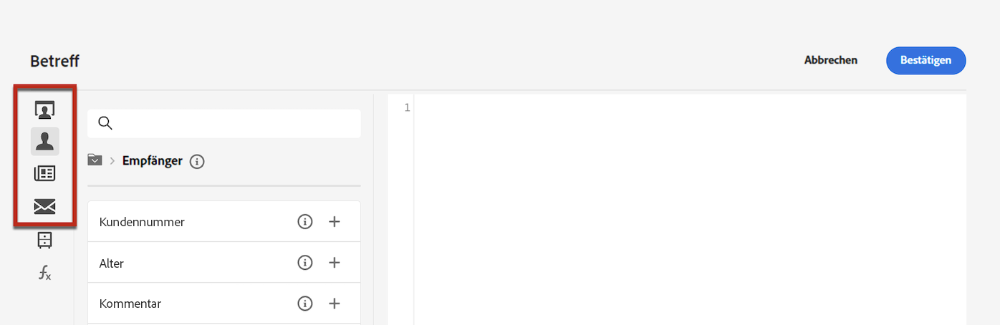
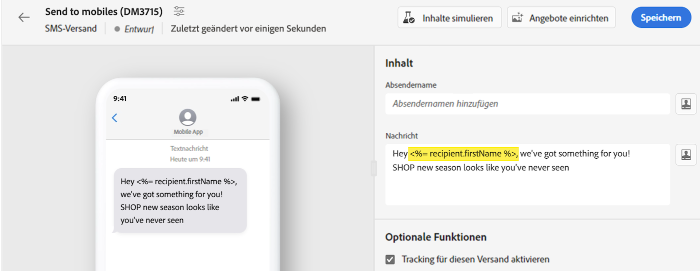
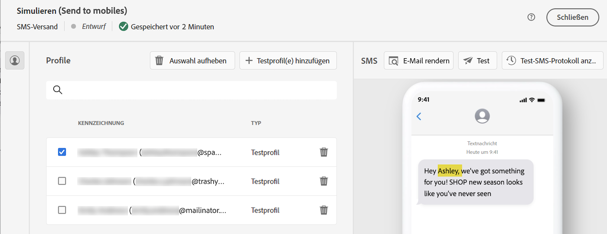

# Personalisieren von Inhalten {#add-personalization}

Sie können jeden Versand mithilfe des Ausdruckseditors personalisieren. Auf den Ausdruckseditor können Sie in allen Feldern mit dem Symbol **[!UICONTROL Personalisierungsdialog öffnen]** zugreifen, z. B. Betreffzeile, E-Mail-Links und Text-/Schaltflächen-Inhaltskomponenten. [Erfahren Sie, wie Sie auf den Ausdruckseditor zugreifen](gs-personalization.md/#access)

## Personalisierungssyntax {#syntax}

Personalisierungs-Tags folgen einer bestimmten Syntax: `<%= table.field %>`. Um beispielsweise den Nachnamen der Empfängerin bzw. des Empfängers aus der Empfängertabelle einzufügen, verwenden Sie die Syntax `<%= recipient.lastName %>`.

Während der Versandvorbereitung interpretiert Adobe Campaign diese Tags automatisch und ersetzt sie durch die entsprechenden Feldwerte für jede Person. Sie können die tatsächliche Ersetzung anzeigen, indem Sie Ihren Inhalt simulieren.

Beim Hochladen von Kontakten aus einer externen Datei für einen eigenständigen E-Mail-Versand sind alle Felder in der Eingabedatei zur Personalisierung verfügbar. Die Syntax sieht folgendermaßen aus: `<%= dataSource.field %>`.

## Hinzufügen von Personalisierungs-Tags {#add}

Gehen Sie wie folgt vor, um einem Versand Personalisierungs-Tags hinzuzufügen:

1. Öffnen Sie den Ausdruckseditor mithilfe des Symbols **[!UICONTROL Personalisierungsdialog öffnen]**, auf das über Textbearbeitungsfelder (wie die Betreffzeile oder der SMS-Text) zugegriffen werden kann. [Erfahren Sie, wie Sie auf den Ausdruckseditor zugreifen](gs-personalization.md/#access)

   {zoomable=&quot;yes&quot;}{width="800" align="center"}

1. Der Ausdruckseditor wird geöffnet. Die in der Adobe Campaign-Datenbank verfügbaren Personalisierungsfelder sind in verschiedene Menüs auf der linken Seite des Bildschirms unterteilt:

   {zoomable=&quot;yes&quot;}{width="800" align="center"}

   | Menü | Beschreibung |
   |-----|------------|
   | {zoomable=&quot;yes&quot;} | Das Menü **[!UICONTROL Abonnentenanwendung]** enthält Felder, die mit den Abonnentinnen und Abonnenten einer Anwendung in Verbindung stehen, wie z. B. das verwendete Terminal oder das Betriebssystem. *Dieses Menü ist nur für Push-Benachrichtigungen verfügbar* |
   | {zoomable=&quot;yes&quot;} | Im Menü **[!UICONTROL Empfänger]** werden die in der Empfängertabelle definierten Felder aufgelistet, z. B. Namen, Alter oder Adressen der Empfängerinnen und Empfänger. Beim [Hochladen von Kontakten aus einer externen Datei](../audience/file-audience.md) für einen eigenständigen E-Mail-Versand enthält dieses Menü alle in der Eingabedatei verfügbaren Felder. |
   | {zoomable=&quot;yes&quot;} | Das Menü **[!UICONTROL Nachricht]** enthält Felder, die mit den Versandlogs in Verbindung stehen. Dazu gehören alle Nachrichten, die über alle Kanäle an Empfängerinnen und Empfänger oder Geräte gesendet werden, z. B. das Datum des letzten Ereignisses im Zusammenhang mit einer bestimmten Person. |
   | {zoomable=&quot;yes&quot;} | Das Menü **[!UICONTROL Versand]** listet Felder auf, die sich auf die Parameter beziehen, die für die Durchführung von Sendungen erforderlich sind, wie beispielsweise den Versandkanal oder die Bezeichnung. |

   >[!NOTE]
   >
   >Standardmäßig werden in jedem Menü alle Felder der ausgewählten Tabelle aufgelistet (Empfänger/Nachricht/Versand). Wenn Sie Felder aus mit der ausgewählten Tabelle verknüpften Tabellen einbeziehen möchten, aktivieren Sie die Option **[!UICONTROL Erweiterte Attribute anzeigen]** unterhalb der Liste.

1. Um ein Personalisierungsfeld hinzuzufügen, positionieren Sie den Cursor an der gewünschten Stelle in Ihrem Inhalt und klicken Sie zum Einfügen auf die Schaltfläche `+`.

1. Sobald Ihr Inhalt fertig ist, können Sie ihn speichern und das Rendering der Personalisierung testen, indem Sie Ihren Inhalt simulieren. Das folgende Beispiel zeigt die Personalisierung einer SMS-Nachricht mit dem Vornamen der Empfängerinnen und Empfänger.

   {zoomable=&quot;yes&quot;}{width="800" align="center"}

   {zoomable=&quot;yes&quot;}{width="800" align="center"}
