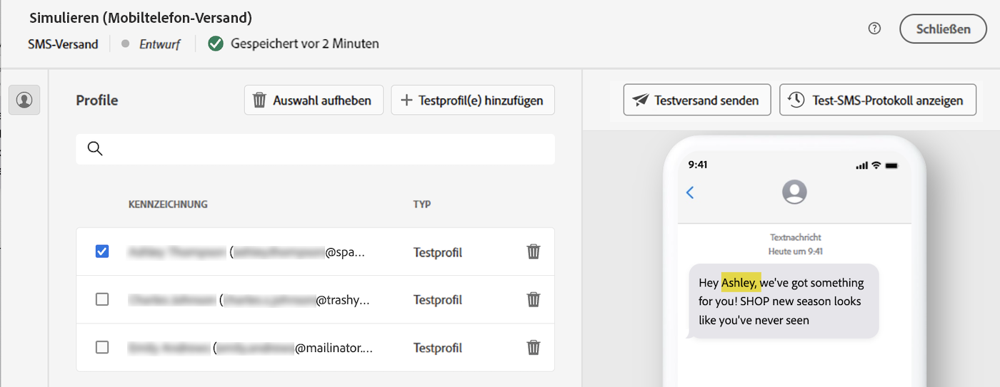

# Personalisieren von Inhalten {#add-personalization}

Die Personalisierung kann jedem Versand mithilfe des Ausdruckseditors hinzugefügt werden, auf den in allen Feldern mit der **[!UICONTROL Personalisierungsdialogfeld öffnen]** -Symbol, z. B. das Betreffzeilenfeld oder E-Mail-Links und Text-/Schaltflächeninhaltskomponenten. [Erfahren Sie, wo dynamische Inhalte hinzugefügt werden](gs-personalization.md/#access)

## Personalisierungssyntax {#syntax}

Ein Personalisierungs-Tag hat immer die folgende Syntax: `<%=table.field%>`. Um beispielsweise den in der Empfängertabelle gespeicherten Empfängernamen einzufügen, verwendet das Personalisierungs-Tag die Syntax &lt;%= recipient.lastName %> .

Bei der Vorbereitung eines Versands werden diese Tags automatisch von Adobe Campaign interpretiert und durch den Feldwert für einen bestimmten Empfänger ersetzt. Der physische Austausch kann dann bei der Simulation Ihres Inhalts angezeigt werden.

## Personalisierungs-Tags hinzufügen {#add}

Um einem Versand Personalisierungs-Tags hinzuzufügen, öffnen Sie den Ausdruckseditor mit der **[!UICONTROL Personalisierungsdialogfeld öffnen]** -Symbol, auf das über Textbearbeitungsfelder wie die Betreffzeile oder den SMS-Textkörper zugegriffen werden kann. [Erfahren Sie, wo dynamische Inhalte hinzugefügt werden](gs-personalization.md/#access)

Der Ausdruckseditor wird angezeigt. Personalisierungsfelder sind in drei Menüs auf der linken Bildschirmseite unterteilt. Über diese Menüs haben Sie Zugriff auf alle in der Adobe Campaign-Datenbank verfügbaren Felder.

| Menü | Beschreibung |
|-----|------------|
|  | Die **[!UICONTROL Abonnentenanwendung]** enthält alle Felder, die mit den Abonnenten einer Anwendung in Verbindung stehen, wie z. B. das Terminal oder das Betriebssystem. *Dieses Menü ist nur für Push-Benachrichtigungen verfügbar* |
|  | Die **[!UICONTROL Empfänger]** listet alle in der Empfängertabelle definierten Felder auf, z. B. den Namen, das Alter oder die Adresse des Empfängers. |
|  | Die **[!UICONTROL Nachricht]** enthält alle Felder, die mit den Versandlogs in Verbindung stehen, d. h. alle Nachrichten, die über alle Kanäle an Empfänger oder Geräte gesendet werden, z. B. das Datum des letzten Ereignisses mit einem bestimmten Empfänger |
|  | Die **[!UICONTROL Versand]** listet alle Felder auf, die mit den für die Durchführung des Versands erforderlichen Parametern verknüpft sind, wie z. B. den Versandkanal, den Titel usw. |

>[!NOTE]
>
>Standardmäßig werden in jedem Menü alle Felder der ausgewählten Tabelle angezeigt (Empfänger, / Nachricht / Versand). Wenn Sie Felder aus mit der ausgewählten Tabelle verknüpften Tabellen einbeziehen möchten, aktivieren Sie die **[!UICONTROL Erweiterte Attribute anzeigen]** Option unterhalb der Liste.

Um ein Personalisierungsfeld hinzuzufügen, platzieren Sie den Cursor an der gewünschten Stelle in Ihrem Inhalt und klicken Sie auf die Schaltfläche + , um es einzufügen.

Sobald Ihr Inhalt fertig ist, können Sie ihn speichern und das Rendering der Personalisierung testen, indem Sie Ihren Inhalt simulieren. Im folgenden Beispiel wird eine SMS mit den Vornamen der Zielgruppenprofile personalisiert.

*Personalisierungs-Tag im Nachrichteninhalt hinzufügen*

*Simulieren des Renderings der Personalisierung für ein bestimmtes Testprofil*

