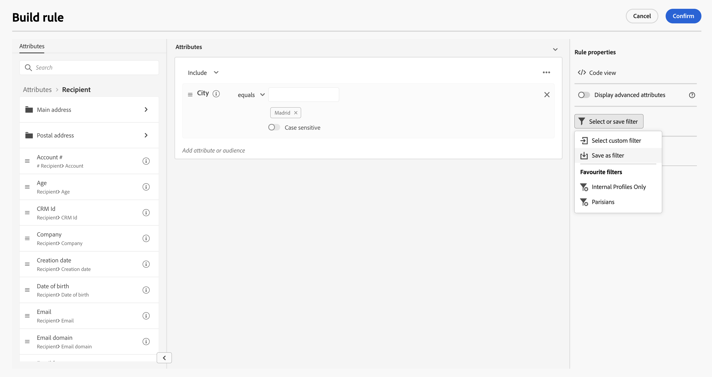

# Arbeiten mit vordefinierten Filtern {#predefined-filters}

>[!CONTEXTUALHELP]
>id="acw_homepage_card3"
>title="Vordefinierte Filterverwaltung"
>abstract="Campaign Web bietet Ihnen jetzt eine benutzerfreundliche Oberfläche, mit der Sie vordefinierte Filter mühelos verwalten und an Ihre spezifischen Anforderungen anpassen können. Erstellen Sie einmal und speichern Sie für die zukünftige Verwendung."

>[!CONTEXTUALHELP]
>id="acw_predefined-filters-dashboard"
>title="Vordefinierte Filter"
>abstract="Campaign Web bietet Ihnen jetzt eine benutzerfreundliche Oberfläche, mit der Sie vordefinierte Filter mühelos verwalten und an Ihre spezifischen Anforderungen anpassen können. Erstellen Sie einmal und speichern Sie für die zukünftige Verwendung."

Vordefinierte Filter sind benutzerdefinierte Filter, die für die zukünftige Verwendung verfügbar sind. Sie können bei Filtervorgängen mit dem Regel-Builder als Verknüpfungen verwendet werden. Sie können vorhandene integrierte Filter verwenden, um auf einen bestimmten Teil Ihrer Daten zuzugreifen, oder Sie können einen eigenen vordefinierten Filter erstellen.

## Vordefinierten Filter erstellen {#create-predefined-filter}

>[!CONTEXTUALHELP]
>id="acw_predefined-filters-creation"
>title="Vordefinierten Filter erstellen"
>abstract="Geben Sie einen Titel für den vordefinierten Filter ein und wählen Sie die Tabelle aus, auf die er angewendet werden soll. Öffnen Sie die zusätzlichen Optionen, um eine Beschreibung hinzuzufügen und diesen Filter als Favoriten festzulegen. Definieren Sie dann mithilfe der Schaltfläche &#39;Regel erstellen&#39; die Filterbedingungen."

Beim Erstellen eines Filters mit dem Regel-Builder können Sie ihn für eine zukünftige Verwendung speichern. Wenn sie als benutzerdefinierter Filter gespeichert werden, ist sie für die zukünftige Verwendung verfügbar. Sie können auch vordefinierte Filter aus dem dedizierten Menü im linken Navigationsbereich erstellen und bearbeiten.

Gehen Sie wie folgt vor, um einen benutzerdefinierten Filter im Regel-Builder zu speichern:

1. Öffnen Sie den Regel-Builder und definieren Sie Ihre Filterbedingungen. Im folgenden Beispiel filtern Sie die Empfänger, die in Madrid leben.
1. Klicken Sie auf **Filter auswählen oder speichern** und wählen Sie **Als Filter speichern**.

   

1. Auswählen **Neuen Filter erstellen** und geben Sie einen Namen und eine Beschreibung für diesen Filter ein.

   

1. (optional) Aktivieren Sie die **Als Favoriten speichern** auswählen, wenn Sie diesen vordefinierten Filter in Ihren Favoriten sehen möchten.

   

1. Klicken Sie auf **Bestätigen**, um Ihre Änderungen zu speichern.

Ihr benutzerdefinierter Filter ist jetzt im **Vordefinierte Filter** und für alle Campaign-Benutzer zugänglich sein.

## Vordefinierten Filter verwenden {#use-predefined-filter}

## Vordefinierte Filter verwalten {#manage-predefined-filter}

## Vordefinierte Filter {#ootb-predefined-filter}
