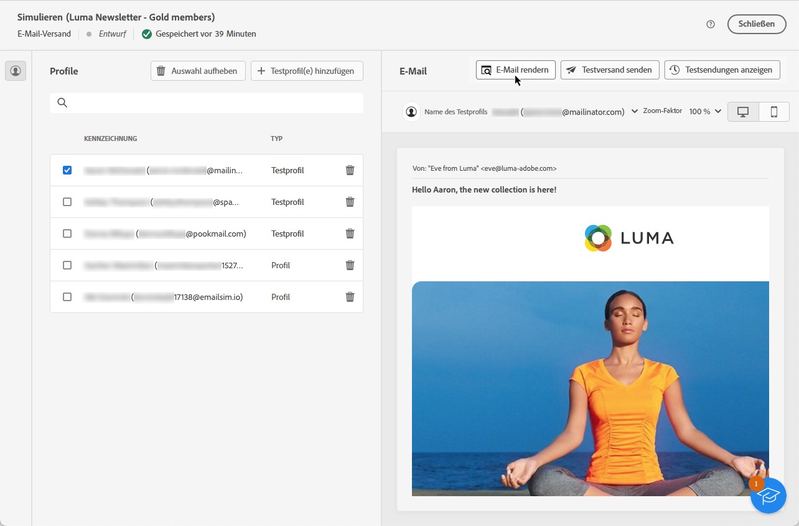

# Testen des E-Mail-Renderings {#email-rendering}

Vergewissern Sie sich vor dem Versand Ihrer E-Mail, dass Ihre Nachricht den Empfängerinnen und Empfängern auf einer Vielzahl von Webclients und Geräten optimal angezeigt wird.

Zu diesem Zweck können Sie Ihr **Litmus**-Konto in [!DNL Adobe Campaign] einbinden, um eine sofortige Vorschau Ihres E-Mail-Renderings in verschiedenen Kontexten zu erhalten und die Kompatibilität mit den wichtigsten Desktops und Anwendungen (Webmail, Nachrichten-Service, Mobilgerät usw.) zu überprüfen.

>[!CAUTION]
>
>Beim E-Mail-Rendering in Campaign wird eine Testsendung an ein Fremdsystem gesendet. Indem Sie Ihr Litmus-Konto mit [!DNL Campaign] verbinden, erkennen Sie an, dass Adobe nicht für Daten verantwortlich ist, die Sie an diesen Drittanbieter senden. Die Litmus-E-Mail-Richtlinie zur Datenaufbewahrung gilt für diese E-Mails, einschließlich der Personalisierungsdaten, die in diese Testsendungen aufgenommen werden können. Um auf solche Daten zuzugreifen oder sie zu löschen, müssen Sie sich direkt an Litmus wenden.

Für den Zugriff auf E-Mail-Rendering-Funktionen müssen Sie folgende Voraussetzungen erfüllen:

* Ein Litmus-Konto besitzen
* Auswählen von Profilen und/oder Testprofilen: Informationen dazu in [diesem Abschnitt](preview-content.md)

Gehen Sie dann wie folgt vor:

1. Klicken Sie im Bildschirm [Inhalt bearbeiten](../email/edit-content.md) oder im [E-Mail-Designer](../email/get-started-email-designer.md) auf die Schaltfläche **[!UICONTROL Inhalt simulieren]**.

1. Wählen Sie die Schaltfläche **[!UICONTROL E-Mail rendern]** aus.

   {zoomable=&quot;yes&quot;}

1. Klicken Sie im oberen rechten Bereich auf **Litmus-Konto verbinden**.

   {zoomable=&quot;yes&quot;}

1. Geben Sie Ihre Anmeldedaten ein und melden Sie sich an.

   {zoomable=&quot;yes&quot;}

1. Klicken Sie auf die Schaltfläche **Test ausführen**, um eine E-Mail-Vorschau zu erstellen.

1. Überprüfen Sie Ihre E-Mail-Inhalte in gängigen Desktop-, Mobile- und Web-basierten Clients.

   {zoomable=&quot;yes&quot;}

<!--
TO CHECK IF user is directed to Litmus or if the email rendering is shown directly in the Campaign UI.

CONTENT ABOVE COPIED FROM AJO

If not redirecting to Litmus:

To test the email rendering, follow these steps:

1. Access the email content creation screen, then click **[!UICONTROL Simulate content]**.

1. Click the **[!UICONTROL Render email]** button.

    The left pane provides various desktop, mobile and web-based email clients. Select the desired email client to display a preview of your email in the right pane. 

    {zoomable="yes"}

    >[!NOTE]
    >
    >The email clients list provides a sample of the major mail clients. Additional email clients are available from the filter button next to the top search bar.

 -->
