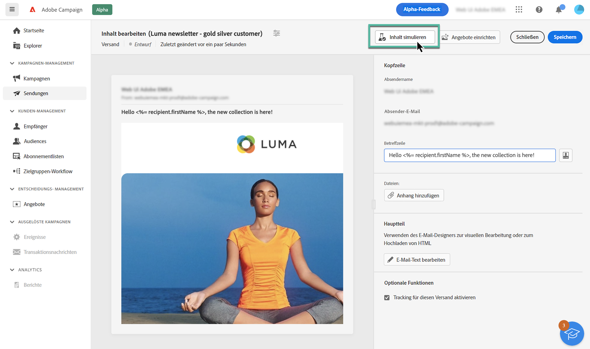
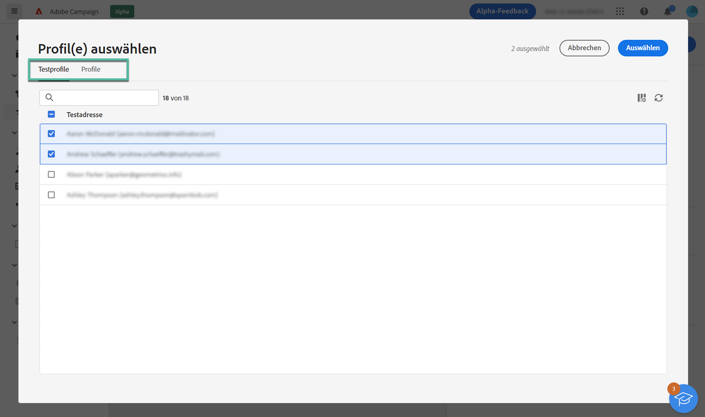
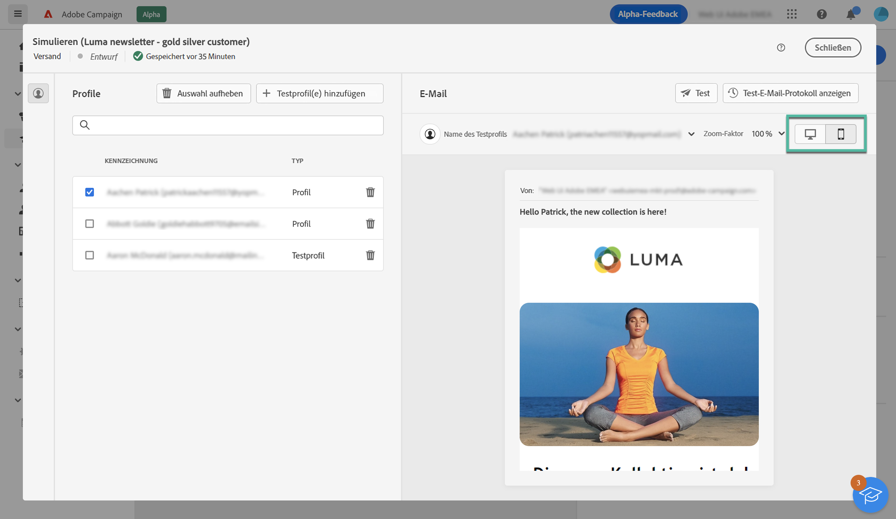

# Vorschau von E-Mail-Inhalten {#preview}

>[!CONTEXTUALHELP]
>id="acw_homepage_card4"
>title="Intelligente Vorschau von Inhalten"
>abstract="In Adobe Campaign kann mithilfe von Profilen der Inhalt einer E-Mail vor dem Versand in der Vorschau betrachtet werden, um die Personalisierung zu überprüfen und die Darstellung der Nachricht so anzuzeigen, wie sie die Empfängerinnen und Empfänger sehen werden."

Mit Adobe Campaign können Sie den Inhalt Ihrer E-Mail vor dem Versand in der Vorschau anzeigen, um die Personalisierung und die Darstellung der Nachricht bei Ihren Empfängern und Empfängerinnen zu überprüfen.

Gehen Sie wie folgt vor, um eine Vorschau des E-Mail-Inhalts anzuzeigen:

1. Öffnen Sie den Bildschirm zur Erstellung von E-Mail-Inhalten und klicken Sie auf die Schaltfläche **[!UICONTROL Inhalt simulieren]**.

   

1. Wählen Sie mindestens ein Profil aus, indem Sie auf die Schaltfläche **[!UICONTROL Profile auswählen]** klicken. Verwenden Sie dann die Registerkarten **[!UICONTROL Testprofile]** und **[!UICONTROL Profile]** zur Auswahl von:

   * Die Registerkarte **Testprofile** enthält Testadressen, die zusätzliche, fiktive Empfängerinnen und Empfänger in der Datenbank sind. Die Testadressen können in der Adobe Campaign-Konsole im Ordner **[!UICONTROL Resourcen]** / **[!UICONTROL Kampagnen-Management]** / **[!UICONTROL Testadressen]** erstellt werden.
   * Die Registerkarte **Profile** listet alle Empfängerinnen und Empfänger auf, die über die Campaign-Konsole im Ordner **[!UICONTROL Profile und Zielgruppen]** gespeichert wurden.

   Sie können bei der Vorschau Ihrer E-Mail Testprofile und Profile miteinander kombinieren.

   

1. Nachdem Sie die Profile ausgewählt haben, wird im rechten Fensterbereich eine Vorschau der E-Mail angezeigt. Personalisierte Elemente werden durch Daten aus dem Profil ersetzt, das im linken Bereich ausgewählt wurde.

   Wenn Sie mehrere Profile hinzugefügt haben, können Sie in der Liste zwischen ihnen wechseln, um eine Vorschau der entsprechenden E-Mail anzuzeigen.

   >[!NOTE]
   >
   >Sie können eine Vorschau des Renderings Ihrer Inhalte auf verschiedenen Geräten (Desktop, Mobiltelefon, Tablet) anzeigen, indem Sie auf das entsprechende Symbol in der oberen rechten Ecke klicken.

   

