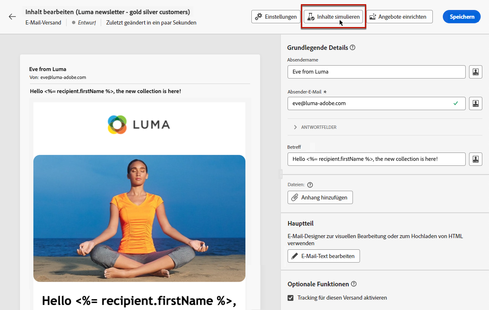
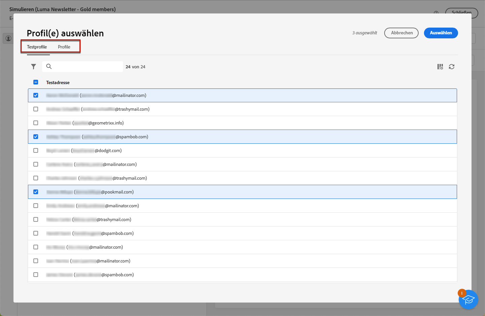
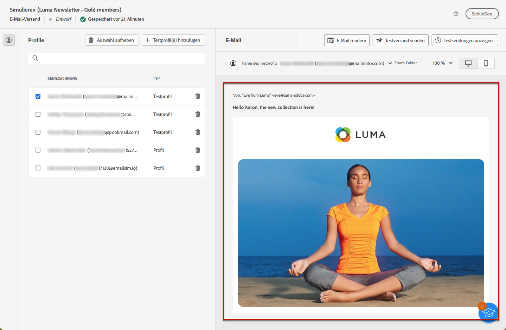

# Vorschau von E-Mail-Inhalten {#preview-content}

Verwenden Sie die [!DNL Campaign] Inhaltssimulation , um vor dem Versand eine Vorschau des Inhalts Ihrer E-Mail anzuzeigen. Auf diese Weise können Sie die Personalisierung steuern und überprüfen, wie sie Ihren Empfängern angezeigt wird.

Gehen Sie wie folgt vor, um eine Vorschau des Inhalts Ihrer E-Mail anzuzeigen.

1. E-Mail durchsuchen [Inhalt bearbeiten](../content/edit-content.md) oder auf [Email Designer](../content/get-started-email-designer.md).

1. Klicken Sie auf **[!UICONTROL Inhalt simulieren]** Schaltfläche.

   

1. Verwenden Sie die **[!UICONTROL Hinzufügen von Testprofilen]** zur Auswahl der Profile, die für die Vorschau Ihres personalisierten Inhalts verwendet werden.

1. Sie können Testprofile und Profile miteinander kombinieren, um eine Vorschau der E-Mail anzuzeigen.

   * Die Registerkarte **[!UICONTROL Testprofile]** enthält Testadressen für zusätzliche, fiktive Empfangende in der Datenbank.

     >[!NOTE]
     >
     >Testprofile können im Abschnitt [!DNL Campaign] in die **[!UICONTROL Ressourcen]** > **[!UICONTROL Campaign Management]** > **[!UICONTROL Testadressen]** Ordner. Weitere Informationen finden Sie unter [Dokumentation zu Campaign v8 (Konsole)](https://experienceleague.adobe.com/docs/campaign/campaign-v8/audience/add-profiles/test-profiles.html){target="_blank"}

   * Die **[!UICONTROL Profile]** enthält alle Empfänger, die im **[!UICONTROL Profile und Zielgruppen]** Ordner aus dem [!DNL Campaign] Konsole. [Weitere Informationen](https://experienceleague.adobe.com/docs/campaign/campaign-v8/audience/view-profiles.html){target="_blank"}

   

1. Klicken **[!UICONTROL Auswählen]** um Ihre Auswahl auf beiden Registerkarten zu bestätigen.

   Eine Vorschau der E-Mail wird im rechten Bereich des **[!UICONTROL Simulieren]** angezeigt. Personalisierte Elemente werden durch Daten aus dem Profil ersetzt, das im linken Bereich ausgewählt wurde.

   

1. Wenn mehrere Profile hinzugefügt wurden, können Sie in der Liste zwischen ihnen wechseln, um eine Vorschau der entsprechenden E-Mail anzuzeigen. Sie können auch weitere Testprofile hinzufügen und Ihre Auswahl mithilfe der entsprechenden Schaltflächen im linken Bereich löschen.

1. Sie können die **[!UICONTROL Zoomfaktor]** und zeigen Sie Ihre Inhalte auf dem Desktop oder Mobilgerät mithilfe des entsprechenden Symbols oben rechts an.

1. Aus dem **[!UICONTROL Simulieren]** -Bildschirm haben Sie auch folgende Möglichkeiten:
   * Prüfen Sie das E-Mail-Rendering in beliebten E-Mail-Clients - [Weitere Infos](email-rendering.md)
   * Senden von Test-E-Mails zur Validierung an bestimmte Empfänger - [Weitere Infos](proofs.md)

