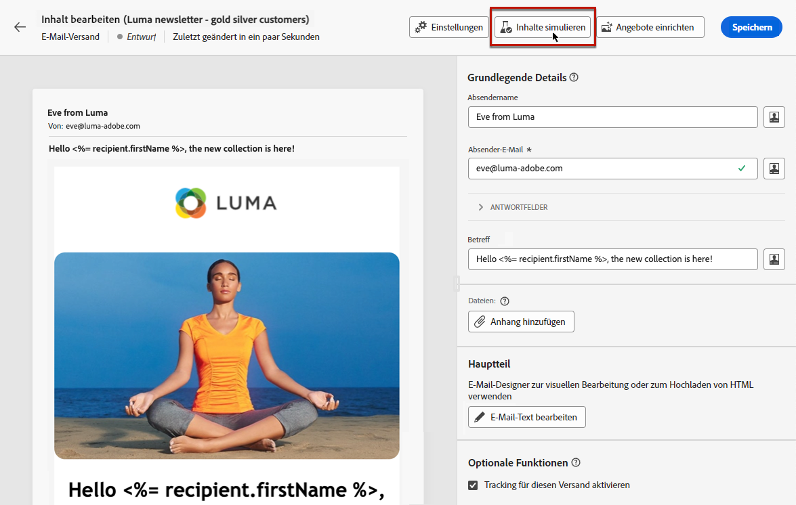

# Über die Vorschau und Tests {#about-preview-test}

>[!CONTEXTUALHELP]
>id="acw_deliveries_simulate"
>title="Anzeigen einer Vorschau und Testen von Nachrichten"
>abstract="Sobald der Nachrichteninhalt definiert worden ist, können Sie ihn mithilfe von Testprofilen in der Vorschau sehen und testen."
>additional-url="https://experienceleague.adobe.com/docs/campaign-web/v8/msg/preview-test/preview-content.html" text="Vorschau des Nachrichteninhalts anzeigen"
>additional-url="https://experienceleague.adobe.com/docs/campaign-web/v8/msg/preview-test/test-deliveries.html" text="Testsendungen durchführen"

Nachdem der Versandinhalt definiert wurde, können Sie Testprofile verwenden, um eine Vorschau anzuzeigen und zu testen, bevor Sie die Nachricht senden.

Dies ist ein entscheidender Schritt, um sicherzustellen, dass er präzise, aber auch frei von Fehlern ist, sowohl in den Inhalts- als auch in den Personalisierungseinstellungen.

Dazu bietet [!DNL Adobe Campaign] folgende Möglichkeiten:

* [Nachrichteninhalt und Personalisierung in der Vorschau ansehen](preview-content.md)
* [Testsendungen durchführen](test-deliveries.md) (Testsendungen) an bestimmte Empfänger oder Abonnenten zum Testen und Validieren
* [Überprüfen des E-Mail-Renderings](email-rendering.md) in beliebten Desktop-, Mobile- und Web-basierten Clients

Diese Aktionen können mit der Variablen **[!UICONTROL Inhalt simulieren]** auf die im Bildschirm Inhalt bearbeiten Ihres Versands zugegriffen werden kann.

<!-- from the [Edit content](../content/edit-content.md) screen or from the [Email Designer](../content/get-started-email-designer.md).-->

>[!NOTE]
>
>Die Inhaltssimulation ist auch in der [Versandzusammenfassung](../monitor/prepare-send.md) verfügbar, nachdem Sie auf die Schaltfläche **[!UICONTROL Überprüfen und senden]** geklickt haben.
