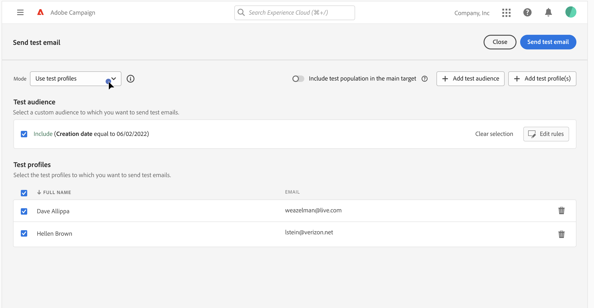
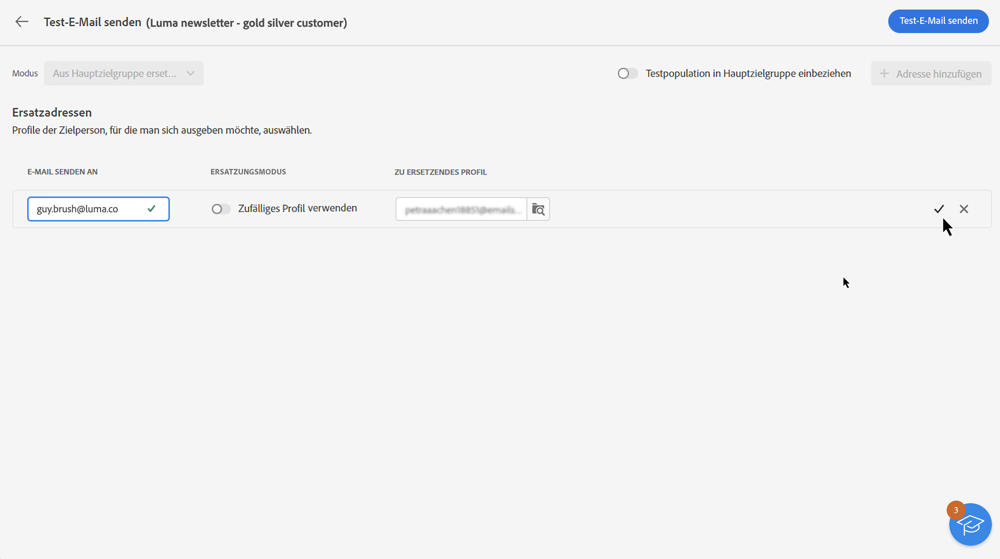
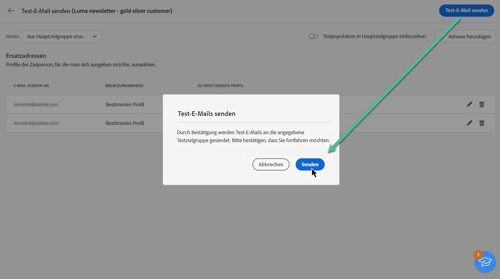
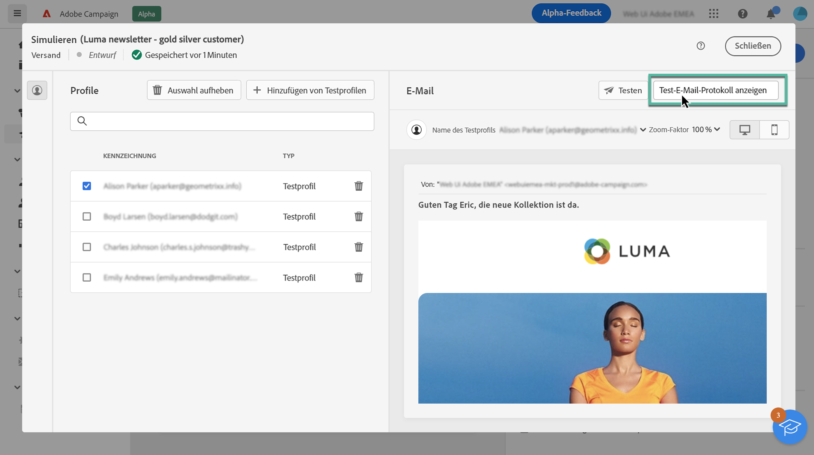

# Durchführen eines Testversands {#send-proofs}

>[!NOTE]
>
>Diese Dokumentation wird derzeit erstellt und häufig aktualisiert. Die endgültige Version dieses Inhalts wird im Januar 2023 vorliegen.

Testsendungen ermöglichen es Ihnen, Ihre E-Mail zu validieren und verschiedene Elemente wie Links, Opt-out-Links, Mirror-Seiten und Bilder zu überprüfen und mögliche Fehler zu erkennen.

Testsendungen können an zwei Empfängertypen gesendet werden:

* **Testprofile/Audiences**: Führen Sie Testsendungen an Testadressen durch, bei denen es sich um zusätzliche Empfänger in der Datenbank handelt, die nicht Teil der E-Mail-Zielgruppe sind,

* **Ersatzprofile**: Führen Sie Testsendungen an eine bestimmte E-Mail-Adresse mithilfe eines vorhandenen Profils durch. Dies ermöglicht es Ihnen, sich selbst in die Position der Profile zu versetzen und eine genaue Darstellung der Nachricht zu erhalten, die das Profil empfangen wird.

## Auswählen der Testversand-Empfänger {#recipients}

1. Öffnen Sie den Bildschirm zur Erstellung des E-Mail-Inhalts und klicken Sie auf **[!UICONTROL Inhalt simulieren]**.

1. Klicken Sie auf **[!UICONTROL Test]** und verwenden Sie dann die Dropdown-Liste **[!UICONTROL Modus]** zur Auswahl des Empfängertyps für die Testsendungen:

<!-- to check: by default, profiles selected in previous screen are pre-selected for proofs. Can add addtitional profiles + remove preselected?-->

### Durchführen eines Testversands an Testprofile

1. Wählen Sie den Modus **[!UICONTROL Testprofile verwenden]**.

1. Fügen Sie die Testprofile hinzu, die die Test-E-Mails erhalten sollen.

   Sie können auch mithilfe der Schaltfläche **[!UICONTROL Test-Audience hinzufügen]** eine Audience erstellen, um Testprofile basierend auf Ihren eigenen Kriterien auszuwählen.

   

### Durchführen eines Testversands an Ersatzprofile

1. Wählen Sie den Modus **[!UICONTROL Ersatz der Zielgruppe]**.

1. Fügen Sie die E-Mail-Adresse(n) hinzu, an die die Testsendungen gesendet werden sollen.

   >[!NOTE]
   >
   >Sie können eine beliebige E-Mail-Adresse angeben. Auf diese Weise können Sie Testsendungen an beliebige Benutzer senden, auch wenn diese nicht Nutzer von Adobe Campaign V8 sind.

1. Wählen Sie für jede E-Mail-Adresse das zu verwendende Profil aus der Zielgruppe aus. Sie können Adobe Campaign auch ein zufälliges Profil aus der Zielgruppe auswählen lassen.

   

Nach Auswahl der Testversand-Empfänger können Sie die Test-E-Mail versenden. [Erfahren Sie, wie Sie einen Testversand durchführen](#send)

>[!NOTE]
>
>Wenn Sie die endgültige E-Mail-Nachricht an die Testversand-Empfänger senden möchten, aktivieren Sie die Option **[!UICONTROL Testpopulation in Hauptzielgruppe einbeziehen]**.

## Versenden der Testsendungen {#send}

Um die Testsendungen an die ausgewählten Empfänger zu senden, klicken Sie auf **[!UICONTROL Test-E-Mail senden]** und bestätigen Sie dann den Versand.

Sobald die Testsendungen gesendet wurden, können Sie über die Schaltfläche **[!UICONTROL Test-E-Mail-Protokoll anzeigen]** auf dedizierte Protokolle zugreifen. Diese Protokolle ermöglichen den Zugriff auf die durchgeführten Testsendungen und auf spezifische Statistiken bezüglich des Testversands.

Senden Sie so viele Testsendungen wie nötig, bis Sie die endgültigen Inhalte Ihres Versands festgelegt haben. Danach können Sie die E-Mail an die Hauptzielgruppe senden. [Erfahren Sie, wie Sie Ihre E-Mail vorbereiten und senden](../monitor/prepare-send.md)
