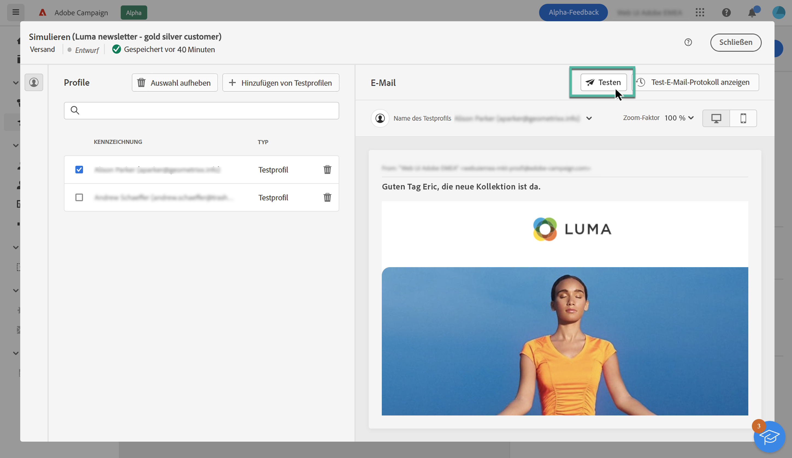
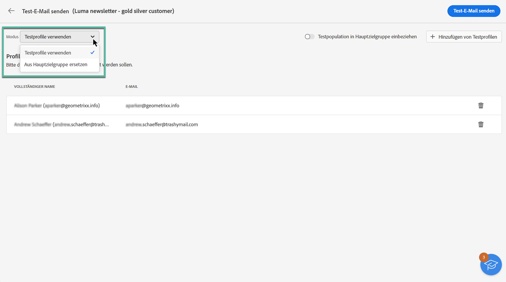
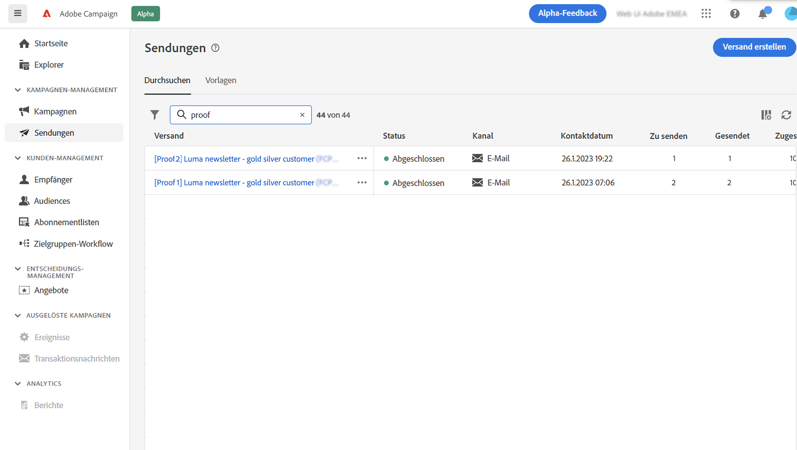

# Senden von Test-E-Mails {#send-proofs}

Der Versand von Test-E-Mails ist ein wichtiger Schritt zur Validierung Ihrer E-Mail-Kampagne und zur Identifizierung potenzieller Probleme. Durch den Versand von Test-E-Mails können Sie verschiedene Elemente wie Links, Opt-out-Links, Bilder und Mirror-Seiten überprüfen und Fehler erkennen.

Test-E-Mails können an zwei Empfängertypen gesendet werden:

* **Testprofile**: Senden Sie Test-E-Mails an Testadressen, die zusätzliche, fiktive Empfängerinnen und Empfänger in der Datenbank sind. Sie können in der Adobe Campaign-Konsole im Ordner **[!UICONTROL Ressourcen]** / **[!UICONTROL Kampagnen-Management]** / **[!UICONTROL Testadressen]** erstellt werden.

* **Ersatz durch Hauptzielgruppe**: Senden Sie Test-E-Mails an eine bestimmte E-Mail-Adresse, während Sie die Identität eines vorhandenen Profils einnehmen. Auf diese Weise wird Ihnen die E-Mail so angezeigt wie Ihren Empfängerinnen und Empfängern und Sie sehen genau die Darstellung der Nachricht, die auch Ihre Profile erhalten.

## Auswählen der Empfängerinnen und Empfänger des Testversands {#recipients}

1. Rufen Sie den Bildschirm zur Simulation von E-Mail-Inhalten auf und klicken Sie dann auf die Schaltfläche **[!UICONTROL Test]**.

   

1. Verwenden Sie die Dropdown-Liste **[!UICONTROL Modus]**, um den Empfängertyp auszuwählen, der die Test-E-Mail erhalten soll:

   * **Testprofile**: Senden Sie die E-Mail an Testadressen, die zusätzliche, fiktive Empfängerinnen und Empfänger in der Datenbank sind.

   * **Ersatz durch Hauptzielgruppe**: Senden Sie Test-E-Mail an eine bestimmte E-Mail-Adresse, die die Identität eines vorhandenen Profils einnimmt. Auf diese Weise wird Ihnen die E-Mail so angezeigt wie Ihren Empfängerinnen und Empfängern und Sie erhalten eine genaue Darstellung der Nachricht, die Ihre Profile empfangen werden.

   

   >[!NOTE]
   >
   >Standardmäßig ist der Modus **[!UICONTROL Testprofile]** ausgewählt. Wenn Sie bereits Profile ausgewählt haben, um die E-Mail im Inhaltsimulations-Bildschirm in der Vorschau anzuzeigen, werden diese Profile als Testempfänger vorausgewählt. Sie können Ihre Auswahl löschen und/oder zusätzliche Empfängerinnen und Empfänger hinzufügen.

1. Um Test-E-Mails an Ersatzprofile zu senden, wählen Sie den Modus **[!UICONTROL Ersatz durch Zielgruppe]** aus und führen Sie dann die folgenden Schritte aus:

   1. Klicken Sie auf die Schaltfläche **[!UICONTROL Adresse hinzufügen]** und geben Sie die E-Mail-Adresse an, an die die Test-E-Mail gesendet werden soll.

      Sie können eine beliebige E-Mail-Adresse eingeben. So können Sie Test-E-Mails an beliebige Benutzende senden, auch wenn diese keine Benutzenden von Adobe Campaign V8 sind.

   1. Wählen Sie das Profil aus der Zielgruppe aus, das zum Senden der Test-E-Mail verwendet werden soll. Sie können Adobe Campaign auch ein zufälliges Profil aus der Zielgruppe auswählen lassen.

   1. Bestätigen Sie die Empfängerin oder den Empfänger und wiederholen Sie den Vorgang, um beliebig viele Adressen hinzuzufügen.

      

1. Nachdem Sie die Testempfängerinnen bzw. Testempfänger ausgewählt haben, können Sie die Test-E-Mail versenden. [Erfahren Sie, wie Sie Test-E-Mails senden.](#send)

   >[!NOTE]
   >
   >Wenn Sie die endgültige E-Mail-Nachricht an die Empfängerinnen oder Empfänger der Test-E-Mail senden möchten, aktivieren Sie die Option **[!UICONTROL Testpopulation in Hauptzielgruppe einbeziehen]**.

## Senden der Test-E-Mail {#send}

Um die Test-E-Mail an die ausgewählten Empfängerinnen und Empfänger zu senden, klicken Sie auf **[!UICONTROL Test-E-Mail senden]** und bestätigen Sie dann den Versand.

Senden Sie so viele Test-E-Mails wie nötig, bis Sie den Inhalt Ihres Versands endgültig festgelegt haben. Danach können Sie die E-Mail an die Hauptzielgruppe senden. [Erfahren Sie, wie Sie Ihre E-Mail vorbereiten und senden](../monitor/prepare-send.md)

## Zugriff auf gesendete Test-E-Mails {#access-proofs}

Nachdem die Test-E-Mails gesendet wurden, können Sie über die Schaltfläche **[!UICONTROL Test-E-Mail-Protokoll anzeigen]** auf spezifische Protokolle zugreifen.

Diese Protokolle ermöglichen den Zugriff auf alle Test-E-Mails für den ausgewählten Versand sowie die Visualisierung bestimmter Versandstatistiken. [Erfahren Sie, wie Sie Versandlogs überwachen](../monitor/delivery-logs.md)

Wie bei allen Sendungen können Sie auch über die Versandliste auf gesendete Test-E-Mails zugreifen.

