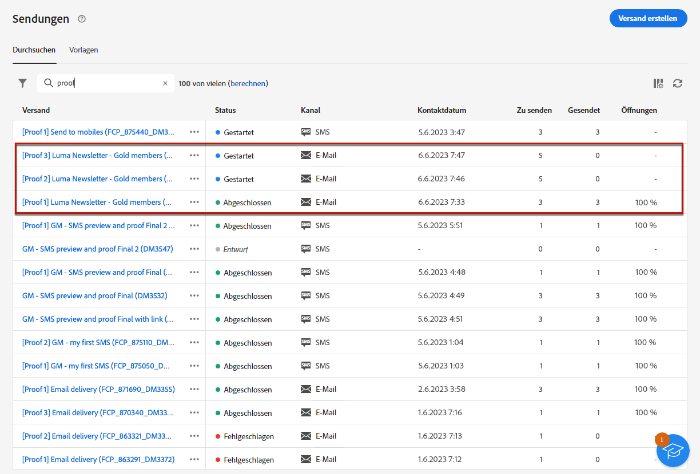

# Testsendungen durchführen {#send-test-deliveries}

**[!UICONTROL Adobe Campaign]** ermöglicht es Ihnen, eine Nachricht zu testen, bevor Sie sie an die Hauptzielgruppe senden.

Der Versand von Testsendungen ist ein wichtiger Schritt zur Validierung Ihrer Kampagne und zur Identifizierung potenzieller Probleme.

Die Testempfänger können verschiedene Elemente wie Links, Opt-out-Links, Bilder oder Mirrorseiten überprüfen und Fehler in Rendering, Inhalt, Personalisierungseinstellungen und Versandkonfiguration erkennen.

## Auswählen der Empfängerinnen und Empfänger des Testversands {#test-recipients}

Je nach verwendetem Kanal können Testnachrichten an drei Empfängertypen gesendet werden:

* [Testprofile](#test-profiles) - Senden **Test-E-Mails und SMS** Testadressen, die zusätzliche fiktive Empfänger in der Datenbank sind.

  Sie können im [!DNL Campaign] in die **[!UICONTROL Ressourcen]** > **[!UICONTROL Campaign Management]** > **[!UICONTROL Testadressen]** Ordner. Weitere Informationen finden Sie unter [Dokumentation zu Campaign v8 (Konsole)](https://experienceleague.adobe.com/docs/campaign/campaign-v8/audience/add-profiles/test-profiles.html){target="_blank"}

* [Ersatz aus Hauptzielgruppe](#substitution-profiles) - Senden **Test-E-Mails und SMS** auf eine bestimmte E-Mail-Adresse oder Telefonnummer zu setzen, während die Identität eines vorhandenen Profils übernommen wird.

  Auf diese Weise können Sie die Nachricht so erleben, wie es die Empfänger tun, und den Inhalt, den das Profil empfangen wird, präzise wiedergeben.

* [Abonnenten](#subscribers) - Senden **Test-Push-Benachrichtigungen** fiktiven Abonnenten, die zur Datenbank hinzugefügt wurden.

  Genau wie Testprofile können auch sie im [!DNL Campaign] in die **[!UICONTROL Ressourcen]** > **[!UICONTROL Campaign Management]** > **[!UICONTROL Testadressen]** Ordner. Weitere Informationen finden Sie unter [Dokumentation zu Campaign v8 (Konsole)](https://experienceleague.adobe.com/docs/campaign/campaign-v8/audience/add-profiles/test-profiles.html){target="_blank"}

Um die Empfänger eines Testversands auszuwählen, gehen Sie entsprechend dem gewünschten Profiltyp wie folgt vor:

### Testprofile {#test-profiles}

1. Navigieren Sie zum Bildschirm Inhalt bearbeiten Ihres E-Mail- oder SMS-Versands und klicken Sie auf die Schaltfläche **[!UICONTROL Inhalt simulieren]** Schaltfläche.

1. Klicken Sie auf **[!UICONTROL Test]** Schaltfläche.

   >[!NOTE]
   >
   >Wenn Sie bereits Profile in [Vorschau des Versands anzeigen](preview-content.md), werden sie im linken Bereich aufgelistet.

   

1. Aus dem **[!UICONTROL Modus]** Dropdown-Liste auswählen **Testprofile** , um fiktive Empfänger auszuwählen, die den Test-E-Mail- oder SMS-Versand erhalten.

1. Wenn Sie bereits Profile in [Vorschau der Nachricht erzeugen](preview-content.md) im Bildschirm der Inhaltsimulation werden diese Profile vorab als Testempfänger ausgewählt. Sie können Ihre Auswahl löschen und/oder zusätzliche Empfänger hinzufügen, indem Sie die **[!UICONTROL Hinzufügen von Testprofilen]** Schaltfläche.

   

   >[!NOTE]
   >
   >Standardmäßig wird die **[!UICONTROL Verwenden von Testprofilen]** ausgewählt ist.

1. Um die endgültige Nachricht auch an die Empfänger des Testversands zu senden, wählen Sie die Option **[!UICONTROL Testpopulation in die Hauptzielgruppe einbeziehen]** -Option.

1. Sobald die Testprofile ausgewählt sind, können Sie [Testversand durchführen](#send-test).

### Ersatzprofile {#substitution-profiles}

So senden Sie eine Test-E-Mail oder SMS an eine bestimmte E-Mail-Adresse oder Telefonnummer, während Daten aus einem vorhandenen Profil der [!DNL Campaign] -Datenbank verwenden Ersatzprofile.

1. Stellen Sie vor dem Versand eines Tests sicher, dass Sie eine Audience für Ihren Versand definieren. [Weitere Informationen](../audience/about-audiences.md)

1. Navigieren Sie zum Bildschirm Inhalt bearbeiten Ihres E-Mail- oder SMS-Versands und klicken Sie auf die Schaltfläche **[!UICONTROL Inhalt simulieren]** Schaltfläche.

1. Klicken Sie auf **[!UICONTROL Test]** Schaltfläche.

   >[!NOTE]
   >
   >Wenn Sie bereits Profile in [Vorschau des Versands anzeigen](preview-content.md), werden sie im linken Bereich aufgelistet.

   

1. Aus dem **[!UICONTROL Modus]** Dropdown-Liste auswählen **Ersatz aus Hauptzielgruppe** , um einen Test an eine bestimmte E-Mail-Adresse oder Telefonnummer zu senden und dabei Daten aus einem vorhandenen Profil anzuzeigen.

1. Klicken Sie auf **[!UICONTROL Adresse hinzufügen]** und geben Sie die E-Mail-Adresse oder Telefonnummer an, an die der Testversand gesendet werden soll.

   Sie können eine beliebige E-Mail-Adresse oder Telefonnummer eingeben. Auf diese Weise können Sie Testsendungen an beliebige Empfänger senden, auch wenn diese keine Benutzer von sind [!DNL Adobe Campaign].

1. Wählen Sie das Profil aus der Datenbank aus, das als Ersatz verwendet werden soll. Sie können auch [!DNL Adobe Campaign] Wählen Sie ein zufälliges Profil aus. Die Profildaten des ausgewählten Profils werden im Testversand angezeigt.

1. Bestätigen Sie den Empfänger und wiederholen Sie den Vorgang, um beliebig viele E-Mail-Adressen oder Telefonnummern hinzuzufügen.

   

1. Um die endgültige Nachricht auch an die Empfänger des Testversands zu senden, wählen Sie die Option **[!UICONTROL Testpopulation in die Hauptzielgruppe einbeziehen]** -Option.

1. Sobald die Ersatzprofile ausgewählt sind, können Sie [Testversand durchführen](#send-test).

### Abonnenten {#subscribers}

Beim Arbeiten mit Push-Benachrichtigungen können Testsendungen nur an Abonnenten gesendet werden. Gehen Sie wie folgt vor, um sie auszuwählen.

1. Navigieren Sie zum Bildschirm Inhalt bearbeiten Ihres Versands und klicken Sie auf die Schaltfläche **[!UICONTROL Inhalt simulieren]** Schaltfläche.

1. Klicken Sie auf **[!UICONTROL Test]** Schaltfläche.

   

1. Wenn Sie bereits Abonnenten ausgewählt haben [Versandvorschau](preview-content.md) im Bildschirm der Inhaltsimulation werden diese Profile vorab als Testabonnenten ausgewählt. Über die dedizierte Schaltfläche können Sie Ihre Auswahl löschen und/oder zusätzliche Abonnenten hinzufügen.

   

1. Um auch die endgültige Push-Benachrichtigung an die Testabonnenten zu senden, wählen Sie die **[!UICONTROL Testpopulation in die Hauptzielgruppe einbeziehen]** -Option.

1. Sobald die Abonnenten ausgewählt sind, können Sie [Testversand durchführen](#send-test).

## Testversand durchführen {#send-test}

Gehen Sie wie folgt vor, um den Testversand an die ausgewählten Empfänger zu senden.

1. Klicken Sie auf **[!UICONTROL Test senden]** Schaltfläche.

1. Bestätigen Sie den Versand.

   

1. Senden Sie so viele Tests wie nötig, bis Sie den Inhalt Ihres Versands fertig gestellt haben.

Danach können Sie Ihren Versand vorbereiten und an die Hauptzielgruppe senden. In den folgenden Abschnitten erfahren Sie mehr dazu:

* [E-Mail senden](../monitor/prepare-send.md)
* [Push-Benachrichtigung senden](../push/send-push.md#send-push)
* [SMS-Versand senden](../sms/send-sms.md#send-sms)

## Auf gesendete Testsendungen zugreifen {#access-proofs}

Sobald die Testsendungen gesendet wurden, können Sie über die **[!UICONTROL Testprotokoll anzeigen]** Schaltfläche.

Diese Protokolle ermöglichen den Zugriff auf alle für den ausgewählten Versand gesendeten Tests und die Visualisierung spezifischer Versandstatistiken. [Erfahren Sie, wie Sie Versandlogs überwachen](../monitor/delivery-logs.md)

Sie können auch über die [Versandliste](../msg/gs-messages.md), wie bei jedem Versand.

