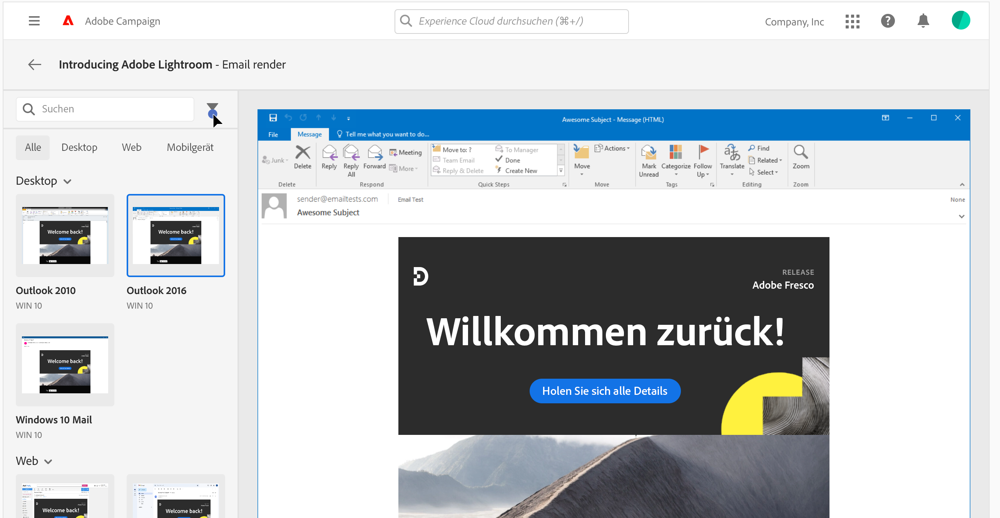

# Testen des E-Mail-Rendering {#rendering}

Vergewissern Sie sich vor dem Versand Ihrer E-Mail, dass Ihre Nachricht den Empfängern und Empfängerinnen auf einer Vielzahl von Webclients, Webmails und Geräten optimal angezeigt wird.

Zu diesem Zweck können Sie mit Adobe Campaign eine Vorschau der gesendeten Nachricht in den verschiedenen Kontexten anzeigen, in denen die Nachrichten empfangen werden, und die Kompatibilität mit den wichtigsten Desktops und Anwendungen (Webmail, Messaging-Dienst, Mobilgeräte usw.) überprüfen.

>[!CAUTION]
>
>Durch die Verwendung von E-Mail-Rendering in Campaign wird eine Test-E-Mail an ein Drittanbietersystem gesendet, das nicht unter der Kontrolle von Adobe steht. Um auf solche Daten zuzugreifen oder sie zu löschen, müssen Sie sich direkt an diesen Drittanbieter wenden. Durch die Verwendung von E-Mail-Rendering erkennen Sie an, dass Adobe für keine Daten verantwortlich ist, die Sie an dieses Drittanbietersystem senden können.

Gehen Sie wie folgt vor, um das E-Mail-Rendering zu testen:

1. Öffnen Sie den Bildschirm zur Erstellung des E-Mail-Inhalts und klicken Sie auf **[!UICONTROL Inhalt simulieren]**.

1. Klicken Sie auf die Schaltfläche **[!UICONTROL E-Mail rendern]**.

   Der linke Bereich bietet verschiedene Desktop-, Mobile- und Web-basierte E-Mail-Clients. Wählen Sie den gewünschten E-Mail-Client aus, um eine Vorschau Ihrer E-Mail im rechten Bereich anzuzeigen.

   

   >[!NOTE]
   >
   >In der Liste der E-Mail-Clients sind die wichtigsten E-Mail-Clients aufgeführt. Zusätzliche E-Mail-Clients sind über die Filterschaltfläche neben der oberen Suchleiste verfügbar.

