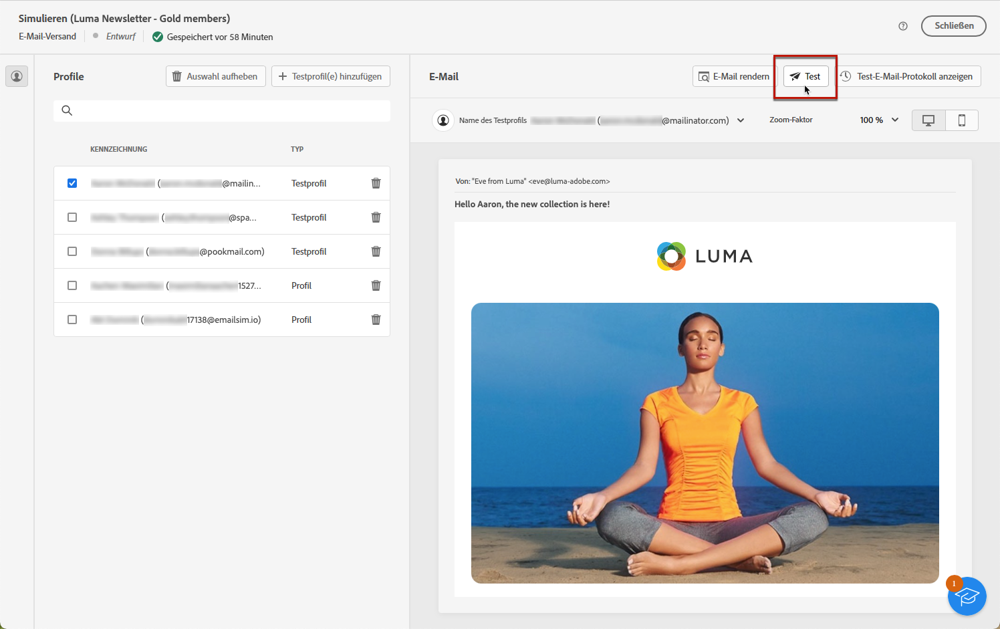
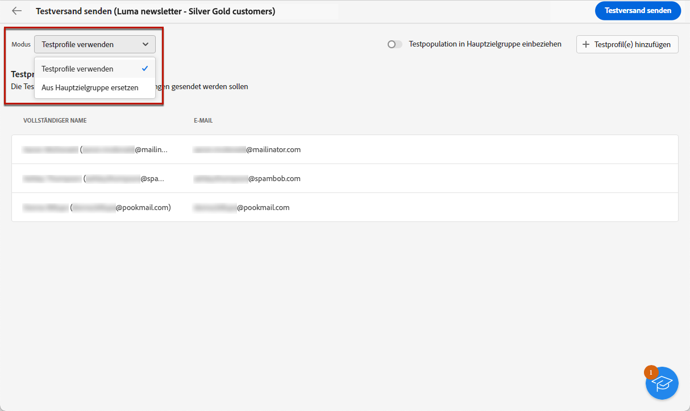
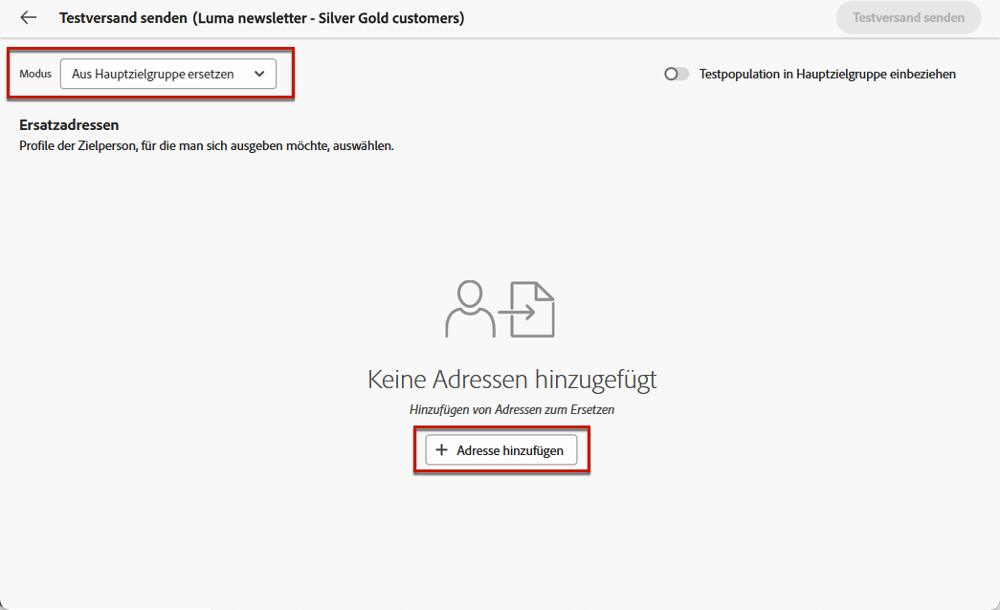
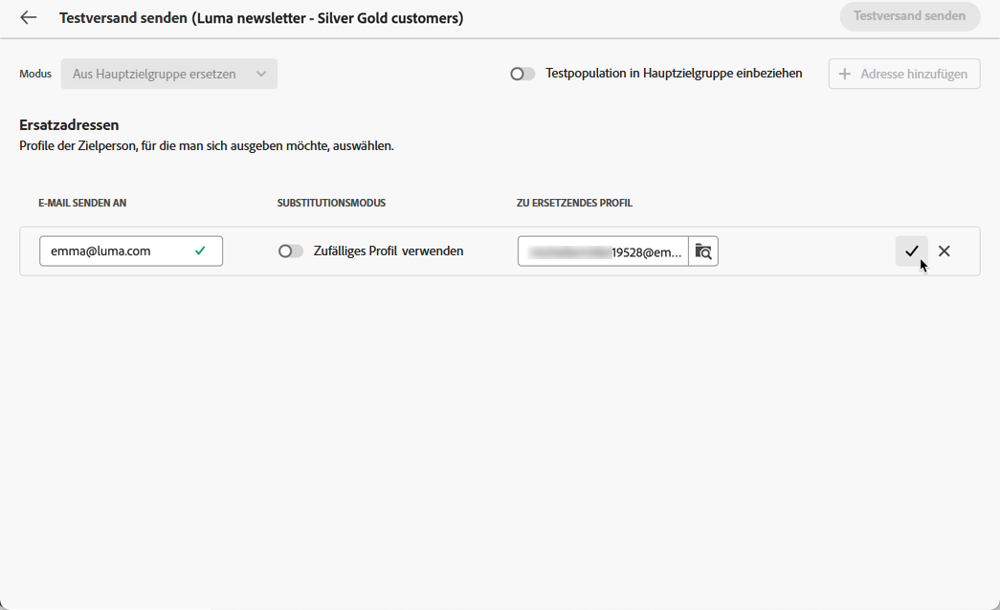
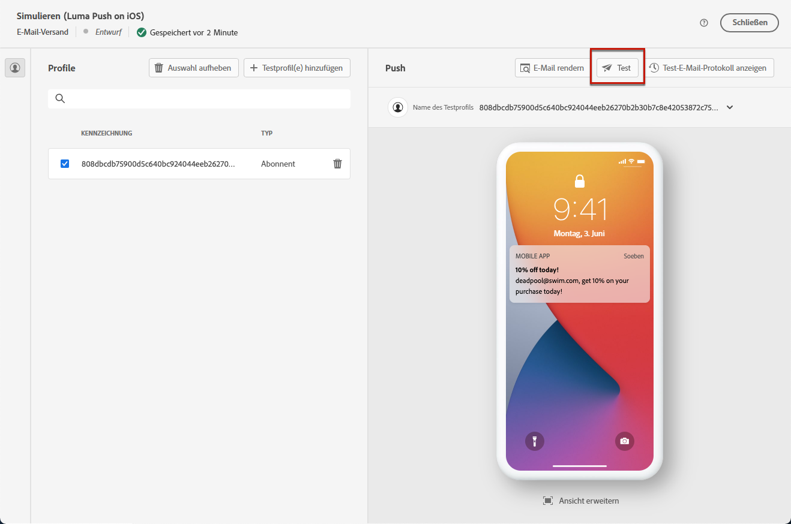
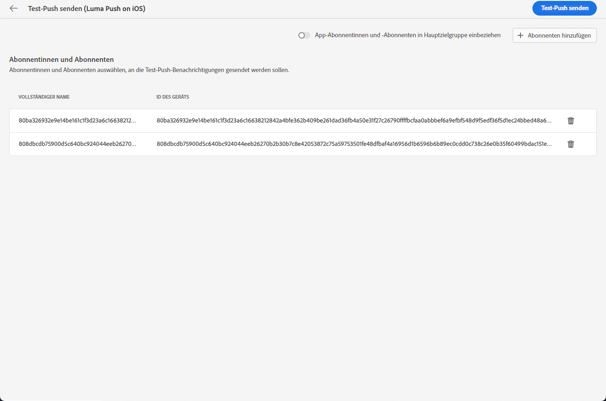
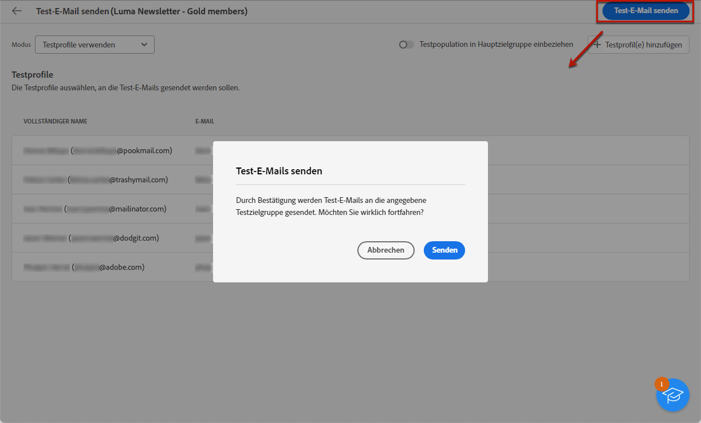
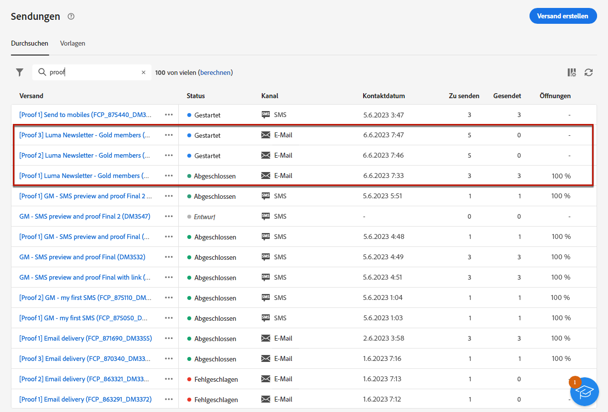

# Durchführen von Testsendungen {#send-test-deliveries}

>[!CONTEXTUALHELP]
>id="acw_email_preview_mode"
>title="Vorschaumodus"
>abstract="Erstellen Sie eine Vorschau und testen Sie die Nachricht, indem Sie die Testpopulation zur Hauptzielgruppe hinzufügen."

Nachdem der Nachrichteninhalt definiert wurde, können Sie ihn in der Vorschau ansehen und testen, indem Sie Testsendungen (auch Testsendungen genannt) durchführen. &#39;proofs&#39;), um Profile zu testen. Wenn Sie personalisierte Inhalte eingefügt haben, können Sie mithilfe von Testprofildaten überprüfen, wie diese Inhalte in der Nachricht angezeigt werden.

Um mögliche Fehler im Nachrichteninhalt oder in den Personalisierungseinstellungen zu erkennen, senden Sie Testnachrichten an Testprofile, bevor Sie sie an die Zielgruppe senden. Bei jeder Änderung sollte eine Testnachricht gesendet werden, um den neuesten Inhalt zu validieren. Testsendungen (früher als „Testversand“ bezeichnet) sind ein wichtiger Schritt bei der Validierung Ihrer Kampagne und Identifizierung potenzieller Probleme. Die Empfänger einer Testnachricht können verschiedene Elemente wie Links, Opt-out-Links, Bilder oder Mirrorseiten prüfen sowie Fehler in Rendering, Inhalt, Personalisierungseinstellungen und Versandkonfiguration erkennen.

## Auswählen der Empfängerinnen und Empfänger des Tests {#test-recipients}

>[!CONTEXTUALHELP]
>id="acw_email_preview_option_test_target"
>title="Testpopulation"
>abstract="Wählen Sie einen Testpopulationsmodus aus."

Je nach verwendetem Kanal können Testnachrichten an drei Empfängertypen gesendet werden:

* [Testprofile](#test-profiles): Senden von **Test-E-Mails und Test-SMS** an Testadressen, bei denen es sich um zusätzliche Empfängerinnen und Empfänger in der Datenbank handelt. Diese können in der [!DNL Campaign]-Konsole im Ordner **[!UICONTROL Ressourcen]** > **[!UICONTROL Kampagnen-Management]** > **[!UICONTROL Testadressen]** erstellt werden. Weitere Informationen finden Sie in der [Dokumentation zu Campaign v8 (Client-Konsole)](https://experienceleague.adobe.com/docs/campaign/campaign-v8/audience/add-profiles/test-profiles.html?lang=de){target="_blank"}

* [Aus Hauptzielgruppe ersetzen](#substitution-profiles): Senden von **Test-E-Mails und Test-SMS** an eine bestimmte E-Mail-Adresse oder Telefonnummer, wobei die Identität eines vorhandenen Profils angenommen wird. Auf diese Weise wird Ihnen die Nachricht so wie Ihren Empfängerinnen und Empfängern angezeigt. Sie erhalten so eine genaue Darstellung des Inhalts, den das Profil empfangen wird.

* [Abonnentinnen und Abonnenten](#subscribers): Senden von **Test-Push-Benachrichtigungen** an fiktive Abonnentinnen oder Abonnenten, die zur Datenbank hinzugefügt wurden. Sie können wie Testprofile in der [!DNL Campaign]-Konsole im Ordner **[!UICONTROL Ressourcen]** > **[!UICONTROL Kampagnen-Management]** > **[!UICONTROL Testadressen]** erstellt werden. Weitere Informationen finden Sie in der [Dokumentation zu Campaign v8 (Client-Konsole)](https://experienceleague.adobe.com/docs/campaign/campaign-v8/audience/add-profiles/test-profiles.html?lang=de){target="_blank"}

Um die Empfängerinnen und Empfänger für einen Testversand auszuwählen, gehen Sie entsprechend dem gewünschten Profiltyp wie folgt vor:

### Testprofile {#test-profiles}

>[!CONTEXTUALHELP]
>id="acw_deliveries_simulate_test_mode"
>title="Testversand-Zielgruppe"
>abstract="Sie können eine zweite Datei als „Testversand-Zielgruppe“ hochladen, wenn Sie Ihren Versand testen möchten, bevor Sie ihn an die Hauptzielgruppe senden."

>[!CONTEXTUALHELP]
>id="acw_deliveries_simulate_test_upload"
>title="Profile hochladen"
>abstract="Sie können eine zweite Datei mit zusätzlichen Profilen hochladen, wenn Sie Ihren Versand mit einem anderen Satz als dem für die Hauptzielgruppe verwendeten testen möchten."

>[!CONTEXTUALHELP]
>id="acw_deliveries_simulate_test_sample"
>title="Vorlagendatei"
>abstract="Hinweis: Die Formatierung der Datei muss mit der Originaldatei übereinstimmen. Unterstützte Dateiformate: txt, csv. Maximale Dateigröße: 15 MB. Verwenden Sie die erste Zeile für Spaltentitel."

Testprofile sind Testadressen, also zusätzliche Empfänger in der Datenbank. Sie können im [!DNL Adobe Campaign] Client-Konsole in **[!UICONTROL Ressourcen]** > **[!UICONTROL Campaign Management]** > **[!UICONTROL Testadressen]** Ordner. Die Schritte zum Senden von Testnachrichten an Testadressen werden nachfolgend beschrieben.

1. Navigieren Sie zum Bildschirm „Inhalt bearbeiten“ für den E-Mail- oder SMS-Versand und klicken Sie dann auf die Schaltfläche **[!UICONTROL Inhalt simulieren]**.

1. Klicken Sie auf die Schaltfläche **[!UICONTROL Test]**.

   >[!NOTE]
   >
   >Wenn Sie bereits Profile für eine [Versandvorschau](preview-content.md) ausgewählt haben, werden diese im linken Bereich aufgelistet.

   

1. Wählen Sie aus der Dropdown-Liste **[!UICONTROL Modus]** die Option **[!UICONTROL Testprofile]** aus, um fiktive Empfängerinnen und Empfänger für den E-Mail- oder SMS-Testversand auszuwählen.

   

1. Wenn Sie bereits Profile ausgewählt haben, um eine [Vorschau der Nachricht](preview-content.md) im Bildschirm zur Inhaltsimulation anzuzeigen, werden diese Profile als Testempfängerinnen und Testempfänger vorausgewählt. Sie können Ihre Auswahl löschen und/oder zusätzliche Empfängerinnen und Empfänger über die Schaltfläche **[!UICONTROL Testprofil(e) hinzufügen]** hinzufügen.

   >[!NOTE]
   >
   >Standardmäßig ist der Modus **[!UICONTROL Testprofile verwenden]** ausgewählt.

1. Um die endgültige Nachricht auch an die Empfängerinnen und Empfänger des Testversands zu senden, wählen Sie die Option **[!UICONTROL Testpopulation in Hauptzielgruppe einbeziehen]** aus.

1. Sobald die Testprofile ausgewählt sind, können Sie den [Testversand durchführen](#send-test).

### Ersatzprofile {#substitution-profiles}

So senden Sie eine Test-E-Mail oder SMS an eine bestimmte E-Mail-Adresse oder Telefonnummer, während Daten aus einem vorhandenen Profil der [!DNL Adobe Campaign] -Datenbank verwenden Ersatzprofile, wie unten beschrieben:

1. Stellen Sie vor einem Testversand sicher, dass Sie eine Zielgruppe für den Versand definieren. [Weitere Informationen](../audience/about-recipients.md)

1. Navigieren Sie zum Bildschirm „Inhalt bearbeiten“ für den E-Mail- oder SMS-Versand und klicken Sie dann auf die Schaltfläche **[!UICONTROL Inhalt simulieren]**.

1. Klicken Sie auf die Schaltfläche **[!UICONTROL Test]**.

   

1. Wählen Sie aus der Dropdown-Liste **[!UICONTROL Modus]** die Option **[!UICONTROL Aus Hauptzielgruppe ersetzen]** aus, um einen Test an eine bestimmte E-Mail-Adresse oder Telefonnummer zu senden und dabei Daten aus einem vorhandenen Profil anzuzeigen.

   >[!CAUTION]
   >
   >Wenn Sie keine [Zielgruppe](../audience/about-recipients.md) für den Versand ausgewählt haben, ist die Option **[!UICONTROL Aus Hauptzielgruppe ersetzen]** ausgegraut und Sie können keine Ersatzprofile auswählen.

1. Klicken Sie auf die Schaltfläche **[!UICONTROL Adresse hinzufügen]** und geben Sie die empfangende E-Mail-Adresse oder Telefonnummer für den Testversand an.

   

   >[!NOTE]
   >
   >Sie können eine beliebige E-Mail-Adresse oder Telefonnummer eingeben. Damit können Sie Testsendungen an beliebige Empfängerinnen und Empfänger senden, auch wenn diese keine Benutzerinnen und Benutzer von [!DNL Adobe Campaign] sind.

1. Wählen Sie das Profil aus der Zielgruppe aus, die Sie für den Versand als Ersatz definiert haben. Sie können auch [!DNL Adobe Campaign] ein zufälliges Profil aus der Zielgruppe auswählen lassen. Die Profildaten aus dem ausgewählten Profil werden beim Testversand angezeigt.

1. Bestätigen Sie die Empfängerin oder den Empfänger und wiederholen Sie den Vorgang, um beliebig viele E-Mail-Adressen oder Telefonnummern hinzuzufügen.

   

1. Um die endgültige Nachricht auch an die Empfängerinnen und Empfänger des Testversands zu senden, wählen Sie die Option **[!UICONTROL Testpopulation in Hauptzielgruppe einbeziehen]** aus.

1. Sobald die Ersatzprofile ausgewählt sind, können Sie den [Testversand durchführen](#send-test).

### Abonnentinnen und Abonnenten {#subscribers}

Beim Arbeiten mit Push-Benachrichtigungen können Testsendungen nur an Ihre App-Abonnenten gesendet werden. Gehen Sie wie folgt vor, um diese auszuwählen.

1. Navigieren Sie zum Bildschirm „Inhalt bearbeiten“ für den Versand und klicken Sie dann auf die Schaltfläche **[!UICONTROL Inhalt simulieren]**.

1. Klicken Sie auf die Schaltfläche **[!UICONTROL Test]**.

   

1. Wenn Sie bereits Abonnentinnen oder Abonnenten ausgewählt haben, um eine [orschau des Versands](preview-content.md) im Bildschirm zur Inhaltsimulation anzuzeigen, werden diese Profile als Testabonnentinnen oder Testabonnenten vorausgewählt.

   Über die dedizierte Schaltfläche können Sie Ihre Auswahl löschen und/oder zusätzliche Abonnentinnen oder Abonnenten hinzufügen.

   

1. Um die endgültige Push-Benachrichtigung auch an die Testabonnentinnen oder Testabonnenten zu senden, wählen Sie die Option **[!UICONTROL Testpopulation in Hauptzielgruppe einbeziehen]** aus.

1. Sobald die Abonnentinnen oder Abonnenten ausgewählt sind, können Sie den [Testversand durchführen](#send-test).

## Durchführen des Testversands {#send-test}

Gehen Sie wie folgt vor, um den Testversand an die ausgewählten Empfängerinnen und Empfänger durchzuführen.

1. Klicken Sie auf die Schaltfläche **[!UICONTROL Test senden]**.

1. Bestätigen Sie das Senden.

   

1. Senden Sie so viele Tests wie nötig, bis Sie die endgültigen Inhalte für Ihren Versand festgelegt haben.

Anschließend können Sie den Versand an die Hauptzielgruppe vorbereiten und durchführen. In den folgenden Abschnitten erfahren Sie mehr dazu:

* [Senden der E-Mail](../monitor/prepare-send.md)
* [Senden der Push-Benachrichtigung](../push/send-push.md#send-push)
* [Senden Ihres SMS-Versands](../sms/send-sms.md#send-sms)

## Zugreifen auf durchgeführte Testsendungen {#access-proofs}

Nach den Testsendungen können Sie über die Schaltfläche **[!UICONTROL Testprotokoll anzeigen]** auf spezifische Protokolle zugreifen.

Diese Protokolle ermöglichen den Zugriff auf alle gesendeten Tests für den ausgewählten Versand sowie die Visualisierung bestimmter Versandstatistiken. [Erfahren Sie, wie Sie Versandlogs überwachen](../monitor/delivery-logs.md)

Wie bei jedem Versand können Sie auch über die [Sendungsliste](../msg/gs-messages.md) auf gesendete Tests zugreifen.

