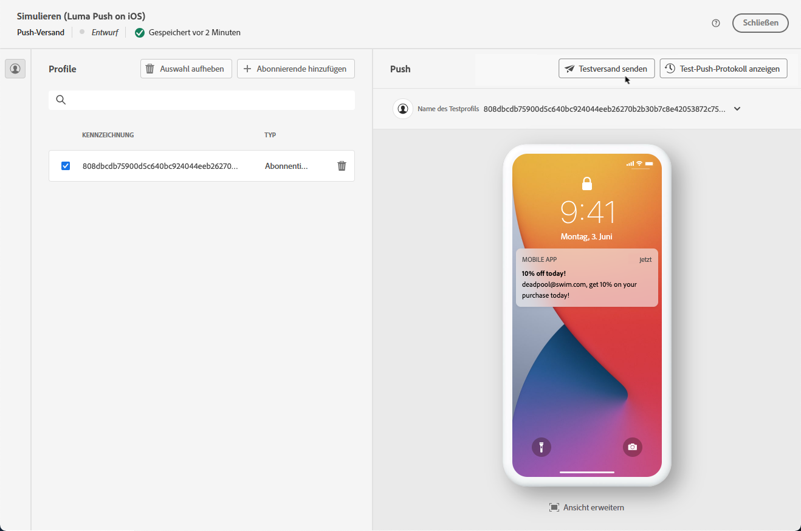
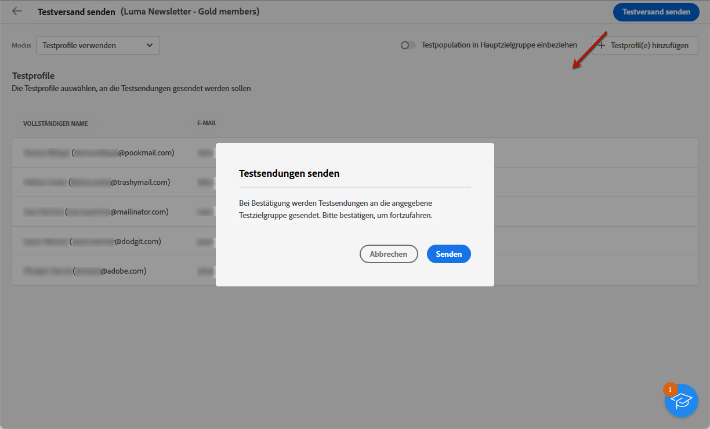

# Durchführen von Testsendungen {#send-test-deliveries}

>[!CONTEXTUALHELP]
>id="acw_email_preview_mode"
>title="Vorschaumodus"
>abstract="Erstellen Sie eine Vorschau und testen Sie die Nachricht, indem Sie die Testpopulation zur Hauptzielgruppe hinzufügen."

Sobald der Nachrichteninhalt definiert ist, können Sie ihn in der Vorschau anzeigen und testen, indem Sie Testsendungen an Testprofile senden. Wenn Sie personalisierte Inhalte eingefügt haben, können Sie mithilfe von Testprofildaten überprüfen, wie diese Inhalte in der Nachricht angezeigt werden.

Um mögliche Fehler im Nachrichteninhalt oder in den Personalisierungseinstellungen zu erkennen, führen Sie Testsendungen an Testprofile durch, bevor Sie sie an die Zielgruppe senden. Bei jeder Änderung sollte ein Testversand durchgeführt werden, um den aktuellen Inhalt zu validieren. Der Versand von Testsendungen ist ein wichtiger Schritt zur Validierung Ihrer Kampagne und zur Identifizierung potenzieller Probleme. Die Testversand-Empfänger können verschiedene Elemente wie Links, Opt-out-Links, Bilder oder Mirrorseiten überprüfen sowie Fehler in Rendering, Inhalt, Personalisierungseinstellungen und Versandkonfiguration erkennen.

## Simulieren von Inhalten mit Testprofilen {#simulate-content-test-deliveries}

>[!CONTEXTUALHELP]
>id="acw_email_preview_option_test_target"
>title="Testpopulation"
>abstract="Wählen Sie einen Testpopulationsmodus aus."

Bevor Sie einen Testversand durchführen, stellen Sie sicher, dass Sie eine Zielgruppe für Ihren Versand definieren. [Weitere Informationen](../audience/add-audience.md)

So testen Sie Ihre Nachrichteninhalte:

1. Bearbeiten Sie den Inhalt Ihres Versands.
1. Klicken Sie auf die Schaltfläche **[!UICONTROL Inhalt simulieren]**.
1. Klicken Sie auf die Schaltfläche **[!UICONTROL Testsendung durchführen]**, um eine Testsendung durchzuführen.

   {zoomable="yes"}

1. Wählen Sie Ihre Testsendungsempfangenden aus.

   Je nach Nachrichtenkanal kann ein Testversand an die folgenden Empfängertypen gesendet werden:

   * Für SMS und E-Mails können Sie [Testprofile](#test-profiles) verwenden, die bestimmte zusätzliche Empfangende in der Datenbank sind. Sie können auch den Modus [Ersatz durch Hauptzielgruppe](#substitution-profiles) verwenden, der den Testversand an eine E-Mail-Testadresse oder Telefonnummer sendet und Personalisierungsdaten eines vorhandenen Profils verwendet. Auf diese Weise wird Ihnen die Nachricht so wie Ihren Empfängerinnen und Empfängern angezeigt. Sie erhalten so eine genaue Darstellung des Inhalts, den das Profil empfangen wird.

   * Für Push-Nachrichten können Sie [Abonnenten](#subscribers) verwenden: fiktive Abonnentinnen und Abonnenten, die zur Datenbank hinzugefügt werden. Sie werden in der [!DNL Campaign]-Konsole angezeigt. Weitere Informationen finden Sie in der [Dokumentation zu Campaign v8 (Client-Konsole)](https://experienceleague.adobe.com/docs/campaign/campaign-v8/audience/add-profiles/test-profiles.html?lang=de){target="_blank"}

   Eine detaillierte Konfiguration für jeden Modus finden Sie unten.

## Verwenden von Testprofilen {#test-profiles}

>[!CONTEXTUALHELP]
>id="acw_deliveries_simulate_test_mode"
>title="Testversand-Zielgruppe"
>abstract="Sie können eine zweite Datei als „Testversand-Zielgruppe“ hochladen, wenn Sie Ihren Versand testen möchten, bevor Sie ihn an die Hauptzielgruppe senden."

>[!CONTEXTUALHELP]
>id="acw_deliveries_simulate_test_upload"
>title="Profile hochladen"
>abstract="Sie können eine zweite Datei mit zusätzlichen Profilen hochladen, wenn Sie Ihren Versand mit einem anderen Satz als dem für die Hauptzielgruppe verwendeten testen möchten."

>[!CONTEXTUALHELP]
>id="acw_deliveries_simulate_test_sample"
>title="Vorlagendatei"
>abstract="Hinweis: Die Formatierung der Datei muss mit der Originaldatei übereinstimmen. Unterstützte Dateiformate: txt, csv. Maximale Dateigröße: 15 MB. Erste Zeile für Spaltentitel verwenden."

>[!CONTEXTUALHELP]
>id="acw_sms_preview_option_app_target"
>title="Testprofile in Hauptzielgruppe einbeziehen"
>abstract="Aktivieren Sie diese Option, um die endgültige Nachricht auch an die Empfangenden der Testsendung zu senden."

Testprofile sind zusätzliche Empfängerinnen und Empfänger in der Datenbank. Sie können über das Menü **[!UICONTROL Kunden-Management]** > **[!UICONTROL Profile]** erstellt werden. [Weitere Informationen](../audience/test-profiles.md#create-test-profiles)

Die Schritte zum Senden von Testsendungen an Testprofile werden nachfolgend beschrieben.

1. Klicken Sie im Versandinhalt auf die Schaltfläche **[!UICONTROL Inhalt simulieren]** und dann auf **[!UICONTROL Testsendung durchführen]**.

1. Wählen Sie aus der Dropdown-Liste **[!UICONTROL Modus]** die Option **[!UICONTROL Testprofile]** aus, um fiktive Empfangende für die Testsendung oder den SMS-Versand auszuwählen.

   {zoomable="yes"}

1. Wenn Sie bereits Profile ausgewählt haben, um eine [Vorschau der Nachricht](preview-content.md) im Bildschirm zur Inhaltsimulation anzuzeigen, werden diese Profile als Empfangende von Testsendungen vorausgewählt. Sie können Ihre Auswahl löschen und/oder zusätzliche Empfangende über die Schaltfläche **[!UICONTROL Testprofil(e) hinzufügen]** hinzufügen.

1. Beim Durchsuchen der Testprofile oder Profillisten können Sie Filter verwenden, um Ihre Suche zu verfeinern. Sie können beispielsweise eine Regel definieren, um alle Testprofile mit dem Status **[!UICONTROL Interessent]** zu finden. Erfahren Sie, wie Sie Regeln mithilfe des [Abfrage-Modelers](../query/query-modeler-overview.md) hinzufügen.

   {zoomable="yes"}

1. Um die endgültige Nachricht auch an die Empfängerinnen und Empfänger der Testsendung zu verschicken, wählen Sie die Option **[!UICONTROL Testpopulation in Hauptzielgruppe einbeziehen]**.

   {zoomable="yes"}

1. Wenn die Testprofile ausgewählt sind, können Sie die [Testsendung durchführen](#send-test).

## Ersetzen von Profildaten {#substitution-profiles}

Verwenden Sie die Profilersetzung, um Testsendungen an eine bestimmte E-Mail-Adresse bzw. Telefonnummer zu senden und dabei Daten aus einem vorhandenen Profil der [!DNL Adobe Campaign]-Datenbank anzuzeigen. Dieser Modus kann nur ausgewählt werden, wenn die Zielgruppe des Versands definiert ist.

Gehen Sie wie folgt vor, um Profildaten aus der Hauptzielgruppe zu ersetzen:

1. Klicken Sie im Versandinhalt auf die Schaltfläche **[!UICONTROL Inhalt simulieren]** und dann auf **[!UICONTROL Testsendung durchführen]**.

1. Wählen Sie in der Dropdown-Liste **[!UICONTROL Modus]** die Option **[!UICONTROL Aus Hauptzielgruppe ersetzen]**, um eine Testsendung an eine bestimmte E-Mail-Adresse oder Telefonnummer zu senden und gleichzeitig Daten aus einem vorhandenen Profil anzuzeigen.

   >[!CAUTION]
   >
   >Wenn Sie kein [Zielgruppe](../audience/about-recipients.md) für den Versand ausgewählt haben, ist die Option **[!UICONTROL Von Hauptzielgruppe ersetzen]** ausgegraut und Sie können keine Ersatzprofile auswählen.

1. Klicken Sie auf die Schaltfläche **[!UICONTROL Adresse hinzufügen]** und geben Sie die empfangende E-Mail-Adresse oder Telefonnummer für die Testsendung an.

   {zoomable="yes"}

   >[!NOTE]
   >
   >Sie können eine beliebige E-Mail-Adresse oder Telefonnummer eingeben. So können Sie Testsendungen an beliebige Empfangende senden, auch wenn es sich bei diesen um keine [!DNL Adobe Campaign]-Benutzende handelt.

1. Wählen Sie das Profil aus der Zielgruppe aus, die Sie für den Versand als Ersatz definiert haben. Sie können auch [!DNL Adobe Campaign] ein zufälliges Profil aus der Zielgruppe auswählen lassen. Die Profildaten aus dem ausgewählten Profil werden bei der Testsendung angezeigt.

1. Bestätigen Sie die Empfängerin bzw. den Empfänger und wiederholen Sie den Vorgang, um beliebig viele E-Mail-Adressen oder Telefonnummern hinzuzufügen.

   {zoomable="yes"}

1. Um die endgültige Nachricht auch an die Empfängerinnen und Empfänger der Testsendung zu verschicken, wählen Sie die Option **[!UICONTROL Testpopulation in Hauptzielgruppe einbeziehen]**.

1. Sobald die Ersatzprofile ausgewählt sind, können Sie die [Testsendung durchführen](#send-test).

## Testsendungen an App-Abonnierende senden {#subscribers}

Beim Entwerfen mit Push-Benachrichtigungen können Testsendungen nur an App-Abonnenten durchgeführt werden. Gehen Sie wie folgt vor, um diese auszuwählen.

1. Klicken Sie im Inhalt Ihres Push-Versands auf die Schaltfläche **[!UICONTROL Inhalt simulieren]** und dann auf **[!UICONTROL Testsendung durchführen]**.

   {zoomable="yes"}

1. Wenn Sie bereits Abonnentinnen oder Abonnenten ausgewählt haben, um eine [orschau des Versands](preview-content.md) im Bildschirm zur Inhaltsimulation anzuzeigen, werden diese Profile als Testabonnentinnen oder Testabonnenten vorausgewählt.

   Über die dedizierte Schaltfläche können Sie Ihre Auswahl löschen und/oder zusätzliche Abonnentinnen oder Abonnenten hinzufügen.

   {zoomable="yes"}

1. Um die endgültige Push-Benachrichtigung auch an die Testabonnentinnen und -abonnenten zu senden, wählen Sie die Option **[!UICONTROL Testpopulation in Hauptzielgruppe einbeziehen]**.

1. Sobald die Abonnierenden ausgewählt sind, können Sie die [Testsendung durchführen](#send-test).

## Durchführen des Testversands {#send-test}

Gehen Sie wie folgt vor, um die Testsendung an die ausgewählten Empfangenden zu senden.

1. Klicken Sie auf die Schaltfläche **[!UICONTROL Testsendung durchführen]**.

1. Bestätigen Sie den Versand.

   {zoomable="yes"}

1. Senden Sie so viele Testsendungen wie nötig, bis Sie den Inhalt Ihres Versands abgeschlossen haben.

Anschließend können Sie den Versand an die Hauptzielgruppe vorbereiten und durchführen. In den folgenden Abschnitten erfahren Sie mehr dazu:

* [Senden der E-Mail](../monitor/prepare-send.md)
* [Senden der Push-Benachrichtigung](../push/send-push.md#send-push)
* [Senden Ihres SMS-Versands](../sms/send-sms.md#send-sms)

## Zugreifen auf Testsendungen {#access-test-deliveries}

Sobald die Testsendungen gesendet wurden, können Sie auf deren Protokolle über den Bildschirm **[!UICONTROL Inhalt simulieren]** zugreifen.

Diese Protokolle ermöglichen den Zugriff auf alle Testsendungen für den ausgewählten Versand und die Visualisierung bestimmter Versandstatistiken. [Informationen zum Überwachen von Versand-Logs](../monitor/delivery-logs.md)

{zoomable="yes"}

Wie bei jedem Versand können Sie auf gesendete Testsendungen auch über die [Versandliste](../msg/gs-messages.md) zugreifen.

{zoomable="yes"}