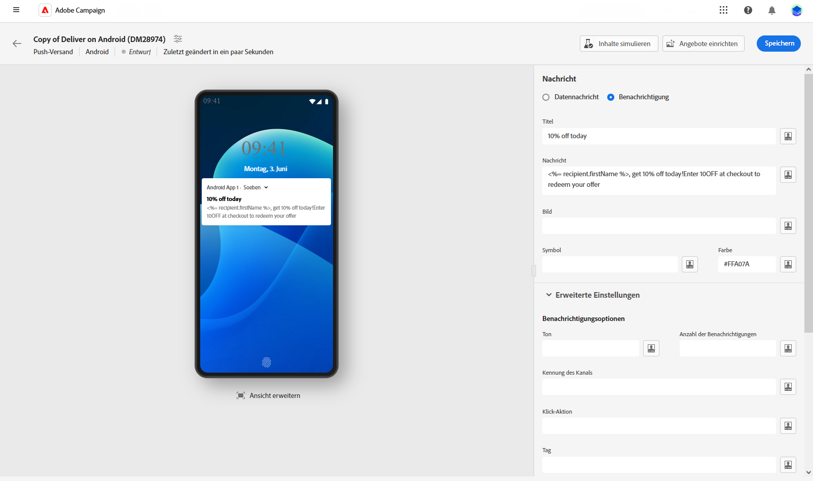
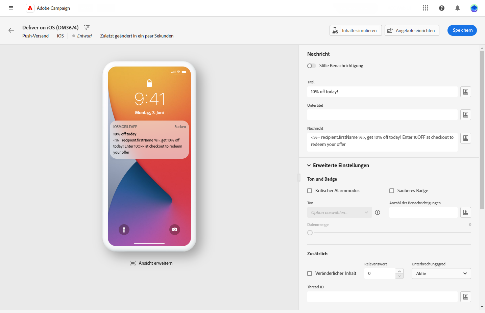
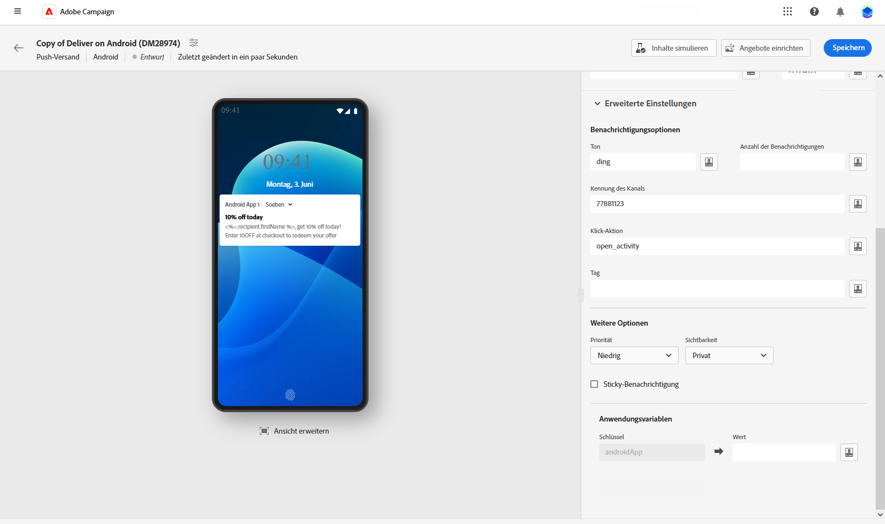
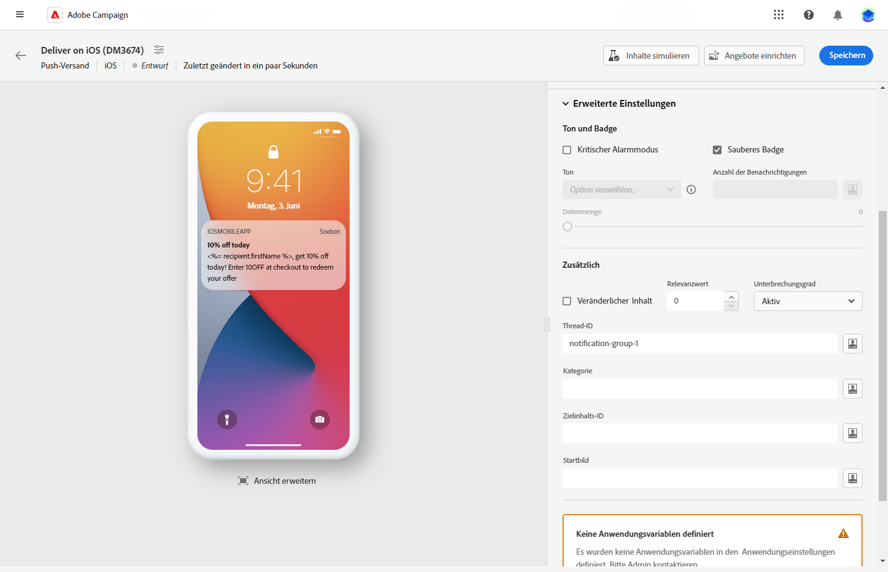

# Erstellen eines Pushnachrichten-Versands {#content-push}

>[!CONTEXTUALHELP]
>id="acw_deliveries_push_android_content"
>title="Pushen von Android-Inhalten"
>abstract="Definieren Sie den Push-Inhalt für Android."

>[!CONTEXTUALHELP]
>id="acw_deliveries_push_ios_content"
>title="Pushen von iOS-Inhalten"
>abstract="Definieren Sie den Push-Inhalt für iOS."

## Festlegen des Inhalts der Benachrichtigung {#push-message}

>[!CONTEXTUALHELP]
>id="acw_deliveries_push_ios_msg"
>title="Push-Nachricht für iOS"
>abstract="Legen Sie den Titel und den Inhalt Ihrer Push-Nachricht für iOS fest. Verwenden Sie den Personalisierungsdialog, um Inhalte zu personalisieren und Bedingungen hinzuzufügen."

>[!CONTEXTUALHELP]
>id="acw_deliveries_push_ios_silent"
>title="Stille Benachrichtigung für iOS"
>abstract="Im Modus „Stilles Pushen“ kann eine „stille“ Benachrichtigung an eine Mobile App gesendet werden. Dem Benutzer wird das Eintreffen der Benachrichtigung nicht mitgeteilt. Sie wird direkt an die Mobile App übertragen."

>[!BEGINTABS]

>[!TAB Android]

Bei Firebase Cloud Messaging stehen Ihnen zwei Nachrichtentypen zur Auswahl:

* Die **[!UICONTROL Datenmeldung]** wird von der Client-App verarbeitet. Diese Meldungen werden direkt an die App gesendet, die auf dem Gerät eine Android-Benachrichtigung generiert und anzeigt. Datennachrichten enthalten nur die von Ihnen definierten Anwendungsvariablen.

  Um den Inhalt zu definieren, Daten zu personalisieren und dynamische Inhalte hinzuzufügen, klicken Sie auf das Feld **[!UICONTROL Nachricht]** und verwenden Sie den Ausdruckseditor. Sie können auf diesen Editor zugreifen, um Nachrichten anzupassen.
Im Menü **[!UICONTROL Anwendungsvariablen]** werden Ihre Anwendungsvariablen automatisch hinzugefügt. Mit diesen Variablen können Sie das Verhalten von Benachrichtigungen definieren. Sie können beispielsweise einen bestimmten Anwendungsbildschirm konfigurieren, der angezeigt wird, wenn die Benutzerin bzw. der Benutzer die Benachrichtigung aktiviert.

  

* Die **[!UICONTROL Benachrichtigungsmeldung]** wird automatisch vom FCM SDK verarbeitet. FCM übernimmt für die Client-App automatisch das Anzeigen der Nachricht auf den Geräten Ihrer Benutzenden. Benachrichtigungsmeldungen enthalten einen vordefinierten Satz von Parametern und Optionen, können aber mit benutzerspezifischen Anwendungsvariablen weiter personalisiert werden.

  Um Ihre Nachricht zu verfassen, klicken Sie auf die Felder **[!UICONTROL Titel]** und **[!UICONTROL Nachricht]**. Verwenden Sie den Ausdruckseditor, um Inhalte zu definieren, Daten zu personalisieren und dynamische Inhalte hinzuzufügen.

  Push-Benachrichtigungen können weiter personalisiert werden. Dazu können Sie ein Bild auswählen, das der Push-Benachrichtigung hinzugefügt werden soll, sowie das Symbol der Benachrichtigung, das auf den Geräten der Profile angezeigt werden soll, und ihre Farbe.

  

>[!TAB iOS]

Um Ihre Nachricht zu verfassen, klicken Sie auf die Felder **[!UICONTROL Titel]** und **[!UICONTROL Nachricht]**. Verwenden Sie den Ausdruckseditor, um Inhalte zu definieren, Daten zu personalisieren und dynamische Inhalte hinzuzufügen.

Sie können einen **[!UICONTROL Untertitel]** als Wert des Parameters „subtitle“ der iOS-Benachrichtigungs-Payload hinzufügen. Weitere Informationen finden Sie in diesem Abschnitt.

Im Modus „Stilles Pushen“ kann eine „stille“ Benachrichtigung an eine Mobile App gesendet werden. Dem Benutzer wird das Eintreffen der Benachrichtigung nicht mitgeteilt. Sie wird direkt an die Mobile App übertragen.

>[!ENDTABS]

## Erweiterte Einstellungen für Push-Benachrichtigungen {#push-advanced}

>[!CONTEXTUALHELP]
>id="acw_deliveries_push_advanced_settings"
>title="Erweiterte Einstellungen für Push-Benachrichtigungen"
>abstract="Definieren Sie erweiterte Einstellungen für Ihre Push-Benachrichtigung, z. B. ihre Priorität, die zugehörige Anzahl an Benachrichtigungen, Anwendungsvariablen und mehr."

>[!CONTEXTUALHELP]
>id="acw_deliveries_push_advanced_settings_critical"
>title="Kritischer Alarmmodus für iOS"
>abstract="Aktivieren Sie diese Option, um Ihrer Benachrichtigung einen Ton hinzuzufügen, selbst wenn das Handy der Person auf den Fokusmodus festgelegt oder das Gerät stummgeschaltet ist. Dadurch wird sichergestellt, dass Benutzende jederzeit über wichtige Warnhinweise informiert werden."

>[!CONTEXTUALHELP]
>id="acw_deliveries_push_advanced_settings_count"
>title="Badge-Nummer für iOS"
>abstract="Verwenden Sie diese Option, damit die Zahl der neuen, ungelesenen Informationen direkt auf dem Symbol der App angezeigt wird. Dadurch können die Benutzenden die Anzahl der ausstehenden Benachrichtigungen schnell sehen."

>[!CONTEXTUALHELP]
>id="acw_deliveries_push_advanced_settings_mutable"
>title="Veränderlicher Inhalt für iOS"
>abstract="Aktivieren Sie diese Option, damit die App mit der Benachrichtigung verknüpfte Medieninhalte herunterladen kann."

>[!CONTEXTUALHELP]
>id="acw_deliveries_push_advanced_settings_score"
>title="Bewertung der Relevanz für iOS"
>abstract="Legen Sie einen Relevanzwert von 0 bis 100 fest, um die Reihenfolge der Benachrichtigungen in der Zusammenfassung der Benachrichtigungen zu priorisieren. Höhere Werte weisen auf wichtigere Benachrichtigungen hin."

>[!CONTEXTUALHELP]
>id="acw_deliveries_push_advanced_settings_app_variables"
>title="Anwendungsvariablen für iOS"
>abstract="Verwenden Sie diese Anwendungsvariablen, um das Verhalten von Benachrichtigungen zu definieren. Diese Variablen sind vollständig anpassbar und Teil der an das Mobilgerät gesendeten Nachrichten-Payload."

>[!CONTEXTUALHELP]
>id="acw_deliveries_push_advanced_settings_category"
>title="Kategorieerkennung für iOS"
>abstract="Geben Sie den Namen der Kategorie-ID an, die mit der Benachrichtigung verknüpft ist. Dies ermöglicht die Anzeige von Aktionsschaltflächen, mit denen Sie direkt über die Benachrichtigung verschiedene Aufgaben ausführen können, ohne die Anwendung zu öffnen."

>[!BEGINTABS]

>[!TAB Android]

| Parameter | Beschreibung |
|---------|---------|
| **[!UICONTROL Ton]** | Legt den Ton fest, der abgespielt werden soll, wenn das Gerät Ihre Benachrichtigung erhält. |
| **[!UICONTROL Anzahl der Benachrichtigungen]** | Legt die Zahl der neuen ungelesenen Informationen fest, die direkt auf dem Symbol der App angezeigt werden. Dadurch können die Benutzenden die Anzahl der ausstehenden Benachrichtigungen schnell sehen. |
| **[!UICONTROL Kanal-ID]** | Legen Sie die Kanal-ID Ihrer Benachrichtigung fest. Die Mobile App muss einen Kanal mit dieser Kanal-ID erstellen, bevor eine Benachrichtigung mit dieser Kanal-ID empfangen werden kann. |
| **[!UICONTROL Klick-Aktion]** | Legt die Aktion fest, die für das Klicken der Benutzenden auf Ihre Benachrichtigung zugewiesen ist. Dies bestimmt das Verhalten bei der Interaktion der Benutzenden mit der Benachrichtigung, z. B. beim Öffnen eines bestimmten Bildschirms oder beim Ausführen einer bestimmten Aktion in der App. |
| **[!UICONTROL Tag]** | Legt eine Kennung fest, die zum Ersetzen bestehender Benachrichtigungen in der Benachrichtigungsablage verwendet wird. Dadurch wird verhindert, dass sich mehrere Benachrichtigungen ansammeln, und sichergestellt, dass nur die jeweils letzte relevante Benachrichtigung angezeigt wird. |
| **[!UICONTROL Priorität]** | Legen Sie die Prioritätsstufe Ihrer Benachrichtigung fest. Dies kann „Standard“, „Minimum“, „Niedrig“ oder „Hoch“ sein. Die Prioritätsstufe bestimmt die Wichtigkeit und Dringlichkeit der Benachrichtigung und beeinflusst deren Anzeige sowie die Frage, ob sie bestimmte Systemeinstellungen umgehen kann. Weitere Informationen hierzu finden Sie in der [FCM-Dokumentation](https://firebase.google.com/docs/reference/fcm/rest/v1/projects.messages#notificationpriority). |
| **[!UICONTROL Sichtbarkeit]** | Legen Sie die Sichtbarkeitsstufe Ihrer Benachrichtigung fest. Dies kann öffentlich, privat oder geheim sein. Die Sichtbarkeitsstufe bestimmt, wie viel des Benachrichtigungsinhalts auf dem Sperrbildschirm und anderen sensiblen Bereichen angezeigt wird. Weitere Informationen finden Sie in der [FCM-Dokumentation](https://firebase.google.com/docs/reference/fcm/rest/v1/projects.messages#visibility). |
| **[!UICONTROL Sticky]** | Wenn diese Option aktiviert ist, bleibt die Benachrichtigung auch dann sichtbar, wenn darauf geklickt wird.  Wenn sie deaktiviert ist, wird die Benachrichtigung automatisch verworfen, sobald damit interagiert wird. Durch das Sticky-Verhalten können wichtige Benachrichtigungen über längere Zeiträume auf dem Bildschirm beibehalten werden. |
| **[!UICONTROL Anwendungsvariablen]** | Damit können Sie das Verhalten von Benachrichtigungen definieren. Diese Variablen sind vollständig anpassbar und Teil der an das Mobilgerät gesendeten Nachrichten-Payload. |

>[!TAB iOS]

| Parameter | Beschreibung |
|---------|---------|
| **[!UICONTROL Kritischer Alarmmodus]** | Aktivieren Sie diese Option, um Ihrer Benachrichtigung einen Ton hinzuzufügen, selbst wenn das Handy der Person auf den Fokusmodus festgelegt oder das Gerät stummgeschaltet ist. Dadurch wird sichergestellt, dass wichtige Warnhinweise wahrgenommen werden. |
| **[!UICONTROL Badge entfernen]** | Aktivieren Sie diese Option, um den auf dem Anwendungssymbol angezeigten Badge-Wert zu aktualisieren. Dadurch wird sichergestellt, dass das Badge die Anzahl der neuen ungelesenen Informationen genau wiedergibt. |
| **[!UICONTROL Anzahl der Benachrichtigungen]** | Damit wird eine Zahl festgelegt, die direkt auf dem App-Symbol angezeigt wird und die Anzahl der neuen, ungelesenen Informationen angibt. Dies bietet eine schnelle visuelle Referenz für die Benutzenden. |
| **[!UICONTROL Lautstärke]** | Lautstärke Ihres Tons auf einer Skala von 0 bis 100. |
| **[!UICONTROL Veränderlicher Inhalt]** | Aktivieren Sie diese Option, damit die App mit der Benachrichtigung verknüpfte Medieninhalte herunterladen kann. Weiterführende Informationen dazu finden Sie im [Apple-Entwickler-Handbuch](https://developer.apple.com/library/content/documentation/NetworkingInternet/Conceptual/RemoteNotificationsPG/ModifyingNotifications.html). |
| **[!UICONTROL Relevanzwert]** | Legen Sie einen Relevanzwert von 0 bis 100 fest, um die Reihenfolge der Benachrichtigungen in der Zusammenfassung der Benachrichtigungen zu priorisieren. Höhere Werte weisen auf wichtigere Benachrichtigungen hin. |
| **[!UICONTROL Unterbrechungsgrad]** | <ul> <li>**[!UICONTROL Aktiv]**: Ist dies als Standardeinstellung festgelegt, wird die Benachrichtigung sofort angezeigt, der Bildschirm wird beleuchtet und eventuell wird ein Ton abgespielt. Benachrichtigungen umgehen nicht den Fokusmodus.</li><li>**[!UICONTROL Passiv]**: Die Benachrichtigung wird zur Benachrichtigungsliste hinzugefügt, ohne dass der Bildschirm beleuchtet oder ein Ton abgespielt wird. Benachrichtigungen umgehen nicht den Fokusmodus.</li><li>**[!UICONTROL Zeitabhängig]**: Die Benachrichtigung wird sofort angezeigt, der Bildschirm wird beleuchtet, eventuell wird ein Ton abgespielt und der Fokusmodus kann umgangen werden. Für diese Stufe ist keine spezielle Berechtigung von Apple erforderlich.</li> <li>**[!UICONTROL Kritisch]**: Die Benachrichtigung wird sofort angezeigt, der Bildschirm wird beleuchtet und der Stummschaltungs- oder Fokusmodus wird umgangen. Beachten Sie, dass für diese Stufe eine spezielle Berechtigung von Apple erforderlich ist.</ul> |
| **[!UICONTROL Thread-ID]** | Kennung, die verwendet wird, um verknüpfte Benachrichtigungen zu gruppieren. Benachrichtigungen mit derselben Thread-ID werden in der Benachrichtigungsliste als eine einzige Konversation oder ein einziger Thread organisiert. |
| **[!UICONTROL Kategorie]** | Geben Sie den Namen der Kategorie-ID an, die mit der Benachrichtigung verknüpft ist. Dies ermöglicht die Anzeige von Aktionsschaltflächen, mit denen Sie direkt über die Benachrichtigung verschiedene Aufgaben ausführen können, ohne die Anwendung zu öffnen. |
| **[!UICONTROL Zielgruppen-Inhalts-ID]** | Kennung, die angibt, welches Anwendungsfenster beim Öffnen der Benachrichtigung in den Vordergrund gebracht werden soll. |
| **[!UICONTROL Startbild]** | Geben Sie den Namen der Bilddatei für den Start an, die angezeigt werden soll, wenn die Anwendung über die Benachrichtigung gestartet wird. Das ausgewählte Bild wird anstelle des regulären Startbildschirms Ihrer Anwendung angezeigt. |
| **[!UICONTROL Anwendungsvariablen]** | Damit können Sie das Verhalten von Benachrichtigungen definieren. Diese Variablen sind vollständig anpassbar und Teil der an das Mobilgerät gesendeten Nachrichten-Payload. |

>[!ENDTABS]

<!--Sounds must be included in the application and defined when the service is created. Refer to this section.-->
