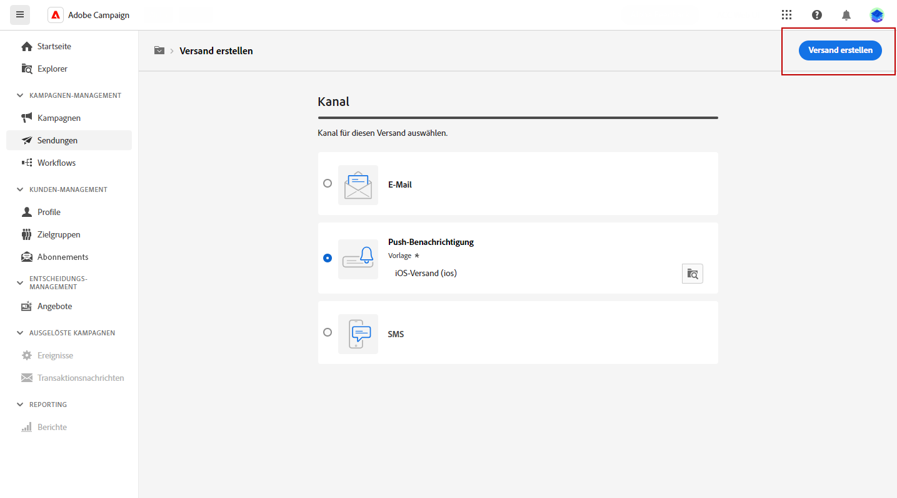
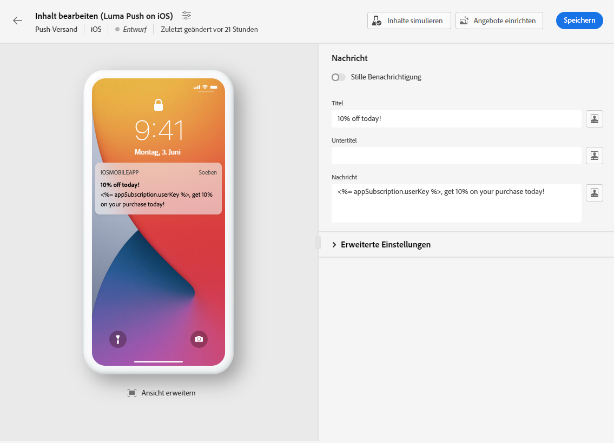
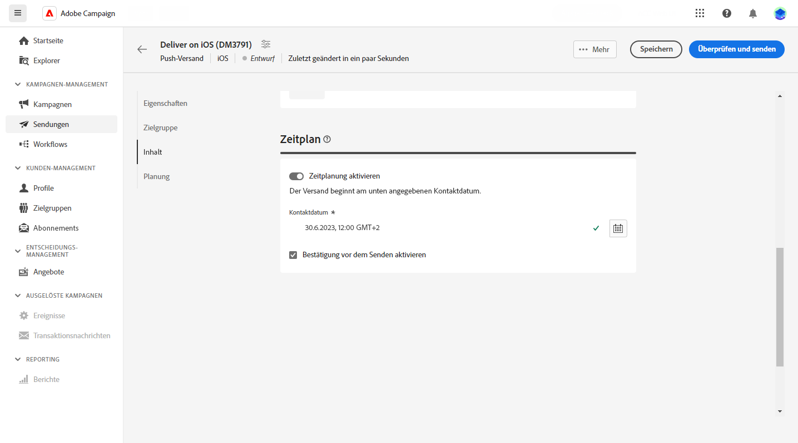
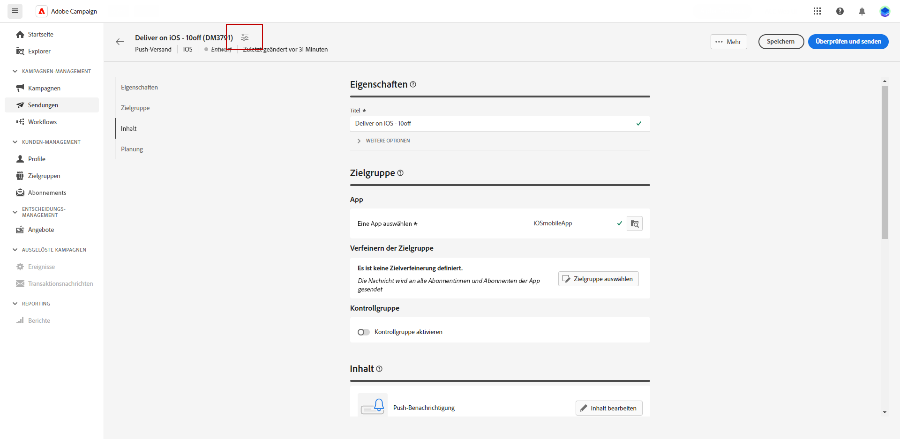

# Erstellen eines Push-Benachrichtigungs-Versands {#create-push}

>[!CONTEXTUALHELP]
>id="acw_push_notification_template"
>title="Vorlage für Push-Benachrichtigungen"
>abstract="Wählen Sie eine Vorlage für Push-Benachrichtigungen aus, um Ihren Push-Versand zu starten. Versandvorlagen ermöglichen die einfache Wiederverwendung benutzerdefinierter Inhalte und Einstellungen in allen Kampagnen und Sendungen."
>additional-url="https://experienceleague.adobe.com/docs/campaign-web/v8/msg/delivery-template.html?lang=de" text="Verwenden von Versandvorlagen"

>[!CONTEXTUALHELP]
>id="acw_deliveries_push_properties"
>title="Eigenschaften des Push-Versands"
>abstract="Definieren Sie die Eigenschaften des Push-Versands. Geben Sie das Label des Push-Versands ein und verwenden Sie **Weitere Optionen**, um den internen Namen, den Versandordner und den Code zu konfigurieren. Sie können auch eine benutzerdefinierte Beschreibung hinzufügen."

Sie können einen eigenständigen Push-Benachrichtigungsversand erstellen oder eine Push-Benachrichtigung im Kontext eines Kampagnen-Workflows erstellen. Die folgenden Schritte beschreiben die Vorgehensweise für einen eigenständigen (einmaligen) Push-Versand. Wenn Sie im Kontext eines Kampagnen-Workflows arbeiten, werden in [diesem Abschnitt](../workflows/activities/channels.md#create-a-delivery-in-a-campaign-workflow) die Schritte beschrieben, die zum Erstellen eines solchen Versands erforderlich sind.

## Erstellen eines Push-Versands {#create-push-delivery}

Gehen Sie wie folgt vor, um einen eigenständigen Push-Versand zu erstellen:

1. Navigieren Sie in der linken Leiste zum Menü **[!UICONTROL Sendungen]** und klicken Sie auf die Schaltfläche **[!UICONTROL Versand erstellen]**.

1. Wählen Sie im Abschnitt **[!UICONTROL Kanal]** als Kanal **Push-Benachrichtigung** aus und wählen Sie dann eine Vorlage je nach dem gewählten Betriebssystem: Android oder iOS. [Weitere Informationen zu Vorlagen](../msg/delivery-template.md)

1. Klicken Sie zur Bestätigung auf **[!UICONTROL Versand erstellen]**.

   {zoomable="yes"}

## Konfigurieren der Versandeinstellungen {#configure-push-settings}

Konfigurieren Sie Ihre Versandeinstellungen wie unten beschrieben:

1. Geben Sie einen **[!UICONTROL Titel]** für den Versand ein. Standardmäßig wird als Titel der Titel der ausgewählten Vorlage festgelegt. Er sollte aktualisiert werden.

1. Durchsuchen Sie die Dropdown-Liste **[!UICONTROL Zusätzliche Optionen]**, um bei Bedarf die Optionen anzupassen. Wenn Ihr Versand auf einem erweiterten Schema basiert, stehen spezifische Felder für **benutzerdefinierte Optionen** zur Verfügung.

   +++Konfigurieren Sie die folgenden Einstellungen entsprechend Ihren Anforderungen.
   * **[!UICONTROL Interner Name]**: Weisen Sie dem Versand eine eindeutige Kennung zu.
   * **[!UICONTROL Ordner]**: Speichern Sie den Versand in einem bestimmten Ordner.
   * **[!UICONTROL Versand-Code]**: Verwenden Sie dieses Feld, um Ihre Sendungen basierend auf Ihrer eigenen Namenskonvention zu organisieren.
   * **[!UICONTROL Beschreibung]**: Geben Sie eine Beschreibung für den Versand an.
   * **[!UICONTROL Art]**: Geben Sie die Art des Versands zu Klassifizierungszwecken an.
+++

## Auswählen der Zielgruppe für den Push-Versand {#create-audience-push}

>[!CONTEXTUALHELP]
>id="acw_deliveries_push_audience"
>title="Definieren der Zielgruppe für die Push-Benachrichtigung"
>abstract="Um die Zielgruppe Ihrer Nachricht zu definieren, müssen Sie zunächst die mit dem Push-Versand verknüpfte App auswählen. Die Push-Benachrichtigung wird standardmäßig an alle Abonnentinnen und Abonnenten der Anwendung gesendet. Die Auswahl kann auf eine bestimmte Zielgruppe eingeschränkt werden, indem man auf die **Zielgruppe auswählen** auswählen klickt. Bei Bedarf kann eine kontrollgruppe hinzugefügt werden, um die Wirkung des Versand zu messen."
>additional-url="https://experienceleague.adobe.com/docs/campaign-web/v8/audiences/target-audiences/control-group.html?lang=de" text="Festlegen einer Kontrollgruppe"

Sie müssen zuerst die App auswählen und können dann die Zielgruppe für Push-Benachrichtigungen wie unten beschrieben verfeinern:

1. Wählen Sie im Abschnitt **[!UICONTROL Zielgruppe]** die Anwendung aus, die Sie für diesen Versand verwenden möchten. Die Push-Benachrichtigung wird standardmäßig an alle Abonnentinnen und Abonnenten der Anwendung gesendet. Die Auswahl kann auf eine bestimmte Zielgruppe eingeschränkt werden, indem man auf die **[!UICONTROL Zielgruppe auswählen]** auswählen klickt. 

   {zoomable="yes"}

1. Wählen Sie eine vorhandene Zielgruppe aus oder erstellen Sie eine eigene Zielgruppe, um die Zielpopulation für Ihren Push-Versand zu verfeinern. Für Push-Benachrichtigungen ist **Abonnierte Anwendungen (nms:appSubscriptionRcp)** die standardmäßige [Zielgruppendimension](../audience/about-recipients.md#targeting-dimensions), die mit der Empfängertabelle verknüpft ist.

   Weitere Informationen dazu, wie Sie eine vorhandene Zielgruppe auswählen, finden Sie auf [dieser Seite](../audience/add-audience.md).

   Weitere Informationen dazu, wie Sie eine neue Zielgruppe erstellen, finden Sie auf [dieser Seite](../audience/one-time-audience.md).

1. Aktivieren Sie die Option **[!UICONTROL Kontrollgruppe aktivieren]**, um eine Kontrollgruppe zum Messen der Wirkung Ihres Versands einzurichten. Nachrichten werden nicht an diese Kontrollgruppe gesendet, sodass Sie das Verhalten der Population, die die Nachricht erhalten hat, mit dem Verhalten der Kontakte vergleichen können, die die Nachricht nicht erhalten haben. [Weitere Informationen](../audience/control-group.md).

## Definieren des Inhalts der Push-Benachrichtigung {#create-content-push}

Um den Inhalt Ihrer Benachrichtigung zu definieren, klicken Sie auf **[!UICONTROL Inhalt bearbeiten]**. [Weitere Informationen](content-push.md).

{zoomable="yes"}

Auf diesem Bildschirm können Sie auch [Inhalte simulieren](../preview-test/preview-test.md) und [Angebote einrichten](../msg/offers.md).

## Planen des Versandzeitpunkts {#schedule-push}

Wenn ein Versand im Rahmen eines Workflows durchgeführt wird, müssen Sie die **Planungs**-Aktivität verwenden. Weitere Informationen finden Sie auf [dieser Seite](../workflows/activities/scheduler.md). Die folgenden Schritte gelten nur für eigenständige Sendungen.

Gehen Sie wie folgt vor, um einen eigenständigen Push-Versand für ein bestimmtes Datum und eine bestimmte Uhrzeit zu planen:

1. Navigieren Sie zum Abschnitt **[!UICONTROL Zeitplan]** in den Versandeigenschaften.

1. Betätigen Sie den Umschalter, um **[!UICONTROL Planung aktivieren]** zu aktivieren.

1. Legen Sie Datum und Uhrzeit für den Versand fest.

Nachdem der Versand initiiert wurde, wird die Nachricht automatisch an dem Datum und zu der Uhrzeit gesendet, die Sie für die Empfängerin bzw. den Empfänger festgelegt haben.

{zoomable="yes"}

Weitere Informationen zur Versandplanung finden Sie in [diesem Abschnitt](../msg/gs-deliveries.md#gs-schedule).

## Erweiterte Versandeinstellungen {#adv-push}

Klicken Sie auf **[!UICONTROL Versandeinstellungen konfigurieren]**, um auf erweiterte Optionen in Bezug auf Ihre Versandvorlage zuzugreifen. [Weitere Informationen](../advanced-settings/delivery-settings.md).

{zoomable="yes"}