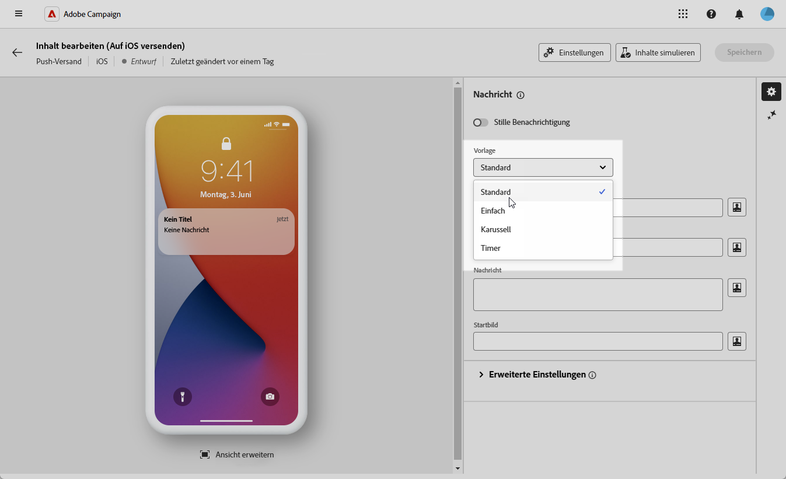
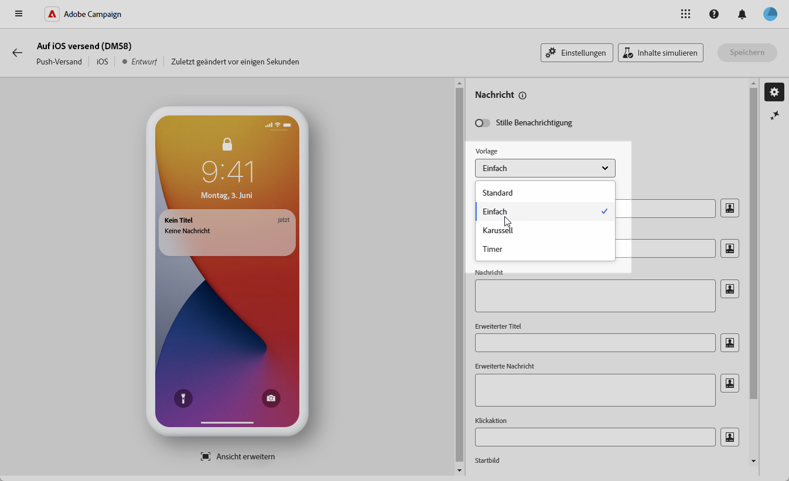
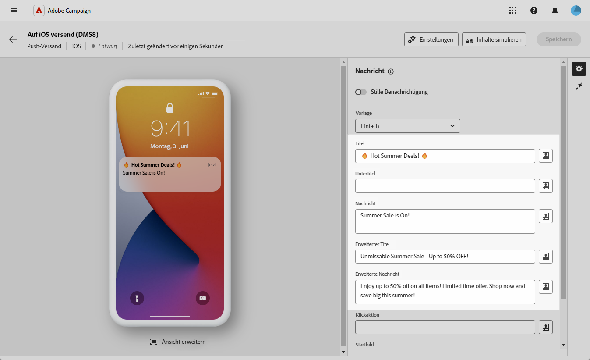
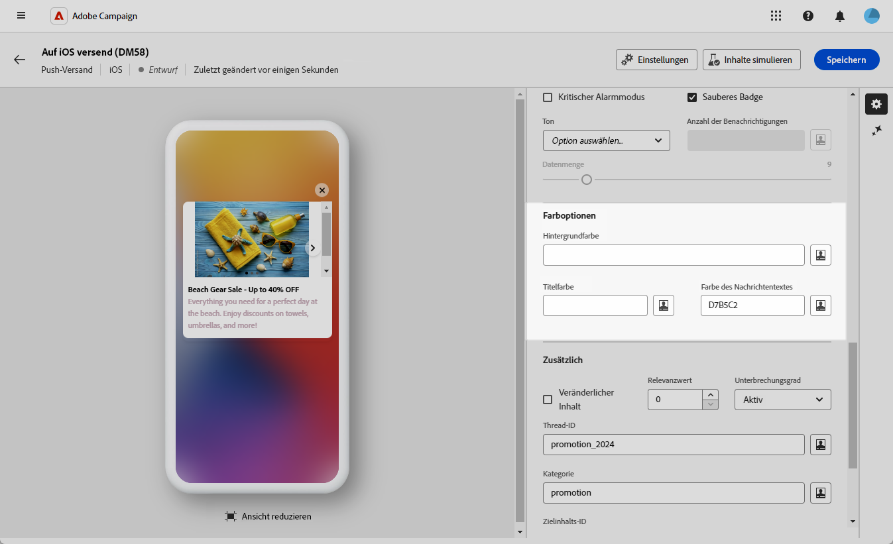
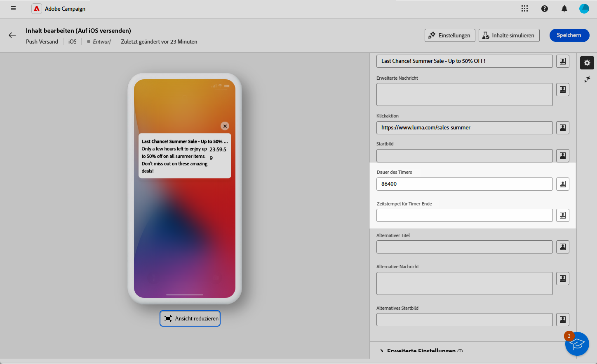

# Erstellen eines Rich-Push-Versands für iOS {#rich-push}

>[!IMPORTANT]
>
>Bevor Sie eine Rich-Push-Benachrichtigung entwerfen, müssen Sie zunächst Ihren V2-Connector konfigurieren. Eine detaillierte Vorgehensweise dazu finden Sie auf [dieser Seite](https://experienceleague.adobe.com/de/docs/campaign-classic/using/sending-messages/sending-push-notifications/configure-the-mobile-app/configuring-the-mobile-application).

## Festlegen des Inhalts der Benachrichtigung {#push-message}

Nach der Erstellung Ihres Push-Versands können Sie dessen Inhalt mit einer der folgenden Vorlagen definieren:

* Mit **Standard** können Sie Benachrichtigungen mit einem einfachen Symbol und einem zugehörigen Bild senden.

* **Standard** kann Text, Bilder und Schaltflächen in Ihre Benachrichtigungen aufnehmen.

* Mit **Karussell** können Sie Benachrichtigungen mit Text und mehreren Bildern senden, durch die Benutzer wischen können.

* **Timer** enthält einen Live-Countdown-Timer in Ihren Benachrichtigungen.

Navigieren Sie durch die folgenden Registerkarten, um mehr über die Personalisierung dieser Vorlagen zu erfahren.

>[!BEGINTABS]

>[!TAB Standard]

1. Wählen Sie **[!UICONTROL Standard]** aus der Dropdown-Liste **[!UICONTROL Vorlage]**.

   

1. Geben Sie in das Feld **[!UICONTROL Titel]** die Bezeichnung ein, die in der Liste der im Benachrichtigungscenter verfügbaren Benachrichtigungen erscheinen soll.

   In diesem Feld können Sie den Wert des Parameters **title** der iOS-Benachrichtigungs-Payload definieren.

1. Fügen Sie optional einen **[!UICONTROL Untertitel]** hinzu, der dem Parameter **subtitle** der iOS-Benachrichtigungs-Payload entspricht.

1. Geben Sie den Inhalt der Nachricht in das Feld **[!UICONTROL Nachricht]** ein.

1. Verwenden Sie den Ausdruckseditor, um Inhalte zu definieren, Daten zu personalisieren und dynamische Inhalte hinzuzufügen. [Weitere Informationen](../personalization/personalize.md)

   

1. Um Ihre Push-Benachrichtigung weiter zu personalisieren, können Sie eine URL für das **[!UICONTROL Bild starten]** auswählen, die Sie Ihrer Push-Benachrichtigung hinzufügen möchten.

1. Navigieren Sie in der Dropdown-Liste **[!UICONTROL Erweiterte Einstellungen]** zur Registerkarte **[!UICONTROL Ton und Badge]** , um zusätzliche Einstellungen wie Ton- und Badge-Optionen für Ihre Benachrichtigungen anzupassen. [Weitere Informationen](#sound-badge)

   

1. Weitere Anpassungen finden Sie in den für Ihre Push-Benachrichtigungen verfügbaren Optionen **[!UICONTROL Zusätzliche]** . [Weitere Informationen](#push-advanced)

   

1. Aus dem Menü **[!UICONTROL Anwendungsvariablen]** werden Ihre **[!UICONTROL Anwendungsvariablen]** automatisch hinzugefügt. Damit können Sie beispielsweise das Benachrichtigungsverhalten definieren. So können Sie einen speziellen Anwendungsbildschirm konfigurieren, der angezeigt wird, wenn der Benutzer die Benachrichtigung aktiviert.

Nachdem Sie den Nachrichteninhalt definiert haben, können Sie Testabonnentinnen und -abonnenten einsetzen, um die Nachricht in einer Vorschau anzuzeigen und zu testen.

>[!TAB Einfach]

1. Wählen Sie **[!UICONTROL Einfach]** aus der Dropdown-Liste **[!UICONTROL Vorlage]**.

   

1. Geben Sie zum Erstellen Ihrer Nachricht den Text in die Felder **[!UICONTROL Titel]**, **[!UICONTROL erweiterter Titel]**, **[!UICONTROL Nachricht]** und **[!UICONTROL Erweiterte Nachricht]** ein.

   Der Text der **[!UICONTROL Nachricht]** wird in der ausgeblendeten Ansicht angezeigt, während die **[!UICONTROL Erweiterte Nachricht]** angezeigt wird, wenn die Benachrichtigung erweitert wird.

   

1. Verwenden Sie den Ausdruckseditor, um Inhalte zu definieren, Daten zu personalisieren und dynamische Inhalte hinzuzufügen. [Weitere Informationen](../personalization/personalize.md)

1. Fügen Sie optional einen **[!UICONTROL Untertitel]** hinzu, der dem Parameter **subtitle** der iOS-Benachrichtigungs-Payload entspricht.

1. Fügen Sie die URL hinzu, die die **[!UICONTROL Klick-Aktion]** definiert, die mit einem Benutzerklick auf Ihre Benachrichtigung verbunden ist. Dies bestimmt das Verhalten bei der Interaktion der Benutzenden mit der Benachrichtigung, z. B. beim Öffnen eines bestimmten Bildschirms oder beim Ausführen einer bestimmten Aktion in der App.

1. Um Ihre Push-Benachrichtigung weiter zu personalisieren, können Sie eine URL für das **[!UICONTROL Bild starten]** auswählen, die Sie Ihrer Push-Benachrichtigung hinzufügen möchten.

1. Navigieren Sie in der Dropdown-Liste **[!UICONTROL Erweiterte Einstellungen]** zur Registerkarte **[!UICONTROL Ton und Badge]** , um zusätzliche Einstellungen wie Ton- und Badge-Optionen für Ihre Benachrichtigungen anzupassen. [Weitere Informationen](#sound-badge)

   

1. Geben Sie im Menü **[!UICONTROL Farboptionen]** hexadezimale Farbcodes für die Hintergrundfarbe der Benachrichtigung **[!UICONTROL 3}, die Hintergrundfarbe der Benachrichtigung]** und die Textfarbe der Nachricht **[!UICONTROL Nachricht]** ein.]****[!UICONTROL 

   

1. Weitere Anpassungen finden Sie in den für Ihre Push-Benachrichtigungen verfügbaren Optionen **[!UICONTROL Zusätzliche]** . [Weitere Informationen](#push-advanced)

1. Aus dem Menü **[!UICONTROL Anwendungsvariablen]** werden Ihre **[!UICONTROL Anwendungsvariablen]** automatisch hinzugefügt. Damit können Sie beispielsweise das Benachrichtigungsverhalten definieren. So können Sie einen speziellen Anwendungsbildschirm konfigurieren, der angezeigt wird, wenn der Benutzer die Benachrichtigung aktiviert.

Nachdem Sie den Nachrichteninhalt definiert haben, können Sie Testabonnentinnen und -abonnenten einsetzen, um die Nachricht in einer Vorschau anzuzeigen und zu testen.

>[!TAB Karussell]

1. Wählen Sie **[!UICONTROL Karussell]** aus der Dropdown-Liste **[!UICONTROL Vorlage]**.

   

1. Geben Sie zum Erstellen Ihrer Nachricht den Text in die Felder **[!UICONTROL Titel]**, **[!UICONTROL erweiterter Titel]**, **[!UICONTROL Nachricht]** und **[!UICONTROL Erweiterte Nachricht]** ein.

   Der Text der **[!UICONTROL Nachricht]** wird in der ausgeblendeten Ansicht angezeigt, während die **[!UICONTROL Erweiterte Nachricht]** angezeigt wird, wenn die Benachrichtigung erweitert wird.

   

1. Verwenden Sie den Ausdruckseditor, um Inhalte zu definieren, Daten zu personalisieren und dynamische Inhalte hinzuzufügen. [Weitere Informationen](../personalization/personalize.md)

1. Fügen Sie optional einen **[!UICONTROL Untertitel]** hinzu, der dem Parameter **subtitle** der iOS-Benachrichtigungs-Payload entspricht.

1. Fügen Sie die URL hinzu, die die **[!UICONTROL Klick-Aktion]** definiert, die mit einem Benutzerklick auf Ihre Benachrichtigung verbunden ist. Dies bestimmt das Verhalten bei der Interaktion der Benutzenden mit der Benachrichtigung, z. B. beim Öffnen eines bestimmten Bildschirms oder beim Ausführen einer bestimmten Aktion in der App.

1. Wählen Sie, wie das **[!UICONTROL Karussell]** bedient werden soll:

   * **[!UICONTROL Automatisch]**: Die Bilder werden automatisch in vordefinierten Intervallen als Folien wiedergegeben.
   * **[!UICONTROL Manuell]**: Benutzende können manuell zwischen den Folien streichen, um durch die Bilder zu navigieren.

1. Klicken Sie auf **[!UICONTROL Bild hinzufügen]** und geben Sie Ihre **[!UICONTROL Bild]**-URL, **[!UICONTROL Text]** und den **[!UICONTROL Action URI]** ein.

   Stellen Sie sicher, dass Sie mindestens drei und maximal fünf Bilder einfügen.

   

1. Bearbeiten Sie die Reihenfolge Ihrer Bilder mit den nach oben bzw. nach unten zeigenden Pfeilen.

1. Navigieren Sie in der Dropdown-Liste **[!UICONTROL Erweiterte Einstellungen]** zur Registerkarte **[!UICONTROL Ton und Badge]** , um zusätzliche Einstellungen wie Ton- und Badge-Optionen für Ihre Benachrichtigungen anzupassen. [Weitere Informationen](#sound-badge)

1. Geben Sie im Menü **[!UICONTROL Farboptionen]** hexadezimale Farbcodes für die Hintergrundfarbe der Benachrichtigung **[!UICONTROL 3}, die Hintergrundfarbe der Benachrichtigung]** und die Textfarbe der Nachricht **[!UICONTROL Nachricht]** ein.]****[!UICONTROL 

   

1. Weitere Anpassungen finden Sie in den für Ihre Push-Benachrichtigungen verfügbaren Optionen **[!UICONTROL Zusätzliche]** . [Weitere Informationen](#push-advanced)

1. Aus dem Menü **[!UICONTROL Anwendungsvariablen]** werden Ihre **[!UICONTROL Anwendungsvariablen]** automatisch hinzugefügt. Damit können Sie beispielsweise das Benachrichtigungsverhalten definieren. So können Sie einen speziellen Anwendungsbildschirm konfigurieren, der angezeigt wird, wenn der Benutzer die Benachrichtigung aktiviert.

Nachdem Sie den Nachrichteninhalt definiert haben, können Sie Testabonnentinnen und -abonnenten einsetzen, um die Nachricht in einer Vorschau anzuzeigen und zu testen.

>[!TAB Timer]

1. Wählen Sie aus der Dropdownliste **[!UICONTROL Benachrichtigungstyp]** die Option **[!UICONTROL Timer]** aus.

   

1. Geben Sie zum Erstellen Ihrer Nachricht den Text in die Felder **[!UICONTROL Titel]**, **[!UICONTROL erweiterter Titel]**, **[!UICONTROL Nachricht]** und **[!UICONTROL Erweiterte Nachricht]** ein.

   Der Text der **[!UICONTROL Nachricht]** wird in der ausgeblendeten Ansicht angezeigt, während die **[!UICONTROL Erweiterte Nachricht]** angezeigt wird, wenn die Benachrichtigung erweitert wird.

   

1. Verwenden Sie den Ausdruckseditor, um Inhalte zu definieren, Daten zu personalisieren und dynamische Inhalte hinzuzufügen. [Weitere Informationen](../personalization/personalize.md)

1. Fügen Sie optional einen **[!UICONTROL Untertitel]** hinzu, der dem Parameter **subtitle** der iOS-Benachrichtigungs-Payload entspricht.

1. Fügen Sie die URL hinzu, die die **[!UICONTROL Klick-Aktion]** definiert, die mit einem Benutzerklick auf Ihre Benachrichtigung verbunden ist. Dies bestimmt das Verhalten bei der Interaktion der Benutzenden mit der Benachrichtigung, z. B. beim Öffnen eines bestimmten Bildschirms oder beim Ausführen einer bestimmten Aktion in der App.

1. Um Ihre Push-Benachrichtigung weiter zu personalisieren, können Sie eine URL für das **[!UICONTROL Bild starten]** auswählen, die Sie Ihrer Push-Benachrichtigung hinzufügen möchten.

1. Legen Sie Ihre **[!UICONTROL Timer-Dauer]** in Sekunden oder den **[!UICONTROL Timer-Endzeitstempel]** auf einen bestimmten Epoch-Zeitstempel fest.

   

1. Geben Sie den Text und das Bild ein, die angezeigt werden sollen, nachdem der Timer abgelaufen ist, in die Felder **[!UICONTROL Alternativer Titel]**, **[!UICONTROL Alternative Nachricht]** und **[!UICONTROL Alternatives Startbild]** ein.

   

1. Navigieren Sie in der Dropdown-Liste **[!UICONTROL Erweiterte Einstellungen]** zur Registerkarte **[!UICONTROL Ton und Badge]** , um zusätzliche Einstellungen wie Ton- und Badge-Optionen für Ihre Benachrichtigungen anzupassen. [Weitere Informationen](#sound-badge)

1. Geben Sie im Menü **[!UICONTROL Farboptionen]** hexadezimale Farbcodes für die Hintergrundfarbe der Benachrichtigung **[!UICONTROL 3}, die Hintergrundfarbe der Benachrichtigung]** und die Textfarbe der Nachricht **[!UICONTROL Nachricht]** ein.]****[!UICONTROL 

1. Weitere Anpassungen finden Sie in den für Ihre Push-Benachrichtigungen verfügbaren Optionen **[!UICONTROL Zusätzliche]** . [Weitere Informationen](#push-advanced)

1. Aus dem Menü **[!UICONTROL Anwendungsvariablen]** werden Ihre **[!UICONTROL Anwendungsvariablen]** automatisch hinzugefügt. Damit können Sie beispielsweise das Benachrichtigungsverhalten definieren. So können Sie einen speziellen Anwendungsbildschirm konfigurieren, der angezeigt wird, wenn der Benutzer die Benachrichtigung aktiviert.

Nachdem Sie den Nachrichteninhalt definiert haben, können Sie Testabonnentinnen und -abonnenten einsetzen, um die Nachricht in einer Vorschau anzuzeigen und zu testen.

>[!ENDTABS]

## Erweiterte Einstellungen für Push-Benachrichtigungen {#push-advanced}

### Audio- und Badge-Optionen {#sound-badge}

| Parameter | Beschreibung |
|---------|---------|
| **[!UICONTROL Kritischer Alarmmodus]** | Aktivieren Sie diese Option, um Ihrer Benachrichtigung Ton hinzuzufügen, selbst wenn das Handy des Benutzers im Fokusmodus eingestellt ist oder wenn der iPhone stummgeschaltet ist. |
| **[!UICONTROL Badge entfernen]** | Aktivieren Sie diese Optionen, um den Badge-Wert zu aktualisieren. |
| **[!UICONTROL Ton]** | Legt den Ton fest, der abgespielt werden soll, wenn das Gerät Ihre Benachrichtigung erhält. |
| **[!UICONTROL Anzahl der Benachrichtigungen]** | Legen Sie eine Zahl fest, mit der die Anzahl der neuen ungelesenen Informationen direkt auf dem Anwendungssymbol angezeigt wird. |
| **[!UICONTROL Lautstärke]** | Legen Sie die Lautstärke Ihres Tons von 0 auf 100 fest. Töne müssen in die App integriert und zum Zeitpunkt der Erstellung des entsprechenden Service konfiguriert werden. |

### Farboptionen {#color}

| Parameter | Beschreibung |
|---------|---------|
| **[!UICONTROL Hintergrundfarbe der Benachrichtigungen]** | Legt die Farbe des Benachrichtigungshintergrunds mit den gewünschten Hexadezimal-Farb-Codes fest. |
| **[!UICONTROL Titelfarbe]** | Legen Sie die Farbe Ihres Titels mit Ihren Hexadezimal-Farb-Codes fest. |
| **[!UICONTROL Farbe des Nachrichtentextes]** | Legen Sie die Farbe Ihres Textes mit Ihren Hex-Farbcodes fest. |

### Erweiterte Optionen {#notification-options}

| Parameter | Beschreibung |
|---------|---------|
| **[!UICONTROL Veränderlicher Inhalt]** | Aktivieren Sie diese Option, damit die Mobile App Medieninhalte herunterladen kann. |
| **[!UICONTROL Relevanzwert]** | Legen Sie einen Relevanzwert von 0 bis 100 fest. Das System verwendet diesen Wert, um die Benachrichtigungen in der Benachrichtigungszusammenfassung zu sortieren. |
| **[!UICONTROL Unterbrechungsgrad]** | <ul><li>Aktiv: Standardmäßig zeigt das System die Benachrichtigung sofort an, beleuchtet den Bildschirm und kann einen Ton abspielen. Benachrichtigungen durchbrechen die Fokusmodi nicht.</li><li>Passiv: Das System fügt die Benachrichtigung zur Benachrichtigungsliste hinzu, ohne den Bildschirm anzuzeigen oder einen Ton abzuspielen. Benachrichtigungen umgehen nicht den Fokusmodus.</li><li> Zeitabhängig: Das System stellt die Benachrichtigung sofort vor, beleuchtet den Bildschirm, kann einen Ton abspielen und den Fokusmodus durchbrechen. Für diese Stufe ist keine spezielle Berechtigung von Apple erforderlich.</li><li>Kritisch: Das System zeigt die Benachrichtigung sofort an, beleuchtet den Bildschirm und umgeht den Stummschaltungs- oder Fokusmodus. Beachten Sie, dass für diese Stufe eine spezielle Berechtigung von Apple erforderlich ist.</li></ul> |
| **[!UICONTROL Thread-ID]** | Legen Sie die Kennung fest, die zum Gruppieren verwandter Benachrichtigungen verwendet wird. |
| **[!UICONTROL Kategorie]** | Legen Sie den Namen Ihrer Kategorie-ID fest, mit der Aktionsschaltflächen angezeigt werden. Mit diesen Benachrichtigungen können Benutzer rascher unterschiedliche Aufgaben ausführen, ohne die Anwendung öffnen oder darin navigieren zu müssen. |
| **[!UICONTROL Zielgruppen-Inhalts-ID]** | Legen Sie eine Kennung fest, die bestimmt, welches Anwendungsfenster beim Öffnen der Benachrichtigung vorgezogen werden soll. |

