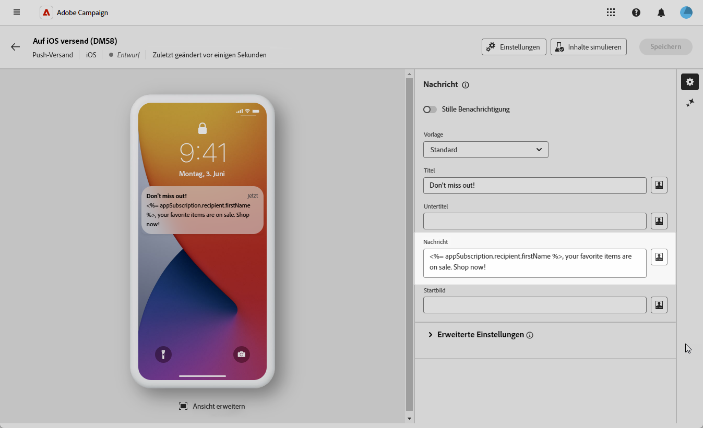
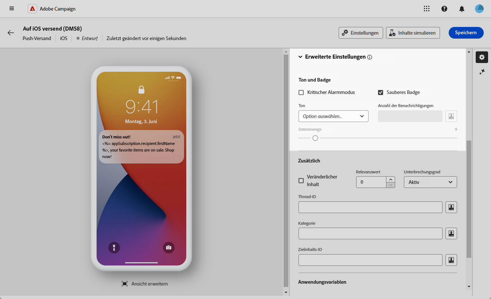
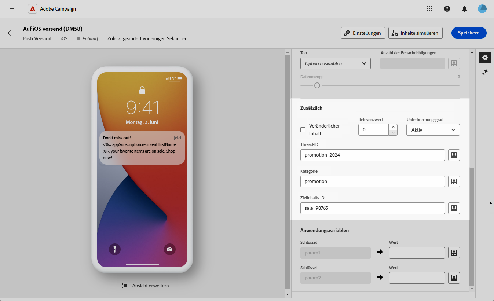
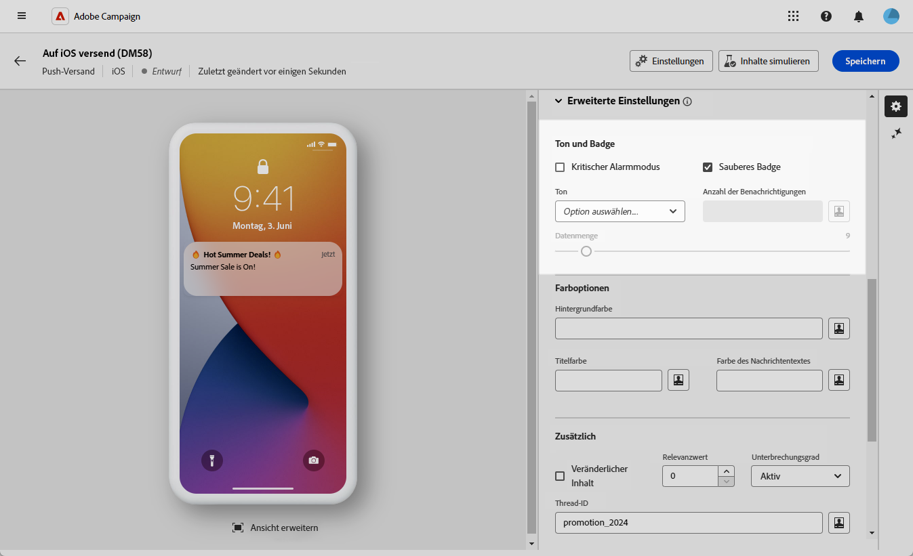
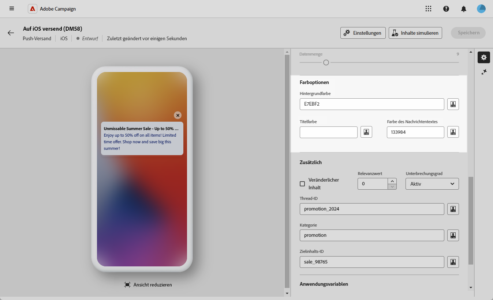
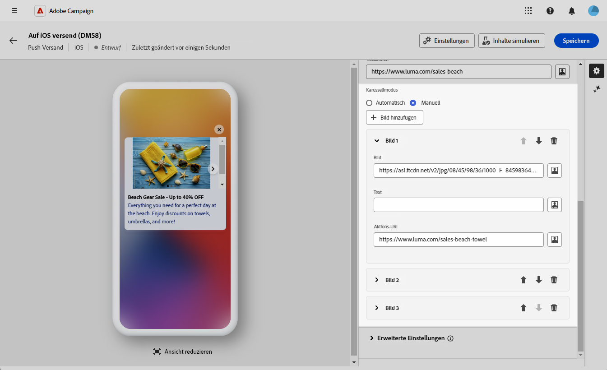
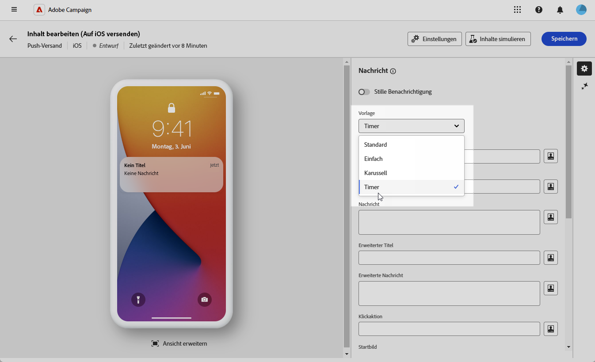
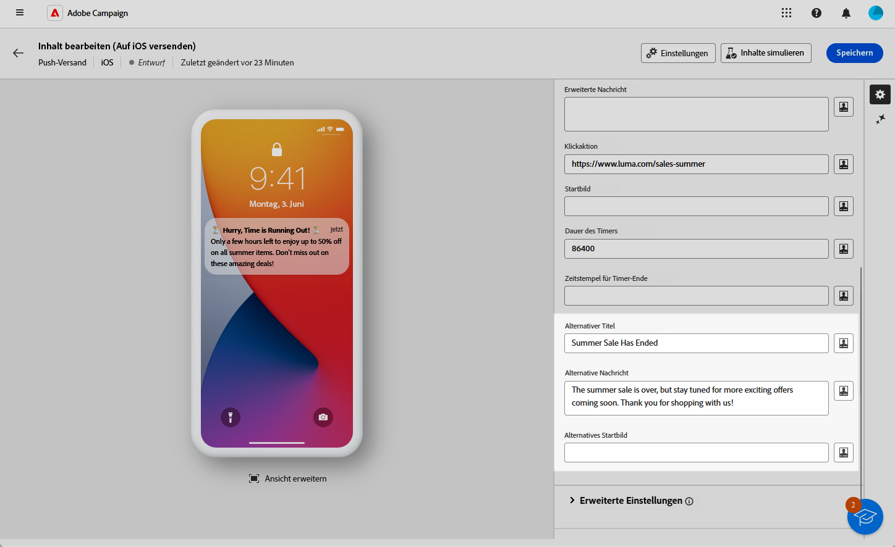

# Erstellen eines Rich-Push-Versands für iOS {#rich-push}

>[!IMPORTANT]
>
>Bevor Sie eine Rich-Push-Benachrichtigung entwerfen, müssen Sie Ihren V2-Connector konfigurieren. Eine detaillierte Vorgehensweise dazu finden Sie auf [dieser Seite](https://experienceleague.adobe.com/de/docs/campaign-classic/using/sending-messages/sending-push-notifications/configure-the-mobile-app/configuring-the-mobile-application).

## Festlegen des Inhalts der Benachrichtigung {#push-message}

Sobald Ihr Push-Versand erstellt ist, definieren Sie seinen Inhalt mit einer der folgenden Vorlagen:

* **Standard** ermöglicht es Ihnen, Benachrichtigungen mit einem einfachen Symbol und einem zugehörigen Bild zu senden.
* **Einfach** ermöglicht es Ihnen, Text, Bilder und Schaltflächen in Ihre Benachrichtigungen einzufügen.
* **Karussell** ermöglicht es Ihnen, Benachrichtigungen mit Text und mehreren Bildern zu senden, zwischen denen die Benutzenden hin und her wischen können.
* **Timer** fügt einen Live-Countdown-Timer in Ihre Benachrichtigungen ein.

Navigieren Sie durch die folgenden Registerkarten, um mehr über die Personalisierung dieser Vorlagen zu erfahren.

>[!BEGINTABS]

>[!TAB Standard]

1. Wählen Sie aus der Dropdown-Liste **[!UICONTROL Vorlage]** die Option **[!UICONTROL Standard]** aus.

   

1. Geben Sie in das Feld **[!UICONTROL Label]** die Bezeichnung ein, die in der Liste der im Benachrichtigungscenter verfügbaren Benachrichtigungen erscheinen soll.

   Dieses Feld definiert den Wert des Parameters **title** der iOS-Benachrichtigungs-Payload.

1. Sie können optional einen **[!UICONTROL Untertitel]** hinzufügen, der dem Parameter **subtitle** der iOS-Benachrichtigungs-Payload entspricht.

1. Geben Sie den Inhalt der Nachricht in das Feld **[!UICONTROL Nachricht]** ein.

1. Verwenden Sie den Ausdruckseditor, um Inhalte zu definieren, Daten zu personalisieren und dynamische Inhalte hinzuzufügen. [Weitere Informationen](../personalization/personalize.md)

   

1. Um Ihre Push-Benachrichtigung weiter zu personalisieren, wählen Sie eine URL für das **[!UICONTROL Startbild]** aus, das Ihrer Push-Benachrichtigung hinzugefügt werden soll.

1. Navigieren Sie in der Dropdown-Liste **[!UICONTROL Erweiterte Einstellungen]** zur Registerkarte **[!UICONTROL Ton und Badge]**, um zusätzliche Einstellungen wie Ton- und Badge-Optionen für Ihre Benachrichtigungen anzupassen. [Weitere Informationen](#sound-badge)

   

1. Weitere Anpassungsmöglichkeiten finden Sie unter **[!UICONTROL zusätzlichen Optionen]** für Ihre Push-Benachrichtigungen. [Weitere Informationen](#push-advanced)

   

1. Ihre **[!UICONTROL Anwendungsvariablen]** werden automatisch von der Registerkarte **[!UICONTROL Anwendungsvariablen]** hinzugefügt. Damit können Sie das Benachrichtigungsverhalten definieren. Zum Beispiel können Sie einen speziellen App-Bildschirm konfigurieren, der angezeigt wird, wenn die Benutzerin oder der Benutzer die Benachrichtigung aktiviert.

Sobald Sie den Inhalt Ihrer Nachricht definiert haben, können Sie Testabonnierende einsetzen, um die Nachricht in einer Vorschau anzuzeigen und zu testen.

>[!TAB Einfach]

1. Wählen Sie aus der Dropdown-Liste **[!UICONTROL Vorlage]** die Option **[!UICONTROL Einfach]**.

   

1. Um Ihre Nachricht zu erstellen, geben Sie Ihren Text in die Felder **[!UICONTROL Titel]**, **[!UICONTROL Erweiterter Titel]**, **[!UICONTROL Nachricht]** und **[!UICONTROL Erweiterte Nachricht]** ein.

   Der Text der **[!UICONTROL Nachricht]** wird in der ausgeblendeten Ansicht angezeigt, während die **[!UICONTROL erweiterte Nachricht]** angezeigt wird, wenn die Benachrichtigung erweitert wird.

   

1. Verwenden Sie den Ausdruckseditor, um Inhalte zu definieren, Daten zu personalisieren und dynamische Inhalte hinzuzufügen. [Weitere Informationen](../personalization/personalize.md)

1. Sie können optional einen **[!UICONTROL Untertitel]** hinzufügen, der dem Parameter **subtitle** der iOS-Benachrichtigungs-Payload entspricht.

1. Fügen Sie die URL hinzu, die die **[!UICONTROL Klick-Aktion]** definiert, die mit einem Benutzerklick auf Ihre Benachrichtigung verbunden ist. Dies bestimmt das Verhalten bei der Interaktion der Benutzenden mit der Benachrichtigung, z. B. beim Öffnen eines bestimmten Bildschirms oder beim Ausführen einer bestimmten Aktion in der App.

1. Um Ihre Push-Benachrichtigung weiter zu personalisieren, wählen Sie eine URL für das **[!UICONTROL Startbild]** aus, das Ihrer Push-Benachrichtigung hinzugefügt werden soll.

1. Navigieren Sie in der Dropdown-Liste **[!UICONTROL Erweiterte Einstellungen]** zur Registerkarte **[!UICONTROL Ton und Badge]**, um zusätzliche Einstellungen wie Ton- und Badge-Optionen für Ihre Benachrichtigungen anzupassen. [Weitere Informationen](#sound-badge)

   

1. Geben Sie im Menü **[!UICONTROL Farboptionen]** die hexadezimalen Farb-Codes für die **[!UICONTROL Hintergrundfarbe der Benachrichtigung]**, **[!UICONTROL Hintergrundfarbe der Benachrichtigung]** und **[!UICONTROL Farbe des Nachrichtentextes]** ein.

   

1. Weitere Anpassungsmöglichkeiten finden Sie unter **[!UICONTROL zusätzlichen Optionen]** für Ihre Push-Benachrichtigungen. [Weitere Informationen](#push-advanced)

1. Ihre **[!UICONTROL Anwendungsvariablen]** werden automatisch von der Registerkarte **[!UICONTROL Anwendungsvariablen]** hinzugefügt. Damit können Sie das Benachrichtigungsverhalten definieren. Zum Beispiel können Sie einen speziellen App-Bildschirm konfigurieren, der angezeigt wird, wenn die Benutzerin oder der Benutzer die Benachrichtigung aktiviert.

Sobald Sie den Inhalt Ihrer Nachricht definiert haben, können Sie Testabonnierende einsetzen, um die Nachricht in einer Vorschau anzuzeigen und zu testen.

>[!TAB Karussell]

1. Wählen Sie aus der Dropdown-Liste **[!UICONTROL Vorlage]** die Option **[!UICONTROL Karussell]**.

   

1. Um Ihre Nachricht zu erstellen, geben Sie Ihren Text in die Felder **[!UICONTROL Titel]**, **[!UICONTROL Erweiterter Titel]**, **[!UICONTROL Nachricht]** und **[!UICONTROL Erweiterte Nachricht]** ein.

   Der Text der **[!UICONTROL Nachricht]** wird in der ausgeblendeten Ansicht angezeigt, während die **[!UICONTROL erweiterte Nachricht]** angezeigt wird, wenn die Benachrichtigung erweitert wird.

   

1. Verwenden Sie den Ausdruckseditor, um Inhalte zu definieren, Daten zu personalisieren und dynamische Inhalte hinzuzufügen. [Weitere Informationen](../personalization/personalize.md)

1. Sie können optional einen **[!UICONTROL Untertitel]** hinzufügen, der dem Parameter **subtitle** der iOS-Benachrichtigungs-Payload entspricht.

1. Fügen Sie die URL hinzu, die die **[!UICONTROL Klick-Aktion]** definiert, die mit einem Benutzerklick auf Ihre Benachrichtigung verbunden ist. Dies bestimmt das Verhalten bei der Interaktion der Benutzenden mit der Benachrichtigung, z. B. beim Öffnen eines bestimmten Bildschirms oder beim Ausführen einer bestimmten Aktion in der App.

1. Wählen Sie, wie das **[!UICONTROL Karussell]** bedient werden soll:

   * **[!UICONTROL Automatisch]**: Die Bilder werden automatisch in vordefinierten Intervallen als Folien wiedergegeben.
   * **[!UICONTROL Manuell]**: Benutzende können manuell zwischen den Folien streichen, um durch die Bilder zu navigieren.

1. Klicken Sie auf **[!UICONTROL Bild hinzufügen]** und geben Sie die URL für das **[!UICONTROL Bild]**, den **[!UICONTROL Text]** und den **[!UICONTROL Aktions-URI]** ein.

   Stellen Sie sicher, dass Sie mindestens drei und maximal fünf Bilder einfügen.

   

1. Bearbeiten Sie die Reihenfolge Ihrer Bilder mit den nach oben bzw. nach unten zeigenden Pfeilen.

1. Navigieren Sie in der Dropdown-Liste **[!UICONTROL Erweiterte Einstellungen]** zur Registerkarte **[!UICONTROL Ton und Badge]**, um zusätzliche Einstellungen wie Ton- und Badge-Optionen für Ihre Benachrichtigungen anzupassen. [Weitere Informationen](#sound-badge)

1. Geben Sie im Menü **[!UICONTROL Farboptionen]** die hexadezimalen Farb-Codes für die **[!UICONTROL Hintergrundfarbe der Benachrichtigung]**, **[!UICONTROL Hintergrundfarbe der Benachrichtigung]** und **[!UICONTROL Farbe des Nachrichtentextes]** ein.

   

1. Weitere Anpassungsmöglichkeiten finden Sie unter **[!UICONTROL zusätzlichen Optionen]** für Ihre Push-Benachrichtigungen. [Weitere Informationen](#push-advanced)

1. Ihre **[!UICONTROL Anwendungsvariablen]** werden automatisch von der Registerkarte **[!UICONTROL Anwendungsvariablen]** hinzugefügt. Damit können Sie das Benachrichtigungsverhalten definieren. Zum Beispiel können Sie einen speziellen App-Bildschirm konfigurieren, der angezeigt wird, wenn die Benutzerin oder der Benutzer die Benachrichtigung aktiviert.

Sobald Sie den Inhalt Ihrer Nachricht definiert haben, können Sie Testabonnierende einsetzen, um die Nachricht in einer Vorschau anzuzeigen und zu testen.

>[!TAB Timer]

1. Wählen Sie in der Dropdown-Liste **[!UICONTROL Benachrichtigungstyp]** die Option **[!UICONTROL Timer]** aus.

   

1. Um Ihre Nachricht zu erstellen, geben Sie Ihren Text in die Felder **[!UICONTROL Titel]**, **[!UICONTROL Erweiterter Titel]**, **[!UICONTROL Nachricht]** und **[!UICONTROL Erweiterte Nachricht]** ein.

   Der Text der **[!UICONTROL Nachricht]** wird in der ausgeblendeten Ansicht angezeigt, während die **[!UICONTROL erweiterte Nachricht]** angezeigt wird, wenn die Benachrichtigung erweitert wird.

   

1. Verwenden Sie den Ausdruckseditor, um Inhalte zu definieren, Daten zu personalisieren und dynamische Inhalte hinzuzufügen. [Weitere Informationen](../personalization/personalize.md)

1. Sie können optional einen **[!UICONTROL Untertitel]** hinzufügen, der dem Parameter **subtitle** der iOS-Benachrichtigungs-Payload entspricht.

1. Fügen Sie die URL hinzu, die die **[!UICONTROL Klick-Aktion]** definiert, die mit einem Benutzerklick auf Ihre Benachrichtigung verbunden ist. Dies bestimmt das Verhalten bei der Interaktion der Benutzenden mit der Benachrichtigung, z. B. beim Öffnen eines bestimmten Bildschirms oder beim Ausführen einer bestimmten Aktion in der App.

1. Um Ihre Push-Benachrichtigung weiter zu personalisieren, wählen Sie eine URL für das **[!UICONTROL Startbild]** aus, das Ihrer Push-Benachrichtigung hinzugefügt werden soll.

1. Stellen Sie die **[!UICONTROL Dauer des Timers]** in Sekunden oder den **[!UICONTROL Zeitstempel für Timer-Ende]** auf einen bestimmten Epoch-Zeitstempel ein.

   

1. Geben Sie den Text und das Bild, die nach Ablauf des Timers angezeigt werden sollen, in die Felder **[!UICONTROL Alternativer Titel]**, **[!UICONTROL Alternative Nachricht]** und **[!UICONTROL Alternatives Startbild]** ein.

   

1. Navigieren Sie in der Dropdown-Liste **[!UICONTROL Erweiterte Einstellungen]** zur Registerkarte **[!UICONTROL Ton und Badge]**, um zusätzliche Einstellungen wie Ton- und Badge-Optionen für Ihre Benachrichtigungen anzupassen. [Weitere Informationen](#sound-badge)

1. Geben Sie im Menü **[!UICONTROL Farboptionen]** die hexadezimalen Farb-Codes für die **[!UICONTROL Hintergrundfarbe der Benachrichtigung]**, **[!UICONTROL Hintergrundfarbe der Benachrichtigung]** und **[!UICONTROL Farbe des Nachrichtentextes]** ein.

1. Weitere Anpassungsmöglichkeiten finden Sie unter **[!UICONTROL zusätzlichen Optionen]** für Ihre Push-Benachrichtigungen. [Weitere Informationen](#push-advanced)

1. Ihre **[!UICONTROL Anwendungsvariablen]** werden automatisch von der Registerkarte **[!UICONTROL Anwendungsvariablen]** hinzugefügt. Damit können Sie das Benachrichtigungsverhalten definieren. Zum Beispiel können Sie einen speziellen App-Bildschirm konfigurieren, der angezeigt wird, wenn die Benutzerin oder der Benutzer die Benachrichtigung aktiviert.

Sobald Sie den Inhalt Ihrer Nachricht definiert haben, können Sie Testabonnierende einsetzen, um die Nachricht in einer Vorschau anzuzeigen und zu testen.

>[!ENDTABS]

## Erweiterte Einstellungen für Push-Benachrichtigungen {#push-advanced}

### Optionen für Ton und Badge {#sound-badge}

| Parameter | Beschreibung |
|-----------|-------------|
| **[!UICONTROL Kritischer Alarmmodus]** | Aktivieren Sie diese Option, um Ihrer Benachrichtigung einen Ton hinzuzufügen, selbst wenn das Telefon der Benutzerin oder des Benutzers auf den Fokusmodus festgelegt oder stummgeschaltet ist. |
| **[!UICONTROL Badge entfernen]** | Aktivieren Sie diese Option, um den Badge-Wert zu aktualisieren. |
| **[!UICONTROL Ton]** | Legt den Ton fest, der abgespielt werden soll, wenn das Gerät Ihre Benachrichtigung erhält. |
| **[!UICONTROL Anzahl der Benachrichtigungen]** | Legen Sie eine Zahl fest, die direkt auf dem App-Symbol angezeigt wird und die Anzahl der neuen, ungelesenen Benachrichtigungen angibt.  |
| **[!UICONTROL Lautstärke]** | Legen Sie die Lautstärke des Tons auf einer Skala von 0 bis 100 fest. Töne müssen in der App vorhanden sein und bei der Erstellung des Dienstes definiert werden. |

### Farboptionen {#color}

| Parameter | Beschreibung |
|-----------|-------------|
| **[!UICONTROL Hintergrundfarbe der Benachrichtigungen]** | Legen Sie die Farbe des Benachrichtigungshintergrunds mithilfe der Hexadezimal-Farb-Codes fest. |
| **[!UICONTROL Titelfarbe]** | Legen Sie die Farbe Ihres Titels mithilfe der Hexadezimal-Farb-Codes fest. |
| **[!UICONTROL Farbe des Nachrichtentextes]** | Legen Sie die Farbe Ihres Texts mithilfe der Hexadezimal-Farb-Codes fest. |

### Erweiterte Optionen {#notification-options}

| Parameter | Beschreibung |
|-----------|-------------|
| **[!UICONTROL Veränderlicher Inhalt]** | Aktivieren Sie diese Option, damit die Mobile App Medieninhalte herunterladen kann. |
| **[!UICONTROL Inhalt verfügbar]** | Aktivieren Sie diese Option, damit Ihre Benachrichtigung Hintergrundaktualisierungen auf iOS-Geräten auslösen kann, auch wenn die App nicht aktiv geöffnet ist. Dadurch wird sichergestellt, dass Inhalte wie Nachrichten oder Datenaktualisierungen verarbeitet und im Posteingang der App gespeichert werden können, ohne dass Benutzerinteraktion erforderlich ist. Wenn diese Option ausgewählt ist, wird die Markierung `content-available: 1` gemäß den Standards des Apple Push Notification Service (APNS) zur `aps`-Payload hinzugefügt. |
| **[!UICONTROL Relevanzwert]** | Legen Sie einen Relevanzwert auf der Skala von 0 bis 100 fest. Das System verwendet diesen Wert, um die Benachrichtigungen in der Benachrichtigungszusammenfassung zu sortieren. |
| **[!UICONTROL Unterbrechungsgrad]** | <ul><li>**Aktiv**: Ist dies als Standardeinstellung festgelegt, wird die Benachrichtigung sofort angezeigt, der Bildschirm wird beleuchtet und eventuell wird ein Ton abgespielt. Benachrichtigungen umgehen die Fokusmodi nicht.</li><li>**Passiv**: Die Benachrichtigung wird zur Benachrichtigungsliste hinzugefügt, ohne dass der Bildschirm beleuchtet oder ein Ton abgespielt wird. Benachrichtigungen umgehen die Fokusmodi nicht.</li><li>**Zeitabhängig**: Die Benachrichtigung wird sofort angezeigt, der Bildschirm wird beleuchtet, eventuell wird ein Ton abgespielt und der Fokusmodus kann umgangen werden. Für diese Stufe ist keine spezielle Berechtigung von Apple erforderlich.</li><li>**Kritisch**: Die Benachrichtigung wird sofort angezeigt, der Bildschirm wird beleuchtet und der Stummschaltungs- oder Fokusmodus wird umgangen. Beachten Sie, dass für diese Stufe eine spezielle Berechtigung von Apple erforderlich ist.</li></ul> |
| **[!UICONTROL Thread-ID]** | Legen Sie die Kennung fest, die zur Gruppierung zusammengehöriger Meldungen verwendet wird. |
| **[!UICONTROL Kategorie]** | Legen Sie den Namen Ihrer Kategorie-ID fest, über die Aktionsschaltflächen angezeigt werden. Diese Benachrichtigungen ermöglichen es Benutzerinnen und Benutzern, verschiedene Aufgaben als Reaktion auf eine Benachrichtigung schneller auszuführen, ohne die App öffnen oder darin navigieren zu müssen. |
| **[!UICONTROL ID des Zielinhalts]** | Legen Sie eine Kennung fest, die angibt, welches App-Fenster beim Öffnen der Benachrichtigung im Vordergrund erscheint. |