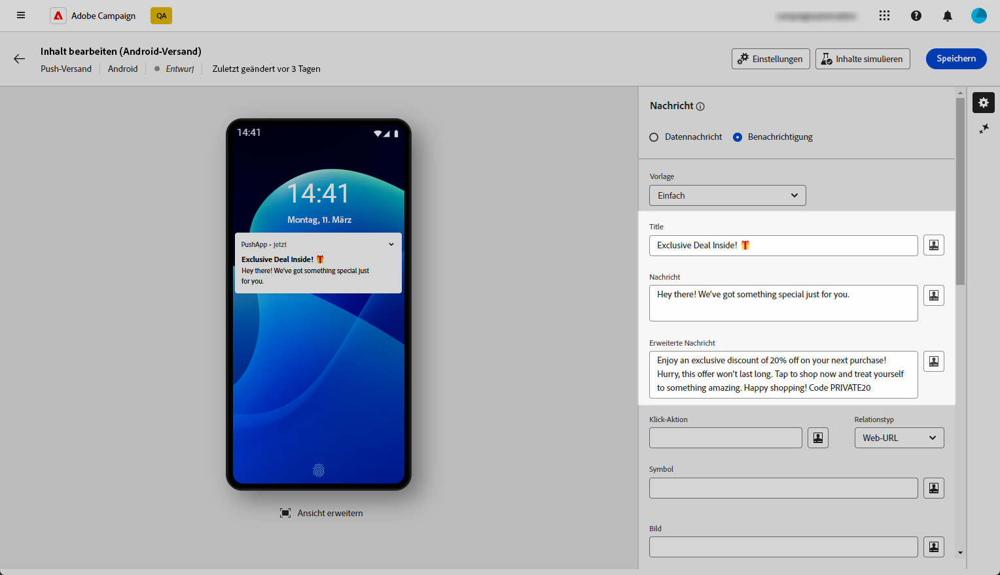
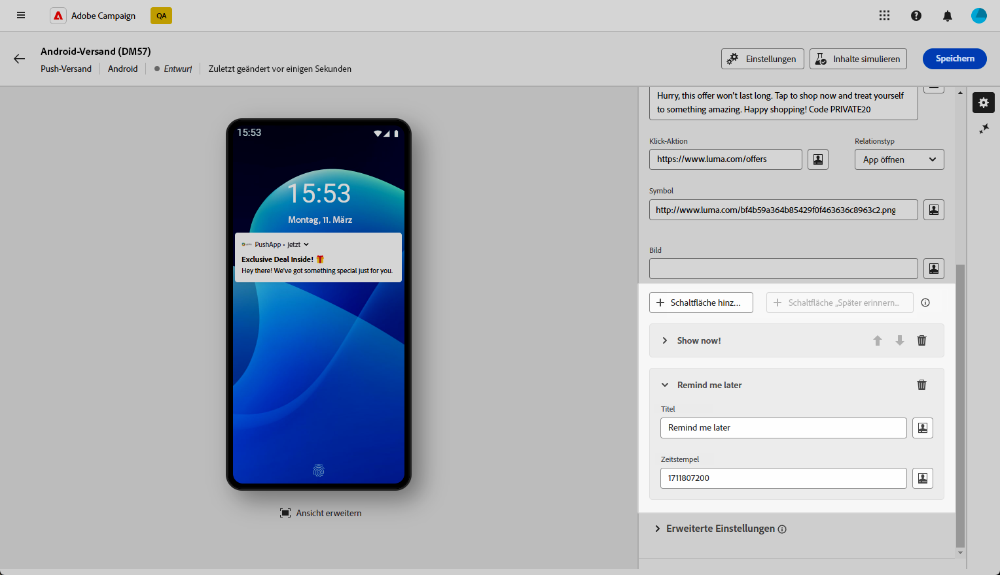
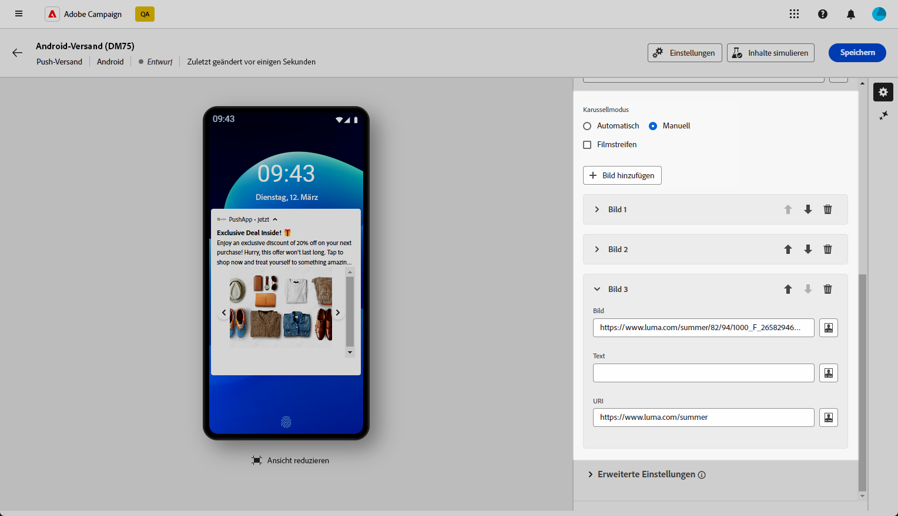
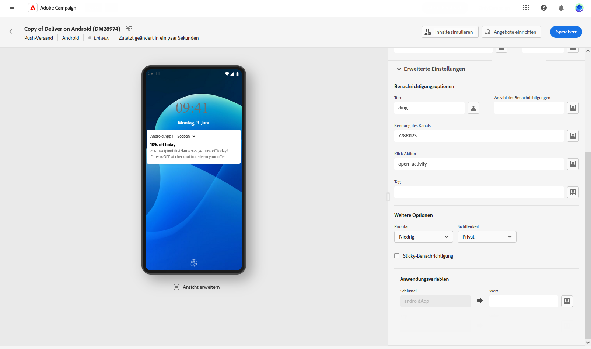

# Erstellen eines Rich-Push-Versands für Android {#rich-push}

>[!CONTEXTUALHELP]
>id="acw_homepage_welcome_rn4"
>title="Rich-Push-Versand"
>abstract="Sie können nun Rich-Push-Benachrichtigungen über Android senden. Derzeit ist diese Funktion nur eingeschränkt verfügbar."
>additional-url="https://experienceleague.adobe.com/docs/campaign-web/v8/release-notes/release-notes.html?lang=de" text="Siehe Versionshinweise"

>[!CONTEXTUALHELP]
>id="acw_deliveries_push_remind_later"
>title="Schaltfläche „Später erinnern“"
>abstract="Die Schaltfläche **Später erinnern** bietet die Möglichkeit, eine Erinnerung zu planen. Das Feld „Zeitstempel“ erfordert einen Wert, der eine Zeitspanne in Sekunden darstellt."

>[!AVAILABILITY]
>
>Diese Funktion ist nur **eingeschränkt verfügbar**.

Bei Firebase Cloud Messaging stehen Ihnen zwei Nachrichtentypen zur Auswahl:

* Die **[!UICONTROL Datenmeldung]** wird von der Client-App verarbeitet. Diese Meldungen werden direkt an die App gesendet, die auf dem Gerät eine Android-Benachrichtigung generiert und anzeigt. Datennachrichten enthalten nur die von Ihnen definierten Anwendungsvariablen.

* Die **[!UICONTROL Benachrichtigungsmeldung]** wird automatisch vom FCM SDK verarbeitet. FCM übernimmt für die Client-App automatisch das Anzeigen der Nachricht auf den Geräten Ihrer Benutzenden. Benachrichtigungsmeldungen enthalten einen vordefinierten Satz von Parametern und Optionen, können aber mit benutzerspezifischen Anwendungsvariablen weiter personalisiert werden.

{zoomable="yes"}

## Festlegen des Inhalts der Benachrichtigung {#push-message}

Sobald Ihr Push-Versand erstellt ist, können Sie seinen Inhalt festlegen. Es sind drei Vorlagen verfügbar:

* Die **Standardvorlage** ermöglicht das Senden von Benachrichtigungen mit einem einfachen Symbol und einem zugehörigen Bild.

* Die **Einfache Vorlage** ermöglicht es Ihnen, Text, Bilder und Schaltflächen in Ihre Benachrichtigungen einfügen.

* Die **Karussell-Vorlage** ermöglicht es Ihnen, Benachrichtigungen mit Text und mehreren Bildern zu senden, zwischen denen die Benutzenden hin und her wischen können.

Navigieren Sie durch die folgenden Registerkarten, um mehr über die Personalisierung dieser Vorlagen zu erfahren.

>[!BEGINTABS]

>[!TAB Standardvorlage]

1. Wählen Sie **[!UICONTROL Standard]** aus der Dropdown-Liste **[!UICONTROL Vorlage]**.

   

1. Um Ihre Nachricht zu erstellen, geben Sie Ihren Text in die Felder **[!UICONTROL Titel]** und **[!UICONTROL Nachricht]** ein.

   

1. Verwenden Sie den Ausdruckseditor, um Inhalte zu definieren, Daten zu personalisieren und dynamische Inhalte hinzuzufügen. [Weitere Informationen](../personalization/personalize.md)

1. Definieren Sie die **[!UICONTROL Klick-Aktion]**, die mit einem Benutzerklick auf Ihre Benachrichtigung verbunden ist. Dies bestimmt das Verhalten bei der Interaktion der Benutzenden mit der Benachrichtigung, z. B. beim Öffnen eines bestimmten Bildschirms oder beim Ausführen einer bestimmten Aktion in der App.

1. Push-Benachrichtigungen können weiter personalisiert werden. Dazu können Sie eine **[!UICONTROL Bild]**-URL auswählen, die der Push-Benachrichtigung hinzugefügt werden soll, sowie das **[!UICONTROL Symbol]** der Benachrichtigung, das auf den Geräten Ihrer Profile angezeigt werden soll.

   

1. Konfigurieren Sie die **[!UICONTROL erweiterten Einstellungen]** Ihrer Push-Benachrichtigung. [Weitere Informationen](#push-advanced)

Nachdem Sie den Nachrichteninhalt definiert haben, können Sie Testabonnentinnen und -abonnenten einsetzen, um die Nachricht in einer Vorschau anzuzeigen und zu testen.

>[!TAB Einfache Vorlage]

1. Wählen Sie **[!UICONTROL Einfach]** aus der Dropdown-Liste **[!UICONTROL Vorlage]**.

   

1. Um Ihre Nachricht zu erstellen, geben Sie Ihren Text in die Felder **[!UICONTROL Titel]**, **[!UICONTROL Nachricht]** und **[!UICONTROL Erweiterte Nachricht]** ein.

   Der Text der **[!UICONTROL Nachricht]** wird in der ausgeblendeten Ansicht angezeigt, während die **[!UICONTROL Erweiterte Nachricht]** angezeigt wird, wenn die Benachrichtigung erweitert wird.

   

1. Verwenden Sie den Ausdruckseditor, um Inhalte zu definieren, Daten zu personalisieren und dynamische Inhalte hinzuzufügen. [Weitere Informationen](../personalization/personalize.md)

1. Fügen Sie die URL hinzu, die die **[!UICONTROL Klick-Aktion]** definiert, die mit einem Benutzerklick auf Ihre Benachrichtigung verbunden ist. Dies bestimmt das Verhalten bei der Interaktion der Benutzenden mit der Benachrichtigung, z. B. beim Öffnen eines bestimmten Bildschirms oder beim Ausführen einer bestimmten Aktion in der App.

1. Wählen Sie den **[!UICONTROL Link-Typ]** der URL, die Sie zum Feld **[!UICONTROL Klick-Aktion]** hinzugefügt haben:

   * **[!UICONTROL Web-URL]**: Web-URLs leiten Benutzende zu Online-Inhalten weiter. Beim Anklicken öffnen sie den Standard-Webbrowser des Geräts und navigieren zu der angegebenen URL.

   * **[!UICONTROL Deeplink]**: Deeplinks sind URLs, die Benutzende zu bestimmten Abschnitten in einer App führen, selbst wenn die App geschlossen ist. Beim Anklicken kann ein Dialogfeld angezeigt werden, in dem Benutzende aus verschiedenen Apps wählen können, die den Link verarbeiten können.

   * **[!UICONTROL Open App]**: Open App-URLs ermöglichen es Ihnen, sich direkt mit Inhalten innerhalb einer Anwendung zu verbinden. Diese Art von URL ermöglicht es Ihrer Anwendung, sich als Standard-Handler für einen bestimmten Link-Typ zu etablieren und so das Dialogfeld zur Disambiguierung zu umgehen.

   Weitere Informationen über die Handhabung von Android-App-Links finden Sie in der [Entwicklerdokumentation zu Android](https://developer.android.com/training/app-links).

   

1. Push-Benachrichtigungen können weiter personalisiert werden. Dazu können Sie eine **[!UICONTROL Bild]**-URL auswählen, die der Push-Benachrichtigung hinzugefügt werden soll, sowie das **[!UICONTROL Symbol]** der Benachrichtigung, das auf den Geräten Ihrer Profile angezeigt werden soll.

1. Klicken Sie auf **[!UICONTROL Schaltfläche hinzufügen]** und füllen Sie folgende Felder aus:

   * **[!UICONTROL Titel]**: Text, der auf der Schaltfläche angezeigt wird.
   * **[!UICONTROL Link-URI]**: Geben Sie den URI an, der beim Klicken auf die Schaltfläche ausgeführt werden soll.
   * **[!UICONTROL Link-Typ]**: Wählen Sie als Link-Typ entweder **[!UICONTROL Web-URL]**, **[!UICONTROL Deeplink]** oder **[!UICONTROL Open App]**.

   Sie haben die Möglichkeit, bis zu drei Schaltflächen in Ihre Push-Benachrichtigung einzubauen. Wenn Sie sich für die **[!UICONTROL Schaltfläche „Später erinnern“]** entscheiden, können Sie maximal zwei Schaltflächen einfügen.

   

1. Klicken Sie auf die Schaltfläche **[!UICONTROL „Später erinnern“ hinzufügen]**, um Ihrer Push-Benachrichtigung die Option „Später erinnern“ hinzuzufügen. Geben Sie einen **[!UICONTROL Titel]** und einen **[!UICONTROL Zeitstempel]** an.

   Das Feld „Zeitstempel“ erfordert einen Wert, der eine Zeitspanne in Sekunden darstellt.

   

1. Konfigurieren Sie die **[!UICONTROL erweiterten Einstellungen]** Ihrer Push-Benachrichtigung. [Weitere Informationen](#push-advanced)

Nachdem Sie den Nachrichteninhalt definiert haben, können Sie Testabonnentinnen und -abonnenten einsetzen, um die Nachricht in einer Vorschau anzuzeigen und zu testen.

>[!TAB Karussell-Vorlage]

1. Wählen Sie **[!UICONTROL Karussell]** aus der Dropdown-Liste **[!UICONTROL Vorlage]**.

   

1. Um Ihre Nachricht zu erstellen, geben Sie Ihren Text in die Felder **[!UICONTROL Titel]**, **[!UICONTROL Nachricht]** und **[!UICONTROL Erweiterte Nachricht]** ein.

   Der Text der **[!UICONTROL Nachricht]** wird in der ausgeblendeten Ansicht angezeigt, während die **[!UICONTROL Erweiterte Nachricht]** angezeigt wird, wenn die Benachrichtigung erweitert wird.

   

1. Verwenden Sie den Ausdruckseditor, um Inhalte zu definieren, Daten zu personalisieren und dynamische Inhalte hinzuzufügen. [Weitere Informationen](../personalization/personalize.md)

1. Fügen Sie die URL hinzu, die die **[!UICONTROL Klick-Aktion]** definiert, die mit einem Benutzerklick auf Ihre Benachrichtigung verbunden ist. Dies bestimmt das Verhalten bei der Interaktion der Benutzenden mit der Benachrichtigung, z. B. beim Öffnen eines bestimmten Bildschirms oder beim Ausführen einer bestimmten Aktion in der App.

1. Wählen Sie den **[!UICONTROL Link-Typ]** der URL aus, die Sie in das Feld **[!UICONTROL Klick-Aktion]** eingefügt haben:

   * **[!UICONTROL Web URL]**: Web-URLs leiten Benutzende zu Online-Inhalten weiter. Beim Anklicken öffnen sie den Standard-Webbrowser des Geräts und navigieren zu der angegebenen URL.

   * **[!UICONTROL Deeplink]**: Deeplinks sind URLs, die Benutzende zu bestimmten Abschnitten in einer App führen, selbst wenn die App geschlossen ist. Beim Anklicken kann ein Dialogfeld angezeigt werden, in dem Benutzende aus verschiedenen Apps wählen können, die den Link verarbeiten können.

   * **[!UICONTROL Open App]**: Open App-URLs ermöglichen es Ihnen, sich direkt mit Inhalten innerhalb einer Anwendung zu verbinden. Diese Art von URL ermöglicht es Ihrer Anwendung, sich als Standard-Handler für einen bestimmten Link-Typ zu etablieren und so das Dialogfeld zur Disambiguierung zu umgehen.

   Weitere Informationen über die Handhabung von Android-App-Links finden Sie in der [Entwicklerdokumentation zu Android](https://developer.android.com/training/app-links).

   

1. Um Ihre Push-Benachrichtigung weiter zu personalisieren, können Sie das **[!UICONTROL Symbol]** der Benachrichtigung auswählen, das auf den Geräten Ihrer Profile angezeigt werden soll.

1. Wählen Sie, wie das **[!UICONTROL Karussell]** bedient werden soll:

   * **[!UICONTROL Automatisch]**: Die Bilder werden automatisch in vordefinierten Intervallen als Folien wiedergegeben.
   * **[!UICONTROL Manuell]**: Benutzende können manuell zwischen den Folien streichen, um durch die Bilder zu navigieren.

     Aktivieren Sie die Option **[!UICONTROL Filmstreifen]**, um die Vorschau der vorherigen und der nächsten Bilder neben der Hauptfolie einzuschließen.

1. Klicken Sie auf **[!UICONTROL Bild hinzufügen]** und geben Sie Ihre Bild-URL und Ihren Text ein.

   Stellen Sie sicher, dass Sie mindestens drei und maximal fünf Bilder einfügen.

   

1. Bearbeiten Sie die Reihenfolge Ihrer Bilder mit den nach oben bzw. nach unten zeigenden Pfeilen.

1. Konfigurieren Sie die **[!UICONTROL erweiterten Einstellungen]** Ihrer Push-Benachrichtigung. [Weitere Informationen](#push-advanced)

Nachdem Sie den Nachrichteninhalt definiert haben, können Sie Testabonnentinnen und -abonnenten einsetzen, um die Nachricht in einer Vorschau anzuzeigen und zu testen.

>[!ENDTABS]

## Erweiterte Einstellungen für Push-Benachrichtigungen {#push-advanced}

{zoomable="yes"}

| Parameter | Beschreibung |
|---------|---------|
| **[!UICONTROL Symbolfarbe]** | Legen Sie die Farbe Ihres Symbols mit Ihren Hexadezimal-Farb-Codes fest. |
| **[!UICONTROL Titelfarbe]** | Legen Sie die Farbe Ihres Titels mit Ihren Hexadezimal-Farb-Codes fest. |
| **[!UICONTROL Farbe des Nachrichtentextes]** | Legen Sie die Farbe Ihres Nachrichtentextes mit Ihren Hexadezimal-Farb-Codes fest. |
| **[!UICONTROL Hintergrundfarbe der Benachrichtigungen]** | Legt die Farbe des Benachrichtigungshintergrunds mit den gewünschten Hexadezimal-Farb-Codes fest. |
| **[!UICONTROL Ton]** | Legt den Ton fest, der abgespielt werden soll, wenn das Gerät Ihre Benachrichtigung erhält. |
| **[!UICONTROL Anzahl der Benachrichtigungen]** | Legt die Zahl der neuen ungelesenen Informationen fest, die direkt auf dem Symbol der App angezeigt werden. Dadurch können die Benutzenden schnell die Anzahl der ausstehenden Benachrichtigungen sehen. |
| **[!UICONTROL Kanal-ID]** | Legen Sie die Kanal-ID Ihrer Benachrichtigung fest. Die App muss einen Kanal mit dieser Kanal-ID erstellen, bevor eine Benachrichtigung mit dieser Kanal-ID empfangen werden kann. |
| **[!UICONTROL Tag]** | Legt eine Kennung fest, die zum Ersetzen bestehender Benachrichtigungen in der Benachrichtigungsablage verwendet wird. Dadurch wird verhindert, dass sich mehrere Benachrichtigungen ansammeln, und sichergestellt, dass nur die jeweils letzte relevante Benachrichtigung angezeigt wird. |
| **[!UICONTROL Priorität]** | Legen Sie die Prioritätsstufe Ihrer Benachrichtigung fest. Dies kann „Standard“, „Minimum“, „Niedrig“ oder „Hoch“ sein. Die Prioritätsstufe bestimmt die Wichtigkeit und Dringlichkeit der Benachrichtigung und beeinflusst deren Anzeige sowie die Frage, ob sie bestimmte Systemeinstellungen umgehen kann. Weitere Informationen hierzu finden Sie in der [FCM-Dokumentation](https://firebase.google.com/docs/reference/fcm/rest/v1/projects.messages#notificationpriority). |
| **[!UICONTROL Sichtbarkeit]** | Legen Sie die Sichtbarkeitsstufe Ihrer Benachrichtigung fest. Dies kann öffentlich, privat oder geheim sein. Die Sichtbarkeitsstufe bestimmt, wie viel des Benachrichtigungsinhalts auf dem Sperrbildschirm und anderen sensiblen Bereichen angezeigt wird. Weitere Informationen finden Sie in der [FCM-Dokumentation](https://firebase.google.com/docs/reference/fcm/rest/v1/projects.messages#visibility). |
| **[!UICONTROL Sticky-Benachrichtigung]** | Wenn diese Option aktiviert ist, bleibt die Benachrichtigung auch dann sichtbar, wenn darauf geklickt wird.  Wenn sie deaktiviert ist, wird die Benachrichtigung automatisch verworfen, sobald damit interagiert wird. Durch das Sticky-Verhalten können wichtige Benachrichtigungen über längere Zeiträume auf dem Bildschirm beibehalten werden. |
| **[!UICONTROL Anwendungsvariablen]** | Damit können Sie das Verhalten von Benachrichtigungen definieren. Diese Variablen sind vollständig anpassbar und Teil der an das Mobilgerät gesendeten Nachrichten-Payload. |
