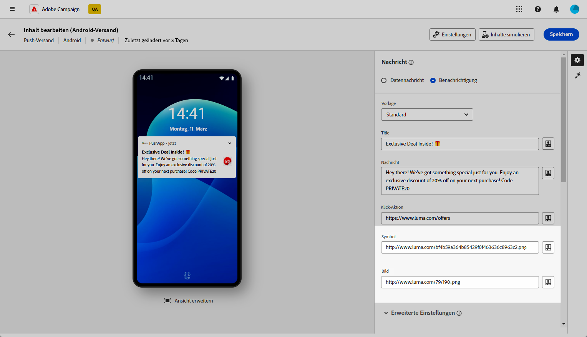
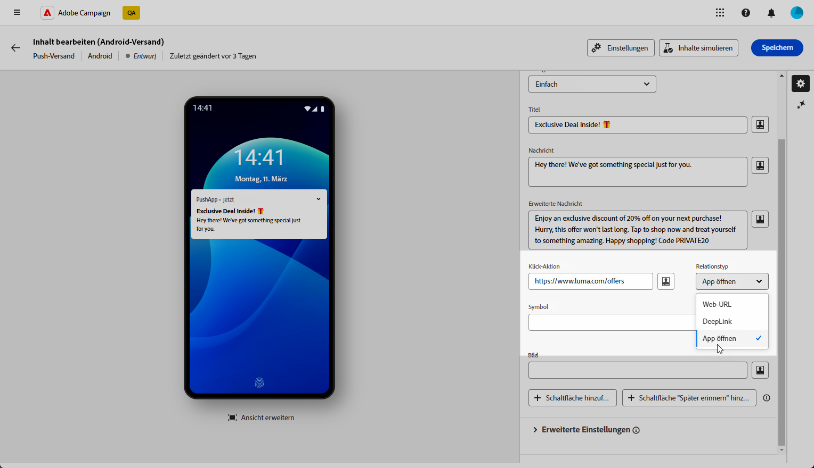
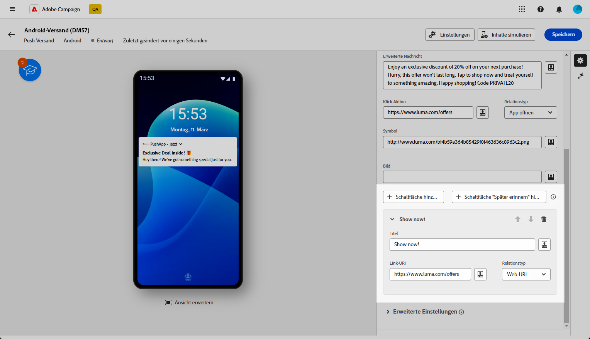
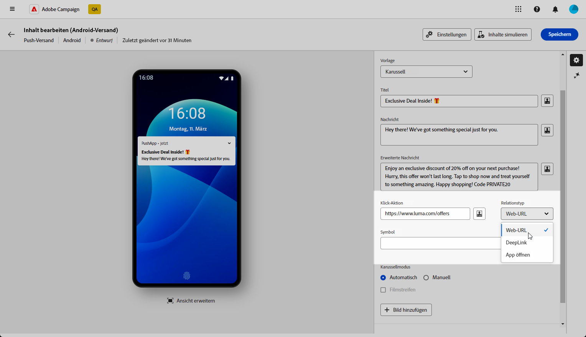

# Erstellen eines Rich-Push-Versands für Android {#content-push}

Bei Firebase Cloud Messaging stehen Ihnen zwei Nachrichtentypen zur Auswahl:

* Die **[!UICONTROL Datenmeldung]** wird von der Client-App verarbeitet. Diese Meldungen werden direkt an die App gesendet, die auf dem Gerät eine Android-Benachrichtigung generiert und anzeigt. Datennachrichten enthalten nur die von Ihnen definierten Anwendungsvariablen.

* Die **[!UICONTROL Benachrichtigungsmeldung]** wird automatisch vom FCM SDK verarbeitet. FCM übernimmt für die Client-App automatisch das Anzeigen der Nachricht auf den Geräten Ihrer Benutzenden. Benachrichtigungsmeldungen enthalten einen vordefinierten Satz von Parametern und Optionen, können aber mit benutzerspezifischen Anwendungsvariablen weiter personalisiert werden.

{zoomable=&quot;yes&quot;}

## Festlegen des Inhalts der Benachrichtigung {#push-message}

Sobald Ihr Push-Versand erstellt ist, können Sie seinen Inhalt festlegen. Auf den folgenden Registerkarten erfahren Sie, wie Sie Ihre Nachricht für jede Vorlage erstellen.

Drei Vorlagen stehen zur Verfügung:

* **Standardvorlage** ermöglicht den Versand von Benachrichtigungen mit einem einfachen Symbol und einem zugehörigen Bild.

* **Grundlegende Vorlage** Sie können Text, Bilder und Schaltflächen in Ihre Benachrichtigungen einfügen.

* **Karussellvorlage** ermöglicht es Ihnen, Benachrichtigungen mit Text und mehreren Bildern zu senden, durch die Benutzer wischen können.

Navigieren Sie durch die folgenden Registerkarten, um mehr über die Personalisierung dieser Vorlagen zu erfahren.

>[!BEGINTABS]

>[!TAB Standardvorlage]

1. Aus dem **[!UICONTROL Vorlage]** Dropdown-Liste auswählen **[!UICONTROL Standard]**.

   

1. Um Ihre Nachricht zu erstellen, geben Sie Ihren Text in das Feld **[!UICONTROL Titel]** und **[!UICONTROL Nachricht]** -Felder.

   

1. Verwenden Sie den Ausdruckseditor, um Inhalte zu definieren, Daten zu personalisieren und dynamischen Inhalt hinzuzufügen. [Weitere Informationen](../personalization/personalize.md)

1. Definieren Sie die **[!UICONTROL Klickaktion]** einem Benutzer zugeordnet ist, klicken Sie auf Ihre Benachrichtigung. Dies bestimmt das Verhalten bei der Interaktion der Benutzenden mit der Benachrichtigung, z. B. beim Öffnen eines bestimmten Bildschirms oder beim Ausführen einer bestimmten Aktion in der App.

1. Um Ihre Push-Benachrichtigung weiter zu personalisieren, können Sie eine **[!UICONTROL Bild]** URL, die zu Ihrer Push-Benachrichtigung und dem **[!UICONTROL Symbol]** auf den Geräten Ihrer Profile angezeigt werden.

   

1. Konfigurieren Sie die **[!UICONTROL Erweiterte Einstellungen]** Ihrer Push-Benachrichtigung. [Weitere Informationen](#push-advanced)

Nachdem Sie den Nachrichteninhalt definiert haben, können Sie Testabonnenten verwenden, um die Nachricht in der Vorschau anzuzeigen und zu testen.

>[!TAB Grundlegende Vorlage]

1. Aus dem **[!UICONTROL Vorlage]** Dropdown-Liste auswählen **[!UICONTROL Allgemein]**.

   

1. Um Ihre Nachricht zu erstellen, geben Sie Ihren Text in das Feld **[!UICONTROL Titel]**, **[!UICONTROL Nachricht]** und **[!UICONTROL Erweiterte Nachricht]** -Felder.

   Die **[!UICONTROL Nachricht]** Text wird in der ausgeblendeten Ansicht angezeigt, während die **[!UICONTROL Erweiterte Nachricht]** wird angezeigt, wenn die Benachrichtigung erweitert wird.

   

1. Verwenden Sie den Ausdruckseditor, um Inhalte zu definieren, Daten zu personalisieren und dynamischen Inhalt hinzuzufügen. [Weitere Informationen](../personalization/personalize.md)

1. Fügen Sie die URL hinzu, die die **[!UICONTROL Klickaktion]** einem Benutzer zugeordnet ist, klicken Sie auf Ihre Benachrichtigung. Dies bestimmt das Verhalten bei der Interaktion der Benutzenden mit der Benachrichtigung, z. B. beim Öffnen eines bestimmten Bildschirms oder beim Ausführen einer bestimmten Aktion in der App.

1. Wählen Sie die **[!UICONTROL Link-Typ]** der URL, die Sie zum **[!UICONTROL Klickaktion]** -Feld:

   * **[!UICONTROL Web-URL]**: Web-URLs leiten Benutzer zu Online-Inhalten weiter. Nach dem Klicken wird der Standard-Webbrowser des Geräts aufgefordert, zu öffnen und zur angegebenen URL zu navigieren.

   * **[!UICONTROL Deeplink]**: Deep-Links sind URLs, die Benutzer zu bestimmten Abschnitten in einer App führen, selbst wenn die App geschlossen ist. Beim Klicken kann ein Dialogfeld angezeigt werden, in dem Benutzer aus verschiedenen Apps wählen können, die den Link verarbeiten können.

   * **[!UICONTROL App öffnen]**: Öffnen Sie App-URLs , um innerhalb einer Anwendung eine direkte Verbindung zu Inhalten herzustellen. Dadurch kann Ihre Anwendung sich selbst als Standard-Handler für einen bestimmten Link einrichten, wobei das Dialogfeld zur Unterscheidung umgangen wird.

   Weitere Informationen zum Umgang mit Android-App-Links finden Sie unter [Dokumentation für Android-Entwickler](https://developer.android.com/training/app-links).

   

1. Um Ihre Push-Benachrichtigung weiter zu personalisieren, können Sie eine **[!UICONTROL Bild]** URL, die zu Ihrer Push-Benachrichtigung und dem **[!UICONTROL Symbol]** auf den Geräten Ihrer Profile angezeigt werden.

1. Klicks **[!UICONTROL Schaltfläche hinzufügen]** und füllen Sie folgende Felder aus:

   * **[!UICONTROL Titel]**: Auf der Schaltfläche angezeigter Text.
   * **[!UICONTROL Link-URI]**: Geben Sie den URI an, der beim Klicken auf die Schaltfläche ausgeführt werden soll.
   * **[!UICONTROL Link-Typ]**: Link-Typ entweder **[!UICONTROL Web-URL]**, **[!UICONTROL Deeplink]** oder **[!UICONTROL App öffnen]**.

   Sie haben die Möglichkeit, bis zu drei Schaltflächen in Ihre Push-Benachrichtigung einzuschließen. Wenn Sie sich für die **[!UICONTROL Schaltfläche &quot;Später erinnern&quot;]** können Sie nur maximal zwei Schaltflächen einfügen.

   

1. Klicks **[!UICONTROL Erinnerung später hinzufügen]** -Schaltfläche, um Ihrer Push-Benachrichtigung die Option Später erinnern hinzuzufügen. Geben Sie einen **[!UICONTROL Titel]** und **[!UICONTROL Zeitstempel]**.

   Das Feld Zeitstempel erwartet einen Wert, der eine Epoche in Sekunden darstellt.

   

1. Konfigurieren Sie die **[!UICONTROL Erweiterte Einstellungen]** Ihrer Push-Benachrichtigung. [Weitere Informationen](#push-advanced)

Nachdem Sie den Nachrichteninhalt definiert haben, können Sie Testabonnenten verwenden, um die Nachricht in der Vorschau anzuzeigen und zu testen.

>[!TAB Karussellvorlage]

1. Aus dem **[!UICONTROL Vorlage]** Dropdown-Liste auswählen **[!UICONTROL Karussell]**.

   

1. Um Ihre Nachricht zu erstellen, geben Sie Ihren Text in das Feld **[!UICONTROL Titel]**, **[!UICONTROL Nachricht]** und **[!UICONTROL Erweiterte Nachricht]** -Felder.

   Die **[!UICONTROL Nachricht]** Text wird in der ausgeblendeten Ansicht angezeigt, während die **[!UICONTROL Erweiterte Nachricht]** wird angezeigt, wenn die Benachrichtigung erweitert wird.

   

1. Verwenden Sie den Ausdruckseditor, um Inhalte zu definieren, Daten zu personalisieren und dynamischen Inhalt hinzuzufügen. [Weitere Informationen](../personalization/personalize.md)

1. Fügen Sie die URL hinzu, die die **[!UICONTROL Klickaktion]** einem Benutzer zugeordnet ist, klicken Sie auf Ihre Benachrichtigung. Dies bestimmt das Verhalten bei der Interaktion der Benutzenden mit der Benachrichtigung, z. B. beim Öffnen eines bestimmten Bildschirms oder beim Ausführen einer bestimmten Aktion in der App.

1. Wählen Sie die **[!UICONTROL Link-Typ]** der URL, die Sie zum **[!UICONTROL Klickaktion]** -Feld:

   * **[!UICONTROL Web URL]**L: Web-URLs leiten Benutzer zu Online-Inhalten weiter. Nach dem Klicken wird der Standard-Webbrowser des Geräts aufgefordert, zu öffnen und zur angegebenen URL zu navigieren.

   * **[!UICONTROL Deeplink]**: Deep-Links sind URLs, die Benutzer zu bestimmten Abschnitten in einer App führen, selbst wenn die App geschlossen ist. Beim Klicken kann ein Dialogfeld angezeigt werden, in dem Benutzer aus verschiedenen Apps wählen können, die den Link verarbeiten können.

   * **[!UICONTROL App öffnen]**: Öffnen Sie App-URLs , um innerhalb einer Anwendung eine direkte Verbindung zu Inhalten herzustellen. Dadurch kann Ihre Anwendung sich selbst als Standard-Handler für einen bestimmten Link einrichten, wobei das Dialogfeld zur Unterscheidung umgangen wird.

   Weitere Informationen zum Umgang mit Android-App-Links finden Sie unter [Dokumentation für Android-Entwickler](https://developer.android.com/training/app-links).

   

1. Um Ihre Push-Benachrichtigung weiter zu personalisieren, können Sie die **[!UICONTROL Symbol]** auf den Geräten Ihrer Profile angezeigt werden.

1. Wählen Sie aus, wie **[!UICONTROL Karussell]** betrieben wird:

   * **[!UICONTROL Auto]**: durchläuft Bilder automatisch als Folien, wobei die Bilder in vordefinierten Intervallen durchlaufen werden.
   * **[!UICONTROL Manuell]**: ermöglicht Benutzern das manuelle Wischen zwischen Folien, um durch die Bilder zu navigieren.

     Aktivieren Sie die **[!UICONTROL Filmstreifen]** -Option, um die Vorschau der vorherigen und der nächsten Bilder neben der Hauptfolie einzuschließen.

1. Klicks **[!UICONTROL Bild hinzufügen]** und geben Sie Ihre Bild-URL und Ihren Text ein.

   Stellen Sie sicher, dass Sie mindestens drei Bilder und maximal fünf Bilder einfügen.

   

1. Bearbeiten Sie die Reihenfolge Ihrer Bilder mit dem Pfeil nach unten und nach oben.

1. Konfigurieren Sie die **[!UICONTROL Erweiterte Einstellungen]** Ihrer Push-Benachrichtigung. [Weitere Informationen](#push-advanced)

Nachdem Sie den Nachrichteninhalt definiert haben, können Sie Testabonnenten verwenden, um die Nachricht in der Vorschau anzuzeigen und zu testen.

>[!ENDTABS]

## Erweiterte Einstellungen für Push-Benachrichtigungen {#push-advanced}

{zoomable=&quot;yes&quot;}

| Parameter | Beschreibung |
|---------|---------|
| **[!UICONTROL Symbolfarbe]** | Legen Sie die Farbe Ihres Symbols mit Ihren Hexadezimalfarbcodes fest. |
| **[!UICONTROL Titelfarbe]** | Legen Sie die Farbe Ihres Titels mit Ihren Hexadezimalfarbcodes fest. |
| **[!UICONTROL Textfarbe der Nachricht]** | Legen Sie die Farbe Ihres Nachrichtentextes mit Ihren Hexadezimalfarbcodes fest. |
| **[!UICONTROL Hintergrundfarbe für Benachrichtigungen]** | Legen Sie die Farbe Ihres Benachrichtigungshintergrunds mit Ihren Hexadezimalfarbcodes fest. |
| **[!UICONTROL Ton]** | Legt den Ton fest, der abgespielt werden soll, wenn das Gerät Ihre Benachrichtigung erhält. |
| **[!UICONTROL Anzahl der Benachrichtigungen]** | Legt die Zahl der neuen ungelesenen Informationen fest, die direkt auf dem Symbol der App angezeigt werden. Dadurch können die Benutzenden schnell die Anzahl der ausstehenden Benachrichtigungen sehen. |
| **[!UICONTROL Kanal-ID]** | Legen Sie die Kanal-ID Ihrer Benachrichtigung fest. Die Mobile App muss einen Kanal mit dieser Kanal-ID erstellen, bevor eine Benachrichtigung mit dieser Kanal-ID empfangen werden kann. |
| **[!UICONTROL Tag]** | Legt eine Kennung fest, die zum Ersetzen bestehender Benachrichtigungen in der Benachrichtigungsablage verwendet wird. Dadurch wird verhindert, dass sich mehrere Benachrichtigungen ansammeln, und sichergestellt, dass nur die jeweils letzte relevante Benachrichtigung angezeigt wird. |
| **[!UICONTROL Priorität]** | Legen Sie die Prioritätsstufe Ihrer Benachrichtigung fest. Dies kann „Standard“, „Minimum“, „Niedrig“ oder „Hoch“ sein. Die Prioritätsstufe bestimmt die Wichtigkeit und Dringlichkeit der Benachrichtigung und beeinflusst deren Anzeige sowie die Frage, ob sie bestimmte Systemeinstellungen umgehen kann. Weitere Informationen hierzu finden Sie in der [FCM-Dokumentation](https://firebase.google.com/docs/reference/fcm/rest/v1/projects.messages#notificationpriority). |
| **[!UICONTROL Sichtbarkeit]** | Legen Sie die Sichtbarkeitsstufe Ihrer Benachrichtigung fest. Dies kann öffentlich, privat oder geheim sein. Die Sichtbarkeitsstufe bestimmt, wie viel des Benachrichtigungsinhalts auf dem Sperrbildschirm und anderen sensiblen Bereichen angezeigt wird. Weitere Informationen finden Sie in der [FCM-Dokumentation](https://firebase.google.com/docs/reference/fcm/rest/v1/projects.messages#visibility). |
| **[!UICONTROL Sticky-Benachrichtigung]** | Wenn diese Option aktiviert ist, bleibt die Benachrichtigung auch dann sichtbar, wenn darauf geklickt wird.  Wenn sie deaktiviert ist, wird die Benachrichtigung automatisch verworfen, sobald damit interagiert wird. Durch das Sticky-Verhalten können wichtige Benachrichtigungen über längere Zeiträume auf dem Bildschirm beibehalten werden. |
| **[!UICONTROL Anwendungsvariablen]** | Damit können Sie das Verhalten von Benachrichtigungen definieren. Diese Variablen sind vollständig anpassbar und Teil der an das Mobilgerät gesendeten Nachrichten-Payload. |
