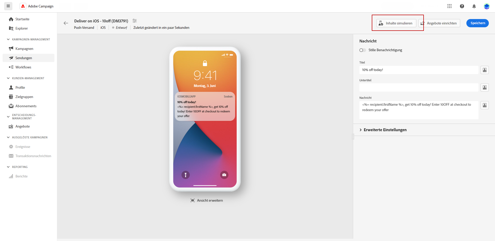
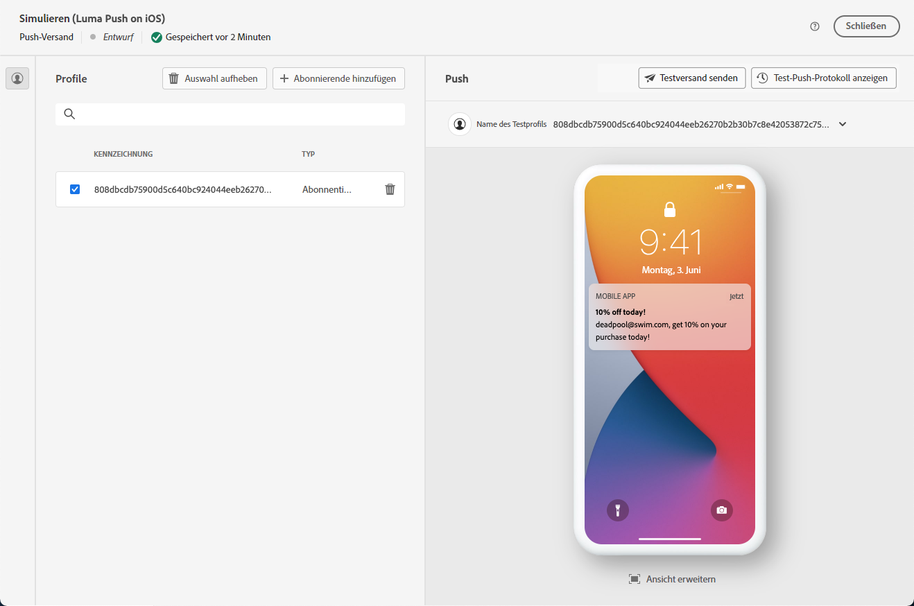
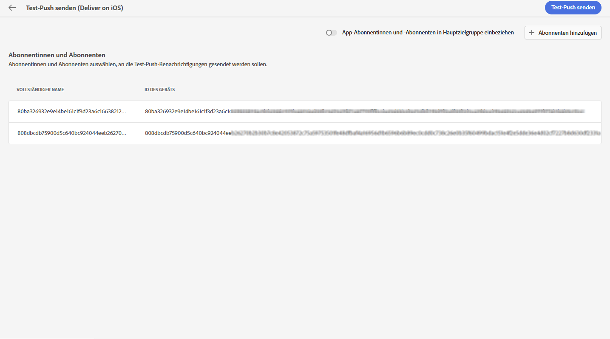
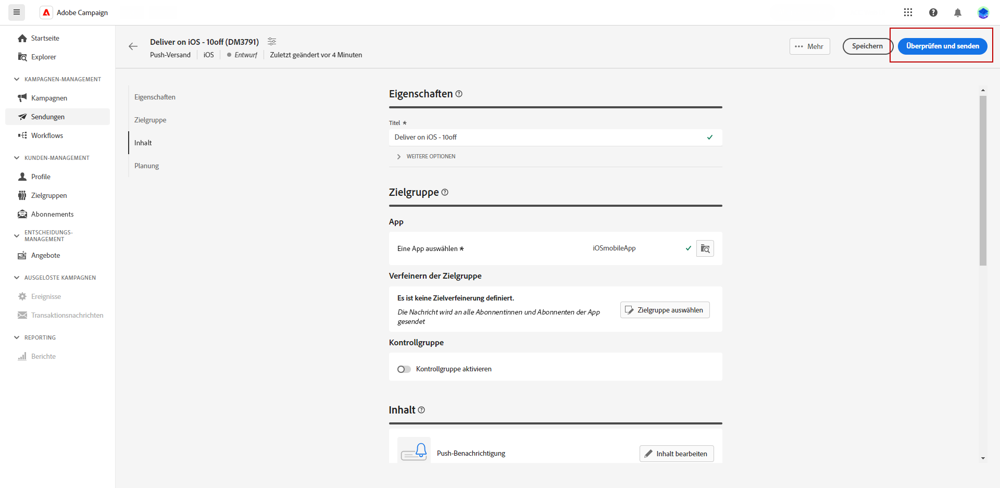
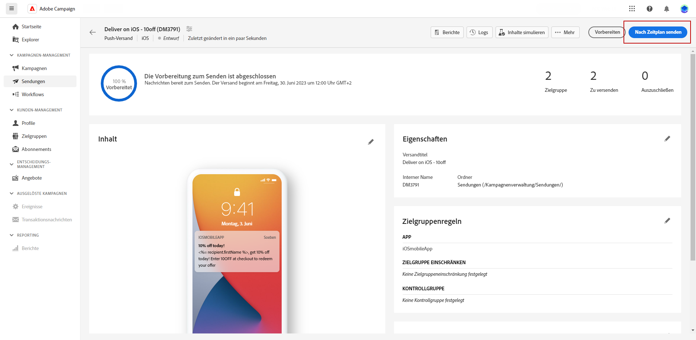

# Vorschau und Senden eines Push-Versands {#send-push-delivery}

## Vorschau Ihres Push-Benachrichtigungs-Versands {#preview-push}

Nachdem Sie den Nachrichteninhalt definiert haben, können Sie Testabonnentinnen und Testabonnenten einsetzen, um die Nachricht in einer Vorschau anzuzeigen und zu testen. Wenn Sie personalisierten Inhalt eingefügt haben, können Sie mithilfe von Testprofildaten prüfen, wie dieser Inhalt in der Nachricht angezeigt wird. Dadurch können Sie sicherstellen, dass die Nachricht korrekt wiedergegeben wird und die personalisierten Elemente entsprechend integriert werden.

Die wichtigsten Schritte zum Anzeigen einer Push-Benachrichtigung in einer Vorschau sind: Weitere Informationen über die Vorschau von Sendungen finden Sie in [diesem Abschnitt](../preview-test/preview-content.md).

1. Auf der Seite für den Versandinhalt können Sie über die Option **[!UICONTROL Inhalt simulieren]** personalisierten Inhalt in einer Vorschau anzeigen.

   {zoomable=&quot;yes&quot;}

1. Klicken Sie auf **[!UICONTROL Abonnentin(nen) oder Abonnent(en) hinzufügen]**, um mindestens ein Profil anzuzeigen und dessen Daten im Inhalt der Push-Benachrichtigung in einer Vorschau anzuzeigen.

   <!--Once your test subscribers are selected, click **[!UICONTROL Select]**.
    {zoomable="yes"}-->

1. Im rechten Bereich sehen Sie eine Vorschau der Push-Benachrichtigung, in der personalisierte Elemente dynamisch durch Daten aus dem ausgewählten Profil ersetzt werden.

   {zoomable=&quot;yes&quot;}

Sie können nun Ihre Push-Benachrichtigung überprüfen und an Ihre Zielgruppe senden.

## Testen des Push-Benachrichtigungs-Versands {#test-push}

Verwenden **Adobe Campaign**, können Sie Testsendungen durchführen, bevor Sie diese an Ihre Hauptzielgruppe senden. Dieser Schritt ist bei der Validierung Ihres Versands und der Identifizierung von Problemen wichtig.

Testprofile sind die Testversand-Empfänger. Sie können Komponenten und Einstellungen wie Links, Bilder und Personalisierung überprüfen und validieren, um eine optimale Leistung zu gewährleisten und Fehler zu erkennen. Auf diese Weise können Sie Ihre Push-Benachrichtigungen verfeinern und optimieren, bevor Sie Ihre Hauptzielgruppe erreichen. [Erfahren Sie, wie Sie einen Testversand durchführen](../preview-test/test-deliveries.md#subscribers)

{zoomable=&quot;yes&quot;}

## Senden Ihres Push-Benachrichtigungs-Versands {#send-push}

1. Nachdem Sie den Inhalt Ihrer Push-Benachrichtigung personalisiert haben, klicken Sie auf der Seite **[!UICONTROL Versand]** auf **[!UICONTROL Überprüfen und Senden]**.

   {zoomable=&quot;yes&quot;}

1. Klicken Sie auf **[!UICONTROL Vorbereiten]** und überwachen Sie den Fortschritt und die bereitgestellten Statistiken.

   Wenn Fehler auftreten, finden Sie im Menü „Protokolle“ detaillierte Informationen zum Fehler.

   {zoomable=&quot;yes&quot;}

1. Senden Sie die Nachrichten, indem Sie auf **[!UICONTROL Senden]** klicken, um mit dem endgültigen Versandprozess fortzufahren.

1. Bestätigen Sie den Sendevorgang durch Auswahl der Schaltfläche **[!UICONTROL Senden]**.

   Wenn der Push-Versand geplant wurde, klicken Sie auf die Schaltfläche **[!UICONTROL Nach Zeitplan senden]**. Weitere Informationen zur Versandplanung finden Sie in [diesem Abschnitt](../msg/gs-messages.md#schedule-the-delivery-sending)

   {zoomable=&quot;yes&quot;}

Nach dem Versand können Sie Ihre KPI(Key Performance Indicator)-Daten über Ihre Versandseite und weitere Daten über das Menü **[!UICONTROL Protokolle]** verfolgen.

Nun können Sie beginnen, mit integrierten Berichten die Wirkung Ihrer Nachricht zu messen. [Weitere Informationen](../reporting/push-report.md)
