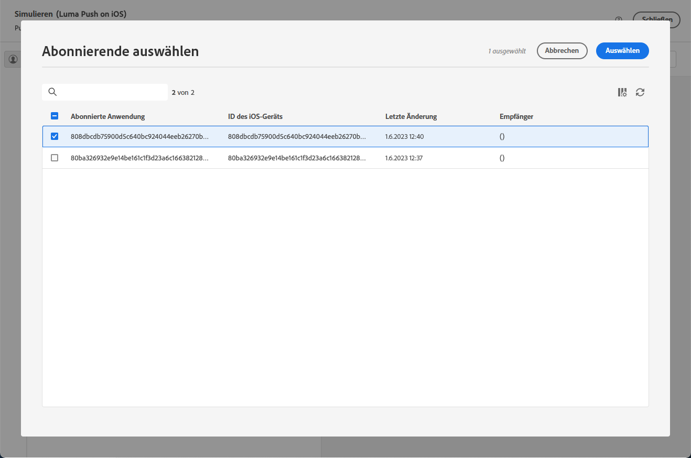

# Vorschau und Senden eines Push-Versands {#send-push-delivery}

## Vorschau Ihres Push-Benachrichtigungs-Versands {#preview-push}

Sobald Sie den Inhalt Ihrer Nachricht definiert haben, können Sie Testabonnierende einsetzen, um die Nachricht in einer Vorschau anzuzeigen und zu testen. Wenn personalisierte Inhalte enthalten sind, überprüfen Sie mithilfe von Testprofildaten, wie diese Inhalte in der Nachricht angezeigt werden. Dadurch wird sichergestellt, dass die Nachricht korrekt gerendert wird und dass die personalisierten Elemente entsprechend integriert werden.

Die wichtigsten Schritte zum Anzeigen einer Push-Benachrichtigung in einer Vorschau sind: Weitere Informationen über die Vorschau von Sendungen finden Sie in [diesem Abschnitt](../preview-test/preview-content.md).

1. Auf der Seite für den Versandinhalt können Sie über die Option **[!UICONTROL Inhalt simulieren]** personalisierten Inhalt in einer Vorschau anzeigen.

   {zoomable="yes"}

1. Klicken Sie auf **[!UICONTROL Abonnentin(nen) oder Abonnent(en) hinzufügen]**, um mindestens ein Profil anzuzeigen und dessen Daten im Inhalt der Push-Benachrichtigung in einer Vorschau anzuzeigen.

   <!--Once your test subscribers are selected, click **[!UICONTROL Select]**.
    {zoomable="yes"}-->

1. Im rechten Bereich sehen Sie eine Vorschau der Push-Benachrichtigung, in der personalisierte Elemente dynamisch durch Daten aus dem ausgewählten Profil ersetzt werden.

   {zoomable="yes"}

Überprüfen Sie Ihre Push-Benachrichtigung und senden Sie sie an Ihre Zielgruppe.

## Testen des Push-Benachrichtigungs-Versands {#test-push}

Mit **Adobe Campaign** können Sie Testsendungen senden, bevor sie an Ihre Hauptzielgruppe gesendet werden. Dieser Schritt validiert den Versand und identifiziert Probleme. 

Testprofile agieren als Empfängerinnen und Empfänger eines Testversands. Diese überprüfen Komponenten und Einstellungen wie Links, Bilder und Personalisierung, um eine optimale Leistung zu gewährleisten und Fehler zu erkennen. Dieser Prozess verfeinert und optimiert Ihre Push-Benachrichtigungen, bevor sie Ihre Hauptzielgruppe erreichen. [Erfahren Sie, wie Testsendungen gesendet werden](../preview-test/test-deliveries.md#subscribers).

{zoomable="yes"}

## Senden Ihres Push-Benachrichtigungs-Versands {#send-push}

1. Nachdem Sie den Inhalt Ihrer Push-Benachrichtigung personalisiert haben, klicken Sie auf der Seite **[!UICONTROL Versand]** auf **[!UICONTROL Überprüfen und Senden]**.

   {zoomable="yes"}

1. Klicken Sie auf **[!UICONTROL Vorbereiten]** und überwachen Sie den Fortschritt und die bereitgestellten Statistiken.

   Wenn Fehler auftreten, finden Sie im Menü „Logs“ detaillierte Informationen dazu.

   {zoomable="yes"}

1. Senden Sie die Nachrichten, indem Sie auf **[!UICONTROL Senden]** klicken, um mit dem endgültigen Versandprozess fortzufahren.

1. Bestätigen Sie den Sendevorgang durch Klicken auf **[!UICONTROL Senden]**.

   Wenn der Push-Versand geplant wurde, klicken Sie auf die Schaltfläche **[!UICONTROL Nach Zeitplan senden]**. Weitere Informationen zur Versandplanung finden Sie in [diesem Abschnitt](../msg/gs-messages.md#schedule-the-delivery-sending).

   {zoomable="yes"}

Sobald der Versand gesendet wurde, verfolgen Sie Ihre Key Performance Indicator(KPI)-Daten über Ihre Versandseite und weitere Daten über das Menü **[!UICONTROL Logs]**.

Messen Sie die Wirkung Ihrer Nachricht mit integrierten Berichten. [Weitere Informationen](../reporting/push-report.md).