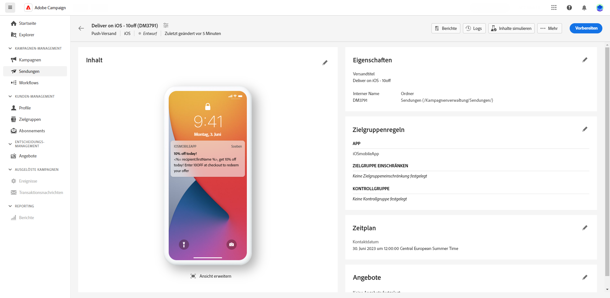

# Push-Benachrichtigungsversand in der Vorschau ansehen und senden {#send-push-delivery}

## Vorschau des Push-Benachrichtigungsversands anzeigen {#preview-push}

Nachdem Sie den Nachrichteninhalt definiert haben, können Sie Testabonnenten verwenden, um die Nachricht in der Vorschau anzuzeigen und zu testen. Wenn Sie personalisierten Inhalt eingefügt haben, können Sie mithilfe von Testprofildaten untersuchen, wie dieser Inhalt in der Nachricht angezeigt wird. Dadurch können Sie sicherstellen, dass die Nachricht korrekt wiedergegeben und die personalisierten Elemente entsprechend integriert werden.

Die wichtigsten Schritte zur Vorschau Ihres SMS-Versands sind: Weitere Informationen zur Versandvorschau finden Sie unter [diesem Abschnitt](../preview-test/preview-content.md).

1. Verwenden Sie auf Ihrer Seite mit den Versandinhalten die **[!UICONTROL Inhalt simulieren]** um eine Vorschau Ihres personalisierten Inhalts anzuzeigen.

   

1. Klicken **[!UICONTROL Abonnenten hinzufügen]** , um ein oder mehrere Profile auszuwählen, um deren Daten im Inhalt der Push-Benachrichtigung in der Vorschau anzuzeigen.

   <!--Once your test subscribers are selected, click **[!UICONTROL Select]**.
    -->

1. Im rechten Bereich finden Sie eine Vorschau der Push-Benachrichtigung, in der personalisierte Elemente dynamisch durch Daten aus dem ausgewählten Profil ersetzt werden.

   

Jetzt können Sie Ihre Push-Benachrichtigung überprüfen und an Ihre Audience senden.

## Testen des Push-Benachrichtigungsversands {#test-push}

Verwenden **Adobe Campaign**können Sie Push-Benachrichtigungen testen, bevor Sie sie an Ihre Hauptzielgruppe senden. Dieser Schritt ist bei der Validierung Ihres Versands und der Identifizierung von Problemen wichtig.
Testempfänger können Elemente wie Links, Bilder und Personalisierungseinstellungen überprüfen, um eine optimale Leistung zu gewährleisten und Fehler zu erkennen. Auf diese Weise können Sie Ihre Push-Benachrichtigungen verfeinern und optimieren, bevor Sie Ihre Hauptzielgruppe erreichen.

 Erfahren Sie, wie Sie Test-Push-Benachrichtigungen senden in [diesem Abschnitt](../preview-test/test-deliveries.md#subscribers).

## Push-Benachrichtigungsversand senden {#send-push}

1. Nachdem Sie den Inhalt Ihrer Push-Benachrichtigung personalisiert haben, klicken Sie auf **[!UICONTROL Überprüfen und Senden]** von **[!UICONTROL Versand]** Seite.

   

1. Klicken **[!UICONTROL Vorbereiten]** und überwachen den Fortschritt und die Statistiken.

   Wenn Fehler auftreten, finden Sie im Menü Protokolle detaillierte Informationen zum Fehler.

   

1. Nachrichten senden, indem Sie auf **[!UICONTROL Senden]** um mit dem endgültigen Versand fortzufahren.

1. Bestätigen Sie den Versand durch Auswahl der **[!UICONTROL Senden]** oder **[!UICONTROL Senden als geplant]** Schaltfläche.

   

Nach dem Versand können Sie Ihre KPI-Daten (Key Performance Indicator) von Ihrer Versandseite und Daten aus der **[!UICONTROL Protokolle]** Menü.

Jetzt können Sie mit integrierten Berichten die Wirkung Ihrer Nachricht messen. [Weitere Informationen](../reporting/push-report.md)
