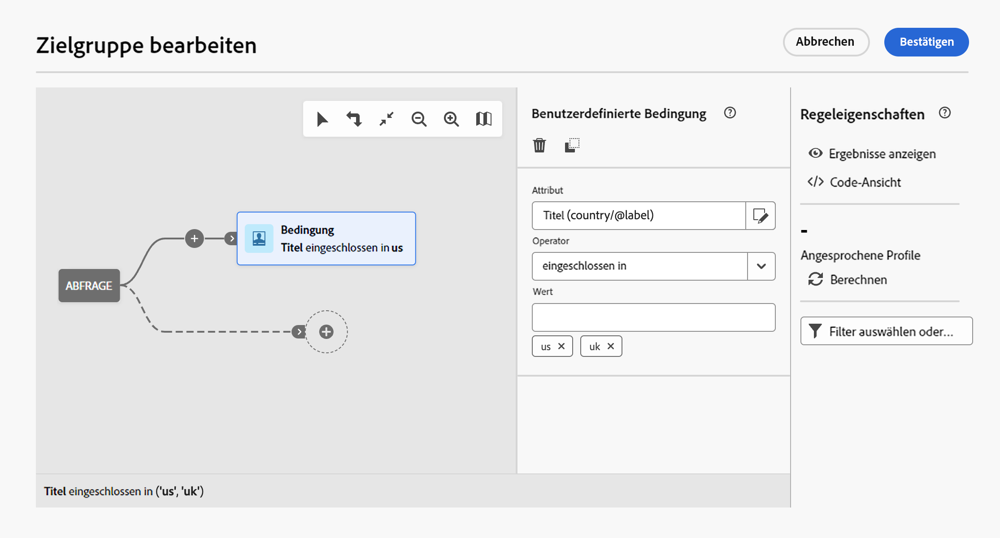

# Erstellen Ihrer ersten Abfrage {#build-query}

Um mit der Erstellung einer Abfrage zu beginnen, greifen Sie je nach der Aktion, die Sie ausführen wollen, vom gewünschten Speicherort aus auf den Abfrage-Modeler zu. Der Abfrage-Modeler wird mit einer leeren Arbeitsfläche geöffnet. Klicken Sie auf die Schaltfläche **+**, um den ersten Knoten der Abfrage zu konfigurieren.

Sie können zwei Elementtypen hinzufügen:

* **Komponenten filtern** (Benutzerdefinierte Bedingung, Zielgruppe auswählen, vordefinierter Filter) ermöglicht es Ihnen, eigene Regeln zu erstellen oder eine Zielgruppe oder einen vordefinierten Filter auszuwählen, um Ihre Abfrage zu verfeinern. [Erfahren Sie, wie Sie mit Filterkomponenten arbeiten können](#filtering)

  Beispiel:

  *Empfängerinnen und Empfänger, die den Newsletter „Sport“ abonniert haben*. *Empfängerinnen und Empfänger mit Wohnsitz in New York*, *Empfängerinnen und Empfänger mit Wohnsitz in San Francisco*

* **Gruppenoperatoren** (UND, ODER, AUSSER) ermöglicht es Ihnen, die Filterkomponenten im Diagramm nach Ihren Bedürfnissen zu gruppieren. [Erfahren Sie, wie man mit Operatoren arbeitet](#filtering)

  Beispiel:

  *Empfängerinnen und Empfänger, die den Newsletter „Sport“ abonniert haben **UND**in New York **ODER**San Francisco* leben.

## Hinzufügen von Filterkomponenten {#filtering}

Filterkomponenten ermöglichen es Ihnen, eine Abfrage mithilfe von folgenden Filtern zu verfeinern:

* **Benutzerdefinierte Bedingungen**: Filtern Sie eine Abfrage, indem Sie Ihre eigene Bedingung mit Attributen aus der Datenbank und erweiterten Ausdrücken erstellen.
* **Zielgruppen**: Filtern Sie eine Abfrage, indem Sie eine vorhandene Zielgruppe verwenden.
* **Vordefinierter Filter**: Filtern Sie eine Abfrage mit vorhandenen vordefinierten Filtern.

### Konfigurieren einer benutzerdefinierten Bedingung

>[!CONTEXTUALHELP]
>id="acw_orchestration_querymodeler_customcondition"
>title="Benutzerdefinierte Bedingung"
>abstract="Benutzerdefinierte Bedingung"

Gehen Sie wie folgt vor, um Ihre Abfrage mit einer benutzerdefinierten Bedingung zu filtern:

1. Klicken Sie auf die Schaltfläche **+** auf dem gewünschten Knoten und wählen Sie **[!UICONTROL Benutzerdefinierte Bedingung]** aus. Der Bereich mit den benutzerdefinierten Bedingungseigenschaften wird auf der rechten Seite geöffnet.

1. Wählen Sie im Feld **Attribut** das Attribut aus der Datenbank aus, das Sie zum Erstellen Ihrer Bedingung verwenden möchten. Die Attributliste enthält alle Attribute aus Ihrer Campaign-Datenbank, einschließlich der mit Ihrer Tabelle verknüpften Attribute.

   

   >[!NOTE]
   >
   >Die Schaltfläche „Ausdruck bearbeiten“ ermöglicht die Verwendung des Ausdruckseditors von Campaign Web, um mithilfe von Feldern aus der Datenbank und Hilfsfunktionen einen Ausdruck manuell zu definieren.

1. Wählen Sie in der Dropdown-Liste den anzuwendenden Operator aus. Es stehen verschiedene Operatoren zur Verfügung. Beachten Sie, dass die in der Dropdown-Liste verfügbaren Operatoren vom Datentyp des Attributs abhängen.

   +++Liste der verfügbaren Operatoren

   | Operator | Zweck | Beispiel |
   |  ---  |  ---  |  ---  |
   | Gleich | Die zurückgegebenen Daten stimmen vollständig mit dem in der zweiten Spalte angegebenen Wert überein. | Nachname (@lastName) gleich &#39;Müller&#39; gibt nur die Empfängerinnen und Empfänger mit dem Nachnamen „Müller“ unter Beachtung der genauen Schreibung zurück. |
   | Ungleich | Die ausgegebenen Daten unterscheiden sich vom angegebenen Wert. | Sprache (@language) ungleich &#39;Englisch&#39; |
   | Größer als | Die ausgegebenen Daten übersteigen den angegebenen Wert. | Alter (@age) größer als &#39;50&#39;</strong> gibt nur die Werte von mehr als &#39;50&#39; Jahren zurück (also &#39;51&#39;, &#39;52&#39; usw.). |
   | Kleiner als | Der ausgegebene Wert unterschreitet den eingegebenen Wert. | Erstellungsdatum (@created) weniger als &#39;DaysAgo(100)&#39;</strong> gibt alle Kontakte zurück, die vor weniger als 100 Tagen angelegt wurden. |
   | Größer als oder gleich | Die ausgegebenen Daten sind identisch mit oder übersteigen den angegebenen Wert. | Alter (@age) größer oder gleich &#39;30&#39;</strong> gibt alle Empfängerinnen und Empfänger ab 30 Jahre zurück. |
   | Kleiner als oder gleich | Die ausgegebenen Daten sind identisch mit oder unterschreiten den angegebenen Wert. | Alter (@age) kleiner oder gleich &#39;60&#39;</strong> gibt alle Empfängerinnen und Empfänger unter 60 Jahren zurück. |
   | Eingeschlossen in | Die ausgegebenen Daten sind in den angegebenen Werten enthalten. Die Werte werden durch Kommata getrennt. | Geburtsdatum (@birthDate) ist enthalten in &#39;12/10/1979,12/10/1984&#39; gibt die Empfängerinnen und Empfänger zurück, die zwischen diesen beiden Daten geboren wurden. |
   | Ist nicht enthalten in | Funktioniert wie der Operators „Ist enthalten in“. Die den angegebenen Werten entsprechenden Daten werden aus dem Ergebnis ausgeschlossen. | Das Geburtsdatum (@birthDate) ist nicht in &#39;12/10/1979,12/10/1984&#39; enthalten. Im Gegensatz zum vorherigen Beispiel werden zwischen diesen beiden Daten geborene Empfängerinnen und Empfänger nicht zurückgegeben. |
   | Ist leer | Die ausgegebenen Daten enthalten keinen Wert in der entsprechenden Spalte. | „Mobiltelefon (@mobilePhone) ist leer“ gibt alle Empfängerinnen und Empfänger zurück, die keine Mobiltelefonnummer haben. |
   | Ist nicht leer | Negative Form des Operators „Ist leer“. Es ist nicht nötig, Daten in die zweite Wert-Spalte einzugeben. | E-Mail (@email) ist nicht leer. |
   | Beginnt mit | Die ausgegebenen Daten beginnen mit dem angegebenen Wert. | Kundennummer (@account) beginnt mit &#39;32010&#39;. |
   | Beginnt nicht mit | Die ausgegebenen Daten beginnen nicht mit dem angegebenen Wert. | Kundennummer (@account) beginnt nicht mit &#39;20&#39; |
   | Enthält | Die zurückgegebenen Daten enthalten den angegebenen Wert. | E-Mail-Domain (@domain) enthält &#39;mail&#39;</strong> gibt alle Domain-Namen zurück, die „mail“ enthalten. Die Domain „gmail.com“ wird daher auch zurückgegeben. |
   | Enthält nicht | Die ausgegebenen Daten enthalten den angegebenen Wert nicht. | E-Mail-Domain (@domain) enthält nicht „oo“</strong>. E-Mail-Domains, die den Wert „oo“ enthalten, werden nicht zurückgegeben (z. B. „google.com“ oder „yahoo.de“ zählen nicht zu den Ergebnissen). |
   | Ist wie | „Ist wie“ ist dem Operator „Enthält“ sehr ähnlich. er erlaubt jedoch das Einfügen des Platzhalters „%“ im Wert. | Nachname (@lastName) ist wie &#39;Me%er&#39;. Der Platzhalter wird hier wie ein „Joker“ verwendet. In diesem Fall werden alle Empfängerinnen und Empfänger ausgegeben, deren Nachname z. B. „Meyer“ oder „Meier“ lautet. |
   | Ist nicht wie | „Ist wie“ ist dem Operator „Enthält“ sehr ähnlich. er erlaubt jedoch das Einfügen des Platzhalters „%“ im Wert. | Nachname (@lastName) nicht wie „Schmi%t“. Hier werden die Empfängerinnen und Empfänger, deren Nachname „Schmi%t“ lautet, also etwa „Schmidt“ oder „Schmitt“, nicht zurückgegeben. |

+++

1. Legen Sie im Feld **Wert** den erwarteten Wert fest. Sie können auch den Campaign Web-Ausdruckseditor verwenden, um einen Ausdruck manuell mithilfe von Feldern aus der Datenbank und Hilfsfunktionen zu definieren. Klicken Sie dazu auf die Schaltfläche **Ausdruck bearbeiten**.

   *Abfragebeispiel, in dem alle Profile im Alter von 21 Jahren oder älter zurückgegeben werden:*

   

**Benutzerdefinierte Bedingungen für entfernte Tabellen (1:1- und 1:n-Relation)**

Benutzerdefinierte Bedingungen ermöglichen die Abfrage entfernter, mit der Empfängertabelle verknüpfter Tabellen.

Wählen Sie bei einer **1:1**-Relation mit einer anderen Datenbank-Ressource direkt einen Wert aus der Zieltabelle aus.

+++Abfragebeispiel

Im vorliegenden Beispiel zielt die Abfrage auf Empfängerinnen und Empfänger ab, deren Land oder Region in den angegebenen Werten enthalten ist („uk“ und „us“).

+++

Bei einer **1:n**-Relation mit einer anderen Datenbank-Ressource: Sie können auf die Felder dieser zweiten Ressource bezogene Unterbedingungen erstellen.

Sie können beispielsweise den Operator „Existiert“ für die Profilkäufe auswählen, um alle Profile auszuwählen, für die Käufe getätigt wurden. Fügen Sie anschließend eine benutzerdefinierte Bedingung für die ausgehende Transition hinzu und erstellen Sie einen Filter, der Ihren Anforderungen entspricht.

+++Abfragebeispiel

In unserem Beispiel zielt die Abfrage auf Empfängerinnen und Empfänger ab, die im Zusammenhang mit dem BrewMaster-Produkt Einkäufe getätigt haben, und zwar für einen Gesamtbetrag von mindestens 100 USD.

+++

### Auswählen einer Zielgruppe

>[!CONTEXTUALHELP]
>id="acw_orchestration_querymodeler_selectaudience"
>title="Zielgruppe auswählen"
>abstract="Zielgruppe auswählen"

Gehen Sie wie folgt vor, um Ihre Abfrage mithilfe einer vorhandenen Zielgruppe zu filtern:

1. Klicken Sie auf die Schaltfläche **+** auf dem gewünschten Knoten und wählen Sie **[!UICONTROL Zielgruppe auswählen]** aus.

1. Der Bereich mit den Eigenschaften **Zielgruppe auswählen** wird auf der rechten Seite geöffnet. Wählen Sie die Zielgruppe aus, die Sie zum Filtern Ihrer Abfrage verwenden möchten.

   *Abfragebeispiel, in dem alle Profile der Zielgruppe „Festivalbesuchende“ zurückgegeben werden:*

   

### Verwenden eines vordefinierten Filters

>[!CONTEXTUALHELP]
>id="acw_orchestration_querymodeler_predefinedfilter"
>title="Vordefinierter Filter"
>abstract="Vordefinierter Filter"

Gehen Sie wie folgt vor, um Ihre Abfrage mithilfe eines vordefinierten Filters zu filtern:

1. Klicken Sie auf die Schaltfläche **+** auf dem gewünschten Knoten und wählen Sie **[!UICONTROL Vordefinierter Filter]** aus.

1. Der Bereich mit den Eigenschaften **Vordefinierter Filter** wird auf der rechten Seite geöffnet. Wählen Sie einen Filter aus der Liste der vordefinierten Filter oder aus den Favoriten aus.

   *Abfragebeispiel, in dem alle Profile zurückgegeben werden, die dem vordefinierten Filter „Inaktive Kunden“ entsprechen:*

   

## Kombinieren von Filterkomponenten mit Operatoren {#operators}

>[!CONTEXTUALHELP]
>id="acw_orchestration_querymodeler_group"
>title="Gruppe"
>abstract="Gruppe"

Jedes Mal, wenn Sie Ihrer Abfrage eine neue Filterkomponente hinzufügen, wird diese automatisch durch einen UND-Operator mit der anderen Komponente verknüpft. Dies bedeutet, dass die Ergebnisse aus beiden Filterkomponenten in den Abfrageergebnissen kombiniert werden.

In diesem Beispiel haben wir für die zweite Transition neue Zielgruppentyp-Filterkomponenten hinzugefügt. Die Komponente ist mit der vordefinierten Filtertypbedingung durch einen UND-Operator verknüpft, d. h. die Abfrageergebnisse enthalten Empfängerinnen und Empfänger, die von dem vordefinierten Filter „Wohnt in Madrid“ UND der Zielgruppe „Rabattjäger“ betroffen sind.

Um den Operator zu ändern, der für die Verknüpfung der Filterbedingungen verwendet wird, klicken Sie darauf und wählen Sie den gewünschten Operator im rechten Bereich „Gruppe“ aus.

Die folgenden Operatoren sind verfügbar:

* **UND (Schnittmenge)**: Kombiniert Ergebnisse, die allen Filterkomponenten in den ausgehenden Transitionen entsprechen.
* **ODER (Vereinigung)**: Umfasst Ergebnisse, die mindestens einer der Filterkomponenten in den ausgehenden Transitionen entsprechen.
* **AUSSER (Ausschluss)**: Schließt Ergebnisse aus, die allen Filterkomponenten in der ausgehenden Transition entsprechen.

### Filterkomponenten kopieren und einfügen {#copy}

Mithilfe des Abfragemodells können Sie eine oder mehrere Filterkomponenten kopieren und am Ende einer Transition einfügen. Dieser Vorgang kann auf der aktuellen Abfragearbeitsfläche oder auf einer beliebigen Arbeitsfläche innerhalb Ihrer Instanz ausgeführt werden.

>[!NOTE]
>
>Die kopierte Auswahl wird beibehalten, solange Sie in Ihrer Instanz arbeiten. Wenn Sie sich abmelden und sich wieder anmelden, kann Ihre Auswahl nicht mehr eingefügt werden.

Gehen Sie wie folgt vor, um Filterkomponenten zu kopieren und einzufügen:

1. Wählen Sie die Filterkomponente aus, die Sie kopieren möchten, indem Sie in der Arbeitsfläche der Abfrage darauf klicken. Um mehrere Komponenten auszuwählen, verwenden Sie das Tool für die Mehrfachauswahl, das in der Symbolleiste oben rechts auf der Arbeitsfläche verfügbar ist.

1. Klicken Sie auf **[!UICONTROL Kopieren]** im Eigenschaftenbereich der Komponente oder im blauen Band unten im Bildschirm, wenn Sie mehrere Komponenten ausgewählt haben.

   | Eine einzelne Komponente kopieren | Kopieren mehrerer Komponenten |
   |  ---  |  ---  |
   | {width="200" align="center" zoomable="yes"} | {width="200" align="center" zoomable="yes"} |

1. Um die Komponente(n) einzufügen, klicken Sie auf die Schaltfläche + am Ende der gewünschten Transition und wählen Sie **In Elemente einfügen**.

## Überprüfen und Validieren einer Abfrage

>[!CONTEXTUALHELP]
>id="acw_orchestration_querymodeler_ruleproperties"
>title="Regeleigenschaften"
>abstract="Regeleigenschaften"

Nachdem Sie Ihre Abfrage auf der Arbeitsfläche erstellt haben, können Sie sie über den Bereich **Regeleigenschaften** auf der rechten Seite überprüfen. Verfügbare Operationen sind:

* **Ergebnisse anzeigen:** Zeigt die aus Ihrer Abfrage resultierenden Daten an.
* **Code-Ansicht**: Zeigt eine Code-basierte Version der Abfrage in SQL an.
* **Berechnen**: Aktualisiert und zeigt die Anzahl der Einträge an, auf die Ihre Abfrage abzielt.
* **Filter auswählen oder speichern**: Wählen Sie einen vorhandenen vordefinierten Filter aus, um ihn in der Arbeitsfläche zu verwenden, oder speichern Sie Ihre Abfrage als neu vordefinierten Filter, um sie später erneut zu verwenden. [Erfahren Sie, wie Sie mit vordefinierten Filtern arbeiten](../get-started/predefined-filters.md)

  >[!IMPORTANT]
  >
  >Wählen Sie im Bereich mit den Regeleigenschaften einen vordefinierten Filter aus, um die in der Arbeitsfläche erstellte Abfrage durch den ausgewählten Filter zu ersetzen.
