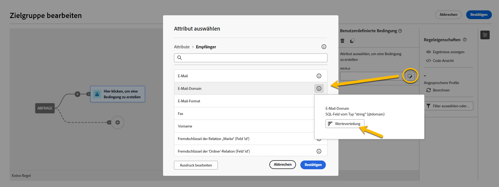
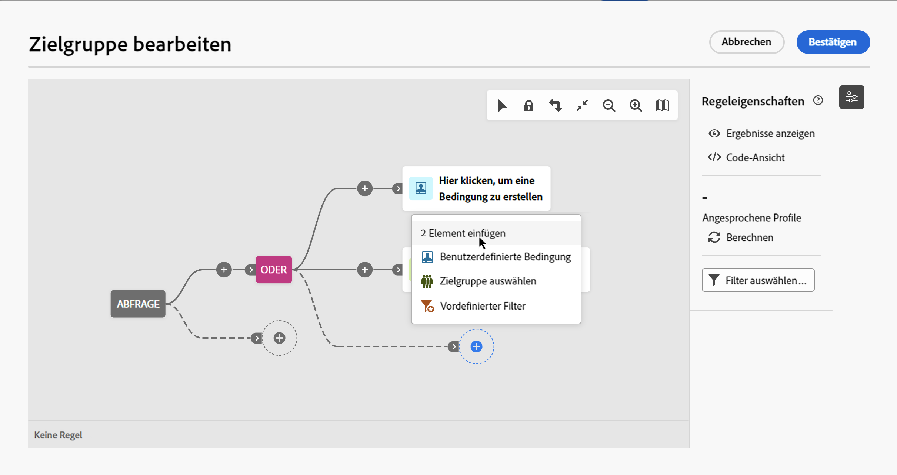

# Erstellen Ihrer ersten Abfrage {#build-query}

Um mit der Erstellung einer Abfrage zu beginnen, greifen Sie je nach der Aktion, die Sie ausführen wollen, vom gewünschten Speicherort aus auf den Abfrage-Modeler zu. Der Abfrage-Modeler wird mit einer leeren Arbeitsfläche geöffnet. Klicken Sie auf die Schaltfläche **+**, um den ersten Knoten der Abfrage zu konfigurieren.

>[!IMPORTANT]
>
>Eine brandneue Benutzeroberfläche für den Abfrage-Modeler ist verfügbar. Mit dem neuen Regel-Builder können Sie Ihre Abfrage dank der vereinfachten und intuitiven Benutzeroberfläche leichter erstellen. Um zu diesem Erlebnis zu wechseln, klicken Sie auf den Umschalter in der oberen rechten Ecke. Sie können jederzeit zum klassischen Abfrage-Modeler zurückkehren, indem Sie einfach auf den Umschalter klicken, um die neue Benutzeroberfläche zu deaktivieren. Sie können in dieser neuen Benutzeroberfläche dieselben Prinzipien wie beim Abfrage-Modeler anwenden.
>&#x200B;>{zoomable="yes"}

Sie können zwei Elementtypen hinzufügen:

* **Filterkomponenten** („Benutzerdefinierte Bedingung“, „Zielgruppe auswählen“, „Vordefinierter Filter“) ermöglichen es Ihnen, eigene Regeln zu erstellen, eine Zielgruppe auszuwählen oder Ihre Abfrage mit einem vordefinierten Filter zu verfeinern. Sie werden zu Beginn Ihrer Abfrage und bei gepunkteten Transitionen hinzugefügt. [Erfahren Sie, wie Sie mit Filterkomponenten arbeiten können](#filtering)

  Beispiel: *Empfängerinnen und Empfänger, die den Newsletter „Sport“ abonniert haben*, *Empfängerinnen und Empfänger, die in New York leben*, *Empfängerinnen und Empfänger, die in San Francisco leben*

>[!BEGINTABS]

>[!TAB Klassischer Abfrage-Modeler]

{zoomable="yes"}

>[!TAB Neuer Regel-Builder]

{zoomable="yes"}

>[!ENDTABS]

* **Gruppenoperatoren** (UND, ODER, AUSSER) ermöglichen es Ihnen, Filterkomponenten im Diagramm zu gruppieren. Sie werden bei vorhandenen Transitionen vor einer Filterkomponente hinzugefügt. [Erfahren Sie, wie man mit Operatoren arbeitet](#filtering)

  Beispiel: *Empfangende belohnen, die „Super VIP“ **UND** „Zu belohnende VIP“ **ODER** „VIP Demo“ sind **AUSSER** Empfangende im Alter unter 21 Jahren und über 45 Jahren.

>[!BEGINTABS]

>[!TAB Klassischer Abfrage-Modeler]

{zoomable="yes"}

>[!TAB Neuer Regel-Builder]

{zoomable="yes"}

>[!ENDTABS]

## Werteverteilung in einer Abfrage {#distribution-values-query}

Die Werteverteilung zeigt den Prozentsatz der einzelnen Werte eines Felds innerhalb einer Tabelle basierend auf den aktuellen Abfrageparametern an. Kenntnisse über die Werteverteilung in einer Abfrage können dabei helfen, die Segmentierung zu verfeinern.

Um auf diese Option zuzugreifen, klicken Sie in Ihrer Abfrage auf die Schaltfläche zur Attributauswahl, wie unten dargestellt. Klicken Sie dann auf das Symbol **[!UICONTROL Informationen]** neben dem ausgewählten Attribut. Sie können auf die Schaltfläche **[!UICONTROL Werteverteilung]** zugreifen.

{zoomable="yes"}

>[!NOTE]
>
>* Bei Feldern mit vielen Werten werden nur die ersten zwanzig Werte angezeigt. In solchen Fällen werden Sie durch die Benachrichtigung **[!UICONTROL Teilweise geladen]** gewarnt.
>* Die Option **[!UICONTROL Werteverteilung]** ist in jeder Attributauswahl verfügbar. [Erfahren Sie, wie Sie Attribute auswählen](../get-started/attributes.md)
>* Mithilfe der **[ !Aerweiterten Filter]** können Sie Bedingungen zu den Ergebnissen hinzufügen. [Weitere Informationen finden Sie hier](../get-started/work-with-folders.md#filter-the-values).

## Hinzufügen von Filterkomponenten {#filtering}

Filterkomponenten ermöglichen es Ihnen, eine Abfrage mithilfe von folgenden Filtern zu verfeinern:

* **[Benutzerdefinierte Bedingungen](#custom-condition)**: Filtern Sie eine Abfrage, indem Sie Ihre eigene Bedingung mit Attributen aus der Datenbank und erweiterten Ausdrücken erstellen.
* **[Zielgruppen](#audiences)**: Filtern Sie eine Abfrage, indem Sie eine vorhandene Zielgruppe verwenden.
* **[Vordefinierter Filter](#predefined-filters)**: Filtern Sie eine Abfrage mit vorhandenen vordefinierten Filtern.

### Konfigurieren einer benutzerdefinierten Bedingung {#custom-condition}

>[!CONTEXTUALHELP]
>id="acw_orchestration_querymodeler_customcondition"
>title="Benutzerdefinierte Bedingung"
>abstract="Benutzerdefinierte Bedingungen filtern Komponenten, mit denen Sie Ihre Abfrage filtern können, indem Sie Ihre eigene Bedingung mit Attributen aus der Datenbank und erweiterten Ausdrücken erstellen."

Gehen Sie wie folgt vor, um Ihre Abfrage mit einer benutzerdefinierten Bedingung zu filtern:

1. Klicken Sie auf die Schaltfläche **+** auf dem gewünschten Knoten und wählen Sie **[!UICONTROL Benutzerdefinierte Bedingung]** aus. Der Bereich mit den benutzerdefinierten Bedingungseigenschaften wird auf der rechten Seite geöffnet.

1. Wählen Sie im Feld **Attribut** das Attribut aus der Datenbank aus, das Sie zum Erstellen Ihrer Bedingung verwenden möchten. Die Attributliste enthält alle Attribute aus Ihrer Kampagnen-Datenbank, einschließlich Attributen aus verknüpften Tabellen. [Erfahren Sie, wie Sie Attribute auswählen und zu den Favoriten hinzufügen](../get-started/attributes.md)

   {zoomable="yes"}

   >[!NOTE]
   >
   >Über die Schaltfläche **Ausdruck bearbeiten** können Sie den Campaign Web-Ausdruckseditor starten, um einen Ausdruck mithilfe von Datenbankfeldern und Hilfsfunktionen manuell festzulegen. [Erfahren Sie, wie Sie Ausdrücke bearbeiten](expression-editor.md)

1. Wählen Sie in der Dropdown-Liste den anzuwendenden Operator aus. Es stehen verschiedene Operatoren zur Verfügung. Beachten Sie, dass die in der Dropdown-Liste verfügbaren Operatoren vom Datentyp des Attributs abhängen.

   +++Liste der verfügbaren Operatoren

   | Operator | Zweck | Beispiel |
   |---|---|---|
   | Gleich | Die zurückgegebenen Daten stimmen vollständig mit dem in der zweiten Spalte angegebenen Wert überein. | „Nachname (@lastName) gleich ‚Müller‘“ gibt nur die Empfängerinnen und Empfänger mit dem Nachnamen „Müller“ unter Beachtung der genauen Schreibung aus. |
   | Ungleich | Die ausgegebenen Daten unterscheiden sich vom angegebenen Wert. | Sprache (@language) ungleich „Englisch“. |
   | Größer als | Die ausgegebenen Daten übersteigen den angegebenen Wert. | „Alter (@age) größer als 50“ gibt alle Werte von mehr als 50 Jahren aus (also „51“, „52“ usw.). |
   | Kleiner als | Der ausgegebene Wert unterschreitet den eingegebenen Wert. | „Erstellungsdatum (@created) kleiner als ‚DaysAgo(100)‘“ gibt alle Empfängerinnen und Empfänger aus, die vor weniger als 100 Tagen angelegt wurden. |
   | Größer als oder gleich | Die ausgegebenen Daten sind identisch mit oder übersteigen den angegebenen Wert. | „Alter (@age) größer oder gleich ‚30‘“ gibt alle Empfängerinnen und Empfänger ab 30 Jahren aus. |
   | Kleiner als oder gleich | Die ausgegebenen Daten sind identisch mit oder unterschreiten den angegebenen Wert. | „Alter (@age) kleiner oder gleich ‚60‘“ gibt alle Empfängerinnen und Empfänger bis 60 Jahren aus. |
   | Eingeschlossen in | Die ausgegebenen Daten sind in den angegebenen Werten enthalten. Die Werte müssen durch Kommata getrennt werden. | „Geburtsdatum (@birthDate) ist enthalten in ‚10.12.1979,10.12.1984‘“ gibt die Empfängerinnen und Empfänger aus, die zwischen diesen beiden Daten geboren wurden. |
   | Ist nicht enthalten in | Negative Form des Operators „ist enthalten in“. Hier werden Empfängerinnen und Empfänger anhand der eingegebenen Werte ausgeschlossen. | Das Geburtsdatum (@birthDate) ist nicht in &#39;12/10/1979,12/10/1984&#39; enthalten. Empfängerinnen und Empfänger, die innerhalb dieses Datumsbereichs geboren wurden, werden nicht ausgegeben. |
   | Ist leer | Die ausgegebenen Daten stimmen mit einem leeren Wert in der zweiten Spalte überein. | „Mobiltelefon (@mobilePhone) ist leer“ gibt alle Empfängerinnen und Empfänger zurück, die keine Mobiltelefonnummer haben. |
   | Ist nicht leer | Negative Form des Operators „Ist leer“. Es ist nicht nötig, Daten in die zweite Wert-Spalte einzugeben. | E-Mail (@email) ist nicht leer. |
   | Beginnt mit | Die ausgegebenen Daten beginnen mit dem angegebenen Wert. | Kundennummer (@account) beginnt mit &#39;32010&#39;. |
   | Beginnt nicht mit | Die ausgegebenen Daten beginnen nicht mit dem angegebenen Wert. | Kundennummer (@account) beginnt nicht mit „20“. |
   | Enthält | Die ausgegebenen Daten enthalten den angegebenen Wert. | „E-Mail-Domain (@domain) enthält ‚mail‘“ gibt nur Domain-Namen aus, die den Wert „mail“, z. B. „gmail.com“, enthalten. |
   | Enthält nicht | Die ausgegebenen Daten enthalten den angegebenen Wert nicht. | E-Mail-Domain (@domain) enthält nicht „vo“. Domain-Namen, die „vo“ enthalten, z. B. „voila.fr“, werden nicht in den Ergebnissen angezeigt. |
   | Ist wie | Dieser Operator ähnelt „Enthält“ und erlaubt das Einfügen des Platzhalters „%“ im Wert. | Nachname (@lastName) ist wie &#39;Me%er&#39;. Das Platzhalterzeichen dient als „Joker“, um Namen wie „Meier“ zu finden. |
   | Ist nicht wie | Dieser Operator ähnelt „Enthält“ und erlaubt das Einfügen des Platzhalters „%“ im Wert. | Nachname (@lastName) nicht wie „Schmi%t“. Empfängerinnen und Empfänger, deren Nachname „Schmi%t“ lautet, also etwa „Schmidt“ oder „Schmitt“, werden nicht ausgegeben. |

   +++

1. Legen Sie im Feld **Wert** den erwarteten Wert fest. Sie können auch den Campaign Web-Ausdruckseditor verwenden, um einen Ausdruck mithilfe von Feldern aus der Datenbank und Hilfsfunktionen manuell zu definieren. Klicken Sie dazu auf die Schaltfläche **Ausdruck bearbeiten**. [Erfahren Sie, wie Sie Ausdrücke bearbeiten](expression-editor.md)

   *Abfragebeispiel, in dem alle Profile im Alter von 21 Jahren oder älter zurückgegeben werden:*

>[!BEGINTABS]

>[!TAB Klassischer Abfrage-Modeler]

{zoomable="yes"}

>[!TAB Neuer Regel-Builder]

{zoomable="yes"}

>[!ENDTABS]

Für Attribute vom Typ „Datum“ sind vordefinierte Werte bei Verwendung der Option **[!UICONTROL Voreinstellungen]** verfügbar.

>[!BEGINTABS]

>[!TAB Klassischer Abfrage-Modeler]

{zoomable="yes"}

>[!TAB Neuer Regel-Builder]

{zoomable="yes"}

>[!ENDTABS]

#### Benutzerdefinierte Bedingungen für verknüpfte Tabellen (1:1- und 1:n-Relation){#links}

Mit benutzerdefinierten Bedingungen können Sie Tabellen abfragen, die mit der aktuell von Ihrer Regel verwendeten Tabelle verknüpft sind. Dazu gehören Tabellen mit einer 1:1-Relation oder Sammlungstabellen (1:n-Relation).

Navigieren Sie bei einer **1:1-Relation** zur verknüpften Tabelle, wählen Sie das gewünschte Attribut aus und definieren Sie den erwarteten Wert.

Sie können auch direkt eine Tabellenverknüpfung in der Auswahl **Wert** auswählen und bestätigen. In diesem Fall müssen die für die ausgewählte Tabelle verfügbaren Werte mit einer speziellen Auswahl ausgewählt werden, wie im folgenden Beispiel gezeigt.

+++Abfragebeispiel

Hier geht es bei der Abfrage um Marken mit der Bezeichnung „Laufen“.

1. Navigieren Sie durch die Tabelle **Marke** und wählen Sie das Attribut **Titel**.

   {zoomable="yes"}{width="85%" align="center"}

1. Definieren Sie den erwarteten Wert für das Attribut.

   {zoomable="yes"}{width="85%" align="center"}

Hier ist ein Abfragebeispiel, bei dem eine Tabellenverknüpfung direkt ausgewählt wurde. Die verfügbaren Werte für diese Tabelle müssen über eine spezielle Auswahl ausgewählt werden.

{zoomable="yes"}{width="85%" align="center"}

+++

Für eine **1:n-Relation** können Sie Unterbedingungen definieren, um Ihre Abfrage zu verfeinern, wie im folgenden Beispiel gezeigt.

+++Abfragebeispiel

In unserem Beispiel zielt die Abfrage auf Empfängerinnen und Empfänger ab, die im Zusammenhang mit dem BrewMaster-Produkt Einkäufe getätigt haben, und zwar für einen Gesamtbetrag von mindestens 100 USD.

1. Wählen Sie die Tabelle **Käufe** und bestätigen Sie.

   {zoomable="yes"}{width="50%" align="center"}

1. Es wird eine ausgehende Transition hinzugefügt, die die Erstellung von Unterbedingungen ermöglicht.

   {zoomable="yes"}{width="85%" align="center"}

1. Wählen Sie das Attribut **Preis** und Zielkäufe von 1000 USD oder mehr

   {zoomable="yes"}{width="85%" align="center"}

1. Fügen Sie Unterbedingungen hinzu, die Ihren Anforderungen entsprechen. In unserem Beispiel haben wir eine Bedingung für Profile hinzugefügt, die ein BrewMaster-Produkt erworben haben.

   {zoomable="yes"}{width="85%" align="center"}

+++

#### Arbeiten mit aggregierten Daten {#aggregate}

Mit benutzerdefinierten Bedingungen können Sie Aggregierungsvorgänge ausführen. Wählen Sie dazu direkt ein Attribut aus einer Sammlungstabelle aus:

1. Navigieren Sie durch die gewünschte Sammlungstabelle und wählen Sie das Attribut aus, für das Sie einen Aggregierungsvorgang durchführen möchten.

   {zoomable="yes"}{width="85%" align="center"}

1. Aktivieren Sie im Eigenschaften-Fenster die Option **Daten aggregieren** und wählen Sie die gewünschte Aggregierungsfunktion aus.

>[!BEGINTABS]

>[!TAB Klassischer Abfrage-Modeler]

{zoomable="yes"}{width="85%" align="center"}

>[!TAB Neuer Regel-Builder]

{zoomable="yes"}{width="85%" align="center"}

>[!ENDTABS]

### Auswählen einer Zielgruppe {#audiences}

>[!CONTEXTUALHELP]
>id="acw_orchestration_querymodeler_selectaudience"
>title="Zielgruppe auswählen"
>abstract="Wenn Sie die Option **Zielgruppe auswählen** verwenden, können Sie die Zielgruppe auswählen, die Sie zum Filtern Ihrer Abfrage verwenden möchten."

Gehen Sie wie folgt vor, um Ihre Abfrage mithilfe einer vorhandenen Zielgruppe zu filtern:

>[!BEGINTABS]

>[!TAB Klassischer Abfrage-Modeler]

1. Klicken Sie auf die Schaltfläche **+** auf dem gewünschten Knoten und wählen Sie **[!UICONTROL Zielgruppe auswählen]** aus.

1. Der Bereich mit den Eigenschaften **Zielgruppe auswählen** wird auf der rechten Seite geöffnet. Wählen Sie die Zielgruppe aus, die Sie zum Filtern Ihrer Abfrage verwenden möchten.

   *Abfragebeispiel, in dem alle Profile der Zielgruppe „Festivalbesuchende“ zurückgegeben werden:*

   {zoomable="yes"}

>[!TAB Neuer Regel-Builder]

1. Klicken Sie auf **Erweitern** neben der Schaltfläche **[!UICONTROL Bedingung hinzufügen]** und wählen Sie **[!UICONTROL Zielgruppe auswählen]**.

1. Der Bereich mit den Eigenschaften **Zielgruppe auswählen** wird auf der rechten Seite geöffnet. Wählen Sie die Zielgruppe aus, die Sie zum Filtern Ihrer Abfrage verwenden möchten.

   *Abfragebeispiel, in dem alle Profile der Zielgruppe „Coffee Works“ zurückgegeben werden:*

   {zoomable="yes"}

>[!ENDTABS]

### Verwenden eines vordefinierten Filters {#predefined-filters}

>[!CONTEXTUALHELP]
>id="acw_orchestration_querymodeler_predefinedfilter"
>title="Vordefinierter Filter"
>abstract="Wenn Sie die Option **Vordefinierter Filter** verwenden, können Sie einen vordefinierten Filter aus der Liste der benutzerdefinierten Filter oder aus den Favoriten auswählen."

Gehen Sie wie folgt vor, um Ihre Abfrage mithilfe eines vordefinierten Filters zu filtern:

>[!BEGINTABS]

>[!TAB Klassischer Abfrage-Modeler]

1. Klicken Sie auf die Schaltfläche **+** auf dem gewünschten Knoten und wählen Sie **[!UICONTROL Vordefinierter Filter]** aus.

1. Der Bereich mit den Eigenschaften **Vordefinierter Filter** wird auf der rechten Seite geöffnet. Wählen Sie einen Filter aus der Liste der vordefinierten Filter oder aus den Favoriten aus.

   *Abfragebeispiel, in dem alle Profile zurückgegeben werden, die dem vordefinierten Filter „Inaktive Kunden“ entsprechen:*

   {zoomable="yes"}

>[!TAB Neuer Regel-Builder]

1. Klicken Sie auf die Schaltfläche **Erweitern** neben der Schaltfläche **[!UICONTROL Bedingung hinzufügen]** und wählen Sie **[!UICONTROL Vordefinierter Filter]**.

1. Der Bereich mit den Eigenschaften **Vordefinierter Filter** wird auf der rechten Seite geöffnet. Wählen Sie einen Filter aus der Liste der vordefinierten Filter oder aus den Favoriten aus.

   *Abfragebeispiel, in dem alle Profile zurückgegeben werden, die dem vordefinierten Filter „Inaktive Kunden“ entsprechen:*

   {zoomable="yes"}

>[!ENDTABS]

### Kopieren und Einfügen von Komponenten {#copy}

Mithilfe des Abfrage-Modelers können Sie eine oder mehrere Filterkomponenten kopieren und am Ende einer Transition einfügen. Dieser Vorgang kann in der aktuellen Abfragearbeitsfläche oder in einer beliebigen Arbeitsfläche innerhalb Ihrer Instanz ausgeführt werden.

>[!NOTE]
>
>Die kopierte Auswahl wird beibehalten, solange Sie in Ihrer Instanz arbeiten. Wenn Sie sich abmelden und wieder anmelden, steht Ihre Auswahl nicht mehr zum Einfügen zur Verfügung.

>[!IMPORTANT]
>
>Es ist derzeit nicht möglich, Komponenten im neuen Regel-Builder-Erlebnis zu kopieren und einzufügen. Um diese nächsten Schritte auszuführen, klicken Sie oben auf den Umschalter **[!UICONTROL Zurück zum klassischen Erlebnis]**, um den klassischen Abfrage-Modeler zu verwenden.

Gehen Sie wie folgt vor, um Filterkomponenten zu kopieren und einzufügen:

1. Klicken Sie in der Abfragearbeitsfläche auf die Filterkomponente, die Sie kopieren möchten. Um mehrere Komponenten auszuwählen, verwenden Sie das Tool zur Mehrfachauswahl in der Symbolleiste oben rechts auf der Arbeitsfläche.

1. Klicken Sie auf die Schaltfläche **[!UICONTROL Kopieren]** im Eigenschaften-Fenster der Komponente oder in der blauen Leiste unten im Bildschirm, wenn Sie mehrere Komponenten ausgewählt haben.

   | Kopieren einer einzelnen Komponente | Kopieren mehrerer Komponenten |
   |  ---  |  ---  |
   | {zoomable="yes"}{width="200" align="center" zoomable="yes"} | {zoomable="yes"}{width="200" align="center" zoomable="yes"} |

1. Um die Komponente(n) einzufügen, klicken Sie auf die Schaltfläche „+“ am Ende der gewünschten Transition und wählen Sie **(n) Elemente einfügen**.

   {zoomable="yes"}

## Verschieben von Komponenten per Drag-and-Drop {#drag-and-drop}

>[!IMPORTANT]
>
>Diese Funktion ist nur für die neue Version des Regel-Builders verfügbar.

Wenn Sie Ihrer Abfrage Komponenten hinzufügen, können Sie diese mithilfe der Drag-and-Drop-Funktion nach oben und unten verschieben.

Sie können links von jeder Komponente auf die Punkte klicken und die Komponente nach oben und unten ziehen, je nachdem wo Sie Komponenten platzieren und gruppieren möchten.

{zoomable="yes"}

## Kombinieren von Filterkomponenten mit Operatoren {#operators}

>[!CONTEXTUALHELP]
>id="acw_orchestration_querymodeler_group"
>title="Gruppe"
>abstract="In diesem Bereich können Sie den Operator ändern, mit dem Filterbedingungen verknüpft werden."

Jedes Mal, wenn Sie zu Ihrer Abfrage eine neue Filterkomponente hinzufügen, wird diese automatisch durch einen **UND**-Operator mit der anderen Komponente verknüpft. Dadurch werden die Ergebnisse der beiden Filterkomponenten kombiniert.

In diesem Beispiel haben wir für die zweite Transition neue Zielgruppentyp-Filterkomponenten hinzugefügt. Die Komponente ist mit der vordefinierten Filterbedingung durch einen **UND**-Operator verknüpft, d. h. die Abfrageergebnisse enthalten Empfängerinnen und Empfänger, auf die der vordefinierte Filter „Newsletter-Abonnenten - MADRID“ zutrifft UND die zur Zielgruppe „Käufer (gesamte Zeit)“ gehören.

>[!BEGINTABS]

>[!TAB Klassischer Abfrage-Modeler]

{zoomable="yes"}

Um den Operator für die Verknüpfung der Filterbedingungen zu ändern, klicken Sie darauf und wählen Sie den gewünschten Operator im Bereich **Gruppe** aus, der sich rechts öffnet.

Die folgenden Operatoren sind verfügbar:

* **UND (Schnittmenge)**: Kombiniert Ergebnisse, die allen Filterkomponenten in den ausgehenden Transitionen entsprechen.
* **ODER (Vereinigung)**: Umfasst Ergebnisse, die mindestens einer der Filterkomponenten in den ausgehenden Transitionen entsprechen.
* **AUSSER (Ausschluss)**: Schließt Ergebnisse aus, die allen Filterkomponenten in der ausgehenden Transition entsprechen.

{zoomable="yes"}

Darüber hinaus können Sie Zwischengruppen von Komponenten erstellen, indem Sie Komponenten zu einer Gruppe zusammenfassen und miteinander verknüpfen. Auf diese Weise wird der UND-Operator standardmäßig gesetzt. Sie können ihn dann in den gewünschten Operator ändern.

>[!TAB Neuer Regel-Builder]

{zoomable="yes"}

Um den Operator zu ändern, der verwendet wird, um Filterbedingungen miteinander zu verknüpfen, klicken Sie darauf. Er ändert sich in ODER, AUSSER und dann zurück in UND. Wählen Sie den gewünschten Operator.

Die folgenden Operatoren sind verfügbar:

* **UND (Schnittmenge)**: Kombiniert Ergebnisse, die allen Filterkomponenten in den ausgehenden Transitionen entsprechen.
* **ODER (Vereinigung)**: Umfasst Ergebnisse, die mindestens einer der Filterkomponenten in den ausgehenden Transitionen entsprechen.
* **AUSSER (Ausschluss)**: Schließt Ergebnisse aus, die allen Filterkomponenten in der ausgehenden Transition entsprechen.

{zoomable="yes"}

>[!ENDTABS]

Im folgenden Beispiel haben wir eine Zwischengruppe erstellt, um Ergebnisse aus den Zielgruppen „Zu belohnende VIP“ oder „Super VIP“ einzubeziehen.

>[!BEGINTABS]

>[!TAB Klassischer Abfrage-Modeler]

{zoomable="yes"}

>[!TAB Neuer Regel-Builder]

{zoomable="yes"}

>[!ENDTABS]

## Überprüfen und Validieren einer Abfrage

>[!CONTEXTUALHELP]
>id="acw_orchestration_querymodeler_ruleproperties"
>title="Regeleigenschaften"
>abstract="Nachdem Sie Ihre Abfrage auf der Arbeitsfläche erstellt haben, können Sie sie über den Bereich **Regeleigenschaften** auf der rechten Seite überprüfen. In diesem Bereich können Sie die resultierenden Daten anzeigen, eine SQL-Code-Version der Abfrage abrufen und die Anzahl der Zieleinträge überprüfen. Verwenden Sie die Schaltfläche **Filter auswählen oder speichern**, um Ihre Abfrage als vordefinierten Filter zu speichern oder den Inhalt der Arbeitsfläche durch einen vorhandenen Filter zu ersetzen."

Nachdem Sie Ihre Abfrage auf der Arbeitsfläche erstellt haben, können Sie sie über den Bereich **Regeleigenschaften** auf der rechten Seite überprüfen. Dieser Bereich wird beim Einrichten einer Abfrage zum Erstellen einer Zielgruppe angezeigt. Verfügbare Operationen sind:

* **Ergebnisse anzeigen:** Zeigt die aus Ihrer Abfrage resultierenden Daten an.
* **Code-Ansicht**: Zeigt eine Code-basierte Version der Abfrage in SQL an.
* **Berechnen**: Aktualisiert und zeigt die Anzahl der Einträge an, auf die Ihre Abfrage abzielt.
* **Filter auswählen oder speichern**: Wählen Sie einen vorhandenen vordefinierten Filter aus, um ihn in der Arbeitsfläche zu verwenden, oder speichern Sie Ihre Abfrage als neu vordefinierten Filter, um sie später erneut zu verwenden. [Erfahren Sie, wie Sie mit vordefinierten Filtern arbeiten](../get-started/predefined-filters.md)

  >[!IMPORTANT]
  >
  >Wählen Sie im Bereich mit den Regeleigenschaften einen vordefinierten Filter aus, um die in der Arbeitsfläche erstellte Abfrage durch den ausgewählten Filter zu ersetzen.

Bei Verwendung des neuen Erlebnisses im Regel-Builder können Sie die Zielpopulation direkt für jede Bedingung und Gruppe anzeigen:

* Klicken Sie auf **Symbol „Bedingung berechnen** der gewünschten Bedingung oder Gruppe, um die Anzahl der Datensätze zu berechnen und anzuzeigen, auf die Ihre Abfrage abzielt.
* Klicken Sie auf die Ergebnisnummer, um die detaillierte Liste der Datensätze anzuzeigen.

{zoomable="yes"}

Wenn Ihre Abfrage fertig ist, klicken Sie auf die Schaltfläche **[!UICONTROL Bestätigen]** in der rechten oberen Ecke, um sie zu speichern.

>[!BEGINTABS]

>[!TAB Klassischer Abfrage-Modeler]

Sie können Ihre Abfrage jederzeit ändern, indem Sie sie öffnen. Beachten Sie, dass beim Öffnen einer vorhandenen Abfrage diese in einer vereinfachten Ansicht angezeigt wird, ohne dass die Schaltflächen **+** angezeigt werden. Um der Abfrage neue Elemente hinzuzufügen, wählen Sie eine Komponente oder einen Operator auf der Arbeitsfläche aus, um die Schaltflächen **+** anzuzeigen.

{zoomable="yes"}

>[!TAB Neuer Regel-Builder]

Sie können Ihre Abfrage jederzeit ändern, indem Sie sie öffnen. Klicken Sie dazu oben links auf die Schaltfläche **[!UICONTROL Bedingung hinzufügen]**.

{zoomable="yes"}

>[!ENDTABS]
