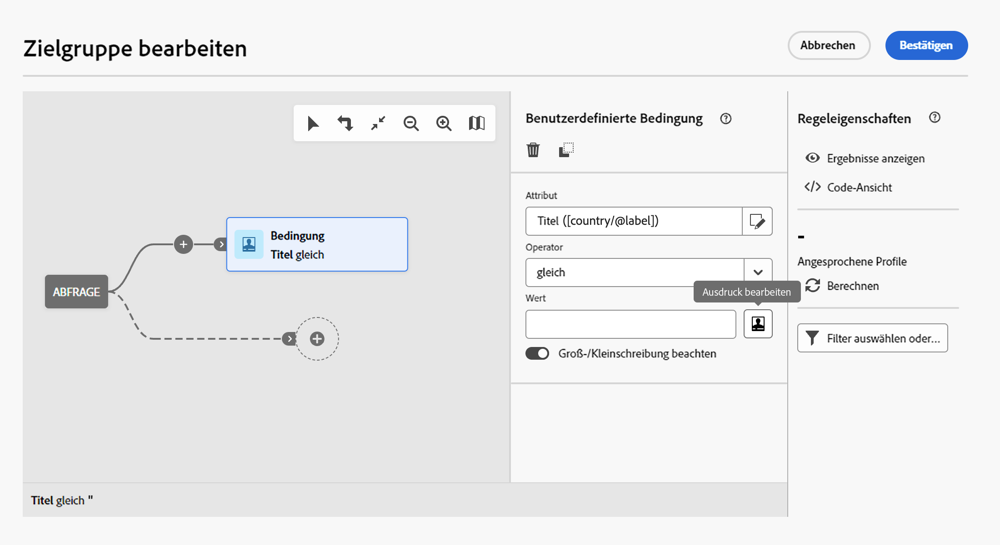

# Ausdrücke bearbeiten {#expression}

Zum Bearbeiten eines Ausdrucks müssen Bedingungen manuell eingegeben werden, um eine Regel zu bilden. Diese Vorgehensweise ermöglicht die Verwendung fortgeschrittener Funktionen, über die Sie die verwendeten Werte (Datumsangaben, Strings, numerische Felder etc.) bearbeiten können, um spezifische Abfragen zu erstellen.

Diese Vorgänge sind über die Schaltfläche Ausdruck bearbeiten des Abfragemodells verfügbar, die bei der Konfiguration einer benutzerdefinierten Bedingung für die Attribute- und Wertfelder verfügbar ist.



Der Ausdruckseditor bietet Folgendes:

* Eingabefeld, in dem der Ausdruck erstellt wird;
* Liste der verfügbaren Felder, die im Ausdruck verwendet werden können und die der Zielgruppendimension der Abfrage entsprechen (siehe auch [Zielgruppendimensionen und Ressourcen](../../automating/using/query.md#targeting-dimensions-and-resources)).
* Liste der verfügbaren Funktionen mit verschiedenen Unterkategorien.

Bearbeiten Sie den Ausdruck, indem Sie ihn direkt in das Eingabefeld eingeben oder die Liste der verfügbaren Felder und Funktionen verwenden. Platzieren Sie dazu den Cursor in den Ausdruck, an dem Sie das Element hinzufügen möchten, und doppelklicken Sie auf das gewünschte Feld oder den gewünschten Ausdruck.

Es ist möglich, Workflow-Ereignisvariablen zur Erstellung eines Ausdrucks zu verwenden. Weitere Informationen hierzu finden Sie unter xxxx.

## Syntax von Ausdrücken  {#expression-syntax}

### Standardsyntax {#standard-syntax}

Standardausdrücke bestehen aus einer oder mehreren Bedingungen, die die folgende Syntax beachten müssen:

* Jede Bedingung hat die Form **&lt;Wert 1> &lt;Vergleichsoperator> &lt;Wert 2>**, wobei

   * **&lt;Wert 1>** ein Feld oder eine Funktion ist. Das Feld **@created** z. B. steht für das Erstellungsdatum eines Profils, die Funktion **Year(@created)** gibt das Jahr der Erstellung eines Profils aus.
   * **&lt;Vergleichsoperator>** ist einer der im Abschnitt [Vergleichsoperatoren](../../automating/using/advanced-expression-editing.md#comparison-operators) aufgelisteten Operatoren. Der Operator definiert die Art des Vergleichs zwischen **&lt;Wert 1>** und **&lt;Wert 2>**.
   * **&lt;Wert 2>** ein Feld, eine Funktion oder ein manuell angegebener Wert ist.

  >[!NOTE]
  >
  >Die Datentypen von **&lt;Wert 1>** und **&lt;Wert 2>** müssen identisch sein. Wenn **&lt;Wert 1>** beispielsweise ein Datum ist, muss **&lt;Wert 2>** auch ein Datum sein.

* Mithilfe von logischen Operatoren können verschiedene Bedingungen miteinander kombiniert werden.

   * **[!UICONTROL AND]**: erstellt die Schnittmenge aus zwei Bedingungen;
   * **[!UICONTROL OR]**: vereinigt die aus zwei Bedingungen resultierenden Elemente.

Beispiel:

```
Year(@created) = Year(GetDate()) AND Month(@created) = Month(GetDate())
```

In diesem Beispiel werden die Profile ausgegeben, bei denen das Erstellungsdatum mit dem aktuellen Jahr und Monat übereinstimmt.

### JavaScript-Syntax  {#javascript-syntax}

Bei der Definition von Sichtbarkeitsbedingungen in einem Textblock des HTML-Inhaltseditiors sind Ausdrücke mit JavaScript-Syntax zu verwenden.

JavaScript-Ausdrücke bestehen aus einer oder mehreren Bedingungen, die die folgende Syntax beachten müssen:

* Jede Bedingung hat die Form **&lt;Kontext> &lt;Vergleichsoperator> &lt;Wert 2>**, wobei

   * **&lt;Kontext>** einem Feld oder einer Funktion entspricht, die es ermöglichen, den Kontext anzugeben. Beispiel **context.profile.@email** steht für die E-Mail-Adresse eines Profils und **context.profile.firstName.length()** für die Anzahl an Zeichen des Vornamens eines Profils.
   * **&lt;Vergleichsoperator>** ist einer der im Abschnitt [Vergleichsoperatoren](../../automating/using/advanced-expression-editing.md#comparison-operators) aufgelisteten Operatoren. Der Operator definiert die Art des Vergleichs zwischen **&lt;Kontext>** und **&lt;Wert 2>**.
   * **&lt;Wert 2>** ein Feld, eine Funktion oder ein manuell angegebener Wert ist.

  >[!NOTE]
  >
  Die Datentypen von **&lt;Kontext>** und **&lt;Wert 2>** müssen identisch sein. Wenn **&lt;Kontext>** beispielsweise ein Datum ist, muss **&lt;Wert 2>** auch ein Datum sein.

* Mithilfe von logischen Operatoren können verschiedene Bedingungen miteinander kombiniert werden.

   * **[!UICONTROL &amp;&amp;]**: erstellt die Schnittmenge aus zwei Bedingungen;
   * **[!UICONTROL ||]**: vereinigt die aus zwei Bedingungen resultierenden Elemente.

Beispiel:

```
context.profile.age > 21 && context.profile.firstName.length() > 0
```

In diesem Beispiel werden die Profile ausgegeben, die über 21 Jahre alt sind und deren Vorname angegeben ist (das Feld **firstName** enthält mindestens ein Zeichen).

## Vergleichsoperatoren  {#comparison-operators}

Bei manchen Regeln können Sie über den Abfrageeditor einen Wert auswählen.

Bedingung müssen mithilfe eines der folgenden Operatoren mit Werten verknüpft werden.

<table> 
 <thead> 
  <tr> 
   <th> Operator<br /> </th> 
   <th> Standardsyntax<br /> </th> 
   <th> JavaScript-Syntax<br /> </th> 
   <th> Beschreibung<br /> </th> 
   <th> Beispiel<br /> </th> 
  </tr> 
 </thead> 
 <tbody> 
  <tr> 
   <td> <span class="uicontrol">Gleich</span> <br /> </td> 
   <td> =<br /> </td> 
   <td> ==<br /> </td> 
   <td> Der erste Wert muss mit dem zweiten identisch sein.<br /> </td> 
   <td> <strong>@lastName = Martin</strong> ruft die Profile ab, deren Nachname exakt 'Martin' ist.<br /> </td> 
  </tr> 
  <tr> 
   <td> <span class="uicontrol">Größer als</span> <br /> </td> 
   <td> &gt;<br /> </td> 
   <td> &gt;<br /> </td> 
   <td> Der erste Wert muss streng größer als der zweite sein.<br /> </td> 
   <td> <strong>@age &gt; 50</strong> ruft Profile ab, deren Alter '50' übersteigt, also '51', '52' etc.<br /> </td> 
  </tr> 
  <tr> 
   <td> <span class="uicontrol">Niedriger als</span> <br /> </td> 
   <td> &lt;<br /> </td> 
   <td> &lt;<br /> </td> 
   <td> Der erste Wert muss streng kleiner als der zweite sein.<br /> </td> 
   <td> <strong>@created &lt; DaysAgo(100)</strong> ruft Profile ab, die vor weniger als 100 Tagen in der Datenbank erstellt wurden.<br /> </td> 
  </tr> 
  <tr> 
   <td> <span class="uicontrol">Größer oder gleich</span> <br /> </td> 
   <td> &gt;=<br /> </td> 
   <td> &gt;=<br /> </td> 
   <td> Der erste Wert muss größer oder gleich dem zweiten sein.<br /> </td> 
   <td> <strong>@age &gt;= 30</strong> ruft Profile mit einem Alter von 30 Jahren und älter ab.<br /> </td> 
  </tr> 
  <tr> 
   <td> <span class="uicontrol">Kleiner oder gleich</span> <br /> </td> 
   <td> &lt;=<br /> </td> 
   <td> &lt;=<br /> </td> 
   <td> Der erste Wert muss kleiner oder gleich dem zweiten sein.<br /> </td> 
   <td> <strong>@age &lt;= 60</strong> ruft Profile mit einem Alter von 60 Jahren und jünger ab.<br /> </td> 
  </tr> 
  <tr> 
   <td> <span class="uicontrol">Unterschiedlich </span> <br /> </td> 
   <td> !=<br /> </td> 
   <td> !=<br /> </td> 
   <td> Der erste Wert muss sich vom zweiten unterscheiden.<br /> </td> 
   <td> <strong>@Sprache != Englisch</strong> ruft Profile ab, für die im Feld „Sprache“ nicht Englisch angegeben ist.<br /> </td> 
  </tr> 
  <tr> 
   <td> <span class="uicontrol">Enthält</span> <br /> </td> 
   <td> IN<br /> </td> 
   <td> K. A.<br /> </td> 
   <td> Der erste Wert muss den zweiten enthalten.<br /> </td> 
   <td> <strong>@domain IN mail</strong>. Hier werden alle Domains ausgegeben, deren Name den Wert 'mail' enthält. 'gmail.com' z. B. wird also in der Ergebnismenge enthalten sein.<br /> </td> 
  </tr> 
  <tr> 
   <td> <span class="uicontrol">Ist wie</span> <br /> </td> 
   <td> LIKE<br /> </td> 
   <td> K. A.<br /> </td> 
   <td> <span class="uicontrol">Ist wie</span> erzielt ähnliche Ergebnisse wie der Operator <span class="uicontrol">enthält. </span> Er ermöglicht jedoch die Verwendung des Platzhalters <span class="uicontrol">%</span> im gesuchten Wert.<br /> </td> 
   <td> <strong>@lastName LIKE Me%er</strong>. Hier erlaubt die Verwendung des Zeichens <strong>%</strong> die Ausgabe aller Profile mit Nachnamen Meyer, Meier, Meiser etc.<br /> </td> 
  </tr> 
  <tr> 
   <td> <span class="uicontrol">Ist nicht wie</span> <br /> </td> 
   <td> NOT<br /> </td> 
   <td> K. A.<br /> </td> 
   <td> Negative Form des Operators <span class="uicontrol">ist wie</span>. Hier dürfen die ausgegebenen Daten nicht dem angegebenen Wert ähneln. Auch in diesem Fall ist der Platzhalter <span class="uicontrol">%</span> zu verwenden.<br /> </td> 
   <td> <strong>@lastName NOT Schmi%t</strong>. Hier entsprechen die Empfänger dem Namen 'Schmied%h' (also Smith usw.) als Ergebnis nicht zurückgegeben werden.<br /> </td> 
  </tr> 
  <tr> 
   <td> <span class="uicontrol">Ist leer</span> <br /> </td> 
   <td> IS NULL<br /> </td> 
   <td> K. A.<br /> </td> 
   <td> Der erste Wert muss einen Nullwert ausgeben.<br /> </td> 
   <td> <strong>@mobilePhone IS NULL</strong> ruft Profile ab, für die keine Mobiltelefonnummer angegeben wurde.<br /> </td> 
  </tr> 
 </tbody> 
</table>