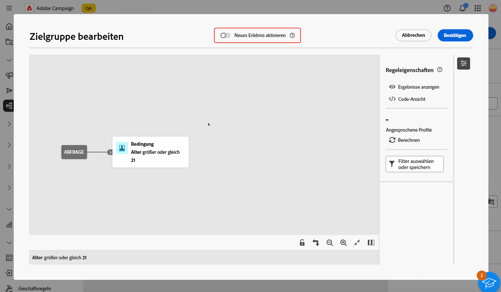
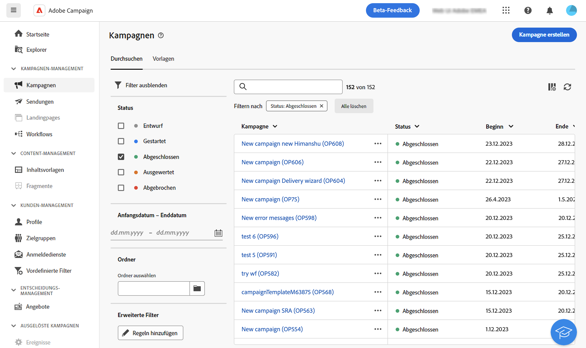
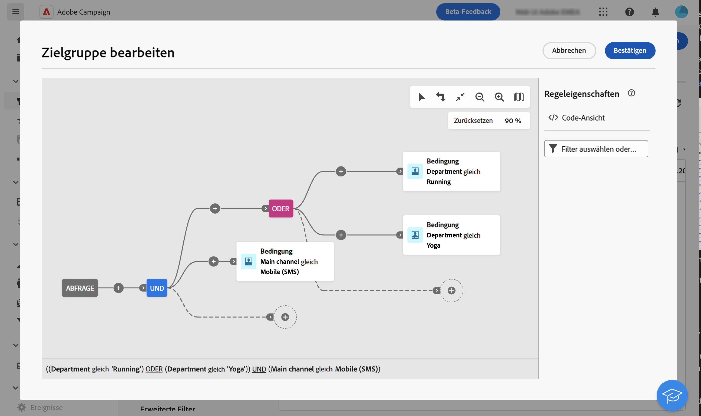

# Filtern von Listen {#filter-lists}

Adobe Campaign Web bietet Filter in jeder Objektliste, mit denen Sie Informationen nach bestimmten Kontextkriterien filtern können. Sie können beispielsweise Sendungen nach Status, Kanal, Kontaktdatum oder Ordner filtern. Sie können Testsendungen auch ausblenden.

>[!IMPORTANT]
>
>Eine brandneue Benutzeroberfläche für den Abfrage-Modellierer ist verfügbar. Mit dem neuen Regel-Builder können Sie Ihre Abfrage dank der vereinfachten Benutzeroberfläche einfacher erstellen. Um zu diesem Erlebnis zu wechseln, drücken Sie die Umschalttaste in der oberen rechten Ecke. Sie können jederzeit zum klassischen Abfrage-Modellierer zurückkehren, indem Sie einfach den Umschalter drücken, um die neue Benutzeroberfläche zu deaktivieren. Sie können in dieser neuen Benutzeroberfläche dieselben Prinzipien wie beim Abfrage-Modellierer anwenden.
>{zoomable="yes"}

## Anwenden von Filtern {#apply}

Um Filter auf eine Liste anzuwenden, klicken Sie auf **[!UICONTROL Filter anzeigen]** links oben in der Liste neben der Suchleiste.

Der Filterbereich wird geöffnet und zeigt die für die ausgewählte Liste verfügbaren Filter an. Sie können beispielsweise Kampagnen nach Status, Start- und Enddatum oder Speicherordner filtern, während die Liste der Anmeldedienste nach Kanal und Speicherordner gefiltert werden kann.

{zoomable="yes"}{width="70%" zoomable="yes"}

Um eine Liste nach Ihren eigenen Kriterien zu filtern, können Sie einen benutzerdefinierten Filter erstellen. Navigieren Sie dazu zum unteren Ende des Filterbereichs und klicken Sie auf **Regeln hinzufügen**. [Erfahren Sie, wie Sie benutzerdefinierte Filter erstellen](#custom).

Nachdem Sie Filter auf eine Liste angewendet haben, werden sie unter der Suchleiste angezeigt. Sie können einen jederzeit einzelne Filter entfernen oder auch alle, indem Sie auf **Alle löschen** klicken.

## Erstellen benutzerdefinierter Filter {#custom}

Mit benutzerdefinierten Filtern können Sie Listen anhand Ihrer eigenen spezifischen Kriterien verfeinern. Sie werden mithilfe des Abfrage-Modelers in Campaign entwickelt. Gehen Sie wie folgt vor, um einen benutzerdefinierten Filter zu erstellen:

1. Öffnen Sie den Bereich „Filter“ und klicken Sie unten auf **Regeln hinzufügen**.

1. Es öffnet sich der Abfrage-Modeler. Definieren und kombinieren Sie Ihre Filterkriterien entsprechend Ihren Anforderungen. Detaillierte Informationen über die Verwendung des Abfrage-Modelers finden Sie in [diesem Abschnitt](../query/query-modeler-overview.md).

   Das folgende Beispiel zeigt einen benutzerdefinierten Filter, der dazu bestimmt ist, in der Kampagnenliste SMS-Kampagnen anzuzeigen, die von Benutzenden der Abteilungen „Laufen“ oder „Yoga“ ausgeführt werden.

   {zoomable="yes"}{width="70%" zoomable="yes"}

1. Sobald Ihr benutzerdefinierter Filter konfiguriert ist, klicken Sie auf **[!UICONTROL Bestätigen]**, um ihn auf die Liste anzuwenden.