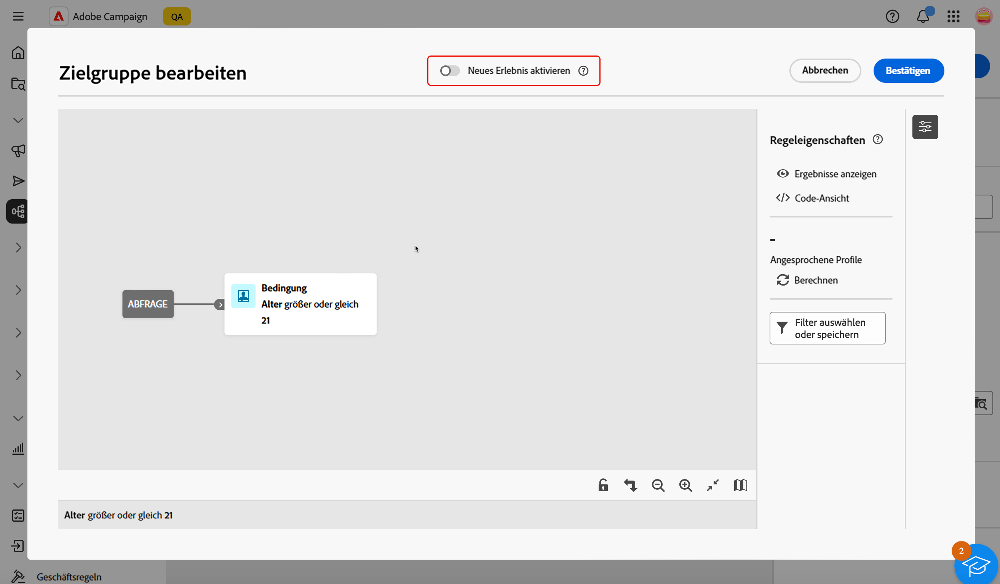

# Arbeiten mit dem Abfrage-Modeler {#segment-builder}

>[!CONTEXTUALHELP]
>id="acw_homepage_learning_card5"
>title="Neuer Abfrage-Modeler"
>abstract="Adobe Campaign Web verfügt über einen Abfrage-Modeler, der den Prozess des Filterns von Datenbanken vereinfacht, um spezifische Zielgruppen auf der Grundlage verschiedener Kriterien auszuwählen. Dies schließt die Verwendung erweiterter Ausdrücke und Operatoren ein. Der Abfrage-Modeler ist in jedem Kontext verfügbar, in dem Sie Regeln zum Filtern von Daten definieren müssen."

>[!CONTEXTUALHELP]
>id="acw_orchestration_querymodeler_querymessage"
>title="Abfrage-Modeler"
>abstract="Definieren Sie Filterkriterien für Empfängerinnen und Empfänger oder jede andere Zielgruppendimension aus der Datenbank. Nutzen Sie Ihre Adobe Experience Platform-Zielgruppe, um die Zielgruppe weiter zu verfeinern und die Wirkung der Kampagne zu maximieren."

>[!CONTEXTUALHELP]
>id="acw_deliveries_refine_target"
>title="Zielgruppe verfeinern"
>abstract="Diese Regeln können nur in der Client-Konsole geändert werden."

Die Adobe Campaign Web-Benutzeroberfläche verfügt über einen Abfrage-Modeler, der das Filtern von Datenbanken anhand verschiedener Kriterien vereinfacht. Dadurch wird die vollständige Kompatibilität mit den in der Client-Konsole erstellten Abfragen sichergestellt und ein nahtloser Übergang zur Web-Benutzeroberfläche ermöglicht.

Außerdem verwaltet der Abfrage-Modeler sehr komplexe und lange Abfragen effizient – und das bei höherer Flexibilität und Genauigkeit. Außerdem werden vordefinierte Filter in Bedingungen unterstützt, sodass Sie Ihre Abfragen mühelos präzisieren und gleichzeitig erweiterte Ausdrücke und Operatoren für umfassende Zielgruppen-Targeting- und Segmentierungsstrategien nutzen können.

## Zugreifen auf den Abfrage-Modeler

Der Abfrage-Modeler ist in jedem Kontext verfügbar, in dem Sie Regeln zum Filtern von Daten definieren müssen.

| Verwendung | Beispiel |
|  ---  |  ---  |
| **Zielgruppen definieren**: Geben Sie die Population an, die Sie in Ihren Nachrichten oder Workflows ansprechen möchten, und erstellen Sie mühelos neue Zielgruppen, die auf Ihre Anforderungen zugeschnitten sind. [Weitere Informationen zum Erstellen von Zielgruppen](../audience/one-time-audience.md) | {width="200" align="center" zoomable="yes"} |
| **Workflow-Aktivitäten anpassen**: Wenden Sie Regeln innerhalb von Workflow-Aktivitäten an, z. B. **Aufspaltung** und **Abstimmung**, um sie an Ihre spezifischen Anforderungen anzupassen.  [Weitere Informationen zu Workflow-Aktivitäten](../workflows/activities/about-activities.md) | {width="200" align="center" zoomable="yes"} |
| **Vordefinierte Filter**: Erstellen Sie vordefinierte Filter, die bei verschiedenen Filtervorgängen als Abkürzungen dienen, unabhängig davon, ob Sie mit Datenlisten arbeiten oder die Zielgruppe für einen Versand bilden.  [Erfahren Sie, wie Sie mit vordefinierten Filtern arbeiten](../get-started/predefined-filters.md) | {width="200" align="center" zoomable="yes"} |
| **Berichtsdaten filtern**: Fügen Sie Regeln hinzu, um die in Berichten angezeigten Daten zu filtern. [Informationen zum Arbeiten mit Profilen](../reporting/gs-reports.md) | {width="200" align="center" zoomable="yes"} |
| **Listen anpassen**: Erstellen Sie benutzerdefinierte Regeln, um die in Listen angezeigten Daten zu filtern, wie z. B. Empfängerinnen und Empfänger oder Sendungslisten. [Informationen zum Filtern von Listen](../get-started/list-filters.md#list-built-in-filters) | {width="200" align="center" zoomable="yes"} |
| **Bedingten Inhalt erstellen**: Gestalten Sie den E-Mail-Inhalt dynamisch, indem Sie Bedingungen erstellen, die festlegen, welche Inhalte den verschiedenen Empfangenden angezeigt werden sollen, und so personalisierte und relevante Nachrichten sicherstellen. [Informationen zum Erstellen von bedingten Inhalten](../personalization/conditions.md) | {width="200" align="center" zoomable="yes"} |

>[!NOTE]
>
>Beim Zugriff auf ein in der Client-Konsole erstelltes Objekt, in dem Regeln wie eine Zielgruppe oder ein vordefinierter Filter angewendet wurden, wird möglicherweise der Abschnitt **[!UICONTROL Zielgruppe verfeinern]** angezeigt. Dies bedeutet, dass zusätzliche Parameter zur Verfeinerung der Regel-Zielgruppe konfiguriert wurden. Diese Parameter können nur in der Konsole geändert werden.
>
>{zoomable="yes"}

## Benutzeroberfläche des Abfrage-Modellierers {#interface}

Der Abfrage-Modeler bietet eine zentrale Arbeitsfläche, auf der Sie Ihre Abfrage erstellen, sowie einen rechten Bereich mit Informationen zu Ihrer Abfrage.

>[!IMPORTANT]
>
>Eine brandneue Benutzeroberfläche für den Abfrage-Modeler ist verfügbar. Mit dem neuen Regel-Builder können Sie Ihre Abfrage dank der vereinfachten und intuitiven Benutzeroberfläche leichter erstellen. Um zu diesem Erlebnis zu wechseln, klicken Sie auf den Umschalter in der oberen rechten Ecke. Sie können jederzeit zum klassischen Abfrage-Modeler zurückkehren, indem Sie einfach auf den Umschalter klicken, um die neue Benutzeroberfläche zu deaktivieren. Sie können in dieser neuen Benutzeroberfläche dieselben Prinzipien wie beim Abfrage-Modeler anwenden.
>>{zoomable="yes"}

>[!CONTEXTUALHELP]
>id="acw_rule_builder_switch_button"
>title="Neues Regel-Builder-Erlebnis"
>abstract="Verwenden Sie diesen Umschalter, um zwischen dem klassischen Abfrage-Modeler und dem neuen Regel-Builder-Erlebnis zu wechseln. Mit dem neuen Rule Builder können Abfragen dank der vereinfachten und intuitiven Benutzeroberfläche leichter erstellt werden."

{zoomable="yes"}

### Die zentrale Arbeitsfläche {#canvas}

Der Abfrage-Modeler bietet eine zentrale Arbeitsfläche, auf der Sie die verschiedenen Komponenten hinzufügen und kombinieren können, um Ihre Abfrage zu erstellen. [So erstellen Sie eine Abfrage](build-query.md)

>[!BEGINTABS]

>[!TAB Klassischer Abfrage-Modeler]

Die Symbolleiste unten rechts in der Arbeitsfläche bietet Optionen zum einfachen Bearbeiten der Abfragekomponenten und Navigieren auf der Arbeitsfläche:

* **Mehrfachauswahl-Modus**: Wählen Sie mehrere Filterkomponenten aus, um sie zu kopieren und am gewünschten Ort einzufügen.
* **Drehen**: Dreht die Arbeitsfläche vertikal.
* **An Bildschirm anpassen**: Passt die Vergrößerung der Arbeitsfläche an Ihren Bildschirm an.
* **Verkleinern**/**Vergrößern**: Verkleinert bzw. vergrößert die Arbeitsfläche.
* **Karte anzeigen**: Öffnet einen Snapshot der Arbeitsfläche mit Ihrer aktuellen Position.

>[!TAB Neues Regel-Builder-Erlebnis]

Die Symbolleiste oben rechts in der Arbeitsfläche bietet Optionen zum einfachen Bearbeiten der Abfragekomponenten und Navigieren in der Arbeitsfläche:

* **Auswahl nach oben verschieben**: Verschiebt die Komponente um eine Zeile nach oben.
* **Auswahl nach unten verschieben**: Verschiebt die Komponente um eine Zeile nach unten.
* **Auswahl gruppieren**: Fügt zwei Komponenten zu einer Gruppe zusammen.
* **Gruppierung aufheben**: Trennt die Komponenten einer einzelnen Gruppe.
* **Alle erweitern**: Erweitert alle Gruppen.
* **Alle reduzieren**: Reduziert alle Gruppen.
* **Alle entfernen**: Entfernt alle Gruppen und Komponenten.

>[!ENDTABS]

### Der Bereich „Regeleigenschaften“ {#rule-properties}

Das Fenster **[!UICONTROL Regeleigenschaften]** rechts enthält Informationen zu Ihrer Abfrage. Damit können Sie verschiedene Vorgänge ausführen, um Ihre Abfrage zu überprüfen und sicherzustellen, dass sie Ihren Anforderungen entspricht. Dieser Bereich wird beim Einrichten einer Abfrage zum Erstellen einer Zielgruppe angezeigt. [So überprüfen und validieren Sie Ihre Abfrage](build-query.md#check-and-validate-your-query)
