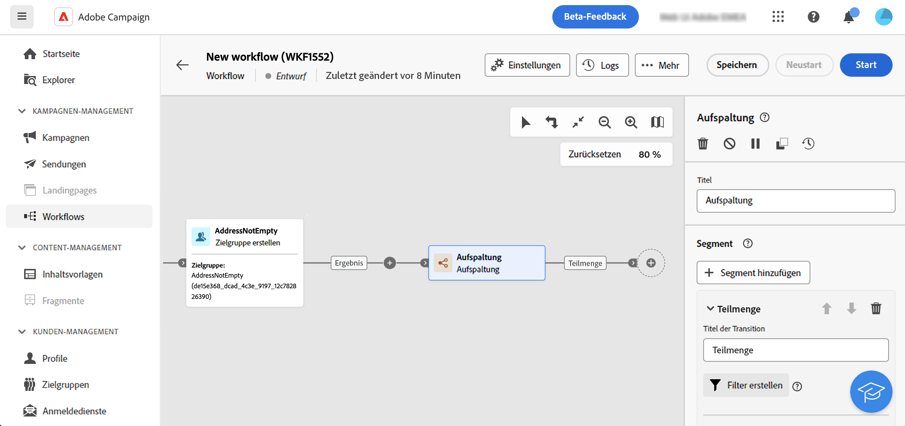
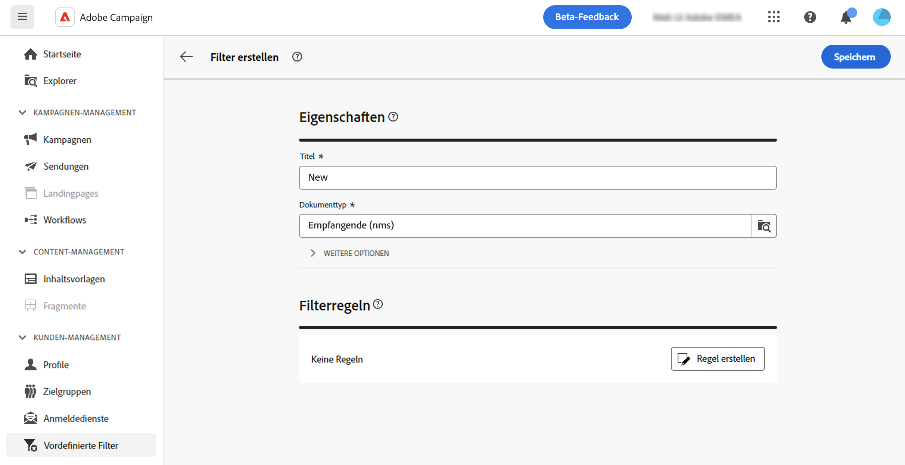
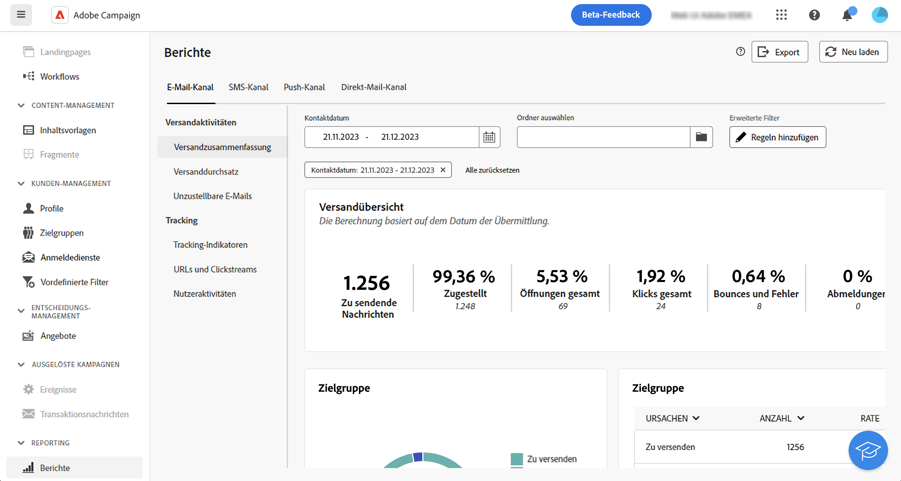
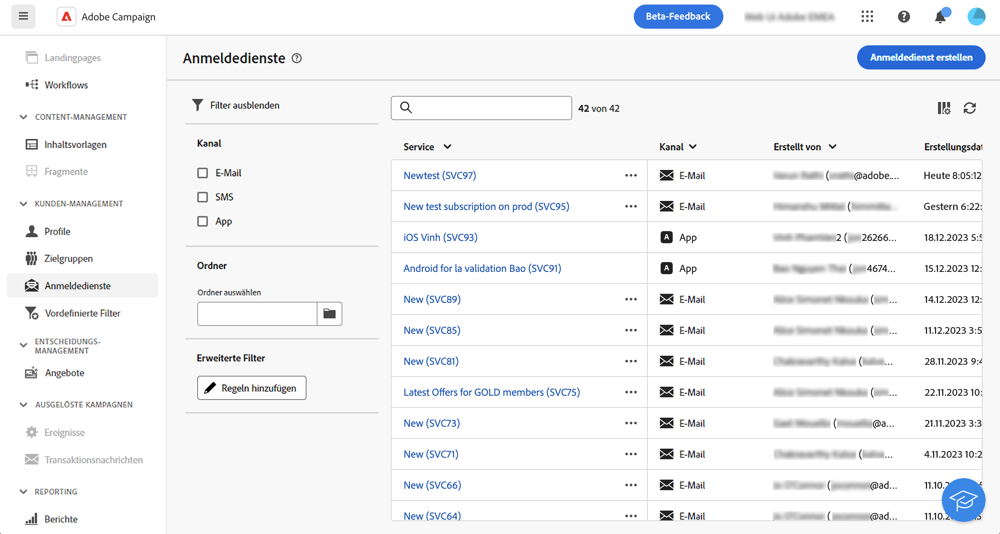
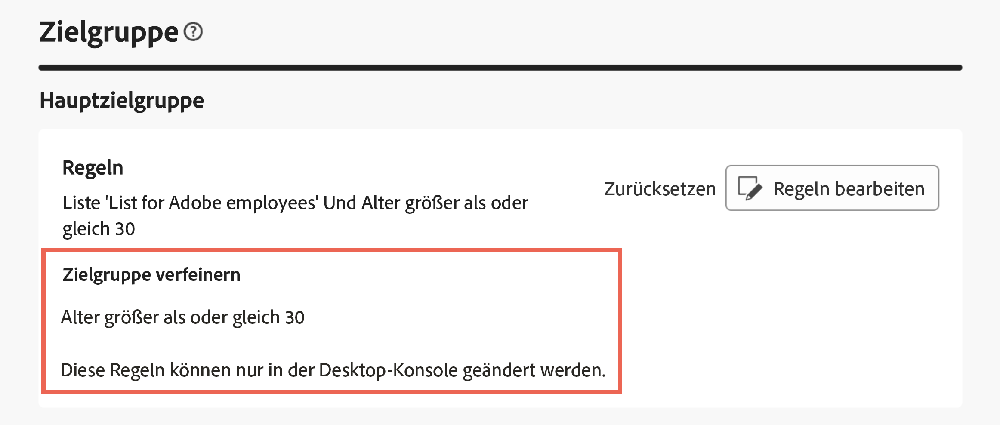
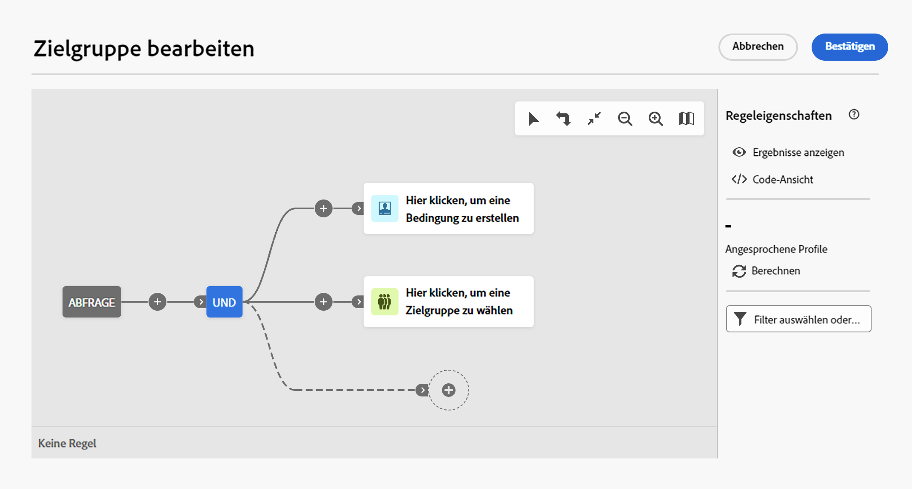

# Arbeiten mit dem Abfrage-Modeler {#segment-builder}

>[!CONTEXTUALHELP]
>id="acw_homepage_learning_card5"
>title="Neuer Abfrage-Modeler"
>abstract="Adobe Campaign Web verfügt über einen Abfrage-Modeler, der den Prozess des Filterns von Datenbanken vereinfacht, um spezifische Zielgruppen auf der Grundlage verschiedener Kriterien auszuwählen. Dies schließt die Verwendung erweiterter Ausdrücke und Operatoren ein. Der Abfrage-Modeler ist in jedem Kontext verfügbar, in dem Sie Regeln zum Filtern von Daten definieren müssen."

>[!CONTEXTUALHELP]
>id="acw_orchestration_querymodeler_querymessage"
>title="Abfrage-Modeler"
>abstract="Definieren Sie Filterkriterien für Empfängerinnen und Empfänger oder jede andere Zielgruppendimension aus der Datenbank. Nutzen Sie Ihre Adobe Experience Platform-Zielgruppe, um die Zielgruppe weiter zu verfeinern und die Wirkung der Kampagne zu maximieren."

>[!CONTEXTUALHELP]
>id="acw_deliveries_refine_target"
>title="Zielgruppe verfeinern"
>abstract="Diese Regeln können nur in der Client-Konsole geändert werden."

Die Adobe Campaign Web-Benutzeroberfläche verfügt über einen Abfrage-Modeler, der das Filtern von Datenbanken anhand verschiedener Kriterien vereinfacht. Dadurch wird die vollständige Kompatibilität mit den in der Client-Konsole erstellten Abfragen sichergestellt und ein nahtloser Übergang zur Web-Benutzeroberfläche ermöglicht.

Darüber hinaus verwaltet der Abfrage-Modellierer sehr komplexe und lange Abfragen effizient und bietet mehr Flexibilität und Präzision. Es unterstützt auch vordefinierte Filter innerhalb von Bedingungen und ermöglicht es Benutzenden, Abfragen mühelos zu verfeinern und gleichzeitig erweiterte Ausdrücke und Operatoren für umfassende Zielgruppen-Targeting- und Segmentierungsstrategien zu verwenden.

## Zugreifen auf den Abfrage-Modeler

Der Abfrage-Modeler ist in jedem Kontext verfügbar, in dem Sie Regeln zum Filtern von Daten definieren müssen.

| Verwendung | Beispiel |
|  ---  |  ---  |
| **Zielgruppen definieren**: Geben Sie die Population an, die Sie in Ihren Nachrichten oder Workflows ansprechen möchten, und erstellen Sie mühelos neue Zielgruppen, die auf Ihre Anforderungen zugeschnitten sind. [Weitere Informationen zum Erstellen von Zielgruppen](../audience/one-time-audience.md) | {zoomable="yes"}{width="200" align="center" zoomable="yes"} [Bild, das den Zugriff auf die Benutzeroberfläche zur Zielgruppenerstellung zeigt] |
| **Workflow-Aktivitäten anpassen**: Wenden Sie Regeln innerhalb von Workflow-Aktivitäten an, wie **Aufspaltung** und **Abstimmung**, um sie an Ihre spezifischen Anforderungen anzupassen. [Weitere Informationen zu Workflow-Aktivitäten](../workflows/activities/about-activities.md) | {zoomable="yes"}{width="200" align="center" zoomable="yes"} [Bild, das den Zugriff auf Workflow-Anpassungsoptionen zeigt] |
| **Vordefinierte Filter**: Erstellen Sie vordefinierte Filter, die bei verschiedenen Filtervorgängen als Abkürzungen dienen, unabhängig davon, ob Sie mit Datenlisten arbeiten oder die Zielgruppe für einen Versand bilden.  [Erfahren Sie, wie Sie mit vordefinierten Filtern arbeiten](../get-started/predefined-filters.md) | {zoomable="yes"}{width="200" align="center" zoomable="yes"} [Bild, das den Zugriff auf vordefinierte Filter zeigt] |
| **Berichtsdaten filtern**: Regeln hinzufügen, um die in Berichten angezeigten Daten zu filtern. [Informationen zum Arbeiten mit Profilen](../reporting/gs-reports.md) | {zoomable="yes"}{width="200" align="center" zoomable="yes"} [Bild, das zeigt, wie Daten in Berichten gefiltert werden] |
| **Listen anpassen**: Erstellen Sie benutzerdefinierte Regeln, um die in Listen angezeigten Daten wie Empfänger- oder Versandlisten zu filtern. [Informationen zum Filtern von Listen](../get-started/list-filters.md#list-built-in-filters) | {zoomable="yes"}{width="200" align="center" zoomable="yes"} [Bild, das die Anpassung von Listenfiltern zeigt] |
| **Bedingten Inhalt erstellen**: E-Mail-Inhalte dynamisch gestalten, indem Bedingungen erstellt werden, die definieren, welche Inhalte für verschiedene Empfängerinnen und Empfänger angezeigt werden sollen. So wird eine personalisierte und relevante Nachrichtenübermittlung sichergestellt. [Informationen zum Erstellen von bedingten Inhalten](../personalization/conditions.md) | {width="200" align="center" zoomable="yes"} [Bild, das die Erstellung bedingter Inhalte zeigt] |

>[!NOTE]
>
>Beim Zugriff auf ein in der Client-Konsole erstelltes Objekt, auf das Regeln angewendet wurden, z. B. eine Zielgruppe oder ein vordefinierter Filter, wird möglicherweise der Abschnitt **[!UICONTROL Ziel]** einschränken“ angezeigt. Dies bedeutet, dass zusätzliche Parameter zur Verfeinerung der Regel-Zielgruppe konfiguriert wurden. Diese Parameter können nur in der Konsole geändert werden.
>
>{zoomable="yes"}

## Benutzeroberfläche des Abfrage-Modelers {#interface}

Der Abfrage-Modellierer bietet eine zentrale Arbeitsfläche, auf der Sie Ihre Abfrage erstellen, und einen rechten Bereich mit Informationen zu Ihrer Abfrage.

>[!CONTEXTUALHELP]
>id="acw_rule_builder_switch_button"
>title="Neues Anwendererlebnis"
>abstract="Verwenden Sie diesen Umschalter, um zwischen dem klassischen Abfrage-Modellierer und dem neuen Regel-Builder-Erlebnis zu wechseln."

{zoomable="yes"}

### Die zentrale Arbeitsfläche {#canvas}

Auf der zentralen Arbeitsfläche des Abfrage-Modellierers können Sie die verschiedenen Komponenten hinzufügen und kombinieren, um Ihre Abfrage zu erstellen. [So erstellen Sie eine Abfrage](build-query.md)

Die Symbolleiste oben rechts auf der Arbeitsfläche bietet Optionen zum einfachen Bearbeiten der Abfragekomponenten und zum Navigieren auf der Arbeitsfläche:

* **Mehrfachauswahl-Modus**: Wählen Sie mehrere Filterkomponenten aus, um sie zu kopieren und am gewünschten Ort einzufügen.
* **Drehen**: Dreht die Arbeitsfläche vertikal.
* **An Bildschirm anpassen**: Passt die Vergrößerung der Arbeitsfläche an Ihren Bildschirm an.
* **Verkleinern**/**Einzoomen**: Verkleinern oder vergrößern Sie die Arbeitsfläche.
* **Karte anzeigen**: Öffnet einen Schnappschuss der Arbeitsfläche, der Ihre aktuelle Position anzeigt.

### Das Fenster „Regeleigenschaften“ {#rule-properties}

Auf der rechten Seite enthält der Bereich **[!UICONTROL Regeleigenschaften]** Informationen zu Ihrer Abfrage. Damit können Sie verschiedene Vorgänge ausführen, um Ihre Abfrage zu überprüfen und sicherzustellen, dass sie Ihren Anforderungen entspricht. Dieser Bereich wird beim Einrichten einer Abfrage zum Erstellen einer Zielgruppe angezeigt. [So überprüfen und validieren Sie Ihre Abfrage](build-query.md#check-and-validate-your-query)