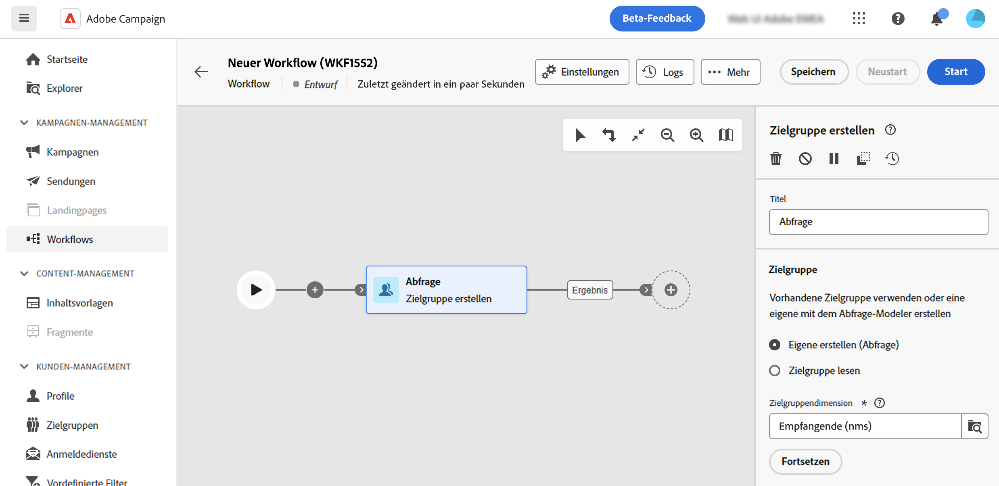

# Arbeiten mit dem Abfrage-Modeler {#segment-builder}

>[!CONTEXTUALHELP]
>id="acw_homepage_learning_card5"
>title="Neuer Abfrage-Modeler"
>abstract="Adobe Campaign Web verfügt über einen Abfrage-Modeler, der den Prozess des Filterns von Datenbanken vereinfacht, um spezifische Zielgruppen auf der Grundlage verschiedener Kriterien auszuwählen. Dies schließt die Verwendung erweiterter Ausdrücke und Operatoren ein. Der Abfrage-Modeler ist in jedem Kontext verfügbar, in dem Sie Regeln zum Filtern von Daten definieren müssen."

>[!CONTEXTUALHELP]
>id="acw_orchestration_querymodeler_querymessage"
>title="Abfrage-Modeler"
>abstract="Definieren Sie Filterkriterien für Empfängerinnen und Empfänger oder jede andere Zielgruppendimension aus der Datenbank. Nutzen Sie Ihre Adobe Experience Platform-Zielgruppe, um die Zielgruppe weiter zu verfeinern und die Wirkung der Kampagne zu maximieren."

Die Adobe Campaign Web-Benutzeroberfläche verfügt über einen Abfrage-Modeler, der das Filtern von Datenbanken anhand verschiedener Kriterien vereinfacht. Dadurch wird die vollständige Kompatibilität mit den in der Client-Konsole erstellten Abfragen sichergestellt und ein nahtloser Übergang zur Web-Benutzeroberfläche ermöglicht.

Außerdem kann der Abfrage-Modeler sehr komplexe und lange Abfragen effizient verwalten – und das bei höherer Flexibilität und Genauigkeit. Darüber hinaus werden vordefinierte Filter in Bedingungen unterstützt, sodass Sie Ihre Abfragen mühelos verfeinern und gleichzeitig erweiterte Ausdrücke und Operatoren für umfassende Zielgruppenbestimmung und Segmentierungsstrategien nutzen können.

## Zugreifen auf den Abfrage-Modeler

Der Abfrage-Modeler ist in jedem Kontext verfügbar, in dem Sie Regeln zum Filtern von Daten definieren müssen.

| Verwendung | Beispiel |
|  ---  |  ---  |
| **Zielgruppen definieren**: Geben Sie die Population an, die Sie in Ihren Nachrichten oder Workflows ansprechen möchten, und erstellen Sie mühelos neue Zielgruppen, die auf Ihre Anforderungen zugeschnitten sind. [Weitere Informationen zum Erstellen von Zielgruppen](../audience/one-time-audience.md) | {zoomable=&quot;yes&quot;}{width="200" align="center" zoomable="yes"} |
| **Workflow-Aktivitäten anpassen**: Wenden Sie Regeln innerhalb von Workflow-Aktivitäten an, z. B. **Aufspaltung** und **Abstimmung**, um sie an Ihre spezifischen Anforderungen anzupassen.  [Weitere Informationen zu Workflow-Aktivitäten](../workflows/activities/about-activities.md). | {zoomable=&quot;yes&quot;}{width="200" align="center" zoomable="yes"} |
| **Vordefinierte Filter**: Erstellen Sie vordefinierte Filter, die bei verschiedenen Filtervorgängen als Abkürzungen dienen, unabhängig davon, ob Sie mit Datenlisten arbeiten oder die Zielgruppe für einen Versand bilden.  [Erfahren Sie, wie Sie mit vordefinierten Filtern arbeiten](../get-started/predefined-filters.md) | {zoomable=&quot;yes&quot;}{width="200" align="center" zoomable="yes"} |
| **Berichtsdaten filtern**: Fügen Sie eine Regel hinzu, um die in Berichten angezeigten Daten zu filtern.  [Informationen zum Arbeiten mit Profilen](../reporting/gs-reports.md) | {zoomable=&quot;yes&quot;}{width="200" align="center" zoomable="yes"} |
| **Listen anpassen**: Erstellen Sie benutzerdefinierte Regeln, um die in Listen angezeigten Daten zu filtern, wie z. B. Empfängerinnen und Empfänger, Sendungslisten usw.  [Informationen zum Filtern von Listen](../get-started/list-filters.md#list-built-in-filters) | {zoomable=&quot;yes&quot;}{width="200" align="center" zoomable="yes"} |
| **Bedingten Inhalt erstellen**: Gestalten Sie den E-Mail-Inhalt dynamisch, indem Sie Bedingungen erstellen, die festlegen, welche Inhalte den verschiedenen Empfangenden angezeigt werden sollen, und so personalisierte und relevante Nachrichten sicherstellen. [Informationen zum Erstellen von bedingten Inhalten](../personalization/conditions.md) | {width="200" align="center" zoomable="yes"} |

## Benutzeroberfläche des Abfrage-Modelers {#interface}

Der Abfrage-Modeler bietet eine zentrale Arbeitsfläche, auf der Sie Ihre Abfrage erstellen, sowie einen rechten Bereich mit Informationen zu Ihrer Abfrage.

{zoomable=&quot;yes&quot;}

### Die zentrale Arbeitsfläche {#canvas}

Der Abfrage-Modeler bietet eine zentrale Arbeitsfläche, auf der Sie die verschiedenen Komponenten hinzufügen und kombinieren können, um Ihre Abfrage zu erstellen. [So erstellen Sie eine Abfrage](build-query.md)

Die Symbolleiste oben rechts in der Arbeitsfläche bietet Optionen zum einfachen Bearbeiten der Abfragekomponenten und Navigieren auf der Arbeitsfläche:

* **Mehrfachauswahl-Modus**: Wählen Sie mehrere Filterkomponenten aus, um sie zu kopieren und am gewünschten Ort einzufügen.
* **Drehen**: Dreht die Arbeitsfläche vertikal.
* **An Bildschirm anpassen**: Passt die Vergrößerung der Arbeitsfläche an Ihren Bildschirm an.
* **Verkleinern**/**Vergrößern**: Verkleinert bzw. vergrößert die Arbeitsfläche.
* **Karte anzeigen**: Öffnet einen Snapshot der Arbeitsfläche, in der Sie sich befinden.

### Das Fenster „Regeleigenschaften“ {#rule-properties}

Das Fenster **[!UICONTROL Regeleigenschaften]** rechts enthält Informationen zu Ihrer Abfrage. Damit können Sie verschiedene Vorgänge ausführen, um Ihre Abfrage zu überprüfen und sicherzustellen, dass sie Ihren Anforderungen entspricht. [So überprüfen und validieren Sie Ihre Abfrage](build-query.md#check-and-validate-your-query)
