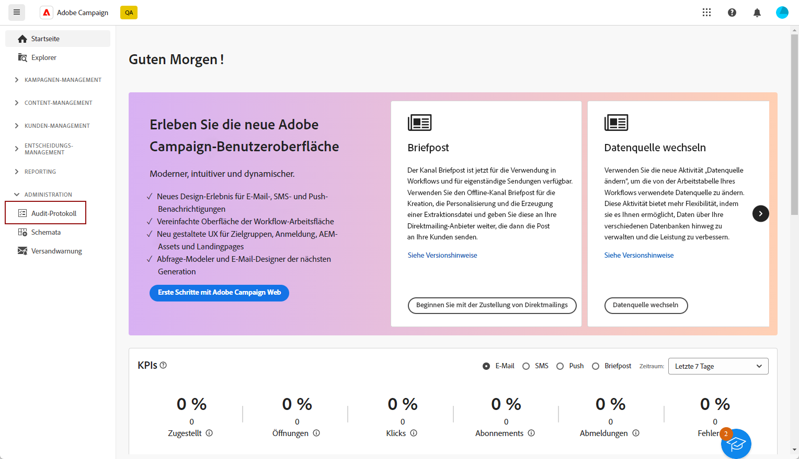
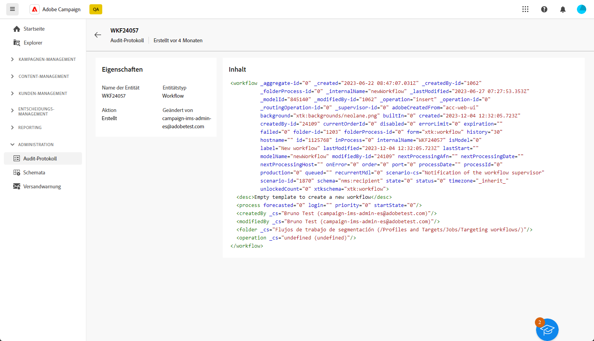

# Audit-Protokoll {#audit-trail}

In der Adobe Campaign Web-Benutzeroberfläche bietet die Funktion **[!UICONTROL Audit-Protokoll]** Benutzerinnen und Benutzern vollständige Einsicht in alle Änderungen, die an wichtigen Entitäten in Ihrer Instanz vorgenommen wurden. Dies sind typischerweise Änderungen, die den reibungslosen Betrieb der Instanz wesentlich beeinflussen.

>[!IMPORTANT]
>
>* Die Adobe Campaign Web-Benutzeroberfläche prüft keine Änderungen an Benutzerrechten, Vorlagen, Personalisierungen oder Kampagnen.
>* Nur Admins der Instanz können das Audit-Protokoll verwalten.

Die Funktion **[!UICONTROL Audit-Protokoll]** zeichnet im Rahmen eines detaillierten Protokolls ständig und in Echtzeit die Aktionen und Ereignisse auf, die in der Adobe Campaign-Instanz stattfinden. Dies bietet eine einfache Methode, um auf einen chronologischen Dateneintrag mit Abfragen zuzugreifen, wie zum Status von Workflows, den Personen, die diese geändert haben oder den Aktivitäten, die von Benutzerinnen und Benutzern innerhalb der Instanz ausgeführt wurden.

+++ Weitere Informationen über die verfügbaren Entitäten im Audit-Protokoll

* Das **Audit-Protokoll für Quellschemata** ermöglicht es Ihnen, Aktivitäten und aktuelle Änderungen an Ihren Schemata in der Client-Konsole von Campaign v8 zu überwachen.

  Detaillierte Informationen zu Schemata finden Sie in der [Dokumentation zu Campaign v8](https://experienceleague.adobe.com/de/docs/campaign/campaign-v8/developer/shemas-forms/schemas).

* Das **Workflow-Audit-Protokoll** ermöglicht es Ihnen, Aktivitäten und aktuelle Änderungen an Workflows zu verfolgen, einschließlich der aktuellen Status wie:

   * Starten
   * Aussetzen
   * Stoppen
   * Neu starten
   * Bereinigen, was der Aktion „Verlauf bereinigen“ entspricht
   * Simulieren, was der Aktion „Starten“ im Simulationsmodus entspricht
   * Wecken, was der Aktion „Vorgezogene Ausführung der ausstehenden Aufgaben“ entspricht
   * Unbedingter Stopp

  Weiterführende Informationen zu Workflows finden Sie auf [dieser Seite](../workflows/gs-workflows.md).

* Das **Audit-Protokoll für Optionen** ermöglicht es Ihnen, Aktivitäten und aktuelle Änderungen an Ihren Optionen in Campaign v8 zu überwachen.

  Weiterführende Informationen zu Optionen finden Sie auf [dieser Seite](https://experienceleague.adobe.com/de/docs/campaign-classic/using/installing-campaign-classic/appendices/configuring-campaign-options).

* Das **Audit-Protokoll für den Versand** ermöglicht Ihnen die Überprüfung der Aktivitäten und der letzten Änderungen an Ihren Sendungen.

  Weiterführende Informationen zu Sendungen finden Sie auf [dieser Seite](../msg/gs-deliveries.md).

* Die Option **Externes Konto** ermöglicht Ihnen die Überprüfung von Änderungen an externen Konten in Campaign v8, die von technischen Prozessen wie technischen Workflows oder Kampagnen-Workflows verwendet werden.

  Weitere Informationen zu externen Konten finden Sie auf dieser [Seite](../administration/external-account.md).

* Das **Versand-Mapping** ermöglicht es Ihnen, Aktivitäten und kürzlich an Ihrem Versand-Mapping vorgenommene Änderungen in Campaign v8 zu überwachen.

  Weiterführende Informationen zu „Versand-Mapping“ finden Sie auf [dieser Seite](https://experienceleague.adobe.com/de/docs/campaign/campaign-v8/audience/add-profiles/target-mappings).

* Eine **Web-Anwendung** ermöglicht Ihnen das Überprüfen von Änderungen an Web-Formularen in Campaign v8, die zum Erstellen von Seiten mit Eingabe- und Auswahlfeldern verwendet werden und die Daten aus der Datenbank enthalten können.

  Weitere Informationen zu Web-Anwendungen finden Sie auf dieser [Seite](https://experienceleague.adobe.com/de/docs/campaign/campaign-v8/content/webapps).

* **Angebot** ermöglicht es Ihnen, die Aktivitäten und letzten Änderungen an Ihren Angeboten zu überprüfen.

  Weiterführende Informationen zu Angeboten finden Sie auf [dieser Seite](../msg/offers.md).

* Die Option **Operator** ermöglichen es Ihnen, Aktivitäten und Änderungen zu überwachen, die vor Kurzem an Ihren Operatoren in Campaign v8 vorgenommen wurden.

  Weiterführende Informationen zu Benutzerinnen und Benutzern finden Sie auf [dieser Seite](https://experienceleague.adobe.com/de/docs/campaign/campaign-v8/offers/interaction-settings/interaction-operators).

+++

## Zugriff auf das Audit-Protokoll {#accessing-audit-trail}

So greifen auf das **[!UICONTROL Audit-Protokoll]** Ihrer Instanz zu:

1. Wählen Sie im Menü **[!UICONTROL Administration]** die Option **[!UICONTROL Audit-Protokoll]** aus.

   

1. Das Fenster **[!UICONTROL Audit-Protokoll]** wird mit der Liste Ihrer Entitäten geöffnet. Die Adobe Campaign Web-Benutzeroberfläche prüft die Aktionen zum Erstellen, Bearbeiten und Löschen von Workflows, Optionen, Sendungen oder Schemata.

   Wählen Sie eine der Entitäten aus, um mehr über die letzten Änderungen zu erfahren.

1. Im Fenster **[!UICONTROL Audit-Entität]** erhalten Sie detailliertere Informationen zu der ausgewählten Entität, z. B.:

   * **[!UICONTROL Typ]**: Workflow, Optionen, Sendungen oder Schemata.
   * **[!UICONTROL Entität]**: Interner Name Ihrer Aktivitäten.
   * **[!UICONTROL Geändert von]**: Benutzername der Person, die diese Entität zuletzt geändert hat.
   * **[!UICONTROL Aktion]**: Letzte Aktion, die für diese Entität ausgeführt wurde, entweder „Erstellt“, „Geändert“ oder „Gelöscht“.
   * **[!UICONTROL Änderungsdatum]**: Datum der letzten Aktion, die an dieser Entität durchgeführt wurde.

   Der Code-Block gibt Ihnen weitere Informationen darüber, was genau in Ihrer Entität geändert wurde.

   