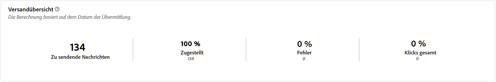
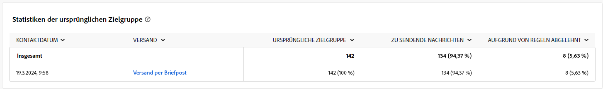
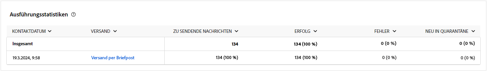
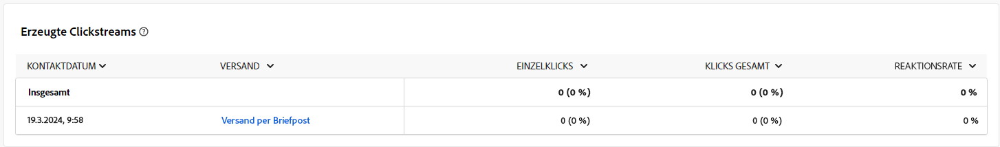

# Kampagnenberichte für den Briefpost-Kanal {#campaign-reports-direct-mail}

Jeder Kampagnenbericht ist in verschiedene Widgets unterteilt, die den Erfolg und die Fehler Ihrer Kampagne detailliert beschreiben. Für den Briefpost-Kanal werden die Berichte und Metriken nachfolgend beschrieben. Erfahren Sie auf [dieser Seite](campaign-reports.md), wie Sie auf Ihre Kampagnenberichte zugreifen können.

## Versandzusammenfassung {#delivery-summary-direct}

### Versandübersicht {#delivery-overview-direct}

>[!CONTEXTUALHELP]
>id="acw_campaign_reporting_delivery_overview_direct_mail"
>title="Versandübersicht"
>abstract="Die **Versandübersicht** präsentiert wichtige Leistungsmetriken (KPI) mit umfassenden Erkenntnissen zur Interaktion Ihrer Besucherinnen und Besucher mit jedem Briefpostversand. Die Metriken sind unten dargestellt."

Die **[!UICONTROL Versandübersicht]** bietet wichtige Leistungsmetriken (KPIs) mit umfassenden Erkenntnissen zur Interaktion Ihrer Besucherinnen und Besucher mit jedem Briefpostversand. Die Metriken sind unten dargestellt.

{zoomable="yes"}{align="center"}

+++Erfahren Sie mehr über Versandübersichtsmetriken.

* **[!UICONTROL Zu sendende Nachrichten]**: Gesamtzahl der während der Versandvorbereitung verarbeiteten Nachrichten.

* **[!UICONTROL Zugestellt]**: Anzahl der erfolgreich gesendeten Nachrichten im Verhältnis zur Gesamtzahl der gesendeten Nachrichten.

* **[!UICONTROL Fehler]**: Summe der Fehler, die beim Versand und bei der automatischen Rücksendung kumuliert wurden, bezogen auf die Gesamtzahl der gesendeten Nachrichten.

* **[!UICONTROL Klicks gesamt]**: Gesamtzahl der unterschiedlichen Empfängerinnen und Empfänger, die einen Versand mindestens einmal angeklickt haben.

+++

### Statistiken der ursprünglichen Zielgruppe {#delivery-summary-direct-initial-target}

>[!CONTEXTUALHELP]
>id="acw_campaign_reporting_target_audience_direct_mail"
>title="Statistiken der ursprünglichen Zielgruppe"
>abstract="Empfängerdaten und Nachrichteninformationen werden in der Tabelle **Statistiken der ursprünglichen Zielgruppe** angezeigt, die die Analyse der Versandvorbereitung widerspiegelt."

Die Tabelle **[!UICONTROL Statistiken der anfänglichen Zielgruppe]** zeigt Daten zu Ihren Empfängerinnen und Empfängern an. Die Metriken werden bei der Versandvorbereitung berechnet und zeigen: die ursprüngliche Zielgruppe, die Anzahl der zu sendenden Nachrichten und die Anzahl der ausgeschlossenen Empfängerinnen und Empfänger.

{zoomable="yes"}

+++Erfahren Sie mehr über die Metriken zu den Statistiken der ursprünglichen Zielgruppe.

* **[!UICONTROL Ursprüngliche Zielgruppe]**: Gesamtzahl der Zielgruppenempfängerinnen und -empfänger.

* **[!UICONTROL Zu versendende Nachricht]**: Gesamtzahl der nach erfolgter Versandvorbereitung zu versendenden Nachrichten.

* **[!UICONTROL Aufgrund von Regeln abgelehnt]**: Gesamtzahl der Adressen, die während der Analyse beim Anwenden von Regeln ignoriert wurden: fehlende Adresse, in Quarantäne, auf Blockierungsliste usw.

+++

### Ausführungsstatistiken {#delivery-summary-direct-exec-stats}

>[!CONTEXTUALHELP]
>id="acw_campaign_reporting_execution_statistics_direct_mail"
>title="Versandstatistiken"
>abstract="Die Tabelle **Ausführungsstatistiken** zeigt den Erfolg Ihres Briefpostversands und die aufgetretenen Fehler an."

Die Tabelle **[!UICONTROL Ausführungsstatistiken]** bietet eine Aufschlüsselung des Erfolgs jedes Briefpostversands mit folgenden detaillierten Metriken.

+++Erfahren Sie mehr über Versandstatistik-Metriken.

* **[!UICONTROL Zu versendende Nachricht]**: Gesamtzahl der nach erfolgter Versandvorbereitung zu versendenden Nachrichten.

* **[!UICONTROL Erfolg]**: Anzahl der erfolgreich verarbeiteten Nachrichten im Verhältnis zur Anzahl der zu versendenden Nachrichten.

* **[!UICONTROL Fehler]**: Gesamtzahl der über alle Sendungen hinweg kumulierten Fehler und der automatischen Bounce-Verarbeitungen im Verhältnis zur Anzahl der zu versendenden Nachrichten.

* **[!UICONTROL Neue Quarantänen]**: Gesamtzahl der Adressen, die infolge eines fehlgeschlagenen Versands unter Quarantäne gestellt wurden (unbekannter Nutzer, ungültige Domain), im Verhältnis zur Anzahl der zu versendenden Nachrichten.

+++

### Generierte Clickstreams {#click-streams}

>[!CONTEXTUALHELP]
>id="acw_campaign_reporting_clicks_direct_mail"
>title="Generierte Clickstreams"
>abstract="Die Tabelle **Generierte Clickstreams** zeigt Daten dazu an, wie Ihre Empfängerinnen und Empfänger mit Ihrem Versand interagiert haben."

{zoomable="yes"}{align="center"}

Die Tabelle **Erzeugte Clickstreams** zeigt die Gründe, warum aus den Zielprofilen ausgeschlossene Benutzerprofile die Nachricht nicht erhalten haben.

+++Erfahren Sie mehr über die Metriken für erzeugte Clickstreams.

* **[!UICONTROL Einzelklicks]**: Gesamtzahl der unterschiedlichen Empfängerinnen und Empfänger, die einen Versand mindestens einmal angeklickt haben.

* **[!UICONTROL Klicks gesamt]**: Gesamtzahl der Klicks auf Links in Sendungen.

* **[!UICONTROL Reaktionsrate]**: Verhältnis der Anzahl an Zielgruppenempfängerinnen und -empfängern, die auf einen Versand geklickt haben, in Bezug zur geschätzten Anzahl der Zielgruppenempfängerinnen und -empfänger, die einen Versand geöffnet haben.

+++
