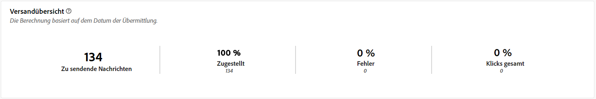
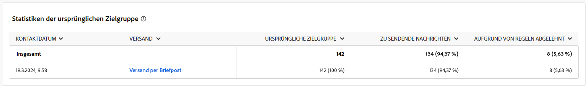
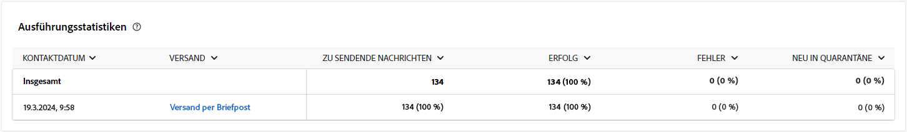
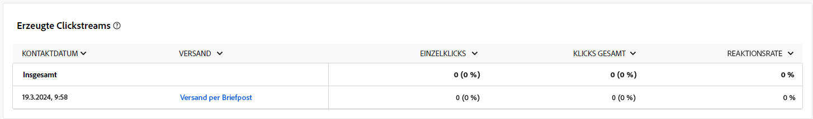

# Kampagnenberichte für die Kanäle externer Sendungen {#campaign-reports-direct-mail}

Jeder Kampagnenbericht ist in verschiedene Widgets unterteilt, die den Erfolg und die Fehler Ihrer Kampagne detailliert beschreiben. Im Folgenden werden Berichte und Metriken für die Kanäle externer Sendungen beschrieben. Erfahren Sie auf [dieser Seite](campaign-reports.md), wie Sie auf Ihre Kampagnenberichte zugreifen können.

Der folgende Bericht wird im Zusammenhang mit Briefpost beschrieben. Es ist auch für Callcenter-Kanäle und benutzerdefinierte externe Kanäle verfügbar.

## Versandzusammenfassung {#delivery-summary-direct}

### Versandübersicht {#delivery-overview-direct}

>[!CONTEXTUALHELP]
>id="acw_campaign_reporting_delivery_overview_direct_mail"
>title="Versandübersicht"
>abstract="Die **Versandübersicht** präsentiert wichtige Leistungsmetriken (KPI) mit umfassenden Erkenntnissen zur Interaktion Ihrer Besucherinnen und Besucher mit jedem Briefpostversand. Die Metriken sind unten dargestellt."

Die **[!UICONTROL Versandübersicht]** bietet wichtige Leistungsmetriken (KPIs) mit umfassenden Erkenntnissen über die Interaktion Ihrer Besucherinnen und Besucher mit jedem Briefpostversand. Die Metriken sind unten dargestellt.

{zoomable="yes"}{align="center"}

+++Weitere Informationen zu den Metriken „Versandübersicht“.

* **[!UICONTROL Zu sendende Nachrichten]**: Gesamtzahl der während der Versandvorbereitung verarbeiteten Nachrichten.

* **[!UICONTROL Zugestellt]**: Anzahl der erfolgreich gesendeten Nachrichten im Verhältnis zur Gesamtzahl der gesendeten Nachrichten.

* **[!UICONTROL Fehler]**: Gesamtzahl der beim Versand und bei der automatischen Rücksendung kumulierten Fehler, bezogen auf die Gesamtzahl der gesendeten Nachrichten.

* **[!UICONTROL Klicks gesamt]**: Gesamtzahl der unterschiedlichen Empfängerinnen und Empfänger, die einen Versand mindestens einmal angeklickt haben.

+++

### Statistiken der ursprünglichen Zielgruppe {#delivery-summary-direct-initial-target}

>[!CONTEXTUALHELP]
>id="acw_campaign_reporting_target_audience_direct_mail"
>title="Statistiken der ursprünglichen Zielgruppe"
>abstract="Empfängerdaten und Nachrichteninformationen werden in der Tabelle **Statistiken der ursprünglichen Zielgruppe** angezeigt, die die Analyse der Versandvorbereitung widerspiegelt."

Die Tabelle **[!UICONTROL Statistiken der ursprünglichen Zielgruppe]** zeigt Daten zu Ihren Empfängerinnen und Empfängern an. Die Metriken werden bei der Versandvorbereitung berechnet und zeigen die ursprüngliche Zielgruppe, die Anzahl der zu sendenden Nachrichten und die Anzahl der ausgeschlossenen Empfängerinnen und Empfänger.

{zoomable="yes"}

+++Weitere Informationen zu den Statistikmetriken der ursprünglichen Zielgruppe.

* **[!UICONTROL Ursprüngliche Zielgruppe]**: Gesamtzahl der Zielgruppenempfängerinnen und -empfänger.

* **[!UICONTROL Zu versendende Nachricht]**: Gesamtzahl der nach erfolgter Versandvorbereitung zu versendenden Nachrichten.

* **[!UICONTROL Aufgrund von Regeln abgelehnt]**: Gesamtzahl der Adressen, die während der Analyse beim Anwenden von Regeln ignoriert wurden, z. B. fehlende Adressen, Adressen in Quarantäne oder Adressen auf einer Blockierungsliste.

+++

### Ausführungsstatistiken {#delivery-summary-direct-exec-stats}

>[!CONTEXTUALHELP]
>id="acw_campaign_reporting_execution_statistics_direct_mail"
>title="Versandstatistiken"
>abstract="Die Tabelle **Ausführungsstatistiken** zeigt den Erfolg Ihres Briefpostversands und die aufgetretenen Fehler an."

Die Tabelle **[!UICONTROL Ausführungsstatistiken]** bietet eine Aufschlüsselung des Erfolgs jedes Briefpostversands mit folgenden detaillierten Metriken.

+++Weitere Informationen zu den Metriken „Versandstatistik“.

* **[!UICONTROL Zu versendende Nachricht(en)]**: Gesamtzahl der nach erfolgter Versandvorbereitung zu versendenden Nachrichten.

* **[!UICONTROL Erfolg]**: Anzahl der erfolgreich verarbeiteten Nachrichten, bezogen auf die Anzahl der zu versendenden Nachrichten.

* **[!UICONTROL Fehler]**: Gesamtzahl der über alle Sendungen und automatischen Bounce-Verarbeitungen hinweg kumulierten Fehler, bezogen auf die Anzahl der zu versendenden Nachrichten.

* **[!UICONTROL Neu in Quarantäne]**: Gesamtzahl der Adressen, die infolge eines fehlgeschlagenen Versands unter Quarantäne gestellt wurden (Fehler „Unbekannter Nutzer“, „Ungültige Domain“), bezogen auf die Anzahl der zu versendenden Nachrichten.

+++

### Generierte Clickstreams {#click-streams}

>[!CONTEXTUALHELP]
>id="acw_campaign_reporting_clicks_direct_mail"
>title="Generierte Clickstreams"
>abstract="Die Tabelle **Generierte Clickstreams** zeigt Daten dazu an, wie Ihre Empfängerinnen und Empfänger mit Ihrem Versand interagiert haben."

{zoomable="yes"}{align="center"}

Die Tabelle **Erzeugte Clickstreams** zeigt die Gründe, warum aus den Zielprofilen ausgeschlossene Benutzerprofile die Nachricht nicht erhalten haben.

+++Weitere Informationen zu den Metriken „Erzeugte Clickstreams“.

* **[!UICONTROL Einzelklicks]**: Gesamtzahl der unterschiedlichen Empfängerinnen und Empfänger, die einen Versand mindestens einmal angeklickt haben.

* **[!UICONTROL Klicks gesamt]**: Gesamtzahl der Klicks auf Links in Sendungen.

* **[!UICONTROL Reaktionsrate]**: Verhältnis der Anzahl an Zielgruppenempfängerinnen und -empfängern, die auf einen Versand geklickt haben, bezogen auf die geschätzten Anzahl der Zielgruppenempfängerinnen und -empfänger, die einen Versand geöffnet haben.

+++
