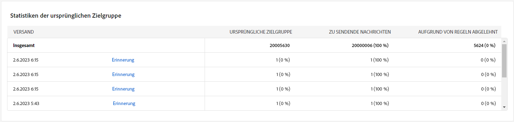
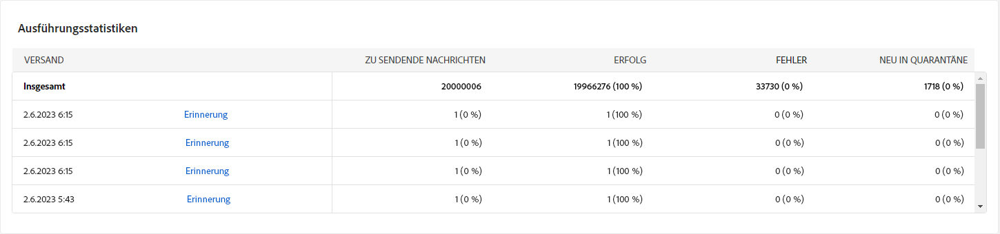
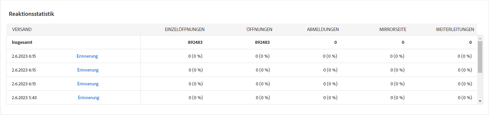
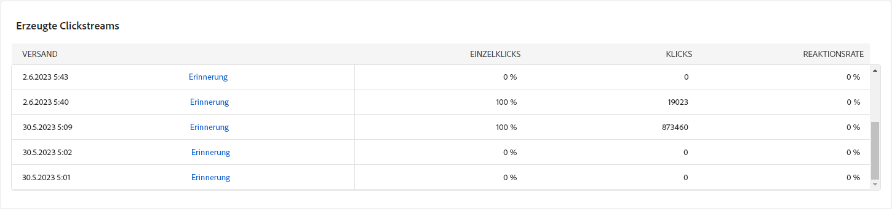
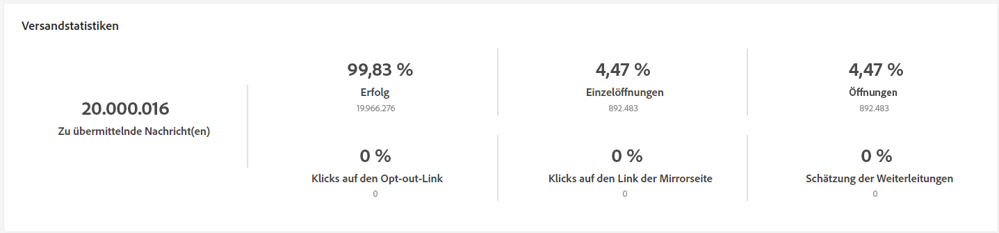
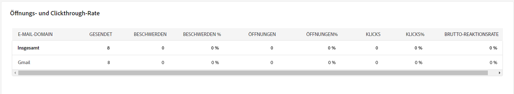
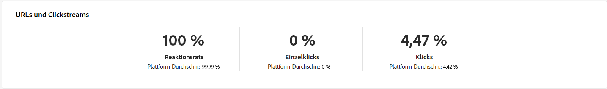
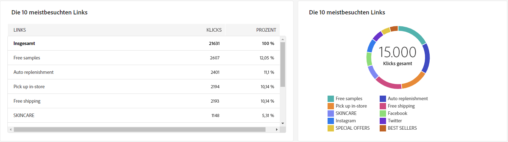
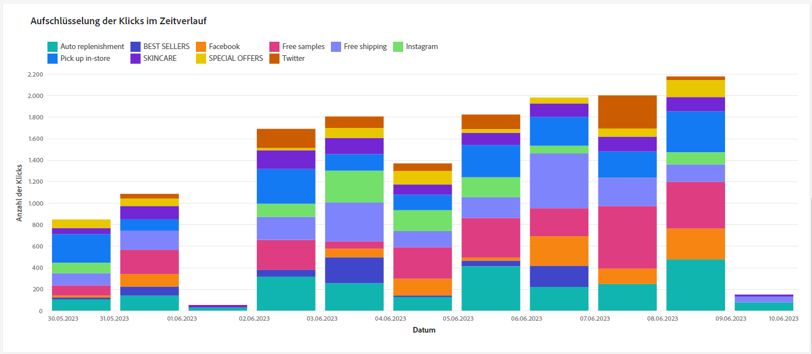
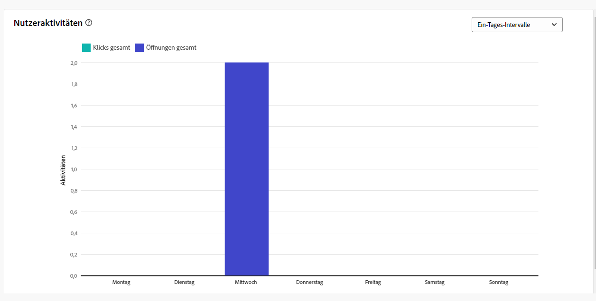

# Kampagnenberichte für den E-Mail-Kanal {#campaign-reports-email-channel}

Jeder Kampagnenbericht ist in verschiedene Widgets unterteilt, die den Erfolg und die Fehler Ihrer Kampagne detailliert beschreiben. Für den E-Mail-Kanal werden die Berichte und Metriken nachfolgend beschrieben. Erfahren Sie auf [dieser Seite](campaign-reports.md), wie Sie auf Ihre Kampagnenberichte zugreifen können.

## Versandzusammenfassung {#delivery-summary-email}

>[!CONTEXTUALHELP]
>id="acw_campaign_reporting_deliveries_overview"
>title="Versandübersicht"
>abstract="Die **Versandübersicht** bietet wichtige Performance-Indikatoren (KPIs), die detaillierte Informationen darüber enthalten, wie Ihre Besucherinnen und Besucher mit Ihrem E-Mail-Versand interagieren."

### Versandübersicht {#delivery-summary-email-ovv}

Der Bericht **[!UICONTROL Versandübersicht]** bietet wichtige Performance-Indikatoren (KPIs), die detaillierte Informationen darüber enthalten, wie Ihre Besucherinnen und Besucher mit Ihrem E-Mail-Versand interagieren. Metriken werden nachfolgend beschrieben.

{zoomable="yes"}

+++Erfahren Sie mehr über die Metriken der E-Mail-Kampagnen-Berichte.

* **[!UICONTROL Zu sendende Nachrichten]**: Gesamtzahl der während der Versandvorbereitung verarbeiteten Nachrichten.

* **[!UICONTROL Zugestellt]**: Anzahl der erfolgreich gesendeten Nachrichten im Verhältnis zur Gesamtzahl der gesendeten Nachrichten.

* **[!UICONTROL Bounces]**: Summe der Fehler, die beim Versand und bei der automatischen Rücksendung kumuliert wurden, bezogen auf die Gesamtzahl der gesendeten Nachrichten.

* **[!UICONTROL Öffnungen insgesamt]**: Gesamtzahl der Zielgruppenempfängerinnen und -empfänger, die mindestens einmal eine Nachricht geöffnet haben.

* **[!UICONTROL Klicks gesamt]**: Gesamtzahl der unterschiedlichen Empfängerinnen und Empfänger, die einen Versand mindestens einmal angeklickt haben.

+++

### Statistiken der ursprünglichen Zielgruppe {#delivery-summary-email-initial-target}

>[!CONTEXTUALHELP]
>id="acw_campaign_reporting_deliveries_target"
>title="Statistiken der ursprünglichen Zielgruppe"
>abstract="Die Tabelle „Statistiken der ursprünglichen Zielgruppe“ zeigt Daten zu Ihren Empfängerinnen und Empfängern an"

Die Tabelle **[!UICONTROL Statistiken der anfänglichen Zielgruppe]** zeigt Daten zu Ihren Empfängerinnen und Empfängern an. Metriken werden nachfolgend beschrieben.

{zoomable="yes"}

+++Erfahren Sie mehr über die Metriken der E-Mail-Kampagnen-Berichte.

* **[!UICONTROL Ursprüngliche Zielgruppe]**: Gesamtzahl der Zielgruppenempfängerinnen und -empfänger.

* **[!UICONTROL Zu versendende Nachricht]**: Gesamtzahl der nach erfolgter Versandvorbereitung zu versendenden Nachrichten.

* **[!UICONTROL Aufgrund von Regeln abgelehnt]**: Gesamtzahl der Adressen, die während der Analyse beim Anwenden von Regeln ignoriert wurden: fehlende Adresse, in Quarantäne, auf Blockierungsliste usw.

+++

### Ausführungsstatistiken {#delivery-summary-email-exec-stats}

>[!CONTEXTUALHELP]
>id="acw_campaign_reporting_email_exec_stats"
>title="Ausführungsstatistiken"
>abstract="Die Tabelle **Ausführungsstatistiken** zeigt den Erfolg Ihres Versands: Zu sendende Nachrichten, Erfolg, Fehler und Neu in Quarantäne."

Die Tabelle **[!UICONTROL Ausführungsstatistiken]** zeigt den Erfolg Ihres Versands im Detail. Metriken werden nachfolgend beschrieben.

{zoomable="yes"}

+++Erfahren Sie mehr über die Metriken der E-Mail-Kampagnen-Berichte.

* **[!UICONTROL Zu versendende Nachricht]**: Gesamtzahl der nach erfolgter Versandvorbereitung zu versendenden Nachrichten.

* **[!UICONTROL Erfolg]**: Anzahl der erfolgreich verarbeiteten Nachrichten im Verhältnis zur Anzahl der zu versendenden Nachrichten.

* **[!UICONTROL Fehler]**: Gesamtzahl der über alle Sendungen hinweg kumulierten Fehler und der automatischen Bounce-Verarbeitungen im Verhältnis zur Anzahl der zu versendenden Nachrichten.

* **[!UICONTROL Neue Quarantänen]**: Gesamtzahl der Adressen, die infolge eines fehlgeschlagenen Versands unter Quarantäne gestellt wurden (unbekannter Nutzer, ungültige Domain), im Verhältnis zur Anzahl der zu versendenden Nachrichten.

  Die E-Mail-Fehlertypen werden in der [Dokumentation zu Adobe Campaign v8 (Client-Konsole)](https://experienceleague.adobe.com/docs/campaign/campaign-v8/send/failures/delivery-failures.html?lang=de#email-error-types){target="_blank"} aufgelistet.

+++

### Reaktionsstatistik {#delivery-summary-email-reaction-stats}

>[!CONTEXTUALHELP]
>id="acw_campaign_reporting_email_reaction_stats"
>title="Reaktionsstatistik"
>abstract="Die Tabelle **Reaktionsstatistik** zeigt die verfügbaren Daten zur Empfängeraktivität Ihres Versands an: Anzahl der Öffnungen, Abonnements, Abmeldungen, Klicks auf Mirrorseiten-Link."

Die Tabelle **[!UICONTROL Reaktionsstatistik]** enthält die verfügbaren Daten zur Empfängeraktivität für Ihren Versand. Metriken werden nachfolgend beschrieben.

{zoomable="yes"}

+++Erfahren Sie mehr über die Metriken der E-Mail-Kampagnen-Berichte.

* **[!UICONTROL Einzelöffnungen]**: Gesamtzahl der Zielgruppenempfängerinnen und -empfänger, die mindestens einmal eine Nachricht geöffnet haben.

* **[!UICONTROL Öffnungen insgesamt]**: Anzahl der unterschiedlichen Zielgruppenempfängerinnen und -empfänger dieser Domain, die mindestens einmal eine Nachricht geöffnet haben.

* **[!UICONTROL Abmeldungen]**: Anzahl der Empfängerinnen und Empfänger, die in dem betreffenden Zeitraum auf Abmeldungen geklickt haben

* **[!UICONTROL Mirrorseite]**: Anzahl der Empfängerinnen und Empfänger, die auf den Link zur Mirrorseite geklickt haben.

* **[!UICONTROL Weiterleitungen]**: Anzahl der Empfängerinnen und Empfänger, die die E-Mail weitergeleitet haben.
+++

### Generierte Clickstreams {#delivery-summary-email-click-streams}

>[!CONTEXTUALHELP]
>id="acw_campaign_reporting_email_click_streams"
>title="Generierte Clickstreams"
>abstract="Die Tabelle **Generierte Clickstreams** zeigt Daten dazu an, wie Ihre Empfängerinnen und Empfänger mit Ihrem Versand interagiert haben."

Die Tabelle **[!UICONTROL Generierte Clickstreams]** zeigt Daten dazu an, wie Ihre Empfängerinnen und Empfänger mit Ihrem Versand interagiert haben. Metriken werden nachfolgend beschrieben.

{zoomable="yes"}

+++Erfahren Sie mehr über die Metriken der E-Mail-Kampagnen-Berichte.

* **[!UICONTROL Einzelklicks]**: Gesamtzahl der eindeutigen Empfängerinnen und Empfänger, die einen Versand mindestens einmal angeklickt haben.

* **[!UICONTROL Klicks insgesamt]**: Gesamtzahl der Klicks auf Links in Sendungen.

* **[!UICONTROL Reaktionsrate]**: Verhältnis der Anzahl an Zielgruppenempfängerinnen und -empfängern, die auf einen Versand geklickt haben, in Bezug zur geschätzten Anzahl der Zielgruppenempfängerinnen und -empfänger, die einen Versand geöffnet haben.

+++

## Unzustellbare Nachrichten {#non-deliverables-email}

### Aufschlüsselung der Fehler nach Typen {#delivery-summary-email-breakdown-per-type}

>[!CONTEXTUALHELP]
>id="acw_campaign_reporting_error_type"
>title="Aufschlüsselung der Fehler nach Typen"
>abstract="Die Tabelle und der Graph zur **Aufschlüsselung der Fehler nach Typen** enthalten die verfügbaren Daten für jeden aufgetretenen Fehlertyp: Benutzerin oder Benutzer unbekannt, Postfach voll, ungültige Domain und mehr."

Die Tabelle und der Graph zur **[!UICONTROL Aufschlüsselung der Fehler nach Typen]** enthalten die verfügbaren Daten zu möglichen Fehlern, die für die einzelnen Domain-Typen aufgetreten sind. Metriken werden nachfolgend beschrieben.

Die in diesem Bericht angezeigten Fehler lösen einen Quarantäneprozess aus. Weitere Informationen zur Quarantäneverwaltung finden Sie in der [Dokumentation zu Campaign v8 (Client-Konsole)](https://experienceleague.adobe.com/docs/campaign/campaign-v8/campaigns/send/failures/delivery-failures.html?lang=de){target="_blank"}.

{zoomable="yes"}

+++Erfahren Sie mehr über die Metriken der E-Mail-Kampagnen-Berichte.

* **[!UICONTROL Unbekannter Nutzer]**: Fehlertyp, der während des Versands erzeugt wird, um anzuzeigen, dass die E-Mail-Adresse ungültig ist.

* **[!UICONTROL Ungültige Domain]**: Fehlertyp, der beim Senden eines Versands erzeugt wird, um anzuzeigen, dass die Domain der E-Mail-Adresse falsch ist oder nicht existiert.

* **[!UICONTROL Postfach voll]**: Fehlertyp, der nach fünf fehlgeschlagenen Versandversuchen erzeugt wird, wenn das Empfängerpostfach zu viele Nachrichten enthält.

* **[!UICONTROL Account deaktiviert]**: Fehlertyp, der beim Senden eines Versands erzeugt wird, um anzuzeigen, dass die Adresse nicht mehr existiert.

* **[!UICONTROL Verweigert]**: Fehlertyp, der erzeugt wird, wenn eine Adresse vom IAP (Internet Access Provider) abgelehnt wird, z. B. nach Anwendung einer Sicherheitsregel (Anti-Spam-Software).

* **[!UICONTROL Unerreichbar]**: Fehlertyp, der in der Nachrichtenverteilungs-Zeichenfolge der Nachricht auftritt: Vorfall im SMTP-Relais, Domain vorübergehend unerreichbar, usw.

* **[!UICONTROL Nicht angemeldet]**: Fehlertyp, wenn das Mobiltelefon der Empfängerin bzw. des Empfängers zum Zeitpunkt des Versands ausgeschaltet war oder über keinen Netzempfang verfügte.

+++

### Aufschlüsselung der Fehler nach Domain {#delivery-summary-email-breakdown-per-domain}

>[!CONTEXTUALHELP]
>id="acw_campaign_reporting_error_domain"
>title="Aufschlüsselung der Fehler nach Domain"
>abstract="Die Tabelle und der Graph zur **Aufschlüsselung der Fehler nach Domain** enthalten die verfügbaren Daten für jeden Fehlertyp, der für die einzelnen Domains aufgetreten ist."

Die Tabelle und der Graph zur **[!UICONTROL Aufschlüsselung der Fehler nach Domain]** enthalten die verfügbaren Daten für mögliche Fehler, die bei den einzelnen Domains aufgetreten sind. Die Metriken sind dieselben wie die der Tabelle und des Graphen **[!UICONTROL Aufschlüsselung der Fehler nach Typen]** weiter oben.

## Tracking-Indikatoren {#tracking-indicators-email}

### Versandstatistiken {#delivery-summary-email-statistics}

>[!CONTEXTUALHELP]
>id="acw_delivery_campaign_delivery_statistics_summary"
>title="Versandstatistiken"
>abstract="Der Graph **Versandstatistiken** zeigt den Erfolg Ihres Versands und die aufgetretenen Fehler an."

Die Metriken der **[!UICONTROL Versandstatistiken]** bieten wichtige Performance-Indikatoren (KPIs), die detaillierte Informationen zu den Daten liefern, die für gesendete E-Mails verfügbar sind. Metriken werden nachfolgend beschrieben.

{zoomable="yes"}

+++Erfahren Sie mehr über die Metriken der E-Mail-Kampagnen-Berichte.

* **[!UICONTROL Zu übermittelnde Nachricht(en)]**: Anzahl der erfolgreich verarbeiteten Nachrichten im Verhältnis zur Anzahl der zu versendenden Nachrichten.

* **[!UICONTROL Einzelöffnungen]**: Gesamtzahl der Zielgruppenempfängerinnen und -empfänger, die mindestens einmal eine Nachricht geöffnet haben.

* **[!UICONTROL Öffnungen insgesamt]**: Anzahl der unterschiedlichen Zielgruppenempfängerinnen und -empfänger dieser Domain, die mindestens einmal eine Nachricht geöffnet haben.

* **[!UICONTROL Klicks auf den Abmelde-Link]**: Anzahl der Klicks auf den Abmelde-Link.

* **[!UICONTROL Klicks auf den Mirror-Link]**: Anzahl der Klicks auf den Link der Mirrorseite.

* **[!UICONTROL Schätzung der Weiterleitungen]**: Schätzung der Anzahl der E-Mails, die von den Zielgruppenempfängerinnen und -empfängern weitergeleitet werden.
+++

### Öffnungs- und Clickthrough-Rate {#delivery-summary-open-rate}

>[!CONTEXTUALHELP]
>id="acw_campaign_reporting_open_clickthrough"
>title="Öffnungs- und Clickthrough-Rate"
>abstract="Die Tabelle **Öffnungs- und Clickthrough-Rate** zeigt Daten bezüglich der Interaktionen Ihrer Empfängerinnen und Empfänger mit dem Versand an."

Die Tabelle **[!UICONTROL Öffnungs- und Clickthrough-Rate]** zeigt Daten zu Ihren Empfängerinnen und Empfängern an. Metriken werden nachfolgend beschrieben.

{zoomable="yes"}

+++ Erfahren Sie mehr über die Metriken von E-Mail-Kampagnen-Berichten.

* **[!UICONTROL Gesendet]**: Gesamtzahl der gesendeten Nachrichten.

* **[!UICONTROL Beschwerden]**: Anzahl und Prozentsatz der Nachrichten für diese Domain, die von der Empfängerin oder vom Empfänger als unerwünscht gemeldet wurden.

* **[!UICONTROL Einzelöffnungen]**: Anzahl und Prozentsatz der unterschiedlichen Zielgruppenempfängerinnen und -empfänger dieser Domain, die mindestens einmal eine Nachricht geöffnet haben.

* **[!UICONTROL Einzelklicks]**: Anzahl und Prozentsatz der unterschiedlichen Zielgruppenempfängerinnen und -empfänger, die mindestens einmal im betreffenden Versand geklickt haben.

* **[!UICONTROL Brutto-Reaktionsrate]**: Prozentualer Anteil der Empfängerinnen und Empfänger, die mindestens einmal in einem Versand geklickt haben, in Bezug auf die Empfängerinnen und Empfänger, die mindestens einmal einen Versand geöffnet haben.

+++

## URLs und Clickstreams {#url-email}

>[!CONTEXTUALHELP]
>id="acw_campaign_reporting_urls_clickstreams"
>title="URLs und Clickstreams"
>abstract="Der Bericht **URLs und Clickstreams** bietet wichtige Performance-Indikatoren (KPIs), die detaillierte Informationen zu den URLs enthalten, auf die während eines Versands am häufigsten geklickt wurde."

Der Bericht **[!UICONTROL URLs und Clickstreams]** bietet wichtige Performance-Indikatoren (KPIs), die detaillierte Informationen zu den URLs enthalten, auf die während eines Versands am häufigsten geklickt wurde. Metriken werden nachfolgend beschrieben.

{zoomable="yes"}

+++ Erfahren Sie mehr über die Metriken von E-Mail-Kampagnen-Berichten.

* **[!UICONTROL Reaktionsrate]**: Verhältnis der Anzahl an Zielgruppenempfängerinnen und -empfängern, die auf einen Versand geklickt haben, im Verhältnis zur geschätzten Anzahl der Zielgruppenempfängerinnen und -empfänger, die einen Versand geöffnet haben.

* **[!UICONTROL Einzelklicks]**: Gesamtzahl der unterschiedlichen Empfängerinnen und Empfänger, die einen Versand mindestens einmal angeklickt haben.

* **[!UICONTROL Klicks insgesamt]**: Gesamtzahl der Klicks auf Links in Sendungen.

* **[!UICONTROL Plattform-Durchschnitt]**: Dieser unter allen Raten (Reaktivität, Unique Clicks und aufaddierte Klicks) angezeigte Wert bezieht sich auf die Gesamtheit der in den letzten sechs Monaten gesendeten Nachrichten. Nur Sendungen, die dieselbe Typologie aufweisen und die auf demselben Kanal gesendet wurden, werden berücksichtigt. Testsendungen sind von der Statistik ausgenommen.

+++

### Die 10 meistbesuchten Links {#top10-campaign-report-email}

>[!CONTEXTUALHELP]
>id="acw_campaign_reporting_urls_clickstreams_top10"
>title="Die 10 meistbesuchten Links"
>abstract="Der Graph und die Tabelle zu den **10 meistbesuchten Links** enthalten die verfügbaren Daten zum Empfängerverhalten für die einzelnen Links."

Der Graph und die Tabelle zu den **[!UICONTROL 10 meistbesuchten Links]** enthalten die verfügbaren Daten zum Empfängerverhalten für die einzelnen Links. Metriken werden nachfolgend beschrieben.

{zoomable="yes"}

+++Erfahren Sie mehr über die Metriken der E-Mail-Kampagnen-Berichte.

* **[!UICONTROL Klicks]**: Gesamtzahl der Klicks auf Links in Sendungen.

* **[!UICONTROL Prozentsatz]**: Prozentsatz der Benutzerinnen und Benutzer, die mit dem Versand interagiert haben

+++

### Aufschlüsselung der Klicks im Zeitverlauf {#campaign-report-email-breakdown-clicks}

>[!CONTEXTUALHELP]
>id="acw_delivery_campaign_urls_click_breakdown"
>title="Aufschlüsselung der Klicks im Zeitverlauf"
>abstract="Der Graph zur **Aufschlüsselung der Klicks im Zeitverlauf** zeigt die verfügbaren Daten zum Empfängerverhalten für jeden Link."

Der Graph zur **[!UICONTROL Aufschlüsselung der Klicks im Zeitverlauf]** enthält die verfügbaren Daten zum Empfängerverhalten für jeden Link.

{zoomable="yes"}

## Benutzeraktivitäten {#user-activities-email}

>[!CONTEXTUALHELP]
>id="acw_campaign_reporting_user_activities"
>title="Benutzeraktivitäten"
>abstract="Der Graph **Benutzeraktivitäten** zeigt die Aufschlüsselung der Öffnungen und Klicks in Form eines Diagramms."

Der Bericht **[!UICONTROL Benutzeraktivitäten]** zeigt die Aufschlüsselung der Öffnungen und Klicks in Form eines Diagramms. Die Metriken für diesen Bericht werden nachfolgend beschrieben.

{zoomable="yes"}{align="center"}

+++Erfahren Sie mehr über die Metriken des E-Mail-Versandberichts.

* **[!UICONTROL Klicks]**: Gesamtzahl der Klicks auf Links in Sendungen.

* **[!UICONTROL Öffnungen]**: Anzahl der unterschiedlichen Zielgruppenempfängerinnen und -empfänger dieser Domain, die mindestens einmal eine Nachricht geöffnet haben.

+++
